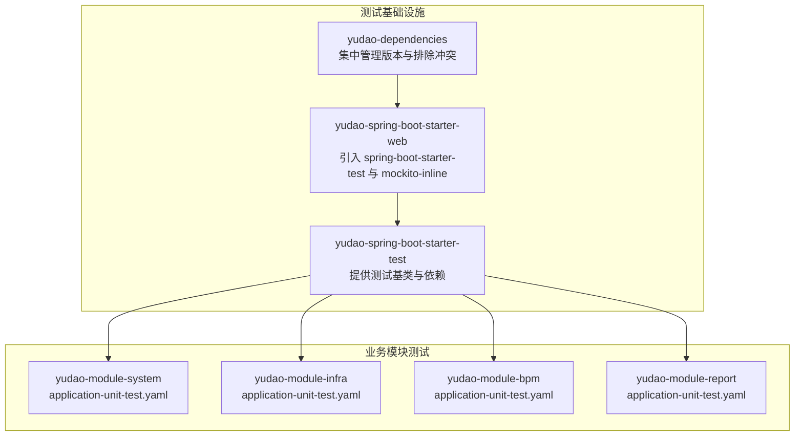
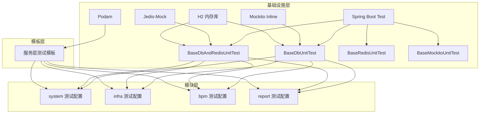
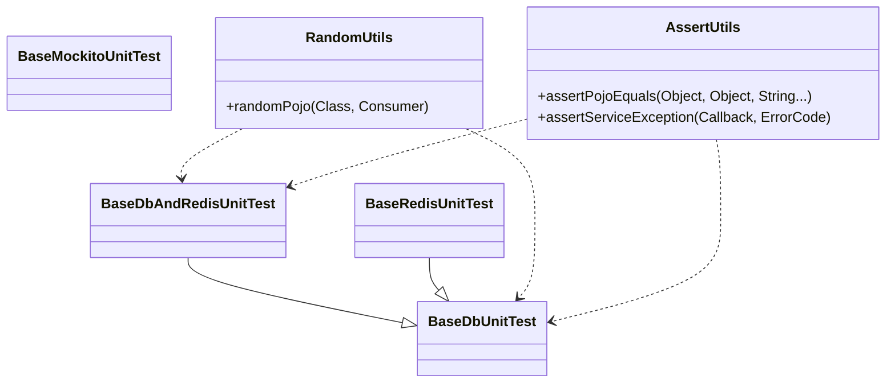
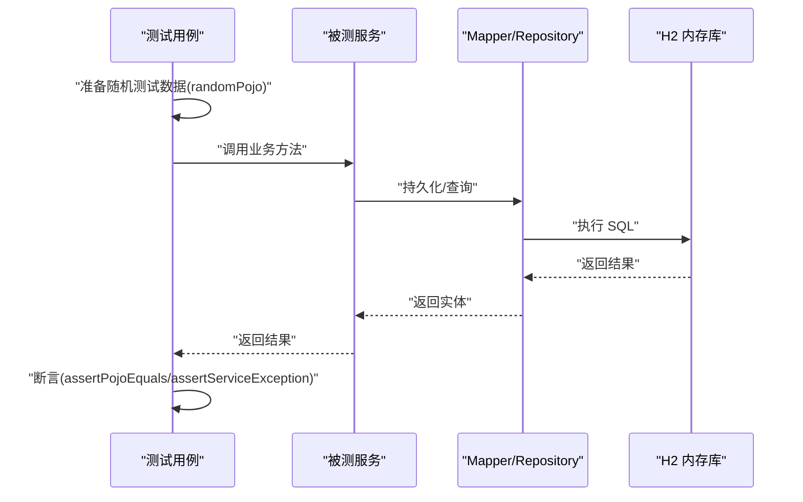
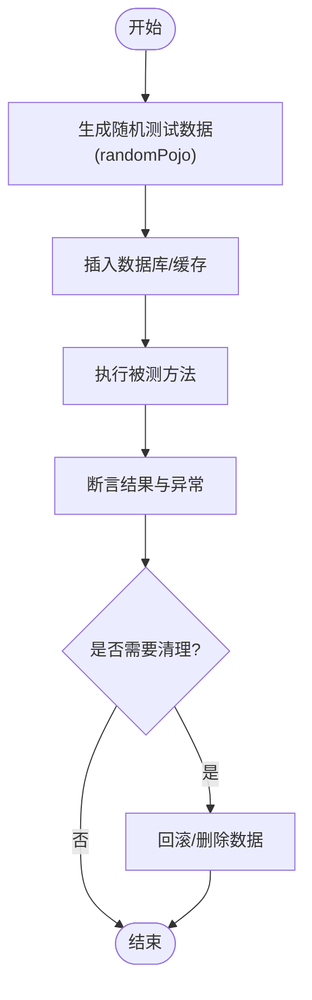
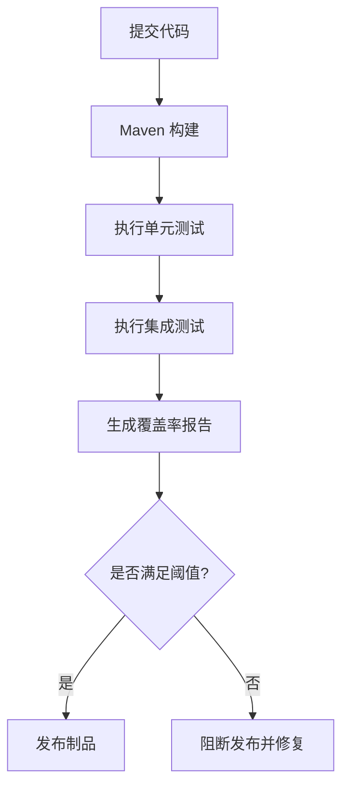
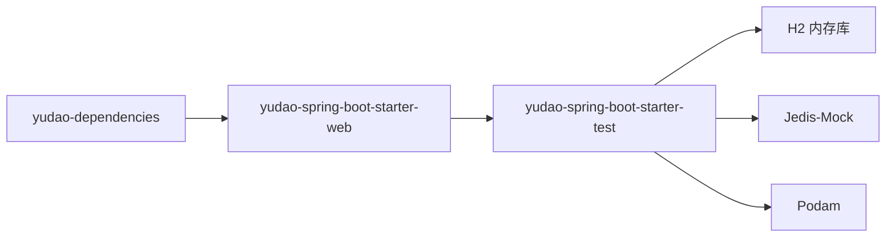

# 测试策略

<cite>
**本文引用的文件**
- [pom.xml](file://yudao-dependencies/pom.xml)
- [pom.xml](file://yudao-framework/yudao-spring-boot-starter-web/pom.xml)
- [pom.xml](file://yudao-framework/yudao-spring-boot-starter-test/pom.xml)
- [《芋道 Spring Boot 单元测试 Test 入门》.md](file://yudao-framework/yudao-spring-boot-starter-test/《芋道 Spring Boot 单元测试 Test 入门》.md)
- [AGENTS.md](file://AGENTS.md)
- [BaseDbUnitTest.java](file://yudao-framework/yudao-spring-boot-starter-test/src/main/java/cn/iocoder/yudao/framework/test/core/ut/BaseDbUnitTest.java)
- [BaseDbAndRedisUnitTest.java](file://yudao-framework/yudao-spring-boot-starter-test/src/main/java/cn/iocoder/yudao/framework/test/core/ut/BaseDbAndRedisUnitTest.java)
- [BaseRedisUnitTest.java](file://yudao-framework/yudao-spring-boot-starter-test/src/main/java/cn/iocoder/yudao/framework/test/core/ut/BaseRedisUnitTest.java)
- [BaseMockitoUnitTest.java](file://yudao-framework/yudao-spring-boot-starter-test/src/main/java/cn/iocoder/yudao/framework/test/core/ut/BaseMockitoUnitTest.java)
- [application-unit-test.yaml](file://yudao-module-system/src/test/resources/application-unit-test.yaml)
- [Jenkinsfile](file://script/jenkins/Jenkinsfile)
- [test/serviceTest.vm](file://yudao-module-infra/src/main/resources/codegen/java/test/serviceTest.vm)
</cite>

## 目录
1. [引言](#引言)
2. [项目结构](#项目结构)
3. [核心组件](#核心组件)
4. [架构总览](#架构总览)
5. [详细组件分析](#详细组件分析)
6. [依赖分析](#依赖分析)
7. [性能考虑](#性能考虑)
8. [故障排查指南](#故障排查指南)
9. [结论](#结论)
10. [附录](#附录)

## 引言
本测试策略文档面向“芋道 ruoyi-vue-pro”项目，系统化阐述测试框架与实践，覆盖单元测试、集成测试、接口测试、端到端测试、前端测试、性能与压力测试、测试数据管理、覆盖率与质量标准、以及持续集成流水线配置与测试环境搭建与维护。文档以仓库中已有的测试基础设施为依据，结合模块化工程结构，给出可落地的测试方法论与最佳实践。

## 项目结构
- 测试基础设施集中在 yudao-spring-boot-starter-test 模块，提供多种基类用于不同场景的测试（内存数据库、嵌入式 Redis、纯 Mockito 等），并统一引入 Spring Boot Test 与 Mockito Inline。
- 各业务模块（如 system、infra、bpm、report 等）在 test 目录下提供独立的 application-unit-test.yaml，用于隔离测试环境配置。
- 代码生成器模板（serviceTest.vm）为服务层生成单元测试骨架，确保测试一致性与可扩展性。

图表来源
- [pom.xml:68-79](file://yudao-framework/yudao-spring-boot-starter-web/pom.xml#L68-L79)
- [pom.xml:404-430](file://yudao-dependencies/pom.xml#L404-L430)
- [application-unit-test.yaml](file://yudao-module-system/src/test/resources/application-unit-test.yaml)

章节来源
- [pom.xml:68-79](file://yudao-framework/yudao-spring-boot-starter-web/pom.xml#L68-L79)
- [pom.xml:35-60](file://yudao-framework/yudao-spring-boot-starter-test/pom.xml#L35-L60)
- [pom.xml:404-430](file://yudao-dependencies/pom.xml#L404-L430)
- [application-unit-test.yaml](file://yudao-module-system/src/test/resources/application-unit-test.yaml)

## 核心组件
- 测试框架与依赖
  - Spring Boot Starter Test：提供测试运行器、断言、WebTestClient、MockMvc 等能力。
  - Mockito Inline：支持对 final 类、static 方法等进行打桩。
  - H2 内存数据库：用于 DB 测试，速度快、易回滚。
  - Jedis-Mock：嵌入式 Redis 模拟，避免真实 Redis 依赖。
  - Podam：POJO 随机填充，提升测试数据构造效率。
- 测试基类
  - BaseDbUnitTest：基于 H2 的数据库测试基类，自动加载 MyBatis 配置。
  - BaseDbAndRedisUnitTest：同时包含数据库与嵌入式 Redis 的测试基类。
  - BaseRedisUnitTest：仅 Redis 测试基类。
  - BaseMockitoUnitTest：纯 Mockito 测试，不启动 Spring 上下文。
- 测试约定与工具
  - RandomUtils.randomPojo：随机生成实体对象。
  - AssertUtils.assertPojoEquals：断言 POJO 属性相等。
  - AssertUtils.assertServiceException：断言业务异常。
  - 代码生成器模板：为服务层生成测试骨架，包含插入、查询、断言等流程。

章节来源
- [pom.xml:35-60](file://yudao-framework/yudao-spring-boot-starter-test/pom.xml#L35-L60)
- [AGENTS.md:155-196](file://AGENTS.md#L155-L196)
- [BaseDbUnitTest.java](file://yudao-framework/yudao-spring-boot-starter-test/src/main/java/cn/iocoder/yudao/framework/test/core/ut/BaseDbUnitTest.java)
- [BaseDbAndRedisUnitTest.java](file://yudao-framework/yudao-spring-boot-starter-test/src/main/java/cn/iocoder/yudao/framework/test/core/ut/BaseDbAndRedisUnitTest.java)
- [BaseRedisUnitTest.java](file://yudao-framework/yudao-spring-boot-starter-test/src/main/java/cn/iocoder/yudao/framework/test/core/ut/BaseRedisUnitTest.java)
- [BaseMockitoUnitTest.java](file://yudao-framework/yudao-spring-boot-starter-test/src/main/java/cn/iocoder/yudao/framework/test/core/ut/BaseMockitoUnitTest.java)
- [test/serviceTest.vm:30-167](file://yudao-module-infra/src/main/resources/codegen/java/test/serviceTest.vm#L30-L167)

## 架构总览
测试体系围绕“基础设施—模块—模板”的三层结构展开：
- 基础设施层：统一的测试依赖与基类，屏蔽底层差异。
- 模块层：各业务模块通过独立的 application-unit-test.yaml 隔离配置，复用基础设施。
- 模板层：代码生成器为服务层快速产出测试骨架，保证测试一致性。

图表来源
- [pom.xml:35-60](file://yudao-framework/yudao-spring-boot-starter-test/pom.xml#L35-L60)
- [application-unit-test.yaml](file://yudao-module-system/src/test/resources/application-unit-test.yaml)
- [test/serviceTest.vm:30-167](file://yudao-module-infra/src/main/resources/codegen/java/test/serviceTest.vm#L30-L167)

## 详细组件分析

### 单元测试基类与使用规范
- 基类选择
  - 需要数据库访问：BaseDbUnitTest 或 BaseDbAndRedisUnitTest。
  - 仅需 Redis：BaseRedisUnitTest。
  - 无需 Spring 上下文：BaseMockitoUnitTest。
- 测试结构模式
  - 导入被测 Service 至测试上下文。
  - 使用 randomPojo 生成测试数据，插入数据库或准备缓存。
  - 调用被测方法，断言结果与异常。
- 断言与工具
  - assertPojoEquals：忽略指定字段后比较对象属性。
  - assertServiceException：断言业务异常码或消息。
- 代码生成器模板
  - 自动生成插入、查询条件构造、分页/列表断言等测试骨架，减少重复劳动。

图表来源
- [BaseDbUnitTest.java](file://yudao-framework/yudao-spring-boot-starter-test/src/main/java/cn/iocoder/yudao/framework/test/core/ut/BaseDbUnitTest.java)
- [BaseDbAndRedisUnitTest.java](file://yudao-framework/yudao-spring-boot-starter-test/src/main/java/cn/iocoder/yudao/framework/test/core/ut/BaseDbAndRedisUnitTest.java)
- [BaseRedisUnitTest.java](file://yudao-framework/yudao-spring-boot-starter-test/src/main/java/cn/iocoder/yudao/framework/test/core/ut/BaseRedisUnitTest.java)
- [BaseMockitoUnitTest.java](file://yudao-framework/yudao-spring-boot-starter-test/src/main/java/cn/iocoder/yudao/framework/test/core/ut/BaseMockitoUnitTest.java)
- [AGENTS.md:193-196](file://AGENTS.md#L193-L196)

章节来源
- [AGENTS.md:155-196](file://AGENTS.md#L155-L196)
- [test/serviceTest.vm:30-167](file://yudao-module-infra/src/main/resources/codegen/java/test/serviceTest.vm#L30-L167)

### 集成测试策略（数据库、接口、端到端）
- 数据库测试
  - 使用 BaseDbUnitTest 或 BaseDbAndRedisUnitTest，H2 内存库自动回滚，适合事务性与非事务性场景。
  - 在 application-unit-test.yaml 中配置数据源、MyBatis、日志级别等，确保与生产隔离。
- 接口测试
  - 建议在 Controller 层使用 MockMvc 或 WebTestClient 进行接口验证，结合 @Import 导入被测控制器或服务。
  - 使用随机 VO 与断言工具，覆盖正常与异常分支。
- 端到端测试
  - 可在 yudao-ui 子项目中引入前端测试工具链（如 Vitest、Cypress 等），结合后端测试基类与隔离配置，完成端到端验证。

图表来源
- [BaseDbUnitTest.java](file://yudao-framework/yudao-spring-boot-starter-test/src/main/java/cn/iocoder/yudao/framework/test/core/ut/BaseDbUnitTest.java)
- [AGENTS.md:193-196](file://AGENTS.md#L193-L196)

章节来源
- [application-unit-test.yaml](file://yudao-module-system/src/test/resources/application-unit-test.yaml)
- [pom.xml:45-58](file://yudao-framework/yudao-spring-boot-starter-test/pom.xml#L45-L58)

### 测试数据管理方案
- 初始化
  - 使用 randomPojo 生成随机实体，结合 Mapper.insert 快速落库。
  - 代码生成器模板自动生成插入与条件构造逻辑，便于批量准备多场景数据。
- 清理
  - H2 内存库默认随测试套件结束自动回滚；如需手动清理，可在测试类中显式删除或使用事务回滚。
- 环境隔离
  - 各模块独立的 application-unit-test.yaml，避免跨模块污染。
  - Redis 使用 Jedis-Mock，避免真实 Redis 干扰。

图表来源
- [test/serviceTest.vm:30-61](file://yudao-module-infra/src/main/resources/codegen/java/test/serviceTest.vm#L30-L61)
- [pom.xml:45-58](file://yudao-framework/yudao-spring-boot-starter-test/pom.xml#L45-L58)

章节来源
- [test/serviceTest.vm:30-167](file://yudao-module-infra/src/main/resources/codegen/java/test/serviceTest.vm#L30-L167)
- [application-unit-test.yaml](file://yudao-module-system/src/test/resources/application-unit-test.yaml)

### 前端测试方法
- 组件测试：在 yudao-ui 子项目中使用 Vitest/Playwright 等工具对 Vue 组件进行单元测试，模拟 props、事件与状态。
- 集成测试：通过 Mock API 或本地联调，验证组件与后端接口的协作。
- 用户交互测试：使用端到端测试工具（如 Cypress/Puppeteer）模拟真实用户操作，覆盖关键业务流程。
- 建议与后端测试保持一致的隔离策略，避免跨模块干扰。

（本节为概念性内容，未直接分析具体文件）

### 性能测试与压力测试指南
- 性能基准测试
  - 使用 JMH 或 Spring Boot Actuator 指标，对关键服务方法进行微基准测试，关注吞吐量与延迟。
- 负载测试
  - 使用 JMeter/Gatling/LoadRunner 等工具，针对核心接口施加并发负载，观察响应时间、错误率与资源占用。
- 结果评估
  - 关注 P95/P99 延迟、错误率阈值、CPU/内存/数据库连接池使用情况。

（本节为通用指导，未直接分析具体文件）

### 持续集成配置
- CI/CD 流水线
  - 使用 Jenkinsfile 定义构建、测试与发布流程，建议包含编译、单元测试、集成测试、覆盖率统计与制品归档。
- 自动化测试执行
  - 在流水线阶段执行 Maven 测试命令，确保测试失败阻断发布。
- 覆盖率报告
  - 集成 JaCoCo 或 SonarQube，生成覆盖率报告并与 PR 校验联动。

图表来源
- [Jenkinsfile](file://script/jenkins/Jenkinsfile)

章节来源
- [Jenkinsfile](file://script/jenkins/Jenkinsfile)

## 依赖分析
- 测试依赖关系
  - yudao-spring-boot-starter-web 与 yudao-dependencies 统一引入 Spring Boot Test 与 Mockito Inline，并排除潜在冲突。
  - yudao-spring-boot-starter-test 提供 H2、Jedis-Mock、Podam 等测试依赖，支撑各类测试场景。
- 模块间耦合
  - 各业务模块通过 application-unit-test.yaml 与测试基类解耦，降低相互影响。
- 外部依赖与集成点
  - H2 与 Jedis-Mock 作为测试期替代品，避免真实外部系统依赖。

图表来源
- [pom.xml:68-79](file://yudao-framework/yudao-spring-boot-starter-web/pom.xml#L68-L79)
- [pom.xml:404-430](file://yudao-dependencies/pom.xml#L404-L430)
- [pom.xml:35-60](file://yudao-framework/yudao-spring-boot-starter-test/pom.xml#L35-L60)

章节来源
- [pom.xml:68-79](file://yudao-framework/yudao-spring-boot-starter-web/pom.xml#L68-L79)
- [pom.xml:404-430](file://yudao-dependencies/pom.xml#L404-L430)
- [pom.xml:35-60](file://yudao-framework/yudao-spring-boot-starter-test/pom.xml#L35-L60)

## 性能考虑
- 测试执行性能
  - 使用内存数据库与嵌入式 Redis，显著缩短测试执行时间。
  - 合理拆分测试套件，避免单个测试类过大导致执行缓慢。
- 覆盖率统计
  - 建议在 CI 中开启覆盖率统计，设定阈值（如语句覆盖率≥80%，分支覆盖率≥70%），并作为合并规则的一部分。
- 资源控制
  - 控制并发测试数量，避免数据库连接池与 Redis 连接耗尽。

（本节为通用指导，未直接分析具体文件）

## 故障排查指南
- 常见问题
  - 测试无法启动：检查 application-unit-test.yaml 是否正确加载，确认数据源与 MyBatis 配置。
  - 断言失败：使用 RandomUtils 与 AssertUtils 辅助定位，逐步缩小输入范围。
  - Mock 失败：确认 Mockito Inline 的使用方式，避免对 final 类的不当打桩。
- 调试建议
  - 在测试类中启用更详细的日志，定位 SQL 与缓存操作。
  - 使用事务回滚或手动清理，确保测试间无副作用。

章节来源
- [application-unit-test.yaml](file://yudao-module-system/src/test/resources/application-unit-test.yaml)
- [AGENTS.md:193-196](file://AGENTS.md#L193-L196)

## 结论
本测试策略以 yudao-spring-boot-starter-test 为基础，结合各模块的隔离配置与代码生成器模板，形成从单元测试到集成测试、从后端到前端、从功能到性能的完整测试体系。通过明确的测试基类、断言工具与 CI 流程，能够有效保障代码质量与交付效率。

## 附录
- 测试质量评估指标建议
  - 单元测试：方法覆盖率、分支覆盖率、行覆盖率。
  - 集成测试：接口可用性、异常处理正确性、事务边界清晰度。
  - 端到端测试：关键业务路径通过率、页面交互稳定性。
- 测试环境搭建与维护
  - 使用 application-unit-test.yaml 独立配置，避免与主应用配置冲突。
  - 定期更新测试依赖版本，保持与生产环境兼容性。
  - 建立测试用例评审机制，确保测试覆盖面与可维护性。

（本节为通用指导，未直接分析具体文件）