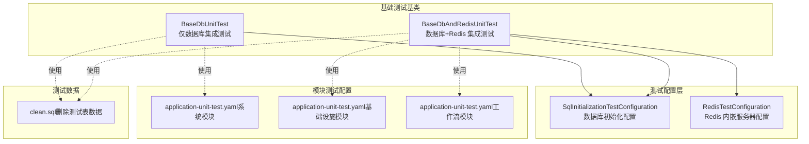
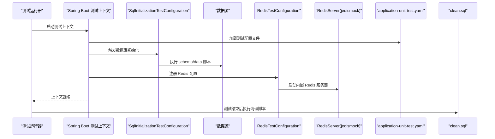
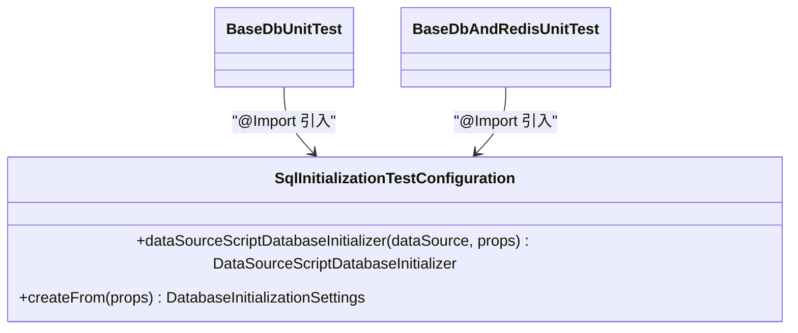
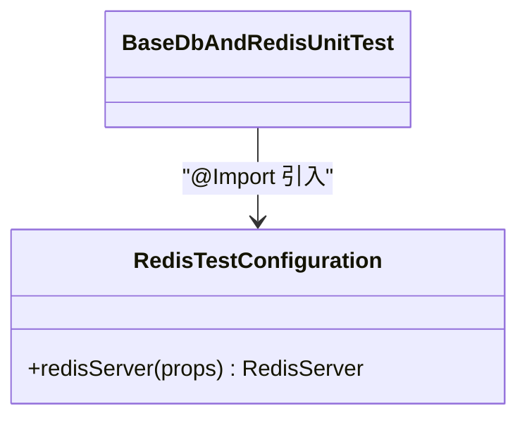
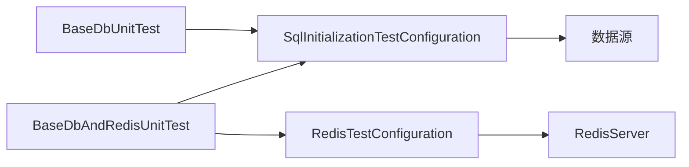

# 集成测试

<cite>
**本文引用的文件**
- [SqlInitializationTestConfiguration.java](file://yudao-framework/yudao-spring-boot-starter-test/src/main/java/cn/iocoder/yudao/framework/test/config/SqlInitializationTestConfiguration.java)
- [RedisTestConfiguration.java](file://yudao-framework/yudao-spring-boot-starter-test/src/main/java/cn/iocoder/yudao/framework/test/config/RedisTestConfiguration.java)
- [BaseDbUnitTest.java](file://yudao-framework/yudao-spring-boot-starter-test/src/main/java/cn/iocoder/yudao/framework/test/core/ut/BaseDbUnitTest.java)
- [BaseDbAndRedisUnitTest.java](file://yudao-framework/yudao-spring-boot-starter-test/src/main/java/cn/iocoder/yudao/framework/test/core/ut/BaseDbAndRedisUnitTest.java)
- [application-unit-test.yaml（系统模块）](file://yudao-module-system/src/test/resources/application-unit-test.yaml)
- [application-unit-test.yaml（基础设施模块）](file://yudao-module-infra/src/test/resources/application-unit-test.yaml)
- [application-unit-test.yaml（工作流模块）](file://yudao-module-bpm/src/test/resources/application-unit-test.yaml)
- [clean.sql（基础设施模块）](file://yudao-module-infra/src/test/resources/sql/clean.sql)
</cite>

## 目录
1. [简介](#简介)
2. [项目结构](#项目结构)
3. [核心组件](#核心组件)
4. [架构总览](#架构总览)
5. [详细组件分析](#详细组件分析)
6. [依赖关系分析](#依赖关系分析)
7. [性能考量](#性能考量)
8. [故障排查指南](#故障排查指南)
9. [结论](#结论)
10. [附录](#附录)

## 简介
本文件面向芋道 ruoyi-vue-pro 的集成测试体系，系统化阐述数据库集成测试、缓存集成测试与外部服务集成测试的设计理念与实施策略；详解 SqlInitializationTestConfiguration 与 RedisTestConfiguration 的配置与使用方式；给出测试环境搭建指南（含测试配置文件与测试数据准备）、端到端测试实现方法（API 接口、业务流程、用户场景）、测试数据管理策略（导入/导出/清理）、测试环境隔离与并发测试方案，以及测试报告生成与结果分析方法。

## 项目结构
围绕集成测试的关键文件分布如下：
- 测试配置层：位于 yudao-framework/yudao-spring-boot-starter-test 下，包含数据库初始化配置与 Redis 内嵌服务器配置。
- 基础测试基类：位于同一模块下，提供“仅数据库”和“数据库+Redis”的两种集成测试基类。
- 模块级测试配置：各业务模块（如 system、infra、bpm）在 test/resources 下提供 application-unit-test.yaml，用于覆盖测试环境的配置。
- 清理脚本：在 infra 模块中提供统一的 clean.sql，确保每次测试后数据库状态可预期。

图表来源
- [SqlInitializationTestConfiguration.java:1-53](file://yudao-framework/yudao-spring-boot-starter-test/src/main/java/cn/iocoder/yudao/framework/test/config/SqlInitializationTestConfiguration.java#L1-L53)
- [RedisTestConfiguration.java:1-36](file://yudao-framework/yudao-spring-boot-starter-test/src/main/java/cn/iocoder/yudao/framework/test/config/RedisTestConfiguration.java#L1-L36)
- [BaseDbUnitTest.java:1-48](file://yudao-framework/yudao-spring-boot-starter-test/src/main/java/cn/iocoder/yudao/framework/test/core/ut/BaseDbUnitTest.java#L1-L48)
- [BaseDbAndRedisUnitTest.java:1-56](file://yudao-framework/yudao-spring-boot-starter-test/src/main/java/cn/iocoder/yudao/framework/test/core/ut/BaseDbAndRedisUnitTest.java#L1-L56)
- [application-unit-test.yaml（系统模块）](file://yudao-module-system/src/test/resources/application-unit-test.yaml)
- [application-unit-test.yaml（基础设施模块）](file://yudao-module-infra/src/test/resources/application-unit-test.yaml)
- [application-unit-test.yaml（工作流模块）](file://yudao-module-bpm/src/test/resources/application-unit-test.yaml)
- [clean.sql（基础设施模块）:1-11](file://yudao-module-infra/src/test/resources/sql/clean.sql#L1-L11)

章节来源
- [SqlInitializationTestConfiguration.java:1-53](file://yudao-framework/yudao-spring-boot-starter-test/src/main/java/cn/iocoder/yudao/framework/test/config/SqlInitializationTestConfiguration.java#L1-L53)
- [RedisTestConfiguration.java:1-36](file://yudao-framework/yudao-spring-boot-starter-test/src/main/java/cn/iocoder/yudao/framework/test/config/RedisTestConfiguration.java#L1-L36)
- [BaseDbUnitTest.java:1-48](file://yudao-framework/yudao-spring-boot-starter-test/src/main/java/cn/iocoder/yudao/framework/test/core/ut/BaseDbUnitTest.java#L1-L48)
- [BaseDbAndRedisUnitTest.java:1-56](file://yudao-framework/yudao-spring-boot-starter-test/src/main/java/cn/iocoder/yudao/framework/test/core/ut/BaseDbAndRedisUnitTest.java#L1-L56)
- [application-unit-test.yaml（系统模块）](file://yudao-module-system/src/test/resources/application-unit-test.yaml)
- [application-unit-test.yaml（基础设施模块）](file://yudao-module-infra/src/test/resources/application-unit-test.yaml)
- [application-unit-test.yaml（工作流模块）](file://yudao-module-bpm/src/test/resources/application-unit-test.yaml)
- [clean.sql（基础设施模块）:1-11](file://yudao-module-infra/src/test/resources/sql/clean.sql#L1-L11)

## 核心组件
- 数据库初始化配置（SqlInitializationTestConfiguration）
  - 作用：在测试启动阶段按配置执行 SQL 初始化脚本，支持 schema 与 data 脚本位置、错误处理策略、编码与分隔符等设置。
  - 关键点：禁用延迟初始化，确保在懒加载模式下也能正确初始化；基于 Spring Boot 的 SqlInitializationProperties 提供配置入口。
- Redis 测试配置（RedisTestConfiguration）
  - 作用：通过内嵌 Redis 服务器（jedismock）为测试提供本地缓存环境，避免对真实 Redis 的依赖。
  - 关键点：默认端口由 RedisProperties 提供；捕获启动异常以规避多容器导致的端口占用问题。
- 基础测试基类
  - BaseDbUnitTest：仅数据库集成测试基类，引入数据源、事务、MyBatis、SQL 初始化等配置。
  - BaseDbAndRedisUnitTest：在上述基础上增加 Redis 测试配置，适用于需要缓存交互的场景。

章节来源
- [SqlInitializationTestConfiguration.java:17-52](file://yudao-framework/yudao-spring-boot-starter-test/src/main/java/cn/iocoder/yudao/framework/test/config/SqlInitializationTestConfiguration.java#L17-L52)
- [RedisTestConfiguration.java:12-35](file://yudao-framework/yudao-spring-boot-starter-test/src/main/java/cn/iocoder/yudao/framework/test/config/RedisTestConfiguration.java#L12-L35)
- [BaseDbUnitTest.java:17-47](file://yudao-framework/yudao-spring-boot-starter-test/src/main/java/cn/iocoder/yudao/framework/test/core/ut/BaseDbUnitTest.java#L17-L47)
- [BaseDbAndRedisUnitTest.java:20-55](file://yudao-framework/yudao-spring-boot-starter-test/src/main/java/cn/iocoder/yudao/framework/test/core/ut/BaseDbAndRedisUnitTest.java#L20-L55)

## 架构总览
下图展示了集成测试从启动到执行再到清理的整体流程，涵盖数据库初始化、Redis 内嵌服务器、模块测试配置与清理脚本。

图表来源
- [SqlInitializationTestConfiguration.java:34-39](file://yudao-framework/yudao-spring-boot-starter-test/src/main/java/cn/iocoder/yudao/framework/test/config/SqlInitializationTestConfiguration.java#L34-L39)
- [RedisTestConfiguration.java:25-33](file://yudao-framework/yudao-spring-boot-starter-test/src/main/java/cn/iocoder/yudao/framework/test/config/RedisTestConfiguration.java#L25-L33)
- [BaseDbUnitTest.java:27-29](file://yudao-framework/yudao-spring-boot-starter-test/src/main/java/cn/iocoder/yudao/framework/test/core/ut/BaseDbUnitTest.java#L27-L29)
- [BaseDbAndRedisUnitTest.java:27-29](file://yudao-framework/yudao-spring-boot-starter-test/src/main/java/cn/iocoder/yudao/framework/test/core/ut/BaseDbAndRedisUnitTest.java#L27-L29)
- [application-unit-test.yaml（系统模块）](file://yudao-module-system/src/test/resources/application-unit-test.yaml)
- [application-unit-test.yaml（基础设施模块）](file://yudao-module-infra/src/test/resources/application-unit-test.yaml)
- [application-unit-test.yaml（工作流模块）](file://yudao-module-bpm/src/test/resources/application-unit-test.yaml)
- [clean.sql（基础设施模块）:1-11](file://yudao-module-infra/src/test/resources/sql/clean.sql#L1-L11)

## 详细组件分析

### 数据库集成测试（SqlInitializationTestConfiguration）
- 设计理念
  - 在测试启动阶段即完成数据库初始化，保证测试执行前的数据一致性与完整性。
  - 支持多种脚本位置与执行模式，便于按模块拆分初始化脚本。
- 实施要点
  - 禁止延迟初始化，确保与懒加载模式兼容。
  - 通过 SqlInitializationProperties 统一管理脚本路径、错误处理、编码与分隔符等。
- 与基础测试基类的关系
  - BaseDbUnitTest 与 BaseDbAndRedisUnitTest 均通过 @Import 引入该配置，从而在测试启动时自动执行初始化。

图表来源
- [SqlInitializationTestConfiguration.java:34-50](file://yudao-framework/yudao-spring-boot-starter-test/src/main/java/cn/iocoder/yudao/framework/test/config/SqlInitializationTestConfiguration.java#L34-L50)
- [BaseDbUnitTest.java:34-38](file://yudao-framework/yudao-spring-boot-starter-test/src/main/java/cn/iocoder/yudao/framework/test/core/ut/BaseDbUnitTest.java#L34-L38)
- [BaseDbAndRedisUnitTest.java:43-47](file://yudao-framework/yudao-spring-boot-starter-test/src/main/java/cn/iocoder/yudao/framework/test/core/ut/BaseDbAndRedisUnitTest.java#L43-L47)

章节来源
- [SqlInitializationTestConfiguration.java:17-52](file://yudao-framework/yudao-spring-boot-starter-test/src/main/java/cn/iocoder/yudao/framework/test/config/SqlInitializationTestConfiguration.java#L17-L52)
- [BaseDbUnitTest.java:24-39](file://yudao-framework/yudao-spring-boot-starter-test/src/main/java/cn/iocoder/yudao/framework/test/core/ut/BaseDbUnitTest.java#L24-L39)
- [BaseDbAndRedisUnitTest.java:42-48](file://yudao-framework/yudao-spring-boot-starter-test/src/main/java/cn/iocoder/yudao/framework/test/core/ut/BaseDbAndRedisUnitTest.java#L42-L48)

### 缓存集成测试（RedisTestConfiguration）
- 设计理念
  - 通过内嵌 Redis 服务器（jedismock）替代真实 Redis，降低测试环境复杂度与资源消耗。
  - 默认端口来自 RedisProperties，避免硬编码；对启动异常进行容错处理，提升并行测试稳定性。
- 实施要点
  - 在测试上下文中注册 RedisServer Bean，确保测试期间可用。
  - 与 BaseDbAndRedisUnitTest 配合，为涉及缓存读写的场景提供稳定支撑。

图表来源
- [RedisTestConfiguration.java:25-33](file://yudao-framework/yudao-spring-boot-starter-test/src/main/java/cn/iocoder/yudao/framework/test/config/RedisTestConfiguration.java#L25-L33)
- [BaseDbAndRedisUnitTest.java:44-46](file://yudao-framework/yudao-spring-boot-starter-test/src/main/java/cn/iocoder/yudao/framework/test/core/ut/BaseDbAndRedisUnitTest.java#L44-L46)

章节来源
- [RedisTestConfiguration.java:12-35](file://yudao-framework/yudao-spring-boot-starter-test/src/main/java/cn/iocoder/yudao/framework/test/config/RedisTestConfiguration.java#L12-L35)
- [BaseDbAndRedisUnitTest.java:42-48](file://yudao-framework/yudao-spring-boot-starter-test/src/main/java/cn/iocoder/yudao/framework/test/core/ut/BaseDbAndRedisUnitTest.java#L42-L48)

### 外部服务集成测试（概念性说明）
- 设计理念
  - 将外部服务（如消息队列、第三方接口）通过模拟或内嵌实现进行替换，确保测试可控且可重复。
- 实施策略
  - 使用模拟客户端或内嵌服务（如 RabbitMQ/RocketMQ 的测试镜像）替代真实外部系统。
  - 在测试配置文件中切换至测试专用的外部服务地址与凭据。
- 与现有组件的结合
  - 可与 BaseDbAndRedisUnitTest 结合，形成“数据库+缓存+外部服务”的完整集成测试基座。

（本节为概念性说明，未直接分析具体文件）

### 测试环境搭建指南
- 测试配置文件编写
  - 各模块在 test/resources 下提供 application-unit-test.yaml，用于指定测试数据库、Redis 端口、日志级别等。
  - 示例参考：系统模块、基础设施模块、工作流模块的 application-unit-test.yaml。
- 测试数据准备
  - 使用 SqlInitializationTestConfiguration 配置的脚本位置，在测试启动前导入初始化数据。
  - 使用 clean.sql 在每个测试方法结束后清理数据，确保测试隔离。
- 环境隔离与并发
  - 通过不同 profile 或独立的 application-unit-test.yaml 实现模块间隔离。
  - Redis 内嵌服务器默认端口可能冲突，建议在并行测试时为不同容器分配不同端口或采用容错启动策略。

章节来源
- [application-unit-test.yaml（系统模块）](file://yudao-module-system/src/test/resources/application-unit-test.yaml)
- [application-unit-test.yaml（基础设施模块）](file://yudao-module-infra/src/test/resources/application-unit-test.yaml)
- [application-unit-test.yaml（工作流模块）](file://yudao-module-bpm/src/test/resources/application-unit-test.yaml)
- [clean.sql（基础设施模块）:1-11](file://yudao-module-infra/src/test/resources/sql/clean.sql#L1-L11)

### 端到端测试实现方法
- API 接口测试
  - 基于 Spring Boot Test 与 WebTestClient 或 RestAssured，调用受保护接口，验证鉴权、参数校验与业务返回。
- 业务流程测试
  - 以 BaseDbAndRedisUnitTest 为基座，构造业务主流程（如下单、支付、库存扣减），断言数据库与缓存状态变化。
- 用户场景测试
  - 模拟典型用户操作链路（登录、菜单访问、数据增删改查），结合 clean.sql 保障每轮测试的干净状态。

（本节为通用实践说明，未直接分析具体文件）

### 测试数据管理策略
- 导入
  - 通过 SqlInitializationTestConfiguration 的 dataLocations 指定初始化脚本，确保测试开始前具备必要数据。
- 导出
  - 可在测试失败时输出当前数据库快照（如转储 SQL）以便复盘。
- 清理
  - 使用 @Sql 注解在测试方法结束后执行 clean.sql，删除测试相关表数据，避免跨测试污染。

章节来源
- [BaseDbUnitTest.java:29-29](file://yudao-framework/yudao-spring-boot-starter-test/src/main/java/cn/iocoder/yudao/framework/test/core/ut/BaseDbUnitTest.java#L29-L29)
- [BaseDbAndRedisUnitTest.java:29-29](file://yudao-framework/yudao-spring-boot-starter-test/src/main/java/cn/iocoder/yudao/framework/test/core/ut/BaseDbAndRedisUnitTest.java#L29-L29)
- [clean.sql（基础设施模块）:1-11](file://yudao-module-infra/src/test/resources/sql/clean.sql#L1-L11)

### 测试报告生成与结果分析
- 报告生成
  - 使用 JUnit 与 Surefire/Failsafe 插件生成 XML 报告；可接入 Allure/Extent 等工具生成可视化报告。
- 结果分析
  - 关注失败用例的数据库与缓存状态差异，结合初始化与清理脚本定位问题根因。
  - 对并发测试中的 Redis 端口冲突与数据竞争进行专项分析。

（本节为通用实践说明，未直接分析具体文件）

## 依赖关系分析
- 组件耦合
  - BaseDbUnitTest 与 BaseDbAndRedisUnitTest 通过 @Import 引入数据库与缓存相关配置，保持高内聚低耦合。
- 外部依赖
  - RedisTestConfiguration 依赖 jedismock 与 RedisProperties；SqlInitializationTestConfiguration 依赖 Spring Boot 的数据库初始化能力。
- 循环依赖
  - 当前配置无明显循环依赖；若自定义扩展，需避免在 @Import 中引入相互依赖的配置类。

图表来源
- [BaseDbUnitTest.java:34-42](file://yudao-framework/yudao-spring-boot-starter-test/src/main/java/cn/iocoder/yudao/framework/test/core/ut/BaseDbUnitTest.java#L34-L42)
- [BaseDbAndRedisUnitTest.java:43-47](file://yudao-framework/yudao-spring-boot-starter-test/src/main/java/cn/iocoder/yudao/framework/test/core/ut/BaseDbAndRedisUnitTest.java#L43-L47)
- [SqlInitializationTestConfiguration.java:34-39](file://yudao-framework/yudao-spring-boot-starter-test/src/main/java/cn/iocoder/yudao/framework/test/config/SqlInitializationTestConfiguration.java#L34-L39)
- [RedisTestConfiguration.java:25-33](file://yudao-framework/yudao-spring-boot-starter-test/src/main/java/cn/iocoder/yudao/framework/test/config/RedisTestConfiguration.java#L25-L33)

章节来源
- [BaseDbUnitTest.java:29-43](file://yudao-framework/yudao-spring-boot-starter-test/src/main/java/cn/iocoder/yudao/framework/test/core/ut/BaseDbUnitTest.java#L29-L43)
- [BaseDbAndRedisUnitTest.java:42-48](file://yudao-framework/yudao-spring-boot-starter-test/src/main/java/cn/iocoder/yudao/framework/test/core/ut/BaseDbAndRedisUnitTest.java#L42-L48)
- [SqlInitializationTestConfiguration.java:34-39](file://yudao-framework/yudao-spring-boot-starter-test/src/main/java/cn/iocoder/yudao/framework/test/config/SqlInitializationTestConfiguration.java#L34-L39)
- [RedisTestConfiguration.java:25-33](file://yudao-framework/yudao-spring-boot-starter-test/src/main/java/cn/iocoder/yudao/framework/test/config/RedisTestConfiguration.java#L25-L33)

## 性能考量
- 启动时间
  - 内嵌 Redis 与数据库初始化显著影响启动时间；可通过并行测试与脚本精简优化。
- 并发测试
  - Redis 端口冲突与数据竞争是关键风险；建议为不同测试容器分配独立端口或采用容错启动策略。
- 数据规模
  - 初始化脚本应尽量精简；大体量数据可考虑分批导入或按需生成。

（本节为通用指导，未直接分析具体文件）

## 故障排查指南
- Redis 端口占用
  - 现象：启动内嵌 Redis 失败。
  - 处理：检查端口占用；在并行测试中为不同容器分配不同端口；RedisTestConfiguration 已对异常进行容错处理。
- 数据库初始化失败
  - 现象：测试启动阶段 SQL 执行报错。
  - 处理：检查 SqlInitializationTestConfiguration 的脚本路径与编码设置；确认 application-unit-test.yaml 中的数据库连接配置正确。
- 测试数据污染
  - 现象：跨测试出现数据干扰。
  - 处理：确认 @Sql(clean.sql) 是否在每个测试方法结束后执行；检查初始化脚本是否覆盖了所有相关表。

章节来源
- [RedisTestConfiguration.java:27-31](file://yudao-framework/yudao-spring-boot-starter-test/src/main/java/cn/iocoder/yudao/framework/test/config/RedisTestConfiguration.java#L27-L31)
- [BaseDbUnitTest.java:29-29](file://yudao-framework/yudao-spring-boot-starter-test/src/main/java/cn/iocoder/yudao/framework/test/core/ut/BaseDbUnitTest.java#L29-L29)
- [BaseDbAndRedisUnitTest.java:29-29](file://yudao-framework/yudao-spring-boot-starter-test/src/main/java/cn/iocoder/yudao/framework/test/core/ut/BaseDbAndRedisUnitTest.java#L29-L29)
- [clean.sql（基础设施模块）:1-11](file://yudao-module-infra/src/test/resources/sql/clean.sql#L1-L11)

## 结论
通过 SqlInitializationTestConfiguration 与 RedisTestConfiguration，结合 BaseDbUnitTest 与 BaseDbAndRedisUnitTest，ruoyi-vue-pro 形成了稳定、可扩展的集成测试基座。配合模块化的测试配置文件与统一的清理脚本，能够有效支撑数据库、缓存与外部服务的集成测试，并为端到端测试、数据管理与并发测试提供坚实基础。

## 附录
- 快速清单
  - 在 application-unit-test.yaml 中配置测试数据库与 Redis 端口。
  - 使用 SqlInitializationTestConfiguration 的 dataLocations 导入初始化数据。
  - 在测试结束后执行 clean.sql，确保数据隔离。
  - 并行测试时为 Redis 分配不同端口或启用容错启动策略。

（本节为通用补充，未直接分析具体文件）