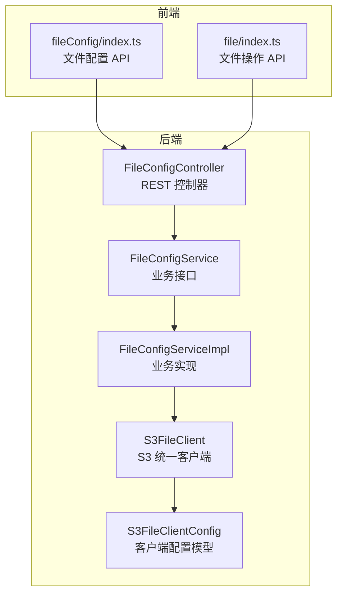
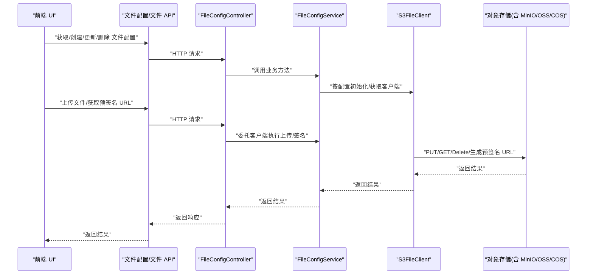
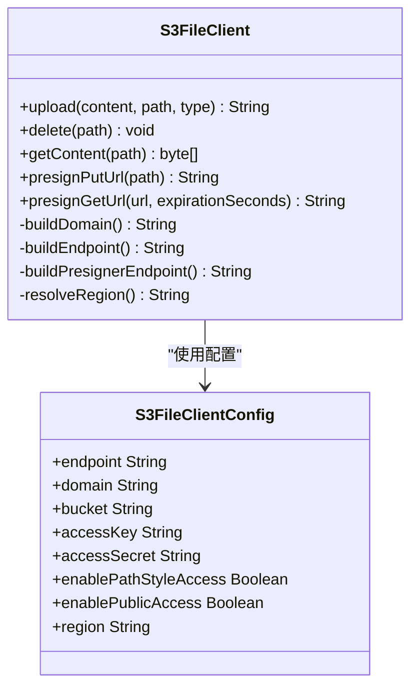
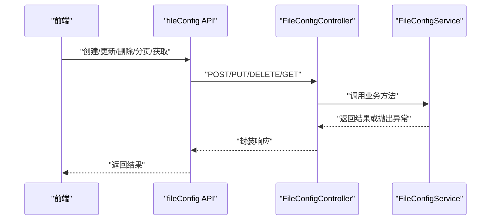
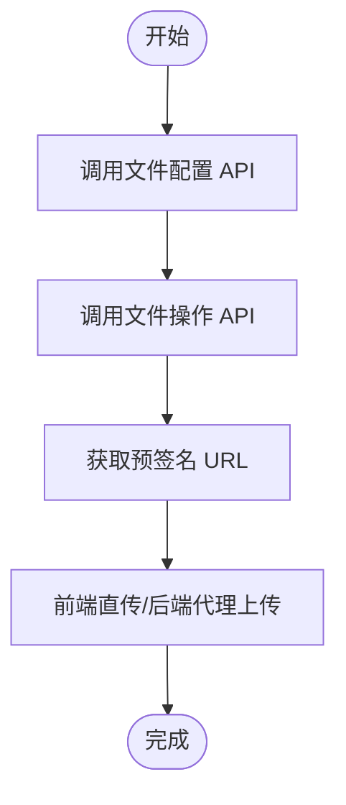
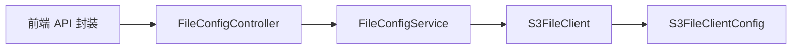
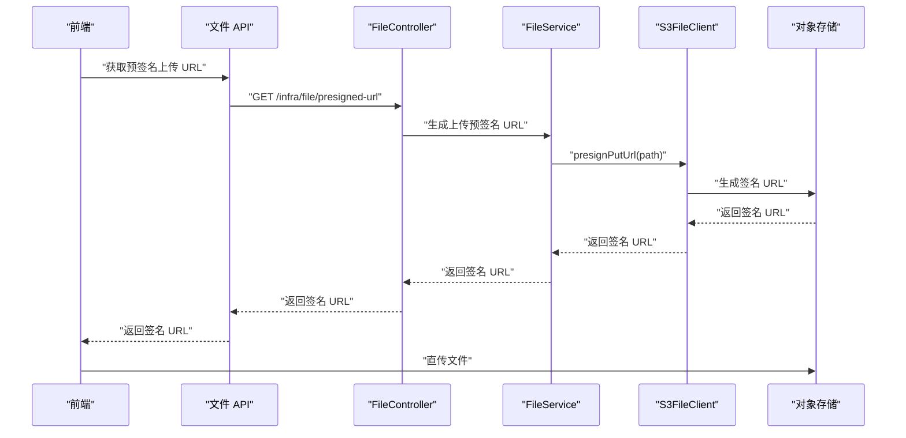

# 存储服务集成

<cite>
**本文引用的文件**
- [S3FileClient.java](file://yudao-module-infra/src/main/java/cn/iocoder/yudao/module/infra/framework/file/core/client/s3/S3FileClient.java)
- [S3FileClientConfig.java](file://yudao-module-infra/src/main/java/cn/iocoder/yudao/module/infra/framework/file/core/client/s3/S3FileClientConfig.java)
- [FileConfigController.java](file://yudao-module-infra/src/main/java/cn/iocoder/yudao/module/infra/controller/admin/file/FileConfigController.java)
- [FileConfigService.java](file://yudao-module-infra/src/main/java/cn/iocoder/yudao/module/infra/service/file/FileConfigService.java)
- [index.ts（文件配置 API）](file://yudao-ui/yudao-ui-admin-vue3/src/api/infra/fileConfig/index.ts)
- [index.ts（文件 API）](file://yudao-ui/yudao-ui-admin-vue3/src/api/infra/file/index.ts)
- [STARTUP.md（MinIO 示例 SQL）](file://STARTUP.md)
</cite>

## 目录
1. [简介](#简介)
2. [项目结构](#项目结构)
3. [核心组件](#核心组件)
4. [架构总览](#架构总览)
5. [详细组件分析](#详细组件分析)
6. [依赖分析](#依赖分析)
7. [性能考虑](#性能考虑)
8. [故障排查指南](#故障排查指南)
9. [结论](#结论)
10. [附录](#附录)

## 简介
本文件面向后端与前端开发者，系统性说明本项目的“存储服务集成”能力，重点覆盖以下内容：
- 基于 S3 协议的统一文件客户端，兼容 MinIO、阿里云 OSS、腾讯云 COS 等对象存储
- 后端配置管理：文件存储配置的创建、更新、主配置切换、测试连通性
- 前端对接：文件上传、预签名 URL 获取、文件列表与删除
- 权限与安全：公开/私有访问控制、预签名 URL 过期时间、自定义域名与路径风格访问
- 本地存储：基于本地文件系统的静态资源服务（以通用方式接入）

## 项目结构
围绕“文件存储”的核心代码分布在基础设施模块与前端 UI 中：
- 后端基础设施模块（Infra）提供文件配置的控制器、服务与 S3 统一客户端
- 前端 UI 提供文件配置与文件操作的 API 封装

图表来源
- [FileConfigController.java:1-99](file://yudao-module-infra/src/main/java/cn/iocoder/yudao/module/infra/controller/admin/file/FileConfigController.java#L1-L99)
- [FileConfigService.java:1-95](file://yudao-module-infra/src/main/java/cn/iocoder/yudao/module/infra/service/file/FileConfigService.java#L1-L95)
- [S3FileClient.java:1-257](file://yudao-module-infra/src/main/java/cn/iocoder/yudao/module/infra/framework/file/core/client/s3/S3FileClient.java#L1-L257)
- [S3FileClientConfig.java:1-109](file://yudao-module-infra/src/main/java/cn/iocoder/yudao/module/infra/framework/file/core/client/s3/S3FileClientConfig.java#L1-L109)
- [index.ts（文件配置 API）:1-69](file://yudao-ui/yudao-ui-admin-vue3/src/api/infra/fileConfig/index.ts#L1-L69)
- [index.ts（文件 API）:1-46](file://yudao-ui/yudao-ui-admin-vue3/src/api/infra/file/index.ts#L1-L46)

章节来源
- [FileConfigController.java:1-99](file://yudao-module-infra/src/main/java/cn/iocoder/yudao/module/infra/controller/admin/file/FileConfigController.java#L1-L99)
- [S3FileClient.java:1-257](file://yudao-module-infra/src/main/java/cn/iocoder/yudao/module/infra/framework/file/core/client/s3/S3FileClient.java#L1-L257)
- [S3FileClientConfig.java:1-109](file://yudao-module-infra/src/main/java/cn/iocoder/yudao/module/infra/framework/file/core/client/s3/S3FileClientConfig.java#L1-L109)
- [index.ts（文件配置 API）:1-69](file://yudao-ui/yudao-ui-admin-vue3/src/api/infra/fileConfig/index.ts#L1-L69)
- [index.ts（文件 API）:1-46](file://yudao-ui/yudao-ui-admin-vue3/src/api/infra/file/index.ts#L1-L46)

## 核心组件
- S3 统一客户端：封装上传、删除、下载、预签名 URL 生成等能力，自动识别区域、构建域名与端点、支持路径风格访问与公开/私有访问模式
- 文件配置控制器与服务：提供文件配置的增删改查、主配置切换、连通性测试、按 ID 获取客户端等
- 前端 API：封装文件配置与文件操作的请求方法，便于在管理后台中进行可视化配置与文件管理

章节来源
- [S3FileClient.java:32-141](file://yudao-module-infra/src/main/java/cn/iocoder/yudao/module/infra/framework/file/core/client/s3/S3FileClient.java#L32-L141)
- [S3FileClientConfig.java:17-106](file://yudao-module-infra/src/main/java/cn/iocoder/yudao/module/infra/framework/file/core/client/s3/S3FileClientConfig.java#L17-L106)
- [FileConfigController.java:33-97](file://yudao-module-infra/src/main/java/cn/iocoder/yudao/module/infra/controller/admin/file/FileConfigController.java#L33-L97)
- [FileConfigService.java:17-94](file://yudao-module-infra/src/main/java/cn/iocoder/yudao/module/infra/service/file/FileConfigService.java#L17-L94)
- [index.ts（文件配置 API）:1-69](file://yudao-ui/yudao-ui-admin-vue3/src/api/infra/fileConfig/index.ts#L1-L69)
- [index.ts（文件 API）:1-46](file://yudao-ui/yudao-ui-admin-vue3/src/api/infra/file/index.ts#L1-L46)

## 架构总览
下图展示“文件配置—客户端—对象存储”的整体调用链路，以及前端如何通过 API 与后端交互。

图表来源
- [FileConfigController.java:33-97](file://yudao-module-infra/src/main/java/cn/iocoder/yudao/module/infra/controller/admin/file/FileConfigController.java#L33-L97)
- [FileConfigService.java:71-94](file://yudao-module-infra/src/main/java/cn/iocoder/yudao/module/infra/service/file/FileConfigService.java#L71-L94)
- [S3FileClient.java:75-141](file://yudao-module-infra/src/main/java/cn/iocoder/yudao/module/infra/framework/file/core/client/s3/S3FileClient.java#L75-L141)
- [index.ts（文件配置 API）:31-69](file://yudao-ui/yudao-ui-admin-vue3/src/api/infra/fileConfig/index.ts#L31-L69)
- [index.ts（文件 API）:30-46](file://yudao-ui/yudao-ui-admin-vue3/src/api/infra/file/index.ts#L30-L46)

## 详细组件分析

### S3 统一客户端（S3FileClient）
- 初始化与端点构建
  - 自动补全 domain 与 endpoint，支持路径风格访问与公开/私有访问
  - 预签名器与 S3 客户端分别配置，确保签名 URL 与实际访问一致
- 上传/删除/下载
  - 上传：构造 PutObjectRequest，上传字节数组，返回可访问 URL
  - 删除：构造 DeleteObjectRequest
  - 下载：构造 GetObjectRequest，读取字节数组
- 预签名 URL
  - 上传预签名：用于前端直传场景
  - 下载预签名：根据公开/私有限制决定是否签名
- 域名与区域解析
  - 自动识别 AWS、阿里云、腾讯云等 endpoint 并提取 region
  - 支持自定义域名与路径风格访问

图表来源
- [S3FileClient.java:32-254](file://yudao-module-infra/src/main/java/cn/iocoder/yudao/module/infra/framework/file/core/client/s3/S3FileClient.java#L32-L254)
- [S3FileClientConfig.java:17-106](file://yudao-module-infra/src/main/java/cn/iocoder/yudao/module/infra/framework/file/core/client/s3/S3FileClientConfig.java#L17-L106)

章节来源
- [S3FileClient.java:43-141](file://yudao-module-infra/src/main/java/cn/iocoder/yudao/module/infra/framework/file/core/client/s3/S3FileClient.java#L43-L141)
- [S3FileClientConfig.java:25-106](file://yudao-module-infra/src/main/java/cn/iocoder/yudao/module/infra/framework/file/core/client/s3/S3FileClientConfig.java#L25-L106)

### 文件配置控制器与服务
- 控制器提供文件配置的增删改查、主配置切换与测试连通性
- 服务层负责业务逻辑与客户端实例管理，支持按 ID 获取客户端与获取主客户端

图表来源
- [FileConfigController.java:33-97](file://yudao-module-infra/src/main/java/cn/iocoder/yudao/module/infra/controller/admin/file/FileConfigController.java#L33-L97)
- [FileConfigService.java:25-94](file://yudao-module-infra/src/main/java/cn/iocoder/yudao/module/infra/service/file/FileConfigService.java#L25-L94)
- [index.ts（文件配置 API）:31-69](file://yudao-ui/yudao-ui-admin-vue3/src/api/infra/fileConfig/index.ts#L31-L69)

章节来源
- [FileConfigController.java:33-97](file://yudao-module-infra/src/main/java/cn/iocoder/yudao/module/infra/controller/admin/file/FileConfigController.java#L33-L97)
- [FileConfigService.java:17-94](file://yudao-module-infra/src/main/java/cn/iocoder/yudao/module/infra/service/file/FileConfigService.java#L17-L94)
- [index.ts（文件配置 API）:31-69](file://yudao-ui/yudao-ui-admin-vue3/src/api/infra/fileConfig/index.ts#L31-L69)

### 前端文件与配置 API
- 文件配置 API：分页、获取、创建、更新、删除、批量删除、测试连通性
- 文件 API：分页、删除、批量删除、获取预签名 URL、创建、上传

图表来源
- [index.ts（文件配置 API）:31-69](file://yudao-ui/yudao-ui-admin-vue3/src/api/infra/fileConfig/index.ts#L31-L69)
- [index.ts（文件 API）:30-46](file://yudao-ui/yudao-ui-admin-vue3/src/api/infra/file/index.ts#L30-L46)

章节来源
- [index.ts（文件配置 API）:1-69](file://yudao-ui/yudao-ui-admin-vue3/src/api/infra/fileConfig/index.ts#L1-L69)
- [index.ts（文件 API）:1-46](file://yudao-ui/yudao-ui-admin-vue3/src/api/infra/file/index.ts#L1-L46)

## 依赖分析
- 组件耦合
  - 控制器依赖服务接口；服务实现依赖 S3 统一客户端；前端仅依赖控制器暴露的 REST 接口
- 外部依赖
  - S3 SDK（AWS Java SDK v2）、Hutool 工具库、Spring Security 注解鉴权
- 可能的循环依赖
  - 当前结构清晰，无明显循环依赖风险

图表来源
- [FileConfigController.java:30-31](file://yudao-module-infra/src/main/java/cn/iocoder/yudao/module/infra/controller/admin/file/FileConfigController.java#L30-L31)
- [FileConfigService.java:7-8](file://yudao-module-infra/src/main/java/cn/iocoder/yudao/module/infra/service/file/FileConfigService.java#L7-L8)
- [S3FileClient.java:32-41](file://yudao-module-infra/src/main/java/cn/iocoder/yudao/module/infra/framework/file/core/client/s3/S3FileClient.java#L32-L41)
- [S3FileClientConfig.java:17-18](file://yudao-module-infra/src/main/java/cn/iocoder/yudao/module/infra/framework/file/core/client/s3/S3FileClientConfig.java#L17-L18)

章节来源
- [FileConfigController.java:1-99](file://yudao-module-infra/src/main/java/cn/iocoder/yudao/module/infra/controller/admin/file/FileConfigController.java#L1-L99)
- [FileConfigService.java:1-95](file://yudao-module-infra/src/main/java/cn/iocoder/yudao/module/infra/service/file/FileConfigService.java#L1-L95)
- [S3FileClient.java:1-257](file://yudao-module-infra/src/main/java/cn/iocoder/yudao/module/infra/framework/file/core/client/s3/S3FileClient.java#L1-L257)
- [S3FileClientConfig.java:1-109](file://yudao-module-infra/src/main/java/cn/iocoder/yudao/module/infra/framework/file/core/client/s3/S3FileClientConfig.java#L1-L109)

## 性能考虑
- 预签名直传
  - 上传大文件时推荐使用预签名直传，减少后端中转带宽与延迟
- 分块编码禁用
  - 客户端已禁用分块编码，避免某些环境下的兼容性问题
- 路径风格访问
  - 在 MinIO 等场景开启路径风格访问可提升兼容性
- 区域解析
  - 自动解析区域可避免错误配置导致的网络往返失败

章节来源
- [S3FileClient.java:57-60](file://yudao-module-infra/src/main/java/cn/iocoder/yudao/module/infra/framework/file/core/client/s3/S3FileClient.java#L57-L60)
- [S3FileClient.java:193-254](file://yudao-module-infra/src/main/java/cn/iocoder/yudao/module/infra/framework/file/core/client/s3/S3FileClient.java#L193-L254)

## 故障排查指南
- 无法上传/下载
  - 检查公开/私有访问配置与预签名 URL 有效期
  - 确认 bucket、accessKey、accessSecret、endpoint、domain、region 是否正确
- 域名或路径访问异常
  - 若使用 MinIO，确认已配置自定义域名并通过 Nginx 暴露
  - 路径风格访问与虚拟主机风格访问不可混用
- 连接超时或鉴权失败
  - 核对网络连通性与防火墙策略
  - 确认对象存储服务端允许的来源与跨域配置
- 快速验证
  - 使用“测试文件配置”接口进行连通性测试

章节来源
- [FileConfigController.java:91-97](file://yudao-module-infra/src/main/java/cn/iocoder/yudao/module/infra/controller/admin/file/FileConfigController.java#L91-L97)
- [S3FileClientConfig.java:97-106](file://yudao-module-infra/src/main/java/cn/iocoder/yudao/module/infra/framework/file/core/client/s3/S3FileClientConfig.java#L97-L106)
- [S3FileClient.java:116-141](file://yudao-module-infra/src/main/java/cn/iocoder/yudao/module/infra/framework/file/core/client/s3/S3FileClient.java#L116-L141)

## 结论
本项目通过统一的 S3 文件客户端抽象，实现了对多种对象存储（MinIO、阿里云 OSS、腾讯云 COS 等）的一致化接入，并提供了完善的配置管理与前端 API 封装。结合预签名直传与公开/私有访问策略，可在保证安全的前提下提升上传性能与灵活性。

## 附录

### MinIO 对象存储集成
- 服务部署
  - 参考官方文档进行安装与配置，建议通过反向代理暴露域名
- SDK 配置
  - endpoint：MinIO 服务地址（可带协议）
  - bucket：存储桶名称
  - accessKey/accessSecret：访问凭据
  - domain：自定义域名（可选，MinIO 建议通过 Nginx 配置）
  - enablePathStyleAccess：建议开启以提升兼容性
  - enablePublicAccess：公开访问需谨慎
  - region：可填任意值，通常使用 us-east-1
- 桶权限设置
  - 公开访问：所有用户可读
  - 私有访问：仅凭据有效时可读写
- 文件上传/下载
  - 使用预签名直传或后端代理上传
  - 下载时根据公开/私有限制生成预签名 URL

章节来源
- [S3FileClientConfig.java:25-95](file://yudao-module-infra/src/main/java/cn/iocoder/yudao/module/infra/framework/file/core/client/s3/S3FileClientConfig.java#L25-L95)
- [S3FileClient.java:148-185](file://yudao-module-infra/src/main/java/cn/iocoder/yudao/module/infra/framework/file/core/client/s3/S3FileClient.java#L148-L185)
- [STARTUP.md（MinIO 示例 SQL）:120-130](file://STARTUP.md#L120-L130)

### 阿里云 OSS 集成
- Bucket 创建与访问权限
  - 在 OSS 控制台创建 Bucket，设置读写权限（私有/公共读写/公共读）
  - 使用 RAM 子账号与最小权限策略，避免泄露主账号密钥
- CDN 加速与安全策略
  - 开启 CDN 加速，绑定自定义域名
  - 设置防盗链与参数签名，限制来源与过期时间
- 客户端配置要点
  - endpoint：OSS Endpoint（如 oss-cn-beijing.aliyuncs.com）
  - bucket：Bucket 名称
  - domain：CDN 或 OSS 回源域名
  - enablePathStyleAccess：通常关闭（虚拟主机风格）
  - enablePublicAccess：按业务需求选择
  - region：自动解析，可不填

章节来源
- [S3FileClientConfig.java:25-95](file://yudao-module-infra/src/main/java/cn/iocoder/yudao/module/infra/framework/file/core/client/s3/S3FileClientConfig.java#L25-L95)
- [S3FileClient.java:231-250](file://yudao-module-infra/src/main/java/cn/iocoder/yudao/module/infra/framework/file/core/client/s3/S3FileClient.java#L231-L250)

### 腾讯云 COS 集成
- 存储桶配置
  - 在 COS 控制台创建 Bucket，设置 ACL（私有读写/公有读私有写等）
- 跨域设置
  - 在 CORS 规则中添加前端域名，允许相应方法与头
- 生命周期管理
  - 设置对象过期删除、低频/归档转换策略，降低存储成本
- 客户端配置要点
  - endpoint：COS Endpoint（如 cos.ap-shanghai.myqcloud.com）
  - bucket：Bucket 名称
  - domain：自定义域名或 COS 回源域名
  - enablePathStyleAccess：通常关闭
  - enablePublicAccess：按业务需求选择
  - region：自动解析，可不填

章节来源
- [S3FileClientConfig.java:25-95](file://yudao-module-infra/src/main/java/cn/iocoder/yudao/module/infra/framework/file/core/client/s3/S3FileClientConfig.java#L25-L95)
- [S3FileClient.java:241-250](file://yudao-module-infra/src/main/java/cn/iocoder/yudao/module/infra/framework/file/core/client/s3/S3FileClient.java#L241-L250)

### 本地存储配置（静态资源服务）
- 文件路径设置
  - 通过本地文件系统保存文件，配置基础路径（basePath）
- 访问域名配置
  - 配置 host/port 或自定义域名（domain），用于生成可访问 URL
- 静态资源服务
  - 将文件路径映射到 Web 服务器静态目录，或通过后端路由转发
- 注意事项
  - 本地存储不具备高可用与扩展性，适合开发/测试或小规模场景

章节来源
- [S3FileClientConfig.java:3-18](file://yudao-module-infra/src/main/java/cn/iocoder/yudao/module/infra/framework/file/core/client/s3/S3FileClientConfig.java#L3-L18)

### 文件上传示例（流程参考）
- 前端直传（推荐）
  - 步骤：获取预签名上传 URL → 前端直接上传至对象存储 → 后端记录文件信息
- 后端代理上传
  - 步骤：获取预签名上传 URL → 后端接收文件 → 上传至对象存储 → 返回访问 URL
- 下载
  - 公开访问：直接返回 domain/path
  - 私有访问：生成预签名下载 URL，设置合理过期时间

图表来源
- [index.ts（文件 API）:30-36](file://yudao-ui/yudao-ui-admin-vue3/src/api/infra/file/index.ts#L30-L36)
- [S3FileClient.java:108-114](file://yudao-module-infra/src/main/java/cn/iocoder/yudao/module/infra/framework/file/core/client/s3/S3FileClient.java#L108-L114)

### 安全策略配置
- 凭据管理
  - 使用子账号与最小权限策略，定期轮换密钥
- 网络与来源控制
  - 限制来源 IP/域名，开启 CDN 参数签名
- 访问控制
  - 私有访问配合预签名 URL，严格控制过期时间
- 日志审计
  - 开启访问日志与操作审计，定期检查异常行为

章节来源
- [S3FileClientConfig.java:53-83](file://yudao-module-infra/src/main/java/cn/iocoder/yudao/module/infra/framework/file/core/client/s3/S3FileClientConfig.java#L53-L83)
- [S3FileClient.java:116-141](file://yudao-module-infra/src/main/java/cn/iocoder/yudao/module/infra/framework/file/core/client/s3/S3FileClient.java#L116-L141)

### 存储成本优化建议
- 生命周期策略
  - 设置对象过期删除与低频/归档转换
- 传输优化
  - 大文件采用分片上传与断点续传（若对象存储支持）
- CDN 缓存
  - 合理设置缓存策略与刷新规则，降低回源压力
- 预签名策略
  - 严格控制过期时间，避免长期有效的公开链接

章节来源
- [S3FileClient.java:34-34](file://yudao-module-infra/src/main/java/cn/iocoder/yudao/module/infra/framework/file/core/client/s3/S3FileClient.java#L34-L34)