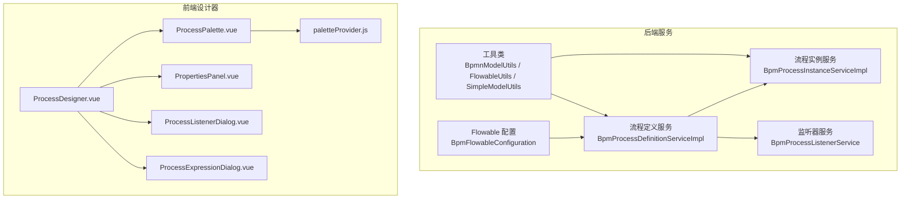
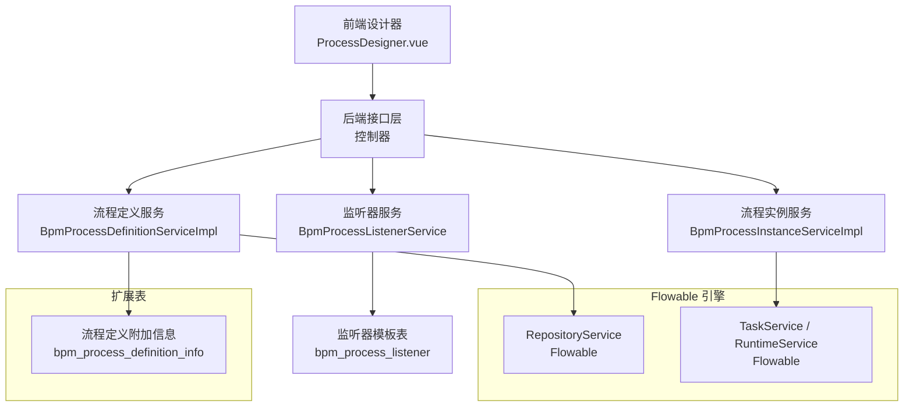
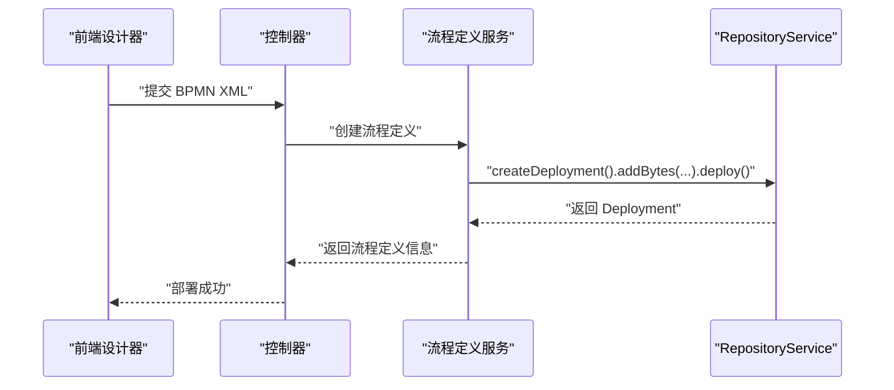
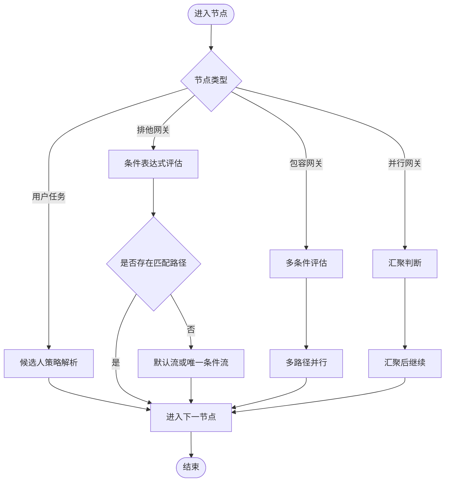
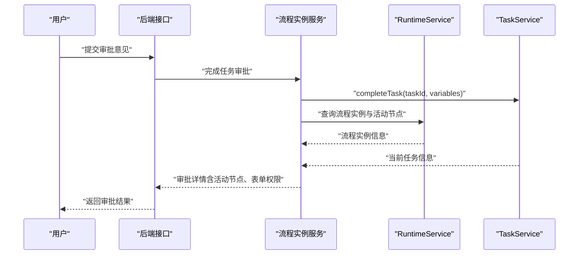
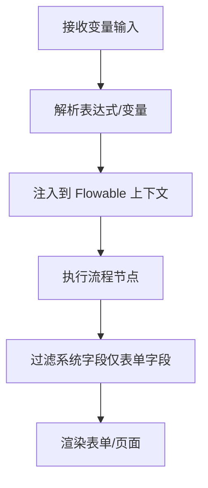
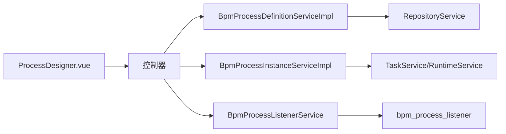

# 工作流引擎集成

<cite>
**本文引用的文件**
- [BpmFlowableConfiguration.java](file://yudao-module-bpm/src/main/java/cn/iocoder/yudao/module/bpm/framework/flowable/config/BpmFlowableConfiguration.java)
- [BpmProcessDefinitionServiceImpl.java](file://yudao-module-bpm/src/main/java/cn/iocoder/yudao/module/bpm/service/definition/BpmProcessDefinitionServiceImpl.java)
- [BpmProcessDefinitionService.java](file://yudao-module-bpm/src/main/java/cn/iocoder/yudao/module/bpm/service/definition/BpmProcessDefinitionService.java)
- [BpmProcessDefinitionInfoDO.java](file://yudao-module-bpm/src/main/java/cn/iocoder/yudao/module/bpm/dal/dataobject/definition/BpmProcessDefinitionInfoDO.java)
- [BpmProcessDefinitionCreateReqDTO.java](file://yudao-module-bpm/src/main/java/cn/iocoder/yudao/module/bpm/service/definition/dto/BpmProcessDefinitionCreateReqDTO.java)
- [BpmProcessListenerService.java](file://yudao-module-bpm/src/main/java/cn/iocoder/yudao/module/bpm/service/definition/BpmProcessListenerService.java)
- [BpmProcessListenerDO.java](file://yudao-module-bpm/src/main/java/cn/iocoder/yudao/module/bpm/dal/dataobject/definition/BpmProcessListenerDO.java)
- [BpmProcessListenerController.java](file://yudao-module-bpm/src/main/java/cn/iocoder/yudao/module/bpm/controller/admin/definition/BpmProcessListenerController.java)
- [BpmProcessListenerPageReqVO.java](file://yudao-module-bpm/src/main/java/cn/iocoder/yudao/module/bpm/controller/admin/definition/vo/listener/BpmProcessListenerPageReqVO.java)
- [BpmProcessInstanceServiceImpl.java](file://yudao-module-bpm/src/main/java/cn/iocoder/yudao/module/bpm/service/task/BpmProcessInstanceServiceImpl.java)
- [BpmProcessInstanceStatusEnum.java](file://yudao-module-bpm/src/main/java/cn/iocoder/yudao/module/bpm/enums/task/BpmProcessInstanceStatusEnum.java)
- [BpmTaskStatusEnum.java](file://yudao-module-bpm/src/main/java/cn/iocoder/yudao/module/bpm/enums/task/BpmTaskStatusEnum.java)
- [BpmProcessInstanceConvert.java](file://yudao-module-bpm/src/main/java/cn/iocoder/yudao/module/bpm/convert/task/BpmProcessInstanceConvert.java)
- [BpmApprovalDetailRespVO.java](file://yudao-module-bpm/src/main/java/cn/iocoder/yudao/module/bpm/controller/admin/task/vo/instance/BpmApprovalDetailRespVO.java)
- [FlowableUtils.java](file://yudao-module-bpm/src/main/java/cn/iocoder/yudao/module/bpm/framework/flowable/core/util/FlowableUtils.java)
- [BpmnModelUtils.java](file://yudao-module-bpm/src/main/java/cn/iocoder/yudao/module/bpm/framework/flowable/core/util/BpmnModelUtils.java)
- [SimpleModelUtils.java](file://yudao-module-bpm/src/main/java/cn/iocoder/yudao/module/bpm/framework/flowable/core/util/SimpleModelUtils.java)
- [BpmTaskCandidateStrategy.java](file://yudao-module-bpm/src/main/java/cn/iocoder/yudao/module/bpm/framework/flowable/core/candidate/BpmTaskCandidateStrategy.java)
- [BpmTaskCandidateUserStrategy.java](file://yudao-module-bpm/src/main/java/cn/iocoder/yudao/module/bpm/framework/flowable/core/candidate/strategy/user/BpmTaskCandidateUserStrategy.java)
- [BpmTaskAssignStartUserExpression.java](file://yudao-module-bpm/src/main/java/cn/iocoder/yudao/module/bpm/framework/flowable/core/candidate/expression/BpmTaskAssignStartUserExpression.java)
- [AbstractEngineConfiguration.java](file://sql/dm/flowable-patch/src/main/java/org/flowable/common/engine/impl/AbstractEngineConfiguration.java)
- [ProcessDesigner.vue](file://yudao-ui/yudao-ui-admin-vue3/src/components/bpmnProcessDesigner/package/designer/ProcessDesigner.vue)
- [ProcessPalette.vue](file://yudao-ui/yudao-ui-admin-vue3/src/components/bpmnProcessDesigner/package/palette/ProcessPalette.vue)
- [PropertiesPanel.vue](file://yudao-ui/yudao-ui-admin-vue3/src/components/bpmnProcessDesigner/package/penal/PropertiesPanel.vue)
- [ProcessListenerDialog.vue](file://yudao-ui/yudao-ui-admin-vue3/src/components/bpmnProcessDesigner/package/penal/listeners/ProcessListenerDialog.vue)
- [ProcessExpressionDialog.vue](file://yudao-ui/yudao-ui-admin-vue3/src/components/bpmnProcessDesigner/package/penal/task/task-components/ProcessExpressionDialog.vue)
- [paletteProvider.js](file://yudao-ui/yudao-ui-admin-vue3/src/components/bpmnProcessDesigner/package/designer/plugins/palette/paletteProvider.js)
- [auto-components.d.ts](file://yudao-ui/yudao-ui-admin-vue3/src/types/auto-components.d.ts)
</cite>

## 目录
1. [简介](#简介)
2. [项目结构](#项目结构)
3. [核心组件](#核心组件)
4. [架构总览](#架构总览)
5. [详细组件分析](#详细组件分析)
6. [依赖关系分析](#依赖关系分析)
7. [性能考虑](#性能考虑)
8. [故障排查指南](#故障排查指南)
9. [结论](#结论)
10. [附录](#附录)

## 简介
本文件面向“工作流引擎集成”，围绕 Flowable 工作流引擎在本项目的落地实践，系统性阐述以下内容：
- Flowable 引擎配置与数据库初始化
- 引擎参数设置与线程池配置
- 流程定义管理（部署、查询、版本控制）
- BPMN 流程设计器使用（节点配置、网关设置、监听器配置）
- 流程实例管理（启动、任务审批、流程监控）
- 流程变量处理（变量传递、数据绑定、表达式计算）
- 设计示例、最佳实践与性能优化建议

## 项目结构
本项目采用模块化分层架构，工作流相关能力集中在 yudao-module-bpm 模块，前端设计器位于 yudao-ui/yudao-ui-admin-vue3。关键目录与职责如下：
- 后端（Spring Boot）：BPM 模块负责流程定义、流程实例、任务审批、监听器等业务能力
- 前端（Vue3）：提供 BPMN 流程设计器、属性面板、监听器与表达式配置弹窗等可视化工具
- 数据库：Flowable 标准表结构配合扩展表（如流程定义附加信息、监听器模板）

图表来源
- [BpmFlowableConfiguration.java:23-49](file://yudao-module-bpm/src/main/java/cn/iocoder/yudao/module/bpm/framework/flowable/config/BpmFlowableConfiguration.java#L23-L49)
- [BpmProcessDefinitionServiceImpl.java:44-70](file://yudao-module-bpm/src/main/java/cn/iocoder/yudao/module/bpm/service/definition/BpmProcessDefinitionServiceImpl.java#L44-L70)
- [BpmProcessInstanceServiceImpl.java:387-542](file://yudao-module-bpm/src/main/java/cn/iocoder/yudao/module/bpm/service/task/BpmProcessInstanceServiceImpl.java#L387-L542)
- [ProcessDesigner.vue](file://yudao-ui/yudao-ui-admin-vue3/src/components/bpmnProcessDesigner/package/designer/ProcessDesigner.vue)
- [ProcessPalette.vue](file://yudao-ui/yudao-ui-admin-vue3/src/components/bpmnProcessDesigner/package/palette/ProcessPalette.vue)
- [PropertiesPanel.vue](file://yudao-ui/yudao-ui-admin-vue3/src/components/bpmnProcessDesigner/package/penal/PropertiesPanel.vue)
- [ProcessListenerDialog.vue](file://yudao-ui/yudao-ui-admin-vue3/src/components/bpmnProcessDesigner/package/penal/listeners/ProcessListenerDialog.vue)
- [ProcessExpressionDialog.vue](file://yudao-ui/yudao-ui-admin-vue3/src/components/bpmnProcessDesigner/package/penal/task/task-components/ProcessExpressionDialog.vue)
- [paletteProvider.js:1-60](file://yudao-ui/yudao-ui-admin-vue3/src/components/bpmnProcessDesigner/package/designer/plugins/palette/paletteProvider.js#L1-L60)

章节来源
- [BpmFlowableConfiguration.java:23-49](file://yudao-module-bpm/src/main/java/cn/iocoder/yudao/module/bpm/framework/flowable/config/BpmFlowableConfiguration.java#L23-L49)
- [ProcessDesigner.vue](file://yudao-ui/yudao-ui-admin-vue3/src/components/bpmnProcessDesigner/package/designer/ProcessDesigner.vue)

## 核心组件
- 引擎配置与线程池
  - 提供 Flowable 异步任务执行器 Bean，避免启动时报错；线程池大小与队列容量可按需调整
- 流程定义管理
  - 通过 RepositoryService 进行部署、查询、挂起/激活；结合扩展表存储分类、图标、描述等信息
- 流程实例与任务
  - 支持流程启动、任务审批、历史轨迹、审批详情构建与状态管理
- 监听器与表达式
  - 监听器模板管理与分页查询；表达式解析与条件网关路由
- 候选人策略
  - 用户策略、部门策略、岗位策略等，支持参数校验与动态计算
- 前端设计器
  - 提供节点拖拽、属性配置、监听器/表达式弹窗、流程预览与导出

章节来源
- [BpmFlowableConfiguration.java:23-49](file://yudao-module-bpm/src/main/java/cn/iocoder/yudao/module/bpm/framework/flowable/config/BpmFlowableConfiguration.java#L23-L49)
- [BpmProcessDefinitionServiceImpl.java:44-70](file://yudao-module-bpm/src/main/java/cn/iocoder/yudao/module/bpm/service/definition/BpmProcessDefinitionServiceImpl.java#L44-L70)
- [BpmProcessInstanceServiceImpl.java:387-542](file://yudao-module-bpm/src/main/java/cn/iocoder/yudao/module/bpm/service/task/BpmProcessInstanceServiceImpl.java#L387-L542)
- [BpmProcessListenerService.java:1-54](file://yudao-module-bpm/src/main/java/cn/iocoder/yudao/module/bpm/service/definition/BpmProcessListenerService.java#L1-L54)
- [BpmnModelUtils.java:27-65](file://yudao-module-bpm/src/main/java/cn/iocoder/yudao/module/bpm/framework/flowable/core/util/BpmnModelUtils.java#L27-L65)
- [FlowableUtils.java:355-397](file://yudao-module-bpm/src/main/java/cn/iocoder/yudao/module/bpm/framework/flowable/core/util/FlowableUtils.java#L355-L397)
- [BpmTaskCandidateStrategy.java:1-54](file://yudao-module-bpm/src/main/java/cn/iocoder/yudao/module/bpm/framework/flowable/core/candidate/BpmTaskCandidateStrategy.java#L1-L54)

## 架构总览
下图展示了后端与前端在工作流引擎集成中的交互关系，以及关键组件之间的依赖。

图表来源
- [BpmProcessDefinitionServiceImpl.java:44-70](file://yudao-module-bpm/src/main/java/cn/iocoder/yudao/module/bpm/service/definition/BpmProcessDefinitionServiceImpl.java#L44-L70)
- [BpmProcessInstanceServiceImpl.java:387-542](file://yudao-module-bpm/src/main/java/cn/iocoder/yudao/module/bpm/service/task/BpmProcessInstanceServiceImpl.java#L387-L542)
- [BpmProcessListenerService.java:1-54](file://yudao-module-bpm/src/main/java/cn/iocoder/yudao/module/bpm/service/definition/BpmProcessListenerService.java#L1-L54)
- [BpmProcessDefinitionInfoDO.java:30-77](file://yudao-module-bpm/src/main/java/cn/iocoder/yudao/module/bpm/dal/dataobject/definition/BpmProcessDefinitionInfoDO.java#L30-L77)

## 详细组件分析

### 引擎配置与数据库初始化
- 线程池配置
  - 通过自定义异步任务执行器 Bean，确保 Flowable 异步任务线程池可用，避免启动阶段异常
- 数据库连接与表前缀
  - 引擎配置支持数据库驱动、URL、用户名、密码、连接池参数、表前缀、模式等，便于多租户与多数据库适配
- 初始化要点
  - 建议在应用启动时执行 Flowable 的数据库迁移脚本，确保标准表结构存在；扩展表（如流程定义附加信息）由业务层维护

章节来源
- [BpmFlowableConfiguration.java:23-49](file://yudao-module-bpm/src/main/java/cn/iocoder/yudao/module/bpm/framework/flowable/config/BpmFlowableConfiguration.java#L23-L49)
- [AbstractEngineConfiguration.java:156-332](file://sql/dm/flowable-patch/src/main/java/org/flowable/common/engine/impl/AbstractEngineConfiguration.java#L156-L332)
- [AbstractEngineConfiguration.java:440-543](file://sql/dm/flowable-patch/src/main/java/org/flowable/common/engine/impl/AbstractEngineConfiguration.java#L440-L543)

### 流程定义管理
- 功能范围
  - 部署流程（基于 BPMN XML）、查询流程定义、挂起/激活、根据部署 ID 查询、批量查询
  - 结合扩展表存储分类、图标、描述等信息，弥补 Flowable 原生 ProcessDefinition 不支持扩展字段的不足
- 关键流程
  - 创建流程定义时，通过 RepositoryService 部署，设置分类、租户 ID、禁用 XML Schema 校验等
  - 查询时支持分页、按挂起状态筛选、按 ID 集合批量查询

图表来源
- [BpmProcessDefinitionServiceImpl.java:134-143](file://yudao-module-bpm/src/main/java/cn/iocoder/yudao/module/bpm/service/definition/BpmProcessDefinitionServiceImpl.java#L134-L143)
- [BpmProcessDefinitionCreateReqDTO.java:14-46](file://yudao-module-bpm/src/main/java/cn/iocoder/yudao/module/bpm/service/definition/dto/BpmProcessDefinitionCreateReqDTO.java#L14-L46)
- [BpmProcessDefinitionService.java:27-43](file://yudao-module-bpm/src/main/java/cn/iocoder/yudao/module/bpm/service/definition/BpmProcessDefinitionService.java#L27-L43)

章节来源
- [BpmProcessDefinitionServiceImpl.java:44-143](file://yudao-module-bpm/src/main/java/cn/iocoder/yudao/module/bpm/service/definition/BpmProcessDefinitionServiceImpl.java#L44-L143)
- [BpmProcessDefinitionInfoDO.java:30-77](file://yudao-module-bpm/src/main/java/cn/iocoder/yudao/module/bpm/dal/dataobject/definition/BpmProcessDefinitionInfoDO.java#L30-L77)
- [BpmProcessDefinitionCreateReqDTO.java:14-46](file://yudao-module-bpm/src/main/java/cn/iocoder/yudao/module/bpm/service/definition/dto/BpmProcessDefinitionCreateReqDTO.java#L14-L46)

### BPMN 流程设计器使用
- 节点配置
  - 支持开始事件、用户任务、并行/包容/排他网关、子流程、定时器边界事件等节点的可视化配置
  - 通过属性面板设置节点名称、候选人策略、表单权限、监听器与表达式
- 网关设置
  - 排他网关：根据条件表达式选择一条路径；若无匹配且存在默认流则走默认
  - 包容网关：多条路径同时满足时全部通过；默认流优先
  - 并行网关：所有上游分支汇聚后才继续
- 监听器配置
  - 监听器模板可在后端统一维护，前端在节点上直接选择；支持监听事件（如 start、end、take）与监听器类型（如执行监听器、任务监听器）

图表来源
- [BpmnModelUtils.java:1003-1088](file://yudao-module-bpm/src/main/java/cn/iocoder/yudao/module/bpm/framework/flowable/core/util/BpmnModelUtils.java#L1003-L1088)
- [BpmnModelUtils.java:1126-1147](file://yudao-module-bpm/src/main/java/cn/iocoder/yudao/module/bpm/framework/flowable/core/util/BpmnModelUtils.java#L1126-L1147)
- [SimpleModelUtils.java:571-622](file://yudao-module-bpm/src/main/java/cn/iocoder/yudao/module/bpm/framework/flowable/core/util/SimpleModelUtils.java#L571-L622)
- [SimpleModelUtils.java:651-675](file://yudao-module-bpm/src/main/java/cn/iocoder/yudao/module/bpm/framework/flowable/core/util/SimpleModelUtils.java#L651-L675)

章节来源
- [ProcessDesigner.vue](file://yudao-ui/yudao-ui-admin-vue3/src/components/bpmnProcessDesigner/package/designer/ProcessDesigner.vue)
- [ProcessPalette.vue](file://yudao-ui/yudao-ui-admin-vue3/src/components/bpmnProcessDesigner/package/palette/ProcessPalette.vue)
- [PropertiesPanel.vue](file://yudao-ui/yudao-ui-admin-vue3/src/components/bpmnProcessDesigner/package/penal/PropertiesPanel.vue)
- [ProcessListenerDialog.vue](file://yudao-ui/yudao-ui-admin-vue3/src/components/bpmnProcessDesigner/package/penal/listeners/ProcessListenerDialog.vue)
- [ProcessExpressionDialog.vue](file://yudao-ui/yudao-ui-admin-vue3/src/components/bpmnProcessDesigner/package/penal/task/task-components/ProcessExpressionDialog.vue)
- [paletteProvider.js:1-60](file://yudao-ui/yudao-ui-admin-vue3/src/components/bpmnProcessDesigner/package/designer/plugins/palette/paletteProvider.js#L1-L60)
- [auto-components.d.ts:138-351](file://yudao-ui/yudao-ui-admin-vue3/src/types/auto-components.d.ts#L138-L351)

### 流程实例管理
- 流程启动
  - 通过 RuntimeService 启动流程实例，传入流程定义 Key 与业务变量
- 任务审批
  - 通过 TaskService 查询当前用户的待办任务，支持审批/拒绝/退回等操作
- 流程监控
  - 通过历史服务查询流程实例的历史轨迹、活动节点、任务详情，构建审批详情响应对象
- 状态管理
  - 流程实例状态与任务状态枚举统一管理，便于前端展示与控制

图表来源
- [BpmProcessInstanceServiceImpl.java:387-542](file://yudao-module-bpm/src/main/java/cn/iocoder/yudao/module/bpm/service/task/BpmProcessInstanceServiceImpl.java#L387-L542)
- [BpmProcessInstanceConvert.java:245-261](file://yudao-module-bpm/src/main/java/cn/iocoder/yudao/module/bpm/convert/task/BpmProcessInstanceConvert.java#L245-L261)
- [BpmApprovalDetailRespVO.java:15-43](file://yudao-module-bpm/src/main/java/cn/iocoder/yudao/module/bpm/controller/admin/task/vo/instance/BpmApprovalDetailRespVO.java#L15-L43)
- [BpmProcessInstanceStatusEnum.java:11-55](file://yudao-module-bpm/src/main/java/cn/iocoder/yudao/module/bpm/enums/task/BpmProcessInstanceStatusEnum.java#L11-L55)
- [BpmTaskStatusEnum.java:12-40](file://yudao-module-bpm/src/main/java/cn/iocoder/yudao/module/bpm/enums/task/BpmTaskStatusEnum.java#L12-L40)

章节来源
- [BpmProcessInstanceServiceImpl.java:387-542](file://yudao-module-bpm/src/main/java/cn/iocoder/yudao/module/bpm/service/task/BpmProcessInstanceServiceImpl.java#L387-L542)
- [BpmProcessInstanceStatusEnum.java:11-55](file://yudao-module-bpm/src/main/java/cn/iocoder/yudao/module/bpm/enums/task/BpmProcessInstanceStatusEnum.java#L11-L55)
- [BpmTaskStatusEnum.java:12-40](file://yudao-module-bpm/src/main/java/cn/iocoder/yudao/module/bpm/enums/task/BpmTaskStatusEnum.java#L12-L40)

### 流程变量处理
- 变量传递
  - 在启动流程与任务审批时传入流程变量；支持从任务本地变量中过滤系统字段，仅保留表单字段
- 表达式计算
  - 通过表达式管理器解析条件表达式，兼容运行时上下文与命令上下文
- 数据绑定
  - 前端属性面板支持绑定变量名与表达式，后端解析并注入到 Flowable 上下文中

图表来源
- [FlowableUtils.java:355-397](file://yudao-module-bpm/src/main/java/cn/iocoder/yudao/module/bpm/framework/flowable/core/util/FlowableUtils.java#L355-L397)
- [BpmnModelUtils.java:1126-1147](file://yudao-module-bpm/src/main/java/cn/iocoder/yudao/module/bpm/framework/flowable/core/util/BpmnModelUtils.java#L1126-L1147)

章节来源
- [FlowableUtils.java:355-397](file://yudao-module-bpm/src/main/java/cn/iocoder/yudao/module/bpm/framework/flowable/core/util/FlowableUtils.java#L355-L397)
- [BpmnModelUtils.java:1003-1088](file://yudao-module-bpm/src/main/java/cn/iocoder/yudao/module/bpm/framework/flowable/core/util/BpmnModelUtils.java#L1003-L1088)

### 监听器与候选人策略
- 监听器模板
  - 支持监听器的新增、更新、删除、查询与分页；监听器类型、事件、值类型与值均可配置
- 候选人策略
  - 用户策略：指定用户 ID 列表；支持参数校验与动态计算
  - 表达式示例：可通过表达式计算发起人作为审批人（示例类，推荐使用策略替代）

章节来源
- [BpmProcessListenerService.java:1-54](file://yudao-module-bpm/src/main/java/cn/iocoder/yudao/module/bpm/service/definition/BpmProcessListenerService.java#L1-L54)
- [BpmProcessListenerDO.java:1-26](file://yudao-module-bpm/src/main/java/cn/iocoder/yudao/module/bpm/dal/dataobject/definition/BpmProcessListenerDO.java#L1-L26)
- [BpmProcessListenerController.java:1-29](file://yudao-module-bpm/src/main/java/cn/iocoder/yudao/module/bpm/controller/admin/definition/BpmProcessListenerController.java#L1-L29)
- [BpmProcessListenerPageReqVO.java:1-30](file://yudao-module-bpm/src/main/java/cn/iocoder/yudao/module/bpm/controller/admin/definition/vo/listener/BpmProcessListenerPageReqVO.java#L1-L30)
- [BpmTaskCandidateStrategy.java:1-54](file://yudao-module-bpm/src/main/java/cn/iocoder/yudao/module/bpm/framework/flowable/core/candidate/BpmTaskCandidateStrategy.java#L1-L54)
- [BpmTaskCandidateUserStrategy.java:1-39](file://yudao-module-bpm/src/main/java/cn/iocoder/yudao/module/bpm/framework/flowable/core/candidate/strategy/user/BpmTaskCandidateUserStrategy.java#L1-L39)
- [BpmTaskAssignStartUserExpression.java:1-37](file://yudao-module-bpm/src/main/java/cn/iocoder/yudao/module/bpm/framework/flowable/core/candidate/expression/BpmTaskAssignStartUserExpression.java#L1-L37)

## 依赖关系分析
- 后端模块内聚
  - 流程定义服务依赖 RepositoryService；流程实例服务依赖 RuntimeService/TaskService；监听器服务依赖持久层；工具类贯穿于流程定义与实例服务
- 前后端耦合
  - 前端设计器通过属性面板与弹窗与后端监听器模板、表达式配置联动
- 外部依赖
  - Flowable 引擎、数据库连接池、MyBatis Plus、Spring MVC

图表来源
- [BpmProcessDefinitionServiceImpl.java:44-70](file://yudao-module-bpm/src/main/java/cn/iocoder/yudao/module/bpm/service/definition/BpmProcessDefinitionServiceImpl.java#L44-L70)
- [BpmProcessInstanceServiceImpl.java:387-542](file://yudao-module-bpm/src/main/java/cn/iocoder/yudao/module/bpm/service/task/BpmProcessInstanceServiceImpl.java#L387-L542)
- [BpmProcessListenerService.java:1-54](file://yudao-module-bpm/src/main/java/cn/iocoder/yudao/module/bpm/service/definition/BpmProcessListenerService.java#L1-L54)

章节来源
- [BpmProcessDefinitionServiceImpl.java:44-70](file://yudao-module-bpm/src/main/java/cn/iocoder/yudao/module/bpm/service/definition/BpmProcessDefinitionServiceImpl.java#L44-L70)
- [BpmProcessInstanceServiceImpl.java:387-542](file://yudao-module-bpm/src/main/java/cn/iocoder/yudao/module/bpm/service/task/BpmProcessInstanceServiceImpl.java#L387-L542)
- [BpmProcessListenerService.java:1-54](file://yudao-module-bpm/src/main/java/cn/iocoder/yudao/module/bpm/service/definition/BpmProcessListenerService.java#L1-L54)

## 性能考虑
- 线程池与并发
  - 合理设置异步任务执行器的核心线程数、最大线程数与队列容量，避免高并发下阻塞
- 数据库连接
  - 控制最大活跃连接数、空闲连接数与超时时间；启用 SQL 执行时间日志以便定位慢查询
- 表前缀与多租户
  - 使用表前缀隔离不同租户的数据；必要时使用模式区分
- 表结构与索引
  - 为常用查询字段建立索引（如流程定义 Key、部署 ID、分类、状态等）
- 表达式与网关
  - 条件表达式尽量简洁；排他/包容网关路径数量不宜过多，避免复杂度导致性能下降

## 故障排查指南
- 启动报错：缺少异步任务执行器
  - 现象：Flowable 启动时报错
  - 处理：确认已注册 applicationTaskExecutor Bean
- 表达式解析失败
  - 现象：条件表达式在运行时抛错
  - 处理：检查变量是否完整传入；使用工具类提供的解析方法并捕获异常
- 网关路径不生效
  - 现象：排他/包容网关未按预期分流
  - 处理：核对条件表达式语法与默认流设置；确认只有一个条件满足时的行为
- 监听器未触发
  - 现象：监听器未按事件触发
  - 处理：核对监听器类型、事件、值类型与值；确认监听器模板正确保存并启用

章节来源
- [BpmFlowableConfiguration.java:23-49](file://yudao-module-bpm/src/main/java/cn/iocoder/yudao/module/bpm/framework/flowable/config/BpmFlowableConfiguration.java#L23-L49)
- [FlowableUtils.java:380-395](file://yudao-module-bpm/src/main/java/cn/iocoder/yudao/module/bpm/framework/flowable/core/util/FlowableUtils.java#L380-L395)
- [BpmnModelUtils.java:1003-1088](file://yudao-module-bpm/src/main/java/cn/iocoder/yudao/module/bpm/framework/flowable/core/util/BpmnModelUtils.java#L1003-L1088)
- [BpmProcessListenerService.java:1-54](file://yudao-module-bpm/src/main/java/cn/iocoder/yudao/module/bpm/service/definition/BpmProcessListenerService.java#L1-L54)

## 结论
本项目以 Flowable 为核心，结合前后端协同的设计器与服务层能力，实现了从流程定义、部署、实例运行到审批监控的完整闭环。通过扩展表与工具类增强，满足了复杂业务场景下的流程定制需求；借助监听器模板与候选人策略，提升了流程的可配置性与可维护性。建议在生产环境中重点关注线程池与数据库连接配置、表达式与网关的性能影响，并持续完善流程设计规范与最佳实践。

## 附录
- 设计示例
  - 使用设计器创建“请假申请”流程：开始事件 → 用户任务（申请人） → 排他网关（是否超过一天） → 两级审批 → 结束事件
- 最佳实践
  - 流程定义 Key 唯一且语义明确；分类清晰；监听器模板集中管理；表达式简洁可读
- 性能优化建议
  - 合理设置线程池；为高频查询字段建立索引；避免复杂条件表达式；限制网关分支数量