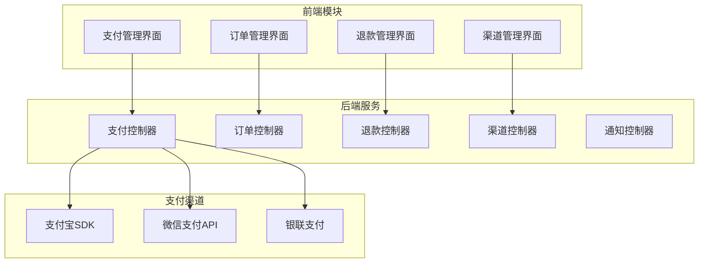
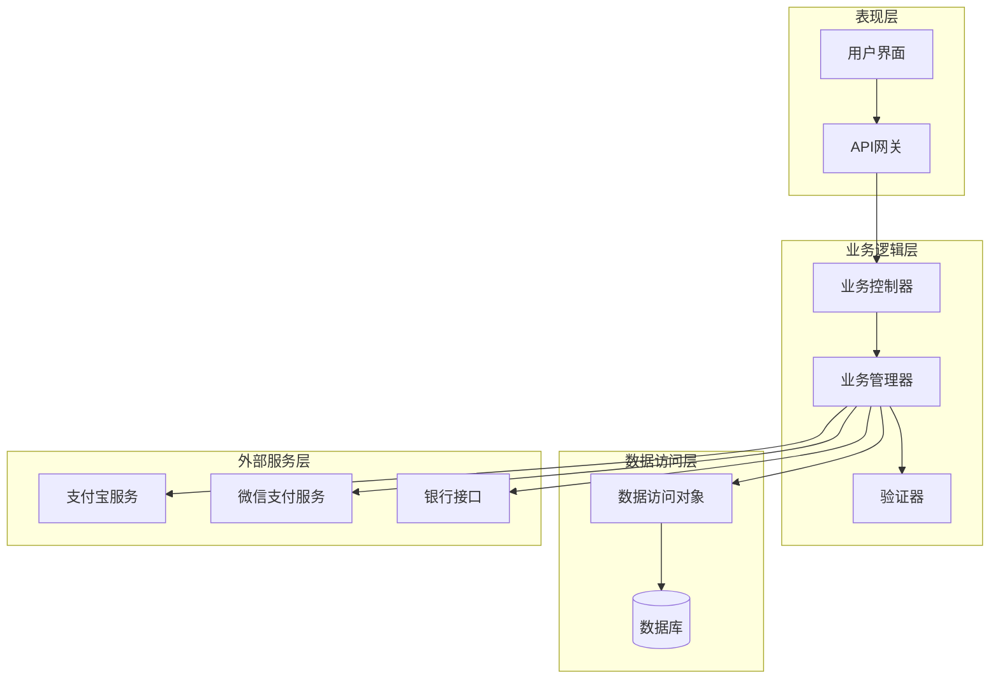
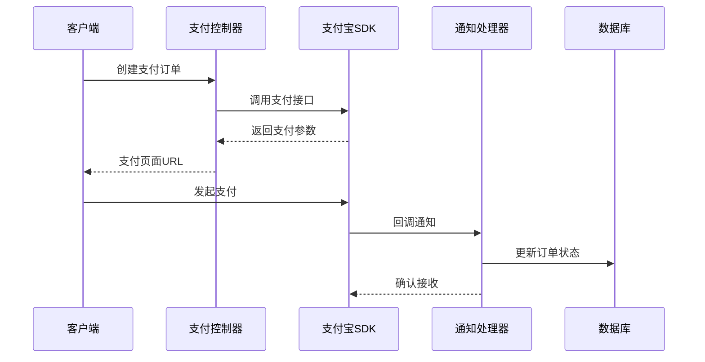
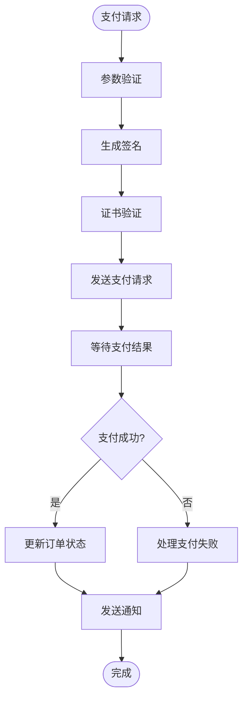
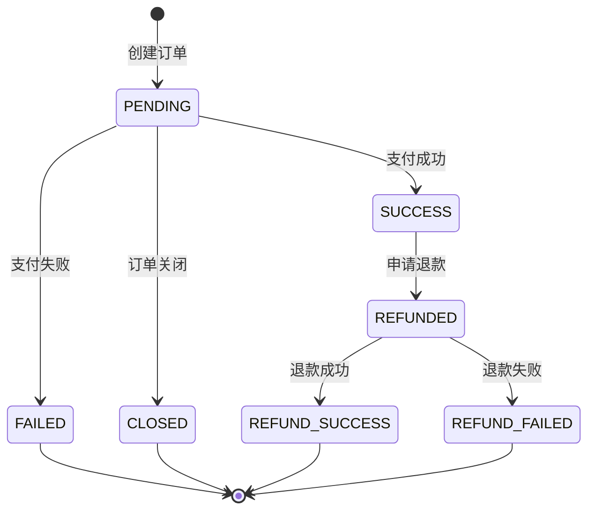
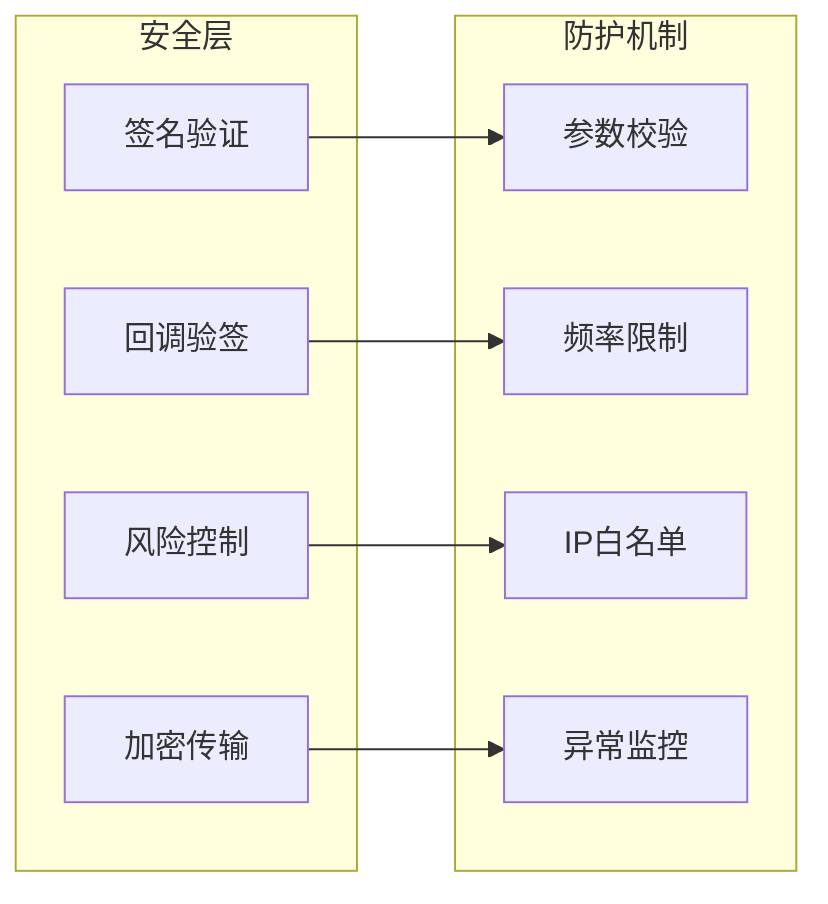
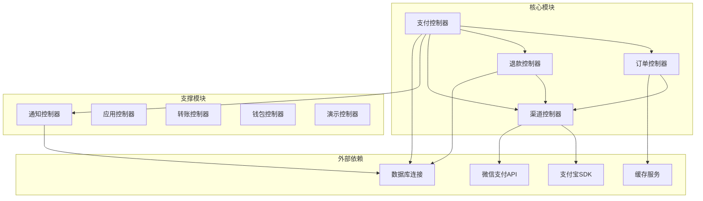

# 支付系统集成

<cite>
**本文档引用的文件**
- [application.yaml](file://yudao-server/src/main/resources/application.yaml)
- [pay-controller](file://yudao-ui/yudao-ui-admin-vue3/src/api/pay/)
- [pay-order-controller](file://yudao-ui/yudao-ui-admin-vue3/src/api/pay/order/)
- [pay-refund-controller](file://yudao-ui/yudao-ui-admin-vue3/src/api/pay/refund/)
- [pay-channel-controller](file://yudao-ui/yudao-ui-admin-vue3/src/api/pay/channel/)
- [pay-notify-controller](file://yudao-ui/yudao-ui-admin-vue3/src/api/pay/notify/)
- [pay-app-controller](file://yudao-ui/yudao-ui-admin-vue3/src/api/pay/app/)
- [pay-transfer-controller](file://yudao-ui/yudao-ui-admin-vue3/src/api/pay/transfer/)
- [pay-wallet-controller](file://yudao-ui/yudao-ui-admin-vue3/src/api/pay/wallet/)
- [pay-demo-controller](file://yudao-ui/yudao-ui-admin-vue3/src/api/pay/demo/)
</cite>

## 目录
1. [简介](#简介)
2. [项目结构](#项目结构)
3. [核心组件](#核心组件)
4. [架构概览](#架构概览)
5. [详细组件分析](#详细组件分析)
6. [依赖关系分析](#依赖关系分析)
7. [性能考虑](#性能考虑)
8. [故障排除指南](#故障排除指南)
9. [结论](#结论)

## 简介

本项目是一个基于RuoYi框架的企业级应用，集成了完整的支付系统解决方案。该支付系统支持多种支付渠道，包括支付宝和微信支付，并提供了全面的支付管理功能。

支付系统的核心特性包括：
- 多渠道支付支持（支付宝、微信支付）
- 完整的支付生命周期管理
- 安全的支付验证机制
- 实时支付状态同步
- 退款处理和对账功能
- 支付统计和报表

## 项目结构

支付系统采用前后端分离的架构设计，主要由以下模块组成：

**图表来源**
- [pay-controller](file://yudao-ui/yudao-ui-admin-vue3/src/api/pay/)
- [pay-order-controller](file://yudao-ui/yudao-ui-admin-vue3/src/api/pay/order/)
- [pay-refund-controller](file://yudao-ui/yudao-ui-admin-vue3/src/api/pay/refund/)

**章节来源**
- [pay-controller](file://yudao-ui/yudao-ui-admin-vue3/src/api/pay/)
- [pay-order-controller](file://yudao-ui/yudao-ui-admin-vue3/src/api/pay/order/)
- [pay-refund-controller](file://yudao-ui/yudao-ui-admin-vue3/src/api/pay/refund/)

## 核心组件

### 支付控制器 (PayController)

支付控制器是整个支付系统的核心入口，负责处理所有支付相关的业务逻辑。

主要功能：
- 支付订单创建和管理
- 支付参数配置和验证
- 支付渠道选择和路由
- 支付状态监控和更新
- 支付结果通知处理

### 订单管理 (OrderController)

订单管理模块负责支付订单的完整生命周期管理。

核心功能：
- 订单创建和初始化
- 订单状态跟踪和同步
- 订单查询和筛选
- 订单取消和关闭
- 订单统计和报表

### 退款管理 (RefundController)

退款管理模块提供完整的退款处理机制。

主要特性：
- 退款申请和审批
- 退款状态跟踪
- 退款金额计算
- 退款记录管理
- 退款异常处理

### 渠道管理 (ChannelController)

渠道管理模块负责支付渠道的配置和维护。

功能包括：
- 支付渠道配置
- 渠道参数管理
- 渠道状态监控
- 渠道切换和维护
- 渠道费用设置

**章节来源**
- [pay-controller](file://yudao-ui/yudao-ui-admin-vue3/src/api/pay/)
- [pay-order-controller](file://yudao-ui/yudao-ui-admin-vue3/src/api/pay/order/)
- [pay-refund-controller](file://yudao-ui/yudao-ui-admin-vue3/src/api/pay/refund/)
- [pay-channel-controller](file://yudao-ui/yudao-ui-admin-vue3/src/api/pay/channel/)

## 架构概览

支付系统采用分层架构设计，确保了系统的可扩展性和可维护性：

**图表来源**
- [application.yaml](file://yudao-server/src/main/resources/application.yaml)
- [pay-controller](file://yudao-ui/yudao-ui-admin-vue3/src/api/pay/)

系统架构特点：
- 分层清晰，职责明确
- 支付渠道解耦，易于扩展
- 异步处理提高系统性能
- 完善的错误处理机制
- 安全的支付验证流程

## 详细组件分析

### 支付渠道集成

#### 支付宝集成

支付宝作为主流移动支付渠道，提供了完善的SDK和API支持：

**图表来源**
- [pay-controller](file://yudao-ui/yudao-ui-admin-vue3/src/api/pay/)
- [pay-notify-controller](file://yudao-ui/yudao-ui-admin-vue3/src/api/pay/notify/)

支付宝集成要点：
- 应用密钥配置和管理
- 支付参数签名验证
- 异步回调处理机制
- 支付状态实时同步

#### 微信支付集成

微信支付提供了丰富的API接口和安全保障：

**图表来源**
- [pay-controller](file://yudao-ui/yudao-ui-admin-vue3/src/api/pay/)
- [pay-channel-controller](file://yudao-ui/yudao-ui-admin-vue3/src/api/pay/channel/)

微信支付集成特性：
- 证书上传和管理
- 统一下单接口调用
- 异步通知处理
- 支付安全验证

### 支付订单管理

支付订单管理是整个支付系统的核心功能模块：

**图表来源**
- [pay-order-controller](file://yudao-ui/yudao-ui-admin-vue3/src/api/pay/order/)

订单管理关键流程：
- 订单创建和初始化
- 支付状态实时同步
- 退款申请和处理
- 订单生命周期管理

### 支付安全配置

支付安全是系统设计的重中之重，采用了多层次的安全防护机制：

**图表来源**
- [pay-controller](file://yudao-ui/yudao-ui-admin-vue3/src/api/pay/)
- [pay-channel-controller](file://yudao-ui/yudao-ui-admin-vue3/src/api/pay/channel/)

安全配置要点：
- 数字签名验证机制
- 回调请求真实性验证
- 支付风险识别和控制
- 敏感数据加密存储

**章节来源**
- [pay-controller](file://yudao-ui/yudao-ui-admin-vue3/src/api/pay/)
- [pay-order-controller](file://yudao-ui/yudao-ui-admin-vue3/src/api/pay/order/)
- [pay-refund-controller](file://yudao-ui/yudao-ui-admin-vue3/src/api/pay/refund/)
- [pay-channel-controller](file://yudao-ui/yudao-ui-admin-vue3/src/api/pay/channel/)

## 依赖关系分析

支付系统各模块之间的依赖关系如下：

**图表来源**
- [pay-controller](file://yudao-ui/yudao-ui-admin-vue3/src/api/pay/)
- [pay-notify-controller](file://yudao-ui/yudao-ui-admin-vue3/src/api/pay/notify/)
- [pay-app-controller](file://yudao-ui/yudao-ui-admin-vue3/src/api/pay/app/)
- [pay-transfer-controller](file://yudao-ui/yudao-ui-admin-vue3/src/api/pay/transfer/)
- [pay-wallet-controller](file://yudao-ui/yudao-ui-admin-vue3/src/api/pay/wallet/)
- [pay-demo-controller](file://yudao-ui/yudao-ui-admin-vue3/src/api/pay/demo/)

模块间协作特点：
- 松耦合设计，便于独立开发和测试
- 明确的职责分工，避免功能重叠
- 统一的错误处理机制
- 标准化的数据交换格式

**章节来源**
- [pay-controller](file://yudao-ui/yudao-ui-admin-vue3/src/api/pay/)
- [pay-notify-controller](file://yudao-ui/yudao-ui-admin-vue3/src/api/pay/notify/)
- [pay-app-controller](file://yudao-ui/yudao-ui-admin-vue3/src/api/pay/app/)

## 性能考虑

支付系统在设计时充分考虑了性能优化：

### 异步处理机制
- 支付回调采用异步处理，避免阻塞主线程
- 订单状态更新使用消息队列异步推送
- 大量数据操作采用批量处理

### 缓存策略
- 支付渠道配置信息缓存
- 用户支付历史缓存
- 热门商品价格缓存

### 连接池管理
- 数据库连接池动态调整
- 外部API调用连接复用
- 内存缓存容量控制

## 故障排除指南

### 常见问题及解决方案

#### 支付回调失败
**问题描述：** 支付完成后，回调通知无法正常接收
**解决步骤：**
1. 检查回调URL配置是否正确
2. 验证服务器网络连通性
3. 查看回调日志和错误信息
4. 确认签名验证逻辑

#### 支付参数错误
**问题描述：** 支付请求返回参数错误
**解决步骤：**
1. 验证商户ID和密钥配置
2. 检查支付金额格式
3. 确认商品描述编码
4. 验证回调地址格式

#### 退款处理异常
**问题描述：** 退款申请后状态长时间不变
**解决步骤：**
1. 检查退款账户余额
2. 验证退款金额限制
3. 确认退款原因合理性
4. 查看银行处理状态

#### 支付超时
**问题描述：** 支付请求超过规定时间无响应
**解决步骤：**
1. 检查网络连接稳定性
2. 验证服务器负载情况
3. 调整超时参数设置
4. 查看第三方支付平台状态

**章节来源**
- [pay-controller](file://yudao-ui/yudao-ui-admin-vue3/src/api/pay/)
- [pay-order-controller](file://yudao-ui/yudao-ui-admin-vue3/src/api/pay/order/)
- [pay-refund-controller](file://yudao-ui/yudao-ui-admin-vue3/src/api/pay/refund/)

## 结论

本支付系统集成了多种主流支付渠道，提供了完整的支付解决方案。系统采用现代化的架构设计，具有良好的扩展性和安全性。

主要优势：
- 支持多渠道支付，满足不同用户需求
- 完善的订单管理功能，覆盖支付全生命周期
- 强大的安全防护机制，保障资金安全
- 良好的性能表现，支持高并发场景
- 清晰的代码结构，便于维护和扩展

建议在实际部署时重点关注：
- 支付渠道的合规性审查
- 安全配置的定期审计
- 性能监控和预警机制
- 应急预案和故障恢复