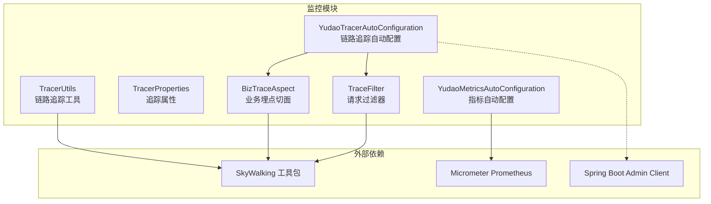
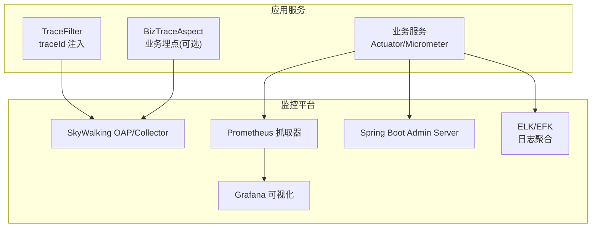
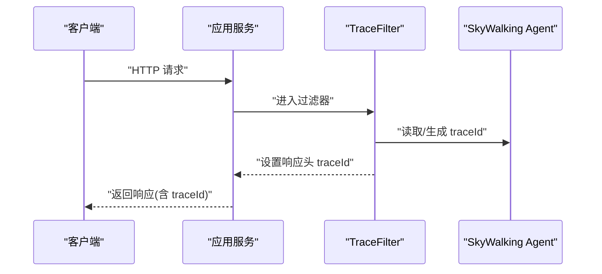
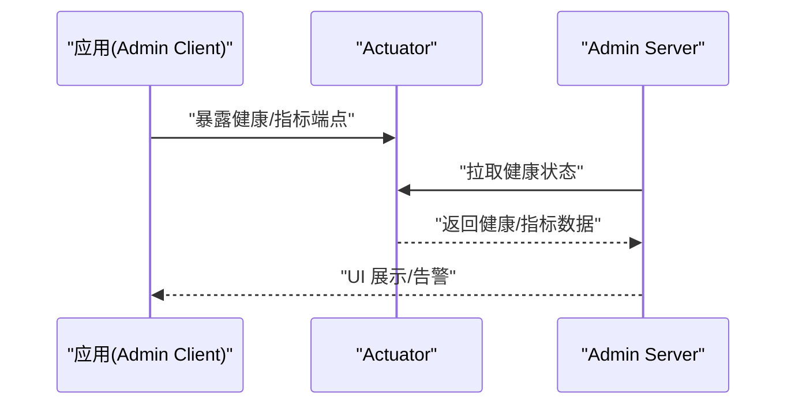
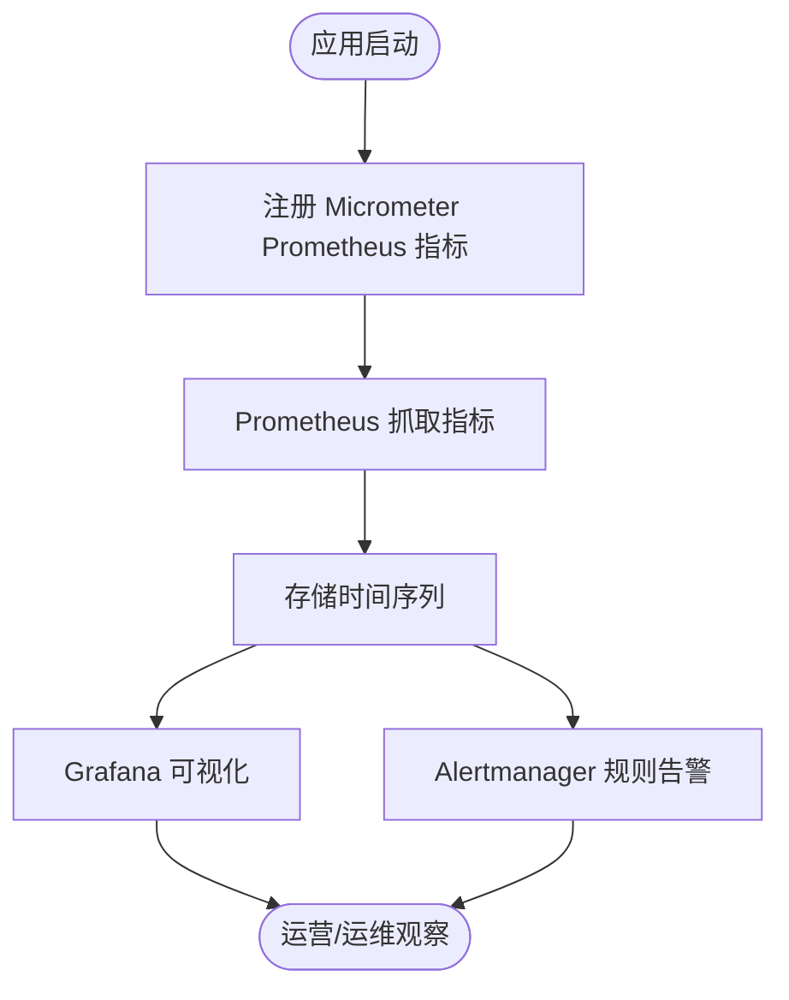
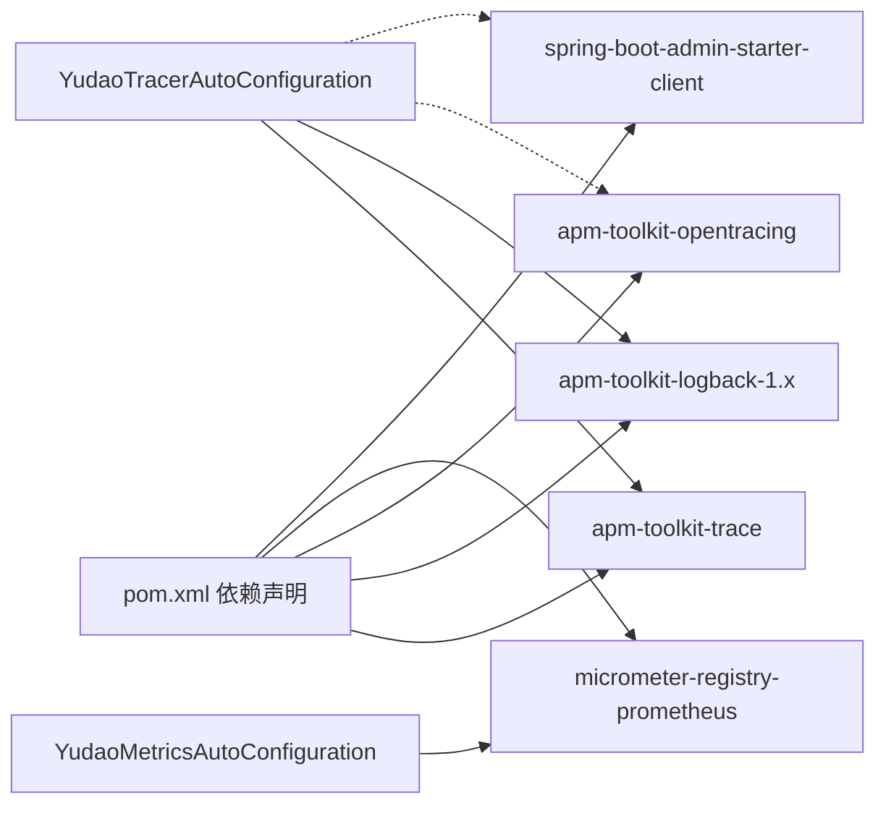

# 监控系统集成

<cite>
**本文引用的文件**
- [YudaoTracerAutoConfiguration.java](file://yudao-framework/yudao-spring-boot-starter-monitor/src/main/java/cn/iocoder/yudao/framework/tracer/config/YudaoTracerAutoConfiguration.java)
- [YudaoMetricsAutoConfiguration.java](file://yudao-framework/yudao-spring-boot-starter-monitor/src/main/java/cn/iocoder/yudao/framework/tracer/config/YudaoMetricsAutoConfiguration.java)
- [TracerProperties.java](file://yudao-framework/yudao-spring-boot-starter-monitor/src/main/java/cn/iocoder/yudao/framework/tracer/config/TracerProperties.java)
- [BizTraceAspect.java](file://yudao-framework/yudao-spring-boot-starter-monitor/src/main/java/cn/iocoder/yudao/framework/tracer/core/aop/BizTraceAspect.java)
- [TraceFilter.java](file://yudao-framework/yudao-spring-boot-starter-monitor/src/main/java/cn/iocoder/yudao/framework/tracer/core/filter/TraceFilter.java)
- [TracerUtils.java](file://yudao-framework/yudao-common/src/main/java/cn/iocoder/yudao/framework/common/util/monitor/TracerUtils.java)
- [pom.xml](file://yudao-framework/yudao-spring-boot-starter-monitor/pom.xml)
- [application.yaml](file://yudao-server/src/main/resources/application.yaml)
- [application-dev.yaml](file://yudao-server/src/main/resources/application-dev.yaml)
- [application-local.yaml](file://yudao-server/src/main/resources/application-local.yaml)
- [Dockerfile](file://yudao-server/Dockerfile)
- [docker-compose.yml](file://script/docker/docker-compose.yml)
- [docker.env](file://script/docker/docker.env)
- [Spring Boot 链路追踪 SkyWalking 入门.md](file://yudao-framework/yudao-spring-boot-starter-monitor/《芋道 Spring Boot 链路追踪 SkyWalking 入门》.md)
- [监控工具 Admin 入门.md](file://yudao-framework/yudao-spring-boot-starter-monitor/《芋道 Spring Boot 监控工具 Admin 入门》.md)
- [监控端点 Actuator 入门.md](file://yudao-framework/yudao-spring-boot-starter-monitor/《芋道 Spring Boot 监控端点 Actuator 入门》.md)
</cite>

## 目录
1. [简介](#简介)
2. [项目结构](#项目结构)
3. [核心组件](#核心组件)
4. [架构总览](#架构总览)
5. [详细组件分析](#详细组件分析)
6. [依赖关系分析](#依赖关系分析)
7. [性能考量](#性能考量)
8. [故障排查指南](#故障排查指南)
9. [结论](#结论)
10. [附录](#附录)

## 简介
本文件面向运维与开发团队，系统性阐述本项目的监控体系集成方案，覆盖以下能力：
- SkyWalking 链路追踪集成：探针配置、Agent 设置与分布式追踪配置要点
- Spring Boot Admin 监控集成：服务注册、健康检查与管理界面配置
- Prometheus 监控集成：指标采集、Grafana 可视化与告警规则配置
- 日志聚合系统集成：ELK Stack 配置与日志分析思路
- 提供监控配置示例、性能指标解读与告警处理流程

本项目在监控模块中已内置 Micrometer Prometheus 支持与 SkyWalking 工具包依赖，并通过自动配置实现通用标签注入与过滤器装配。

## 项目结构
监控相关能力主要集中在 yudao-spring-boot-starter-monitor 模块，核心文件如下：
- 自动配置与属性：YudaoTracerAutoConfiguration、YudaoMetricsAutoConfiguration、TracerProperties
- 核心拦截与过滤：BizTraceAspect、TraceFilter
- 工具类：TracerUtils（SkyWalking TraceId 获取）
- 依赖声明：pom.xml 中包含 SkyWalking 与 Micrometer Prometheus 依赖
- 服务器侧配置：application.yaml、application-dev.yaml、application-local.yaml、Dockerfile、docker-compose.yml、docker.env

图表来源
- [YudaoTracerAutoConfiguration.java:1-53](file://yudao-framework/yudao-spring-boot-starter-monitor/src/main/java/cn/iocoder/yudao/framework/tracer/config/YudaoTracerAutoConfiguration.java#L1-L53)
- [YudaoMetricsAutoConfiguration.java:1-27](file://yudao-framework/yudao-spring-boot-starter-monitor/src/main/java/cn/iocoder/yudao/framework/tracer/config/YudaoMetricsAutoConfiguration.java#L1-L27)
- [TracerProperties.java:1-100](file://yudao-framework/yudao-spring-boot-starter-monitor/src/main/java/cn/iocoder/yudao/framework/tracer/config/TracerProperties.java#L1-L100)
- [BizTraceAspect.java:1-120](file://yudao-framework/yudao-spring-boot-starter-monitor/src/main/java/cn/iocoder/yudao/framework/tracer/core/aop/BizTraceAspect.java#L1-L120)
- [TraceFilter.java:1-120](file://yudao-framework/yudao-spring-boot-starter-monitor/src/main/java/cn/iocoder/yudao/framework/tracer/core/filter/TraceFilter.java#L1-L120)
- [TracerUtils.java:1-30](file://yudao-framework/yudao-common/src/main/java/cn/iocoder/yudao/framework/common/util/monitor/TracerUtils.java#L1-L30)
- [pom.xml:37-79](file://yudao-framework/yudao-spring-boot-starter-monitor/pom.xml#L37-L79)

章节来源
- [YudaoTracerAutoConfiguration.java:1-53](file://yudao-framework/yudao-spring-boot-starter-monitor/src/main/java/cn/iocoder/yudao/framework/tracer/config/YudaoTracerAutoConfiguration.java#L1-L53)
- [YudaoMetricsAutoConfiguration.java:1-27](file://yudao-framework/yudao-spring-boot-starter-monitor/src/main/java/cn/iocoder/yudao/framework/tracer/config/YudaoMetricsAutoConfiguration.java#L1-L27)
- [TracerProperties.java:1-100](file://yudao-framework/yudao-spring-boot-starter-monitor/src/main/java/cn/iocoder/yudao/framework/tracer/config/TracerProperties.java#L1-L100)
- [BizTraceAspect.java:1-120](file://yudao-framework/yudao-spring-boot-starter-monitor/src/main/java/cn/iocoder/yudao/framework/tracer/core/aop/BizTraceAspect.java#L1-L120)
- [TraceFilter.java:1-120](file://yudao-framework/yudao-spring-boot-starter-monitor/src/main/java/cn/iocoder/yudao/framework/tracer/core/filter/TraceFilter.java#L1-L120)
- [TracerUtils.java:1-30](file://yudao-framework/yudao-common/src/main/java/cn/iocoder/yudao/framework/common/util/monitor/TracerUtils.java#L1-L30)
- [pom.xml:37-79](file://yudao-framework/yudao-spring-boot-starter-monitor/pom.xml#L37-L79)

## 核心组件
- 链路追踪自动配置：负责装配 TraceFilter 与（注释掉的）BizTraceAspect，以及对 SkyWalking 的兼容性提示
- 指标自动配置：启用 Micrometer 并注入通用标签（如 application），便于多实例统一识别
- 追踪属性：用于扩展追踪相关配置（当前未使用）
- 业务埋点切面：基于 OpenTracing/SkyWalking 的业务埋点（当前未启用）
- 请求过滤器：在响应头中设置 traceId，便于跨服务定位
- 链路追踪工具：提供获取当前请求 traceId 的便捷方法

章节来源
- [YudaoTracerAutoConfiguration.java:27-53](file://yudao-framework/yudao-spring-boot-starter-monitor/src/main/java/cn/iocoder/yudao/framework/tracer/config/YudaoTracerAutoConfiguration.java#L27-L53)
- [YudaoMetricsAutoConfiguration.java:11-27](file://yudao-framework/yudao-spring-boot-starter-monitor/src/main/java/cn/iocoder/yudao/framework/tracer/config/YudaoMetricsAutoConfiguration.java#L11-L27)
- [TracerProperties.java:12-100](file://yudao-framework/yudao-spring-boot-starter-monitor/src/main/java/cn/iocoder/yudao/framework/tracer/config/TracerProperties.java#L12-L100)
- [BizTraceAspect.java:28-120](file://yudao-framework/yudao-spring-boot-starter-monitor/src/main/java/cn/iocoder/yudao/framework/tracer/core/aop/BizTraceAspect.java#L28-L120)
- [TraceFilter.java:16-120](file://yudao-framework/yudao-spring-boot-starter-monitor/src/main/java/cn/iocoder/yudao/framework/tracer/core/filter/TraceFilter.java#L16-L120)
- [TracerUtils.java:12-30](file://yudao-framework/yudao-common/src/main/java/cn/iocoder/yudao/framework/common/util/monitor/TracerUtils.java#L12-L30)

## 架构总览
下图展示监控子系统与外部组件的交互关系，包括 SkyWalking、Prometheus、Spring Boot Admin 与应用服务之间的协作。

图表来源
- [YudaoTracerAutoConfiguration.java:42-53](file://yudao-framework/yudao-spring-boot-starter-monitor/src/main/java/cn/iocoder/yudao/framework/tracer/config/YudaoTracerAutoConfiguration.java#L42-L53)
- [YudaoMetricsAutoConfiguration.java:11-27](file://yudao-framework/yudao-spring-boot-starter-monitor/src/main/java/cn/iocoder/yudao/framework/tracer/config/YudaoMetricsAutoConfiguration.java#L11-L27)
- [pom.xml:44-76](file://yudao-framework/yudao-spring-boot-starter-monitor/pom.xml#L44-L76)

## 详细组件分析

### SkyWalking 链路追踪集成
- 探针配置与 Agent 设置
  - 在应用启动参数中添加 SkyWalking Agent 启动参数，指向下载好的 agent 包路径
  - 在环境变量或 docker.env 中配置 agent 所需的 OAP 地址、服务名等参数
- 分布式追踪配置
  - 通过 TraceFilter 将 traceId 写入响应头，便于下游服务透传
  - 业务埋点切面 BizTraceAspect 基于 SkyWalking 工具包进行标注（当前自动配置中被注释，未启用）
  - TracerUtils 提供获取当前 traceId 的静态方法，便于日志与业务代码中使用

图表来源
- [TraceFilter.java:16-120](file://yudao-framework/yudao-spring-boot-starter-monitor/src/main/java/cn/iocoder/yudao/framework/tracer/core/filter/TraceFilter.java#L16-L120)
- [TracerUtils.java:20-30](file://yudao-framework/yudao-common/src/main/java/cn/iocoder/yudao/framework/common/util/monitor/TracerUtils.java#L20-L30)
- [YudaoTracerAutoConfiguration.java:42-53](file://yudao-framework/yudao-spring-boot-starter-monitor/src/main/java/cn/iocoder/yudao/framework/tracer/config/YudaoTracerAutoConfiguration.java#L42-L53)

章节来源
- [YudaoTracerAutoConfiguration.java:27-53](file://yudao-framework/yudao-spring-boot-starter-monitor/src/main/java/cn/iocoder/yudao/framework/tracer/config/YudaoTracerAutoConfiguration.java#L27-L53)
- [TraceFilter.java:16-120](file://yudao-framework/yudao-spring-boot-starter-monitor/src/main/java/cn/iocoder/yudao/framework/tracer/core/filter/TraceFilter.java#L16-L120)
- [TracerUtils.java:12-30](file://yudao-framework/yudao-common/src/main/java/cn/iocoder/yudao/framework/common/util/monitor/TracerUtils.java#L12-L30)
- [pom.xml:44-63](file://yudao-framework/yudao-spring-boot-starter-monitor/pom.xml#L44-L63)
- [Spring Boot 链路追踪 SkyWalking 入门.md](file://yudao-framework/yudao-spring-boot-starter-monitor/《芋道 Spring Boot 链路追踪 SkyWalking 入门》.md)

### Spring Boot Admin 监控集成
- 服务注册与发现
  - 应用以 Spring Boot Admin Client 身份向 Admin Server 注册，需要在配置中指定 Admin Server 地址
  - Actuator 端点默认开启，便于 Admin Server 抓取健康信息
- 健康检查
  - Actuator 提供多种健康指标，Admin UI 将其汇总展示
- 管理界面配置
  - Admin Server 侧可配置 UI 访问、认证与通知策略
  - 应用侧可按需开放敏感端点或限制访问

图表来源
- [YudaoTracerAutoConfiguration.java:42-53](file://yudao-framework/yudao-spring-boot-starter-monitor/src/main/java/cn/iocoder/yudao/framework/tracer/config/YudaoTracerAutoConfiguration.java#L42-L53)
- [监控工具 Admin 入门.md](file://yudao-framework/yudao-spring-boot-starter-monitor/《芋道 Spring Boot 监控工具 Admin 入门》.md)
- [监控端点 Actuator 入门.md](file://yudao-framework/yudao-spring-boot-starter-monitor/《芋道 Spring Boot 监控端点 Actuator 入门》.md)

章节来源
- [监控工具 Admin 入门.md](file://yudao-framework/yudao-spring-boot-starter-monitor/《芋道 Spring Boot 监控工具 Admin 入门》.md)
- [监控端点 Actuator 入门.md](file://yudao-framework/yudao-spring-boot-starter-monitor/《芋道 Spring Boot 监控端点 Actuator 入门》.md)

### Prometheus 监控集成
- 指标采集
  - 通过 Micrometer Prometheus 注册表暴露指标，Prometheus 以 scrape 方式抓取
  - YudaoMetricsAutoConfiguration 注入通用标签，便于区分不同应用实例
- Grafana 可视化
  - 在 Grafana 中添加 Prometheus 数据源，基于指标名称构建仪表盘
- 告警规则配置
  - 在 Prometheus Alertmanager 中配置规则，结合 Slack/钉钉等渠道推送告警

图表来源
- [YudaoMetricsAutoConfiguration.java:11-27](file://yudao-framework/yudao-spring-boot-starter-monitor/src/main/java/cn/iocoder/yudao/framework/tracer/config/YudaoMetricsAutoConfiguration.java#L11-L27)
- [pom.xml:65-70](file://yudao-framework/yudao-spring-boot-starter-monitor/pom.xml#L65-L70)

章节来源
- [YudaoMetricsAutoConfiguration.java:11-27](file://yudao-framework/yudao-spring-boot-starter-monitor/src/main/java/cn/iocoder/yudao/framework/tracer/config/YudaoMetricsAutoConfiguration.java#L11-L27)
- [pom.xml:65-70](file://yudao-framework/yudao-spring-boot-starter-monitor/pom.xml#L65-L70)

### 日志聚合系统集成（ELK/EFK）
- 结构
  - 应用输出结构化日志（JSON），由 Filebeat/Fluent Bit 收集
  - 发送到 Logstash/直接写入 Elasticsearch
  - Kibana 进行可视化与检索
- 与 SkyWalking 的协同
  - SkyWalking 日志工具包可将链路上下文注入日志，提升关联分析效率
- 建议
  - 统一日志格式与字段（traceId、spanId、应用名、实例名）
  - 为不同环境配置独立索引策略与保留周期

章节来源
- [pom.xml:54-58](file://yudao-framework/yudao-spring-boot-starter-monitor/pom.xml#L54-L58)

## 依赖关系分析
- SkyWalking 工具包
  - apm-toolkit-trace：提供注解与 API 获取 traceId
  - apm-toolkit-logback-1.x：将 traceId 注入日志
  - apm-toolkit-opentracing：OpenTracing 兼容层（当前自动配置中未启用）
- Micrometer Prometheus
  - micrometer-registry-prometheus：暴露指标给 Prometheus
- Spring Boot Admin
  - spring-boot-admin-starter-client：客户端注册与健康上报

图表来源
- [pom.xml:44-76](file://yudao-framework/yudao-spring-boot-starter-monitor/pom.xml#L44-L76)
- [YudaoTracerAutoConfiguration.java:27-53](file://yudao-framework/yudao-spring-boot-starter-monitor/src/main/java/cn/iocoder/yudao/framework/tracer/config/YudaoTracerAutoConfiguration.java#L27-L53)
- [YudaoMetricsAutoConfiguration.java:11-27](file://yudao-framework/yudao-spring-boot-starter-monitor/src/main/java/cn/iocoder/yudao/framework/tracer/config/YudaoMetricsAutoConfiguration.java#L11-L27)

章节来源
- [pom.xml:37-79](file://yudao-framework/yudao-spring-boot-starter-monitor/pom.xml#L37-L79)

## 性能考量
- 指标开销
  - 默认启用通用标签注入，建议仅在必要时开启细粒度指标，避免过度采样
- 过滤器与切面
  - TraceFilter 为轻量级过滤器；BizTraceAspect 当前未启用，避免引入额外 AOP 开销
- 日志与追踪
  - SkyWalking 日志工具包会增加少量序列化成本，建议在高吞吐场景评估开关策略

## 故障排查指南
- 无法获取 traceId
  - 检查是否正确配置 SkyWalking Agent 与 OAP 地址
  - 确认 TraceFilter 是否生效，响应头是否包含 traceId
- 指标未出现在 Prometheus
  - 确认 Micrometer Prometheus 依赖已引入且自动配置未被禁用
  - 检查 Actuator 端点是否可访问，Prometheus 抓取地址与目标是否正确
- Admin UI 无服务列表
  - 确认 Admin Server 地址配置正确，网络连通性正常
  - 检查 Actuator 端点权限与防火墙策略

章节来源
- [YudaoTracerAutoConfiguration.java:42-53](file://yudao-framework/yudao-spring-boot-starter-monitor/src/main/java/cn/iocoder/yudao/framework/tracer/config/YudaoTracerAutoConfiguration.java#L42-L53)
- [YudaoMetricsAutoConfiguration.java:11-27](file://yudao-framework/yudao-spring-boot-starter-monitor/src/main/java/cn/iocoder/yudao/framework/tracer/config/YudaoMetricsAutoConfiguration.java#L11-L27)
- [监控端点 Actuator 入门.md](file://yudao-framework/yudao-spring-boot-starter-monitor/《芋道 Spring Boot 监控端点 Actuator 入门》.md)

## 结论
本项目在监控方面提供了完善的基础设施：
- 通过 SkyWalking 工具包与 TraceFilter 实现分布式追踪与 traceId 透传
- 通过 Micrometer Prometheus 与通用标签实现标准化指标采集
- 通过 Spring Boot Admin Client 实现服务注册与健康展示
- 通过日志工具包与 ELK 协同实现可观测性闭环

建议在生产环境中结合实际流量与资源情况，合理配置指标粒度、日志采样与告警阈值，持续优化监控体验。

## 附录

### 配置示例（路径参考）
- 应用基础配置
  - [application.yaml](file://yudao-server/src/main/resources/application.yaml)
  - [application-dev.yaml](file://yudao-server/src/main/resources/application-dev.yaml)
  - [application-local.yaml](file://yudao-server/src/main/resources/application-local.yaml)
- 容器与编排
  - [Dockerfile](file://yudao-server/Dockerfile)
  - [docker-compose.yml](file://script/docker/docker-compose.yml)
  - [docker.env](file://script/docker/docker.env)

章节来源
- [application.yaml](file://yudao-server/src/main/resources/application.yaml)
- [application-dev.yaml](file://yudao-server/src/main/resources/application-dev.yaml)
- [application-local.yaml](file://yudao-server/src/main/resources/application-local.yaml)
- [Dockerfile](file://yudao-server/Dockerfile)
- [docker-compose.yml](file://script/docker/docker-compose.yml)
- [docker.env](file://script/docker/docker.env)