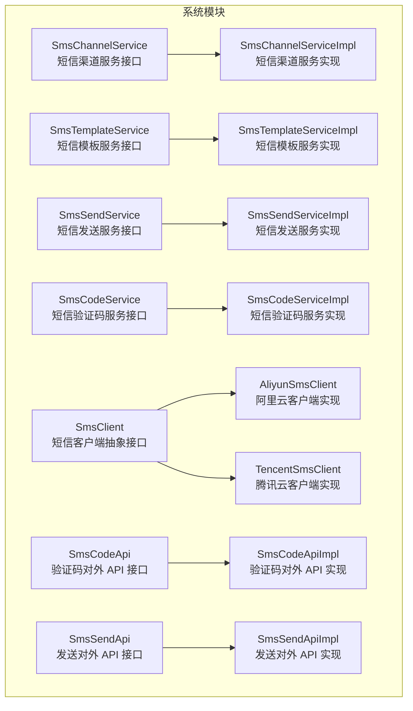
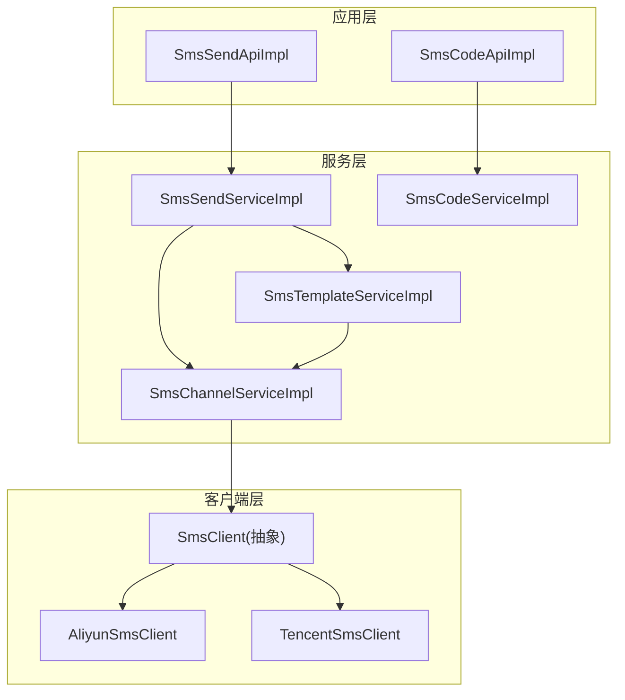
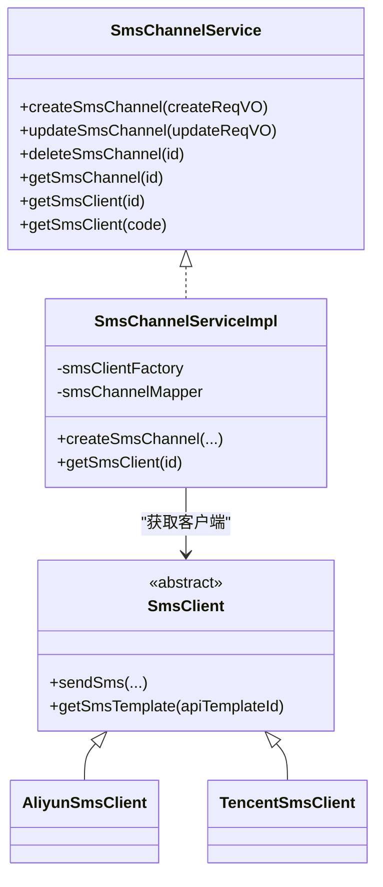
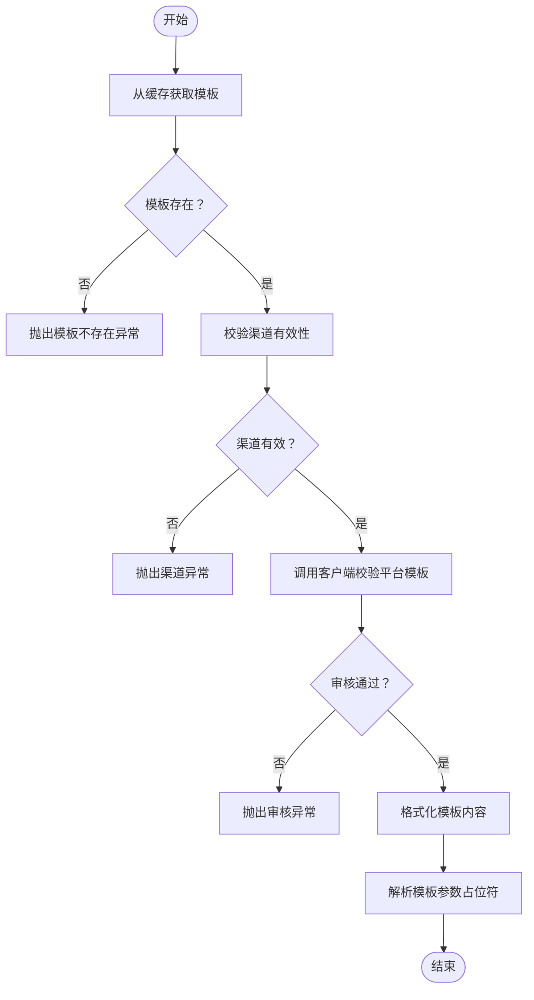
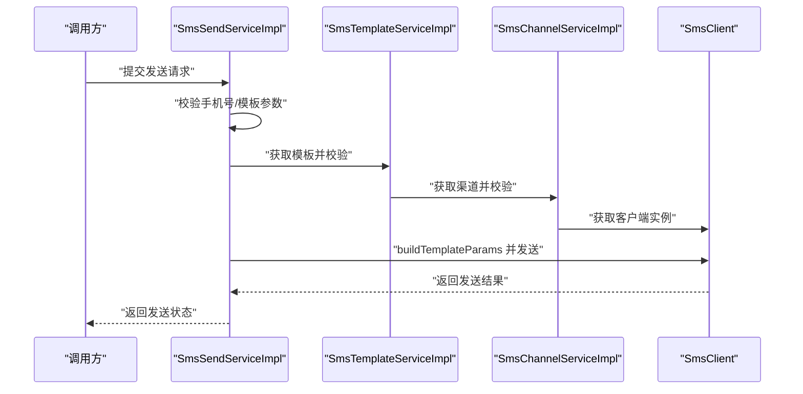
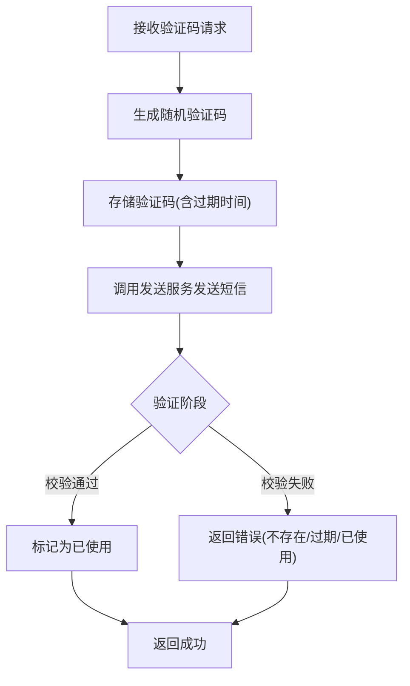
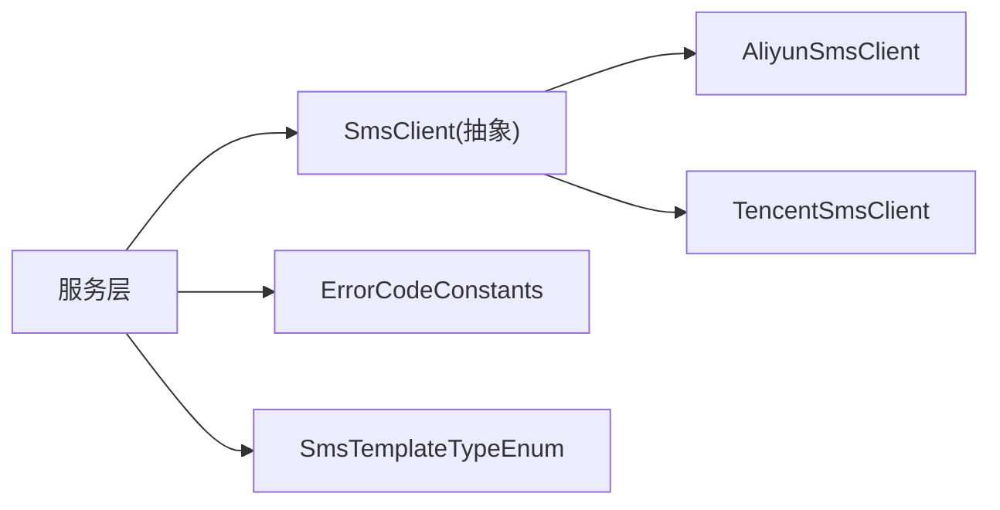

# 短信服务集成

<cite>
**本文引用的文件**
- [SmsChannelService.java](file://yudao-module-system/src/main/java/cn/iocoder/yudao/module/system/service/sms/SmsChannelService.java)
- [SmsChannelServiceImpl.java](file://yudao-module-system/src/main/java/cn/iocoder/yudao/module/system/service/sms/SmsChannelServiceImpl.java)
- [SmsTemplateService.java](file://yudao-module-system/src/main/java/cn/iocoder/yudao/module/system/service/sms/SmsTemplateService.java)
- [SmsTemplateServiceImpl.java](file://yudao-module-system/src/main/java/cn/iocoder/yudao/module/system/service/sms/SmsTemplateServiceImpl.java)
- [SmsSendService.java](file://yudao-module-system/src/main/java/cn/iocoder/yudao/module/system/service/sms/SmsSendService.java)
- [SmsSendServiceImpl.java](file://yudao-module-system/src/main/java/cn/iocoder/yudao/module/system/service/sms/SmsSendServiceImpl.java)
- [SmsCodeService.java](file://yudao-module-system/src/main/java/cn/iocoder/yudao/module/system/service/sms/SmsCodeService.java)
- [SmsCodeServiceImpl.java](file://yudao-module-system/src/main/java/cn/iocoder/yudao/module/system/service/sms/SmsCodeServiceImpl.java)
- [SmsClient.java](file://yudao-module-system/src/main/java/cn/iocoder/yudao/module/system/framework/sms/core/client/SmsClient.java)
- [AliyunSmsClient.java](file://yudao-module-system/src/main/java/cn/iocoder/yudao/module/system/framework/sms/core/client/impl/AliyunSmsClient.java)
- [TencentSmsClient.java](file://yudao-module-system/src/main/java/cn/iocoder/yudao/module/system/framework/sms/core/client/impl/TencentSmsClient.java)
- [SmsCodeApi.java](file://yudao-module-system/src/main/java/cn/iocoder/yudao/module/system/api/sms/SmsCodeApi.java)
- [SmsCodeApiImpl.java](file://yudao-module-system/src/main/java/cn/iocoder/yudao/module/system/api/sms/SmsCodeApiImpl.java)
- [SmsSendApi.java](file://yudao-module-system/src/main/java/cn/iocoder/yudao/module/system/api/sms/SmsSendApi.java)
- [SmsSendApiImpl.java](file://yudao-module-system/src/main/java/cn/iocoder/yudao/module/system/api/sms/SmsSendApiImpl.java)
- [ErrorCodeConstants.java](file://yudao-module-system/src/main/java/cn/iocoder/yudao/module/system/enums/ErrorCodeConstants.java)
- [SmsTemplateTypeEnum.java](file://yudao-module-system/src/main/java/cn/iocoder/yudao/module/system/enums/sms/SmsTemplateTypeEnum.java)
</cite>

## 目录
1. [简介](#简介)
2. [项目结构](#项目结构)
3. [核心组件](#核心组件)
4. [架构总览](#架构总览)
5. [详细组件分析](#详细组件分析)
6. [依赖关系分析](#依赖关系分析)
7. [性能考虑](#性能考虑)
8. [故障排查指南](#故障排查指南)
9. [结论](#结论)
10. [附录](#附录)

## 简介
本文件面向系统管理员与开发人员，系统性阐述短信服务在本项目的集成方案，覆盖以下要点：
- 阿里云短信服务集成：AccessKey 配置、短信模板设置、签名配置与发送接口使用
- 腾讯云短信服务集成：SDK 配置、模板管理、签名申请与发送流程
- 短信验证码功能：验证码生成、存储、验证与过期处理机制
- 短信模板管理：模板创建、审核流程与动态参数替换
- 发送示例路径、错误处理与发送状态查询能力

## 项目结构
短信服务相关代码主要位于 system 模块，采用“接口 + 实现 + DTO + 枚举 + 错误码”的分层设计，配合抽象客户端与具体厂商客户端实现解耦。

图表来源
- [SmsChannelService.java:1-88](file://yudao-module-system/src/main/java/cn/iocoder/yudao/module/system/service/sms/SmsChannelService.java#L1-L88)
- [SmsChannelServiceImpl.java:1-35](file://yudao-module-system/src/main/java/cn/iocoder/yudao/module/system/service/sms/SmsChannelServiceImpl.java#L1-L35)
- [SmsTemplateService.java](file://yudao-module-system/src/main/java/cn/iocoder/yudao/module/system/service/sms/SmsTemplateService.java)
- [SmsTemplateServiceImpl.java:143-211](file://yudao-module-system/src/main/java/cn/iocoder/yudao/module/system/service/sms/SmsTemplateServiceImpl.java#L143-L211)
- [SmsSendService.java](file://yudao-module-system/src/main/java/cn/iocoder/yudao/module/system/service/sms/SmsSendService.java)
- [SmsSendServiceImpl.java:118-155](file://yudao-module-system/src/main/java/cn/iocoder/yudao/module/system/service/sms/SmsSendServiceImpl.java#L118-L155)
- [SmsCodeService.java](file://yudao-module-system/src/main/java/cn/iocoder/yudao/module/system/service/sms/SmsCodeService.java)
- [SmsCodeServiceImpl.java](file://yudao-module-system/src/main/java/cn/iocoder/yudao/module/system/service/sms/SmsCodeServiceImpl.java)
- [SmsClient.java](file://yudao-module-system/src/main/java/cn/iocoder/yudao/module/system/framework/sms/core/client/SmsClient.java)
- [AliyunSmsClient.java](file://yudao-module-system/src/main/java/cn/iocoder/yudao/module/system/framework/sms/core/client/impl/AliyunSmsClient.java)
- [TencentSmsClient.java](file://yudao-module-system/src/main/java/cn/iocoder/yudao/module/system/framework/sms/core/client/impl/TencentSmsClient.java)
- [SmsCodeApi.java](file://yudao-module-system/src/main/java/cn/iocoder/yudao/module/system/api/sms/SmsCodeApi.java)
- [SmsCodeApiImpl.java](file://yudao-module-system/src/main/java/cn/iocoder/yudao/module/system/api/sms/SmsCodeApiImpl.java)
- [SmsSendApi.java](file://yudao-module-system/src/main/java/cn/iocoder/yudao/module/system/api/sms/SmsSendApi.java)
- [SmsSendApiImpl.java](file://yudao-module-system/src/main/java/cn/iocoder/yudao/module/system/api/sms/SmsSendApiImpl.java)

章节来源
- [SmsChannelService.java:1-88](file://yudao-module-system/src/main/java/cn/iocoder/yudao/module/system/service/sms/SmsChannelService.java#L1-L88)
- [SmsChannelServiceImpl.java:1-35](file://yudao-module-system/src/main/java/cn/iocoder/yudao/module/system/service/sms/SmsChannelServiceImpl.java#L1-L35)
- [SmsTemplateServiceImpl.java:143-211](file://yudao-module-system/src/main/java/cn/iocoder/yudao/module/system/service/sms/SmsTemplateServiceImpl.java#L143-L211)
- [SmsSendServiceImpl.java:118-155](file://yudao-module-system/src/main/java/cn/iocoder/yudao/module/system/service/sms/SmsSendServiceImpl.java#L118-L155)
- [SmsCodeServiceImpl.java](file://yudao-module-system/src/main/java/cn/iocoder/yudao/module/system/service/sms/SmsCodeServiceImpl.java)
- [SmsClient.java](file://yudao-module-system/src/main/java/cn/iocoder/yudao/module/system/framework/sms/core/client/SmsClient.java)
- [AliyunSmsClient.java](file://yudao-module-system/src/main/java/cn/iocoder/yudao/module/system/framework/sms/core/client/impl/AliyunSmsClient.java)
- [TencentSmsClient.java](file://yudao-module-system/src/main/java/cn/iocoder/yudao/module/system/framework/sms/core/client/impl/TencentSmsClient.java)
- [SmsCodeApi.java](file://yudao-module-system/src/main/java/cn/iocoder/yudao/module/system/api/sms/SmsCodeApi.java)
- [SmsCodeApiImpl.java](file://yudao-module-system/src/main/java/cn/iocoder/yudao/module/system/api/sms/SmsCodeApiImpl.java)
- [SmsSendApi.java](file://yudao-module-system/src/main/java/cn/iocoder/yudao/module/system/api/sms/SmsSendApi.java)
- [SmsSendApiImpl.java](file://yudao-module-system/src/main/java/cn/iocoder/yudao/module/system/api/sms/SmsSendApiImpl.java)

## 核心组件
- 短信渠道服务：负责短信通道（如阿里云、腾讯云）的创建、更新、删除与分页查询；提供根据 ID 或编码获取短信客户端的能力
- 短信模板服务：负责模板校验（含平台侧审核状态）、模板内容格式化与参数解析
- 短信发送服务：负责发送前校验（手机号、模板、参数）、构建参数序列、调用客户端发送
- 短信验证码服务：负责验证码生成、存储、验证与过期处理
- 抽象短信客户端：定义统一的短信发送与模板查询接口，具体厂商实现（阿里云、腾讯云等）
- 对外 API：验证码与发送的对外接口封装

章节来源
- [SmsChannelService.java:1-88](file://yudao-module-system/src/main/java/cn/iocoder/yudao/module/system/service/sms/SmsChannelService.java#L1-L88)
- [SmsTemplateService.java](file://yudao-module-system/src/main/java/cn/iocoder/yudao/module/system/service/sms/SmsTemplateService.java)
- [SmsSendService.java](file://yudao-module-system/src/main/java/cn/iocoder/yudao/module/system/service/sms/SmsSendService.java)
- [SmsCodeService.java](file://yudao-module-system/src/main/java/cn/iocoder/yudao/module/system/service/sms/SmsCodeService.java)
- [SmsClient.java](file://yudao-module-system/src/main/java/cn/iocoder/yudao/module/system/framework/sms/core/client/SmsClient.java)

## 架构总览
短信服务整体采用“服务层 + 客户端抽象 + 具体厂商实现 + 对外 API”的分层架构，通过 SmsClientFactory 获取具体厂商客户端，实现对不同短信服务商的解耦。

图表来源
- [SmsSendApiImpl.java](file://yudao-module-system/src/main/java/cn/iocoder/yudao/module/system/api/sms/SmsSendApiImpl.java)
- [SmsCodeApiImpl.java](file://yudao-module-system/src/main/java/cn/iocoder/yudao/module/system/api/sms/SmsCodeApiImpl.java)
- [SmsSendServiceImpl.java:118-155](file://yudao-module-system/src/main/java/cn/iocoder/yudao/module/system/service/sms/SmsSendServiceImpl.java#L118-L155)
- [SmsTemplateServiceImpl.java:143-211](file://yudao-module-system/src/main/java/cn/iocoder/yudao/module/system/service/sms/SmsTemplateServiceImpl.java#L143-L211)
- [SmsChannelServiceImpl.java:1-35](file://yudao-module-system/src/main/java/cn/iocoder/yudao/module/system/service/sms/SmsChannelServiceImpl.java#L1-L35)
- [SmsClient.java](file://yudao-module-system/src/main/java/cn/iocoder/yudao/module/system/framework/sms/core/client/SmsClient.java)
- [AliyunSmsClient.java](file://yudao-module-system/src/main/java/cn/iocoder/yudao/module/system/framework/sms/core/client/impl/AliyunSmsClient.java)
- [TencentSmsClient.java](file://yudao-module-system/src/main/java/cn/iocoder/yudao/module/system/framework/sms/core/client/impl/TencentSmsClient.java)

## 详细组件分析

### 短信渠道与客户端
- SmsChannelService 提供短信渠道的增删改查与分页查询，并支持按 ID/编码获取 SmsClient
- SmsChannelServiceImpl 通过 SmsClientFactory 获取具体厂商客户端实例
- SmsClient 抽象了短信发送与模板查询能力，阿里云与腾讯云分别实现

图表来源
- [SmsChannelService.java:1-88](file://yudao-module-system/src/main/java/cn/iocoder/yudao/module/system/service/sms/SmsChannelService.java#L1-L88)
- [SmsChannelServiceImpl.java:1-35](file://yudao-module-system/src/main/java/cn/iocoder/yudao/module/system/service/sms/SmsChannelServiceImpl.java#L1-L35)
- [SmsClient.java](file://yudao-module-system/src/main/java/cn/iocoder/yudao/module/system/framework/sms/core/client/SmsClient.java)
- [AliyunSmsClient.java](file://yudao-module-system/src/main/java/cn/iocoder/yudao/module/system/framework/sms/core/client/impl/AliyunSmsClient.java)
- [TencentSmsClient.java](file://yudao-module-system/src/main/java/cn/iocoder/yudao/module/system/framework/sms/core/client/impl/TencentSmsClient.java)

章节来源
- [SmsChannelService.java:1-88](file://yudao-module-system/src/main/java/cn/iocoder/yudao/module/system/service/sms/SmsChannelService.java#L1-L88)
- [SmsChannelServiceImpl.java:1-35](file://yudao-module-system/src/main/java/cn/iocoder/yudao/module/system/service/sms/SmsChannelServiceImpl.java#L1-L35)
- [SmsClient.java](file://yudao-module-system/src/main/java/cn/iocoder/yudao/module/system/framework/sms/core/client/SmsClient.java)
- [AliyunSmsClient.java](file://yudao-module-system/src/main/java/cn/iocoder/yudao/module/system/framework/sms/core/client/impl/AliyunSmsClient.java)
- [TencentSmsClient.java](file://yudao-module-system/src/main/java/cn/iocoder/yudao/module/system/framework/sms/core/client/impl/TencentSmsClient.java)

### 短信模板管理
- SmsTemplateServiceImpl 负责模板校验（渠道有效性、模板重复性）、平台侧模板审核状态校验、模板内容格式化与参数解析
- 支持从缓存获取模板，提升发送效率
- validateApiTemplate 会调用 SmsClient 的模板查询接口，校验审核状态与失败原因

图表来源
- [SmsTemplateServiceImpl.java:143-211](file://yudao-module-system/src/main/java/cn/iocoder/yudao/module/system/service/sms/SmsTemplateServiceImpl.java#L143-L211)

章节来源
- [SmsTemplateServiceImpl.java:143-211](file://yudao-module-system/src/main/java/cn/iocoder/yudao/module/system/service/sms/SmsTemplateServiceImpl.java#L143-L211)

### 短信发送流程
- SmsSendServiceImpl 在发送前进行手机号与模板参数校验，构建参数键值对序列，然后调用 SmsClient 发送
- 对于部分平台（如腾讯云），参数需按顺序映射到数组下标，该方法会将 Map 转换为有序键值对

图表来源
- [SmsSendServiceImpl.java:118-155](file://yudao-module-system/src/main/java/cn/iocoder/yudao/module/system/service/sms/SmsSendServiceImpl.java#L118-L155)
- [SmsTemplateServiceImpl.java:143-211](file://yudao-module-system/src/main/java/cn/iocoder/yudao/module/system/service/sms/SmsTemplateServiceImpl.java#L143-L211)
- [SmsChannelServiceImpl.java:1-35](file://yudao-module-system/src/main/java/cn/iocoder/yudao/module/system/service/sms/SmsChannelServiceImpl.java#L1-L35)
- [SmsClient.java](file://yudao-module-system/src/main/java/cn/iocoder/yudao/module/system/framework/sms/core/client/SmsClient.java)

章节来源
- [SmsSendServiceImpl.java:118-155](file://yudao-module-system/src/main/java/cn/iocoder/yudao/module/system/service/sms/SmsSendServiceImpl.java#L118-L155)
- [SmsTemplateServiceImpl.java:143-211](file://yudao-module-system/src/main/java/cn/iocoder/yudao/module/system/service/sms/SmsTemplateServiceImpl.java#L143-L211)
- [SmsChannelServiceImpl.java:1-35](file://yudao-module-system/src/main/java/cn/iocoder/yudao/module/system/service/sms/SmsChannelServiceImpl.java#L1-L35)
- [SmsClient.java](file://yudao-module-system/src/main/java/cn/iocoder/yudao/module/system/framework/sms/core/client/SmsClient.java)

### 短信验证码功能
- SmsCodeServiceImpl 负责验证码的生成、存储、验证与过期处理
- SmsCodeApi 与 SmsCodeApiImpl 提供对外接口：创建验证码并发送、验证并使用
- 错误码覆盖验证码不存在、已过期、已使用、超出日发送上限、发送过于频繁等情况

图表来源
- [SmsCodeServiceImpl.java](file://yudao-module-system/src/main/java/cn/iocoder/yudao/module/system/service/sms/SmsCodeServiceImpl.java)
- [SmsCodeApi.java](file://yudao-module-system/src/main/java/cn/iocoder/yudao/module/system/api/sms/SmsCodeApi.java)
- [SmsCodeApiImpl.java](file://yudao-module-system/src/main/java/cn/iocoder/yudao/module/system/api/sms/SmsCodeApiImpl.java)
- [ErrorCodeConstants.java:93-103](file://yudao-module-system/src/main/java/cn/iocoder/yudao/module/system/enums/ErrorCodeConstants.java#L93-L103)

章节来源
- [SmsCodeServiceImpl.java](file://yudao-module-system/src/main/java/cn/iocoder/yudao/module/system/service/sms/SmsCodeServiceImpl.java)
- [SmsCodeApi.java](file://yudao-module-system/src/main/java/cn/iocoder/yudao/module/system/api/sms/SmsCodeApi.java)
- [SmsCodeApiImpl.java](file://yudao-module-system/src/main/java/cn/iocoder/yudao/module/system/api/sms/SmsCodeApiImpl.java)
- [ErrorCodeConstants.java:93-103](file://yudao-module-system/src/main/java/cn/iocoder/yudao/module/system/enums/ErrorCodeConstants.java#L93-L103)

### 阿里云短信服务集成
- 配置项：通过 SmsChannelProperties 与 SmsClientFactory 绑定阿里云客户端
- 发送接口：AliyunSmsClient 实现 SmsClient 的发送与模板查询方法
- 模板与签名：在 validateApiTemplate 中校验平台侧模板审核状态；签名与模板在平台侧配置后由客户端透传

章节来源
- [AliyunSmsClient.java](file://yudao-module-system/src/main/java/cn/iocoder/yudao/module/system/framework/sms/core/client/impl/AliyunSmsClient.java)
- [SmsClient.java](file://yudao-module-system/src/main/java/cn/iocoder/yudao/module/system/framework/sms/core/client/SmsClient.java)

### 腾讯云短信服务集成
- 配置项：通过 SmsChannelProperties 与 SmsClientFactory 绑定腾讯云客户端
- 发送接口：TencentSmsClient 实现 SmsClient 的发送与模板查询方法
- 模板与签名：在 validateApiTemplate 中校验平台侧模板审核状态；参数需按顺序映射（见 buildTemplateParams）

章节来源
- [TencentSmsClient.java](file://yudao-module-system/src/main/java/cn/iocoder/yudao/module/system/framework/sms/core/client/impl/TencentSmsClient.java)
- [SmsSendServiceImpl.java:138-147](file://yudao-module-system/src/main/java/cn/iocoder/yudao/module/system/service/sms/SmsSendServiceImpl.java#L138-L147)
- [SmsClient.java](file://yudao-module-system/src/main/java/cn/iocoder/yudao/module/system/framework/sms/core/client/SmsClient.java)

### 短信模板管理与动态参数
- 模板类型：验证码、通知、营销三类
- 动态参数：parseTemplateContentParams 解析模板中的占位符，formatSmsTemplateContent 进行字符串格式化
- 审核流程：validateApiTemplate 校验审核状态，若处于审核中或失败则抛出对应异常

章节来源
- [SmsTemplateTypeEnum.java:1-25](file://yudao-module-system/src/main/java/cn/iocoder/yudao/module/system/enums/sms/SmsTemplateTypeEnum.java#L1-L25)
- [SmsTemplateServiceImpl.java:201-211](file://yudao-module-system/src/main/java/cn/iocoder/yudao/module/system/service/sms/SmsTemplateServiceImpl.java#L201-L211)
- [SmsTemplateServiceImpl.java:176-199](file://yudao-module-system/src/main/java/cn/iocoder/yudao/module/system/service/sms/SmsTemplateServiceImpl.java#L176-L199)

## 依赖关系分析
- 低耦合：服务层仅依赖抽象客户端接口，通过工厂注入具体实现
- 可扩展：新增厂商只需实现 SmsClient 并注册到工厂
- 可观测：发送与验证码均通过错误码与日志进行问题定位

图表来源
- [SmsSendServiceImpl.java:118-155](file://yudao-module-system/src/main/java/cn/iocoder/yudao/module/system/service/sms/SmsSendServiceImpl.java#L118-L155)
- [SmsTemplateServiceImpl.java:143-211](file://yudao-module-system/src/main/java/cn/iocoder/yudao/module/system/service/sms/SmsTemplateServiceImpl.java#L143-L211)
- [ErrorCodeConstants.java:93-103](file://yudao-module-system/src/main/java/cn/iocoder/yudao/module/system/enums/ErrorCodeConstants.java#L93-L103)
- [SmsTemplateTypeEnum.java:1-25](file://yudao-module-system/src/main/java/cn/iocoder/yudao/module/system/enums/sms/SmsTemplateTypeEnum.java#L1-L25)

章节来源
- [SmsSendServiceImpl.java:118-155](file://yudao-module-system/src/main/java/cn/iocoder/yudao/module/system/service/sms/SmsSendServiceImpl.java#L118-L155)
- [SmsTemplateServiceImpl.java:143-211](file://yudao-module-system/src/main/java/cn/iocoder/yudao/module/system/service/sms/SmsTemplateServiceImpl.java#L143-L211)
- [ErrorCodeConstants.java:93-103](file://yudao-module-system/src/main/java/cn/iocoder/yudao/module/system/enums/ErrorCodeConstants.java#L93-L103)
- [SmsTemplateTypeEnum.java:1-25](file://yudao-module-system/src/main/java/cn/iocoder/yudao/module/system/enums/sms/SmsTemplateTypeEnum.java#L1-L25)

## 性能考虑
- 模板缓存：SmsSendServiceImpl 从缓存获取模板，减少数据库访问
- 参数预处理：buildTemplateParams 将 Map 转为有序键值对，避免平台差异导致的参数错位
- 并发控制：验证码发送频率限制与日发送上限由服务层逻辑保障，防止滥用

## 故障排查指南
- 常见错误码
  - 短信发送：手机号不存在、模板参数缺失、模板不存在
  - 验证码：验证码不存在、验证码已过期、验证码已使用、超过每日发送上限、发送过于频繁
- 排查步骤
  - 确认模板与渠道状态正常
  - 检查参数是否完整且类型匹配
  - 核对平台侧模板审核状态
  - 查看验证码存储与过期策略

章节来源
- [ErrorCodeConstants.java:93-103](file://yudao-module-system/src/main/java/cn/iocoder/yudao/module/system/enums/ErrorCodeConstants.java#L93-L103)
- [SmsSendServiceImpl.java:118-155](file://yudao-module-system/src/main/java/cn/iocoder/yudao/module/system/service/sms/SmsSendServiceImpl.java#L118-L155)
- [SmsTemplateServiceImpl.java:176-199](file://yudao-module-system/src/main/java/cn/iocoder/yudao/module/system/service/sms/SmsTemplateServiceImpl.java#L176-L199)

## 结论
本项目通过抽象客户端与服务层解耦，实现了对阿里云、腾讯云等多家短信服务商的统一接入；结合模板缓存、参数预处理与完善的错误码体系，提供了高可用、可扩展的短信服务能力。建议在生产环境按平台要求完成签名与模板审核，并结合业务场景合理设置验证码发送频率与有效期。

## 附录
- 对外 API 使用参考
  - 验证码：SmsCodeApi/SmsCodeApiImpl
  - 发送：SmsSendApi/SmsSendApiImpl
- 示例代码路径（不展示具体代码，仅提供定位）
  - [验证码创建与发送示例](file://yudao-module-system/src/main/java/cn/iocoder/yudao/module/system/api/sms/SmsCodeApiImpl.java)
  - [发送单条短信示例](file://yudao-module-system/src/main/java/cn/iocoder/yudao/module/system/api/sms/SmsSendApiImpl.java)
  - [模板内容格式化示例:201-204](file://yudao-module-system/src/main/java/cn/iocoder/yudao/module/system/service/sms/SmsTemplateServiceImpl.java#L201-L204)
  - [参数序列构建示例:138-147](file://yudao-module-system/src/main/java/cn/iocoder/yudao/module/system/service/sms/SmsSendServiceImpl.java#L138-L147)