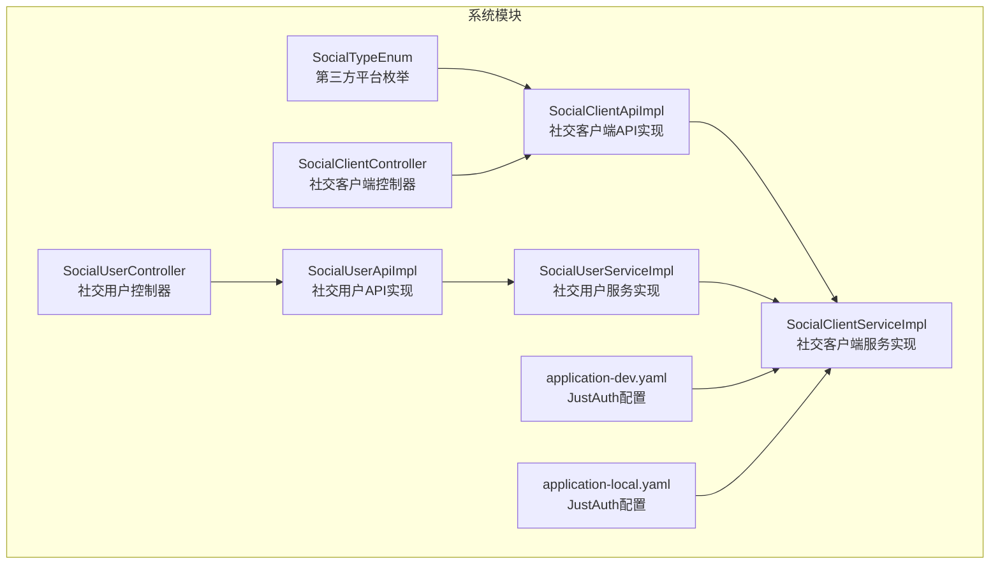
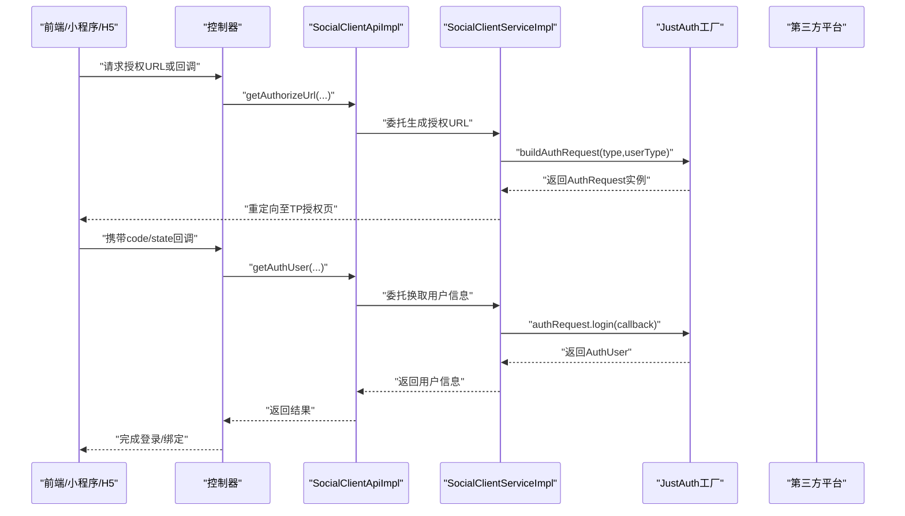
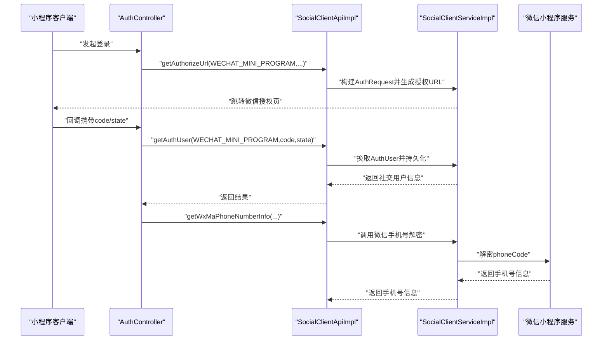
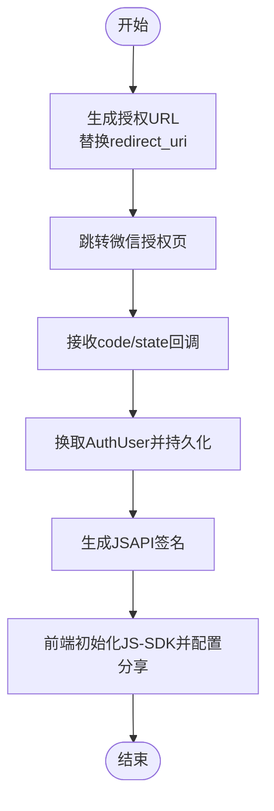
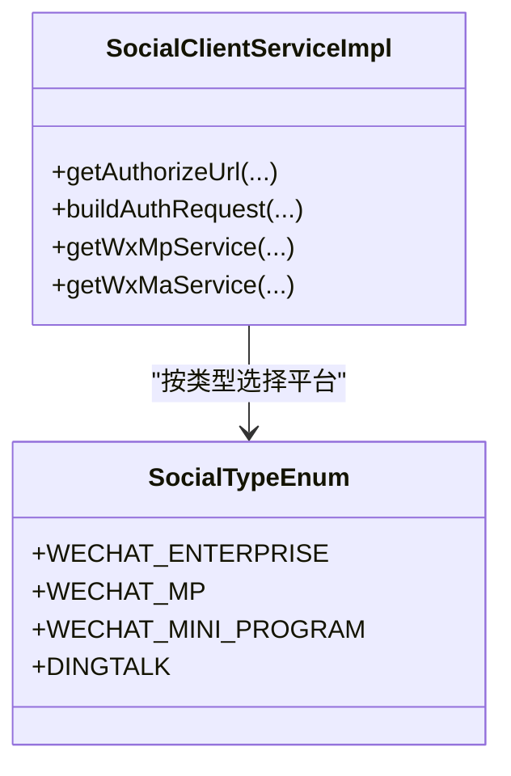
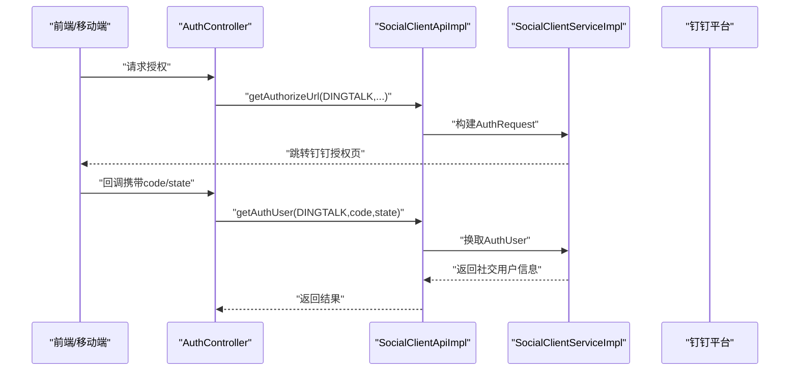
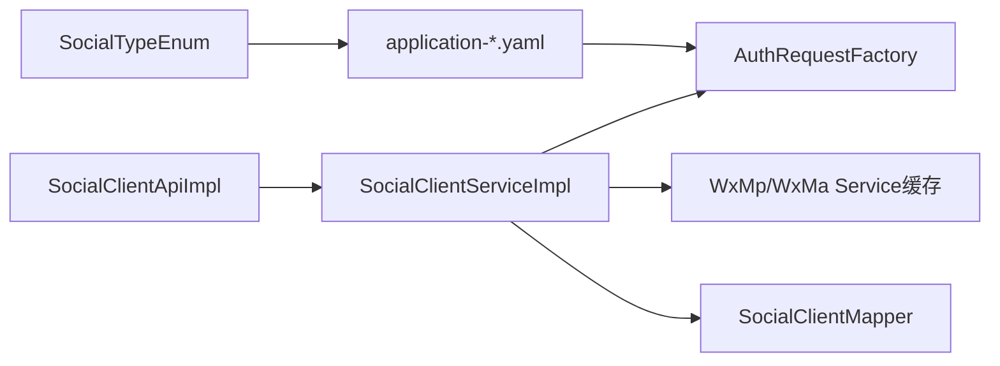

# 第三方认证集成

<cite>
**本文引用的文件**
- [SocialTypeEnum.java](file://yudao-module-system/src/main/java/cn/iocoder/yudao/module/system/enums/social/SocialTypeEnum.java)
- [application-dev.yaml](file://yudao-server/src/main/resources/application-dev.yaml)
- [application-local.yaml](file://yudao-server/src/main/resources/application-local.yaml)
- [SocialClientApi.java](file://yudao-module-system/src/main/java/cn/iocoder/yudao/module/system/api/social/SocialClientApi.java)
- [SocialClientApiImpl.java](file://yudao-module-system/src/main/java/cn/iocoder/yudao/module/system/api/social/SocialClientApiImpl.java)
- [SocialClientService.java](file://yudao-module-system/src/main/java/cn/iocoder/yudao/module/system/service/social/SocialClientService.java)
- [SocialClientServiceImpl.java](file://yudao-module-system/src/main/java/cn/iocoder/yudao/module/system/service/social/SocialClientServiceImpl.java)
- [SocialUserApi.java](file://yudao-module-system/src/main/java/cn/iocoder/yudao/module/system/api/social/SocialUserApi.java)
- [SocialUserApiImpl.java](file://yudao-module-system/src/main/java/cn/iocoder/yudao/module/system/api/social/SocialUserApiImpl.java)
- [SocialUserService.java](file://yudao-module-system/src/main/java/cn/iocoder/yudao/module/system/service/social/SocialUserService.java)
- [SocialUserServiceImpl.java](file://yudao-module-system/src/main/java/cn/iocoder/yudao/module/system/service/social/SocialUserServiceImpl.java)
- [SocialClientController.java](file://yudao-module-system/src/main/java/cn/iocoder/yudao/module/system/controller/admin/socail/SocialClientController.java)
- [SocialUserController.java](file://yudao-module-system/src/main/java/cn/iocoder/yudao/module/system/controller/admin/socail/SocialUserController.java)
- [SocialClientSaveReqVO.java](file://yudao-module-system/src/main/java/cn/iocoder/yudao/module/system/controller/admin/socail/vo/client/SocialClientSaveReqVO.java)
- [AuthController.java](file://yudao-module-system/src/main/java/cn/iocoder/yudao/module/system/controller/admin/auth/AuthController.java)
</cite>

## 目录
1. [简介](#简介)
2. [项目结构](#项目结构)
3. [核心组件](#核心组件)
4. [架构总览](#架构总览)
5. [详细组件分析](#详细组件分析)
6. [依赖关系分析](#依赖关系分析)
7. [性能考虑](#性能考虑)
8. [故障排查指南](#故障排查指南)
9. [结论](#结论)
10. [附录](#附录)

## 简介
本文件面向“第三方认证集成”的技术与非技术读者，系统性说明本项目在以下平台的 OAuth2 集成能力与实现要点：
- 微信小程序 OAuth2：AppID 配置、授权回调设置、用户信息获取（含手机号）
- 微信公众号 OAuth2：网页授权、JS-SDK 配置、微信分享设置
- 企业微信：应用配置、通讯录同步与审批流程对接（以企业微信为入口的 OAuth2）
- 钉钉：应用开发、用户授权与考勤数据同步（以钉钉为入口的 OAuth2）

同时，文档提供 OAuth2 授权流程示例代码路径、Token 管理策略与授权范围控制建议，帮助快速落地与扩展。

## 项目结构
围绕第三方认证的核心模块位于 yudao-module-system，采用“接口 + 实现 + 控制器 + DTO/VO + 配置”的分层组织方式：
- 枚举定义第三方平台类型
- API 层提供对外暴露的能力（授权 URL、JS-SDK 签名、小程序手机号等）
- Service 层封装 JustAuth 工厂构建、多租户配置覆盖、微信服务实例缓存、异常处理
- 控制器层承接前端调用与管理端配置
- 配置文件集中管理各平台的 client-id/secret/agent-id 等参数，并启用 JustAuth 缓存

**图表来源**
- [SocialTypeEnum.java:17-84](file://yudao-module-system/src/main/java/cn/iocoder/yudao/module/system/enums/social/SocialTypeEnum.java#L17-L84)
- [SocialClientApiImpl.java:24-107](file://yudao-module-system/src/main/java/cn/iocoder/yudao/module/system/api/social/SocialClientApiImpl.java#L24-L107)
- [SocialClientServiceImpl.java:83-537](file://yudao-module-system/src/main/java/cn/iocoder/yudao/module/system/service/social/SocialClientServiceImpl.java#L83-L537)
- [SocialUserServiceImpl.java:36-174](file://yudao-module-system/src/main/java/cn/iocoder/yudao/module/system/service/social/SocialUserServiceImpl.java#L36-L174)
- [application-dev.yaml:181-212](file://yudao-server/src/main/resources/application-dev.yaml#L181-L212)
- [application-local.yaml:253-284](file://yudao-server/src/main/resources/application-local.yaml#L253-L284)

**章节来源**
- [SocialTypeEnum.java:17-84](file://yudao-module-system/src/main/java/cn/iocoder/yudao/module/system/enums/social/SocialTypeEnum.java#L17-L84)
- [application-dev.yaml:181-212](file://yudao-server/src/main/resources/application-dev.yaml#L181-L212)
- [application-local.yaml:253-284](file://yudao-server/src/main/resources/application-local.yaml#L253-L284)

## 核心组件
- 平台枚举：统一管理微信小程序、微信公众号、企业微信、钉钉、支付宝小程序等类型，便于上层按类型路由到对应实现
- JustAuth 工厂：通过 AuthRequestFactory 获取各平台授权请求对象，支持多租户动态覆盖配置
- 微信服务缓存：针对 WxMpService/WxMaService 做异步重载缓存，降低构建成本
- 社交用户服务：封装授权码换取用户信息、绑定/解绑逻辑，持久化第三方用户信息与 Token

**章节来源**
- [SocialTypeEnum.java:17-84](file://yudao-module-system/src/main/java/cn/iocoder/yudao/module/system/enums/social/SocialTypeEnum.java#L17-L84)
- [SocialClientService.java:25-160](file://yudao-module-system/src/main/java/cn/iocoder/yudao/module/system/service/social/SocialClientService.java#L25-L160)
- [SocialClientServiceImpl.java:115-226](file://yudao-module-system/src/main/java/cn/iocoder/yudao/module/system/service/social/SocialClientServiceImpl.java#L115-L226)
- [SocialUserServiceImpl.java:132-160](file://yudao-module-system/src/main/java/cn/iocoder/yudao/module/system/service/social/SocialUserServiceImpl.java#L132-L160)

## 架构总览
下图展示从“授权 URL 生成”到“换取用户信息”的整体流程，以及微信公众号/小程序的专属能力：

**图表来源**
- [SocialClientApiImpl.java:39-42](file://yudao-module-system/src/main/java/cn/iocoder/yudao/module/system/api/social/SocialClientApiImpl.java#L39-L42)
- [SocialClientServiceImpl.java:169-191](file://yudao-module-system/src/main/java/cn/iocoder/yudao/module/system/service/social/SocialClientServiceImpl.java#L169-L191)
- [SocialUserServiceImpl.java:132-160](file://yudao-module-system/src/main/java/cn/iocoder/yudao/module/system/service/social/SocialUserServiceImpl.java#L132-L160)

## 详细组件分析

### 微信小程序 OAuth2 集成
- AppID 配置
  - 通过配置文件中的 client-id/client-secret 指定小程序 AppID/Secret
  - 支持多租户覆盖：若数据库中存在对应 userType + socialType 的配置，则优先使用 DB 配置
- 授权回调设置
  - 生成授权 URL 时会附加 redirect_uri 参数，确保回调地址正确
  - state 参数用于防 CSRF，微信小程序场景可忽略校验
- 用户信息获取
  - 授权码换取用户信息后，持久化第三方用户信息与 Token
  - 提供手机号解密能力，用于敏感信息获取

**图表来源**
- [application-dev.yaml:194-198](file://yudao-server/src/main/resources/application-dev.yaml#L194-L198)
- [application-local.yaml:266-270](file://yudao-server/src/main/resources/application-local.yaml#L266-L270)
- [SocialClientApiImpl.java:39-42](file://yudao-module-system/src/main/java/cn/iocoder/yudao/module/system/api/social/SocialClientApiImpl.java#L39-L42)
- [SocialClientServiceImpl.java:169-191](file://yudao-module-system/src/main/java/cn/iocoder/yudao/module/system/service/social/SocialClientServiceImpl.java#L169-L191)
- [SocialUserServiceImpl.java:132-160](file://yudao-module-system/src/main/java/cn/iocoder/yudao/module/system/service/social/SocialUserServiceImpl.java#L132-L160)

**章节来源**
- [application-dev.yaml:194-198](file://yudao-server/src/main/resources/application-dev.yaml#L194-L198)
- [application-local.yaml:266-270](file://yudao-server/src/main/resources/application-local.yaml#L266-L270)
- [SocialClientApiImpl.java:39-67](file://yudao-module-system/src/main/java/cn/iocoder/yudao/module/system/api/social/SocialClientApiImpl.java#L39-L67)
- [SocialClientServiceImpl.java:169-191](file://yudao-module-system/src/main/java/cn/iocoder/yudao/module/system/service/social/SocialClientServiceImpl.java#L169-L191)
- [SocialUserServiceImpl.java:132-160](file://yudao-module-system/src/main/java/cn/iocoder/yudao/module/system/service/social/SocialUserServiceImpl.java#L132-L160)

### 微信公众号 OAuth2 集成
- 网页授权
  - 生成授权 URL 并替换 redirect_uri，支持多租户配置覆盖
- JS-SDK 配置
  - 生成 JSAPI 签名，供前端初始化 JS-SDK 使用
- 微信分享设置
  - 基于签名能力，前端可配置分享到朋友圈/好友等参数

**图表来源**
- [SocialClientServiceImpl.java:169-191](file://yudao-module-system/src/main/java/cn/iocoder/yudao/module/system/service/social/SocialClientServiceImpl.java#L169-L191)
- [SocialClientServiceImpl.java:230-235](file://yudao-module-system/src/main/java/cn/iocoder/yudao/module/system/service/social/SocialClientServiceImpl.java#L230-L235)

**章节来源**
- [application-dev.yaml:199-202](file://yudao-server/src/main/resources/application-dev.yaml#L199-L202)
- [application-local.yaml:271-274](file://yudao-server/src/main/resources/application-local.yaml#L271-L274)
- [SocialClientServiceImpl.java:169-191](file://yudao-module-system/src/main/java/cn/iocoder/yudao/module/system/service/social/SocialClientServiceImpl.java#L169-L191)
- [SocialClientServiceImpl.java:230-235](file://yudao-module-system/src/main/java/cn/iocoder/yudao/module/system/service/social/SocialClientServiceImpl.java#L230-L235)

### 企业微信集成
- 应用配置
  - 支持 client-id、client-secret、agent-id 等参数配置
  - 多租户场景下可覆盖默认配置
- 通讯录同步与审批流程对接
  - 以企业微信为入口的 OAuth2 登录已完整实现
  - 通讯录与审批流程属于企业微信生态的扩展能力，可在现有 OAuth2 基础上继续扩展

**图表来源**
- [SocialClientServiceImpl.java:169-226](file://yudao-module-system/src/main/java/cn/iocoder/yudao/module/system/service/social/SocialClientServiceImpl.java#L169-L226)
- [SocialTypeEnum.java:37-43](file://yudao-module-system/src/main/java/cn/iocoder/yudao/module/system/enums/social/SocialTypeEnum.java#L37-L43)

**章节来源**
- [application-dev.yaml:188-192](file://yudao-server/src/main/resources/application-dev.yaml#L188-L192)
- [application-local.yaml:260-264](file://yudao-server/src/main/resources/application-local.yaml#L260-L264)
- [SocialClientSaveReqVO.java:56-70](file://yudao-module-system/src/main/java/cn/iocoder/yudao/module/system/controller/admin/socail/vo/client/SocialClientSaveReqVO.java#L56-L70)
- [SocialClientServiceImpl.java:169-226](file://yudao-module-system/src/main/java/cn/iocoder/yudao/module/system/service/social/SocialClientServiceImpl.java#L169-L226)

### 钉钉集成
- 应用开发
  - 通过 client-id、client-secret 进行应用接入
- 用户授权
  - 生成授权 URL 并处理回调，换取用户信息
- 考勤数据同步
  - 以 OAuth2 为基础，后续可扩展对接钉钉考勤 API

**图表来源**
- [application-dev.yaml:184-187](file://yudao-server/src/main/resources/application-dev.yaml#L184-L187)
- [application-local.yaml:256-259](file://yudao-server/src/main/resources/application-local.yaml#L256-L259)
- [SocialClientServiceImpl.java:169-191](file://yudao-module-system/src/main/java/cn/iocoder/yudao/module/system/service/social/SocialClientServiceImpl.java#L169-L191)

**章节来源**
- [application-dev.yaml:184-187](file://yudao-server/src/main/resources/application-dev.yaml#L184-L187)
- [application-local.yaml:256-259](file://yudao-server/src/main/resources/application-local.yaml#L256-L259)
- [SocialClientServiceImpl.java:169-191](file://yudao-module-system/src/main/java/cn/iocoder/yudao/module/system/service/social/SocialClientServiceImpl.java#L169-L191)

## 依赖关系分析
- 平台枚举与配置文件耦合：通过枚举的 source 值与配置文件的键名一一对应
- API/Service 解耦：API 层仅负责编排，具体实现由 Service 层完成
- JustAuth 工厂与多租户配置：优先使用数据库配置，否则回退到全局配置
- 微信服务缓存：避免频繁创建 WxMpService/WxMaService 实例，提升性能

**图表来源**
- [SocialTypeEnum.java:17-84](file://yudao-module-system/src/main/java/cn/iocoder/yudao/module/system/enums/social/SocialTypeEnum.java#L17-L84)
- [application-dev.yaml:181-212](file://yudao-server/src/main/resources/application-dev.yaml#L181-L212)
- [application-local.yaml:253-284](file://yudao-server/src/main/resources/application-local.yaml#L253-L284)
- [SocialClientServiceImpl.java:115-226](file://yudao-module-system/src/main/java/cn/iocoder/yudao/module/system/service/social/SocialClientServiceImpl.java#L115-L226)

**章节来源**
- [SocialClientServiceImpl.java:115-226](file://yudao-module-system/src/main/java/cn/iocoder/yudao/module/system/service/social/SocialClientServiceImpl.java#L115-L226)

## 性能考虑
- 微信服务实例缓存：通过 LoadingCache 异步重载，减少 WxMpService/WxMaService 构建开销
- 订阅消息模板缓存：针对小程序订阅模板做缓存，降低频繁拉取模板的成本
- 上传发货信息重试：针对微信支付回调延迟问题，采用指数退避重试策略，提升成功率

**章节来源**
- [SocialClientServiceImpl.java:133-164](file://yudao-module-system/src/main/java/cn/iocoder/yudao/module/system/service/social/SocialClientServiceImpl.java#L133-L164)
- [SocialClientServiceImpl.java:309-320](file://yudao-module-system/src/main/java/cn/iocoder/yudao/module/system/service/social/SocialClientServiceImpl.java#L309-L320)
- [SocialClientServiceImpl.java:384-402](file://yudao-module-system/src/main/java/cn/iocoder/yudao/module/system/service/social/SocialClientServiceImpl.java#L384-L402)

## 故障排查指南
- 授权失败
  - 检查配置文件中的 client-id/secret 是否正确
  - 确认 redirect_uri 与平台侧配置一致
  - 核对 state 校验开关（如微信小程序场景可忽略）
- 用户信息缺失
  - 确认授权作用域包含用户信息字段
  - 查看 SocialUserServiceImpl 中持久化逻辑是否正常
- 微信服务异常
  - 检查 Redis 缓存可用性与 key 前缀
  - 关注微信服务实例构建日志
- 订单发货上传失败
  - 观察是否出现“支付单不存在”错误码，系统已内置重试机制

**章节来源**
- [SocialClientServiceImpl.java:169-191](file://yudao-module-system/src/main/java/cn/iocoder/yudao/module/system/service/social/SocialClientServiceImpl.java#L169-L191)
- [SocialUserServiceImpl.java:132-160](file://yudao-module-system/src/main/java/cn/iocoder/yudao/module/system/service/social/SocialUserServiceImpl.java#L132-L160)
- [application-dev.yaml:181-212](file://yudao-server/src/main/resources/application-dev.yaml#L181-L212)
- [application-local.yaml:253-284](file://yudao-server/src/main/resources/application-local.yaml#L253-L284)

## 结论
本项目通过 JustAuth 工厂与多租户配置覆盖，实现了对微信小程序、微信公众号、企业微信、钉钉等平台的统一 OAuth2 接入。结合微信服务缓存、订阅模板缓存与重试机制，既保证了性能也提升了稳定性。在此基础上，可进一步扩展企业微信通讯录与审批流程、钉钉考勤等企业级能力。

## 附录

### OAuth2 授权流程示例代码路径
- 生成授权 URL：[SocialClientServiceImpl.java:169-176](file://yudao-module-system/src/main/java/cn/iocoder/yudao/module/system/service/social/SocialClientServiceImpl.java#L169-L176)
- 换取用户信息：[SocialClientServiceImpl.java:178-191](file://yudao-module-system/src/main/java/cn/iocoder/yudao/module/system/service/social/SocialClientServiceImpl.java#L178-L191)
- 绑定社交用户：[SocialUserServiceImpl.java:61-81](file://yudao-module-system/src/main/java/cn/iocoder/yudao/module/system/service/social/SocialUserServiceImpl.java#L61-L81)

### Token 管理与授权范围控制
- Token 存储：SocialUserServiceImpl 会将第三方 Token 与原始信息持久化，便于后续调用
- 授权范围：通过平台侧 scope 控制，确保最小权限原则
- 配置覆盖：优先使用数据库配置，支持按 userType + socialType 精细化控制

**章节来源**
- [SocialUserServiceImpl.java:145-159](file://yudao-module-system/src/main/java/cn/iocoder/yudao/module/system/service/social/SocialUserServiceImpl.java#L145-L159)
- [SocialClientServiceImpl.java:205-226](file://yudao-module-system/src/main/java/cn/iocoder/yudao/module/system/service/social/SocialClientServiceImpl.java#L205-L226)