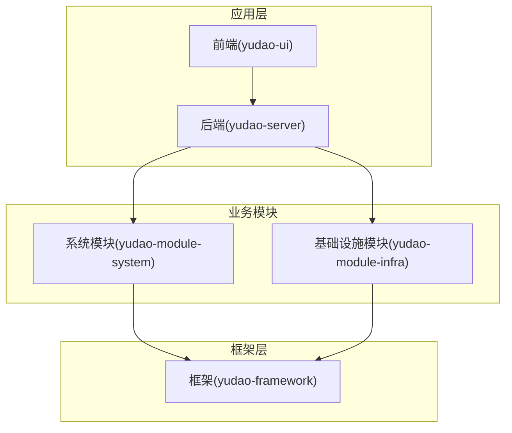
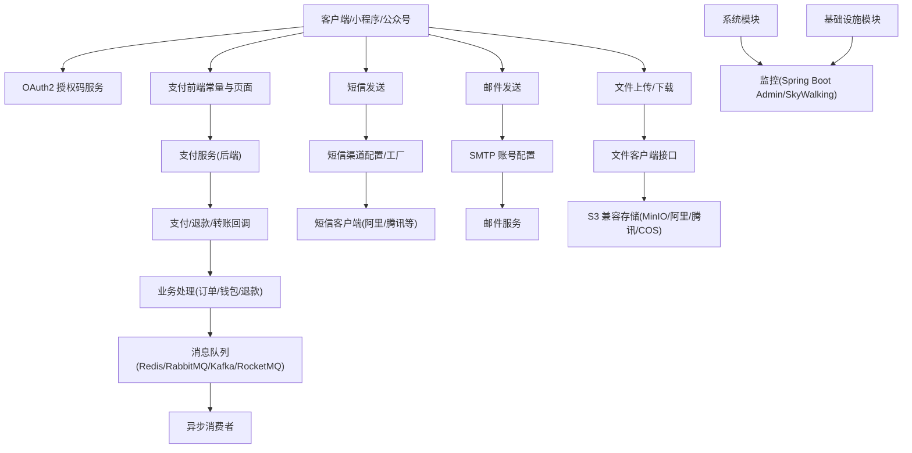
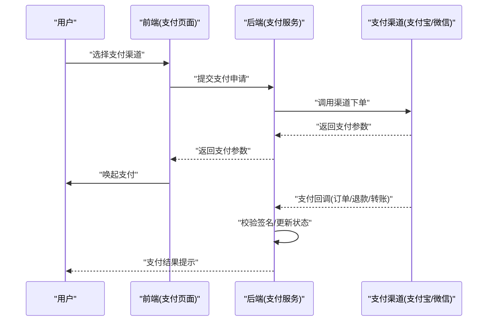
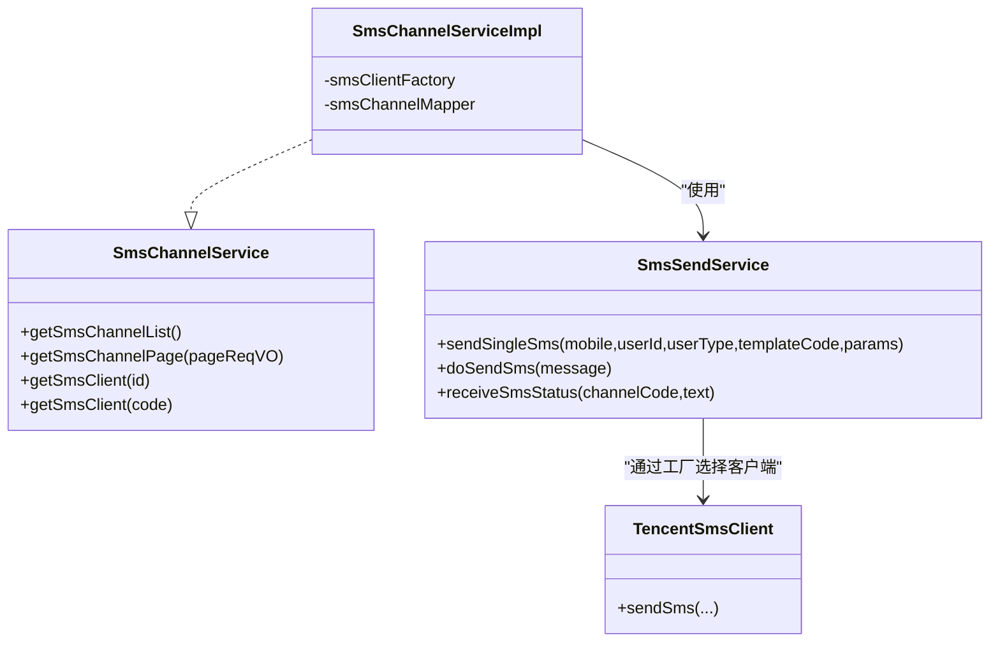
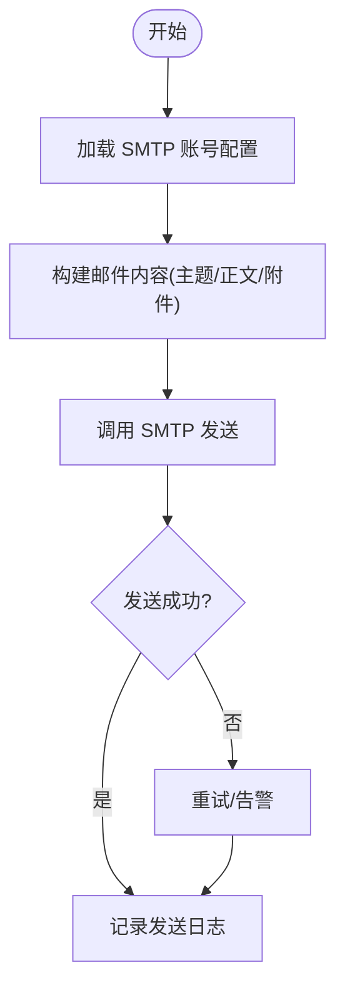
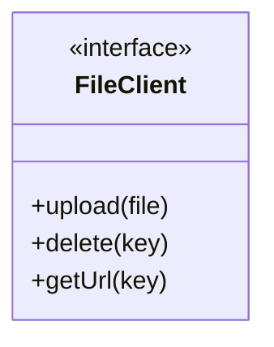
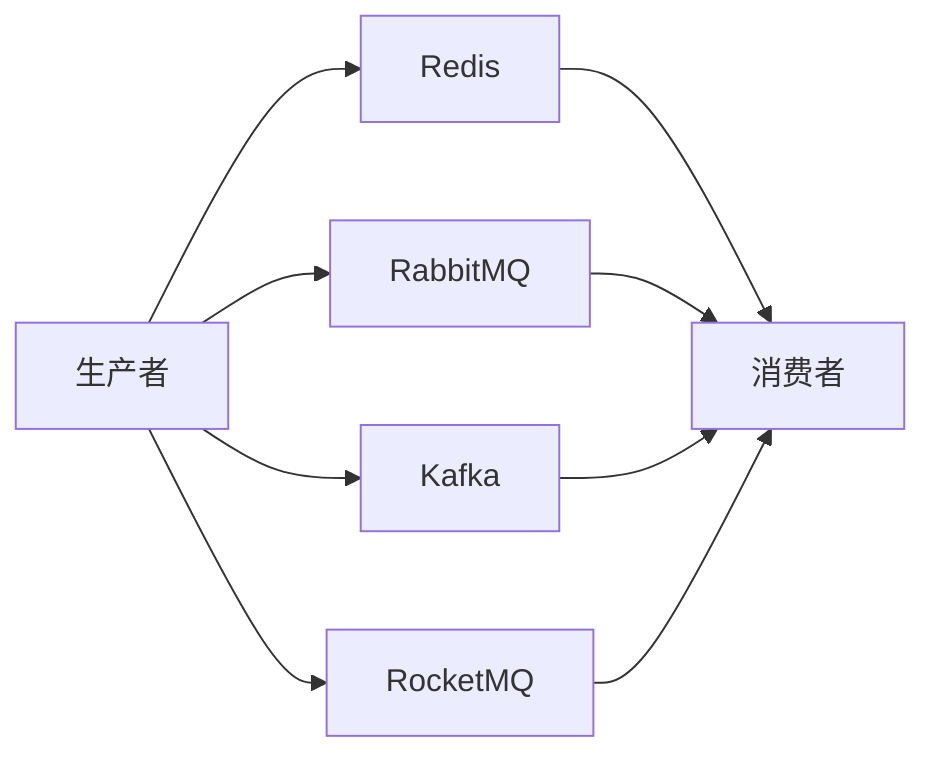
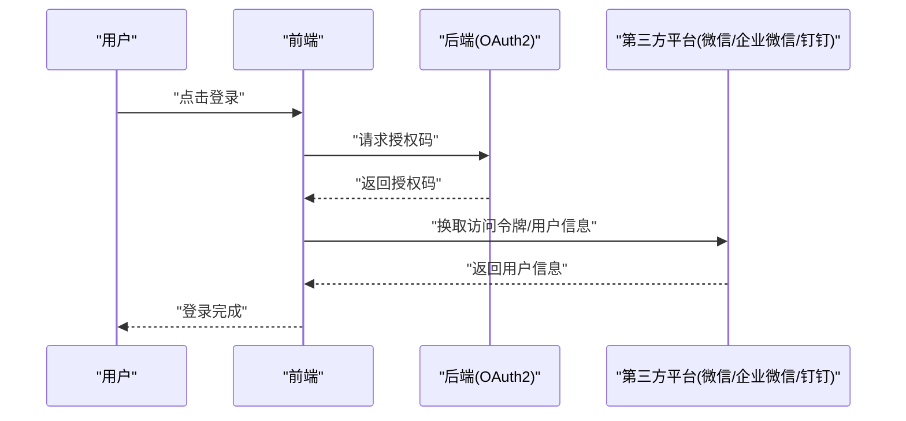
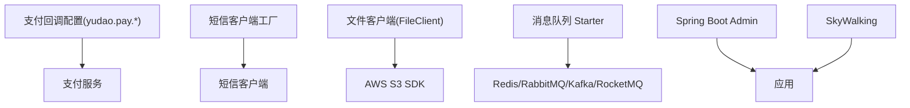

# 第三方集成

<cite>
**本文引用的文件**
- [application-dev.yaml](file://yudao-server/src/main/resources/application-dev.yaml)
- [application-local.yaml](file://yudao-server/src/main/resources/application-local.yaml)
- [constants.ts](file://yudao-ui/yudao-ui-admin-vue3/src/utils/constants.ts)
- [SocialClientServiceImpl.java](file://yudao-module-system/src/main/java/cn/iocoder/yudao/module/system/service/social/SocialClientServiceImpl.java)
- [SmsChannelService.java](file://yudao-module-system/src/main/java/cn/iocoder/yudao/module/system/service/sms/SmsChannelService.java)
- [SmsChannelServiceImpl.java](file://yudao-module-system/src/main/java/cn/iocoder/yudao/module/system/service/sms/SmsChannelServiceImpl.java)
- [SmsSendService.java](file://yudao-module-system/src/main/java/cn/iocoder/yudao/module/system/service/sms/SmsSendService.java)
- [TencentSmsClient.java](file://yudao-module-system/src/main/java/cn/iocoder/yudao/module/system/framework/sms/core/client/impl/TencentSmsClient.java)
- [MailAccountRespVO.java](file://yudao-module-system/src/main/java/cn/iocoder/yudao/module/system/controller/admin/mail/vo/account/MailAccountRespVO.java)
- [MailAccountSaveReqVO.java](file://yudao-module-system/src/main/java/cn/iocoder/yudao/module/system/controller/admin/mail/vo/account/MailAccountSaveReqVO.java)
- [FileClient.java](file://yudao-module-infra/src/main/java/cn/iocoder/yudao/module/infra/framework/file/core/client/FileClient.java)
- [pom.xml](file://yudao-module-infra/pom.xml)
- [OAuth2CodeServiceImpl.java](file://yudao-module-system/src/main/java/cn/iocoder/yudao/module/system/service/oauth2/OAuth2CodeServiceImpl.java)
- [pom.xml](file://yudao-framework/yudao-spring-boot-starter-mq/pom.xml)
- [README.md](file://README.md)
</cite>

## 目录
1. [简介](#简介)
2. [项目结构](#项目结构)
3. [核心组件](#核心组件)
4. [架构总览](#架构总览)
5. [详细组件分析](#详细组件分析)
6. [依赖分析](#依赖分析)
7. [性能考虑](#性能考虑)
8. [故障排除指南](#故障排除指南)
9. [结论](#结论)
10. [附录](#附录)

## 简介
本指南面向在 ruoyi-vue-pro 项目中集成第三方服务的开发者，覆盖支付系统（支付宝、微信支付）、短信服务（阿里云短信、腾讯云短信等）、邮件服务（SMTP 配置与模板）、存储服务（MinIO、阿里云 OSS、腾讯云 COS 等 S3 兼容对象存储）、消息队列（Redis、RabbitMQ、Kafka、RocketMQ）、第三方认证（微信小程序/公众号、企业微信、钉钉等 OAuth2 授权）、工作流引擎（Flowable）、监控系统（SkyWalking、Spring Boot Admin）以及 API 网关与网关集成方案。文档以仓库现有实现为基础，结合前端常量与后端配置，给出可落地的接入步骤与最佳实践。

## 项目结构
ruoyi-vue-pro 采用多模块分层架构，第三方集成能力主要分布在以下模块：
- yudao-module-system：系统基础能力，包含社交登录、短信、邮件、OAuth2 等
- yudao-module-infra：基础设施，包含文件存储、监控、定时任务等
- yudao-framework：框架层，提供通用 Starter（如监控、消息队列、Redis、安全等）
- yudao-server：应用启动器，包含运行时配置
- yudao-ui：前端工程，包含支付渠道常量、页面与交互

**章节来源**
- [README.md: 203-222:203-222](file://README.md#L203-L222)

## 核心组件
- 支付系统：后端通过支付渠道配置与通知回调对接第三方支付；前端提供支付渠道枚举与展示模式常量
- 短信服务：统一的短信渠道抽象与工厂，支持多种厂商 SDK
- 邮件服务：基于 SMTP 的账号配置与发送封装
- 存储服务：统一的文件客户端接口，兼容 S3（MinIO、阿里云 OSS、腾讯云 COS 等）
- 消息队列：框架层提供对 Redis、RabbitMQ、Kafka、RocketMQ 的 Starter 支持
- 第三方认证：社交登录与 OAuth2 授权码服务
- 工作流引擎：基于 Flowable 的流程定义与任务管理
- 监控系统：Spring Boot Admin 与 SkyWalking 集成
- API 网关：项目未内置 API 网关模块，建议通过 Spring Cloud Gateway 或 Nginx 等外部网关接入

**章节来源**
- [constants.ts: 104-191:104-191](file://yudao-ui/yudao-ui-admin-vue3/src/utils/constants.ts#L104-L191)
- [application-dev.yaml: 170-179:170-179](file://yudao-server/src/main/resources/application-dev.yaml#L170-L179)
- [application-local.yaml: 220-248:220-248](file://yudao-server/src/main/resources/application-local.yaml#L220-L248)

## 架构总览
下图展示了第三方集成在系统中的位置与交互关系：

**图表来源**
- [constants.ts: 104-191:104-191](file://yudao-ui/yudao-ui-admin-vue3/src/utils/constants.ts#L104-L191)
- [SocialClientServiceImpl.java: 215-377:215-377](file://yudao-module-system/src/main/java/cn/iocoder/yudao/module/system/service/social/SocialClientServiceImpl.java#L215-L377)
- [SmsChannelServiceImpl.java: 1-35:1-35](file://yudao-module-system/src/main/java/cn/iocoder/yudao/module/system/service/sms/SmsChannelServiceImpl.java#L1-L35)
- [FileClient.java](file://yudao-module-infra/src/main/java/cn/iocoder/yudao/module/infra/framework/file/core/client/FileClient.java)
- [pom.xml:1-43](file://yudao-framework/yudao-spring-boot-starter-mq/pom.xml#L1-L43)

## 详细组件分析

### 支付系统集成（支付宝、微信支付）
- 支付渠道枚举与前端展示模式
  - 前端提供微信 JSAPI、小程序、APP、Native、WAP、条码支付，以及支付宝 PC/WAP/APP/扫码/条码支付、钱包、模拟支付等枚举
  - 展示模式包括 URL、IFRAME、FORM、二维码、APP 等
- 后端配置与回调地址
  - 通过 yudao.pay.order-notify-url、refund-notify-url、transfer-notify-url 配置支付渠道回调地址
  - 可在不同环境（dev/local）分别配置
- 支付流程要点
  - 前端根据选择的渠道调起对应支付方式
  - 后端生成支付单据，调用对应渠道 SDK 完成下单
  - 支付完成后，渠道回调至后端回调地址，后端解析并更新订单状态
- 退款处理机制
  - 后端根据订单状态与渠道规则发起退款请求
  - 渠道退款回调同样走 yudao.pay.refund-notify-url
- 微信小程序/公众号对接
  - 社交服务支持微信公众号 JS-SDK 的签名生成与微信小程序手机号解密等能力
  - 支持按用户类型切换不同的公众号/小程序配置

**图表来源**
- [constants.ts: 104-191:104-191](file://yudao-ui/yudao-ui-admin-vue3/src/utils/constants.ts#L104-L191)
- [application-dev.yaml: 170-179:170-179](file://yudao-server/src/main/resources/application-dev.yaml#L170-L179)
- [application-local.yaml: 220-248:220-248](file://yudao-server/src/main/resources/application-local.yaml#L220-L248)
- [SocialClientServiceImpl.java: 215-377:215-377](file://yudao-module-system/src/main/java/cn/iocoder/yudao/module/system/service/social/SocialClientServiceImpl.java#L215-L377)

**章节来源**
- [constants.ts: 104-191:104-191](file://yudao-ui/yudao-ui-admin-vue3/src/utils/constants.ts#L104-L191)
- [application-dev.yaml: 170-179:170-179](file://yudao-server/src/main/resources/application-dev.yaml#L170-L179)
- [application-local.yaml: 220-248:220-248](file://yudao-server/src/main/resources/application-local.yaml#L220-L248)
- [SocialClientServiceImpl.java: 215-377:215-377](file://yudao-module-system/src/main/java/cn/iocoder/yudao/module/system/service/social/SocialClientServiceImpl.java#L215-L377)

### 短信服务集成（阿里云短信、腾讯云短信等）
- 统一抽象
  - SmsChannelService 提供短信渠道的增删改查与客户端获取
  - SmsSendService 提供发送与接收状态的能力
- 客户端工厂
  - SmsChannelServiceImpl 通过 SmsClientFactory 获取具体厂商客户端
- 腾讯云短信示例
  - TencentSmsClient 作为腾讯云短信客户端实现，体现如何扩展新厂商
- 使用流程
  - 在后台配置短信渠道（厂商、AK/SK、签名、模板等）
  - 调用 SmsSendService 发送短信，内部通过工厂选择对应客户端
  - 支持异步发送与状态回推（receiveSmsStatus）

**图表来源**
- [SmsChannelService.java: 57-88:57-88](file://yudao-module-system/src/main/java/cn/iocoder/yudao/module/system/service/sms/SmsChannelService.java#L57-L88)
- [SmsChannelServiceImpl.java: 1-35:1-35](file://yudao-module-system/src/main/java/cn/iocoder/yudao/module/system/service/sms/SmsChannelServiceImpl.java#L1-L35)
- [SmsSendService.java: 43-78:43-78](file://yudao-module-system/src/main/java/cn/iocoder/yudao/module/system/service/sms/SmsSendService.java#L43-L78)
- [TencentSmsClient.java](file://yudao-module-system/src/main/java/cn/iocoder/yudao/module/system/framework/sms/core/client/impl/TencentSmsClient.java)

**章节来源**
- [SmsChannelService.java: 57-88:57-88](file://yudao-module-system/src/main/java/cn/iocoder/yudao/module/system/service/sms/SmsChannelService.java#L57-L88)
- [SmsChannelServiceImpl.java: 1-35:1-35](file://yudao-module-system/src/main/java/cn/iocoder/yudao/module/system/service/sms/SmsChannelServiceImpl.java#L1-L35)
- [SmsSendService.java: 43-78:43-78](file://yudao-module-system/src/main/java/cn/iocoder/yudao/module/system/service/sms/SmsSendService.java#L43-L78)
- [TencentSmsClient.java](file://yudao-module-system/src/main/java/cn/iocoder/yudao/module/system/framework/sms/core/client/impl/TencentSmsClient.java)

### 邮件服务集成（SMTP 配置、模板与批量发送）
- SMTP 账号配置
  - MailAccountSaveReqVO/MailAccountRespVO 定义了邮箱、用户名、密码、SMTP 主机、端口、SSL/STARTTLS 等字段
- 邮件模板管理
  - 项目提供邮件相关模块与页面，可结合后端模板引擎或外部模板系统实现
- 批量发送
  - 当前 SmsSendService 默认不支持批量短信，但可参考其设计思路扩展邮件批量发送

**图表来源**
- [MailAccountRespVO.java: 1-39:1-39](file://yudao-module-system/src/main/java/cn/iocoder/yudao/module/system/controller/admin/mail/vo/account/MailAccountRespVO.java#L1-L39)
- [MailAccountSaveReqVO.java: 1-45:1-45](file://yudao-module-system/src/main/java/cn/iocoder/yudao/module/system/controller/admin/mail/vo/account/MailAccountSaveReqVO.java#L1-L45)

**章节来源**
- [MailAccountRespVO.java: 1-39:1-39](file://yudao-module-system/src/main/java/cn/iocoder/yudao/module/system/controller/admin/mail/vo/account/MailAccountRespVO.java#L1-L39)
- [MailAccountSaveReqVO.java: 1-45:1-45](file://yudao-module-system/src/main/java/cn/iocoder/yudao/module/system/controller/admin/mail/vo/account/MailAccountSaveReqVO.java#L1-L45)

### 存储服务集成（MinIO、阿里云 OSS、腾讯云 COS 等）
- 统一接口
  - FileClient 抽象了上传、删除、获取 URL 等通用能力
- S3 兼容
  - 依赖软件包为 AWS SDK S3，天然兼容 MinIO、阿里云 OSS、腾讯云 COS 等 S3 兼容对象存储
- 使用建议
  - 在后台配置存储桶、Endpoint、AccessKey/SecretKey、Region 等
  - 前端直传或后端代理上传，结合 CDN 与鉴权策略

**图表来源**
- [FileClient.java](file://yudao-module-infra/src/main/java/cn/iocoder/yudao/module/infra/framework/file/core/client/FileClient.java)
- [pom.xml: 107-111:107-111](file://yudao-module-infra/pom.xml#L107-L111)

**章节来源**
- [FileClient.java](file://yudao-module-infra/src/main/java/cn/iocoder/yudao/module/infra/framework/file/core/client/FileClient.java)
- [pom.xml: 107-111:107-111](file://yudao-module-infra/pom.xml#L107-L111)

### 消息队列集成（Redis、RabbitMQ、Kafka、RocketMQ）
- 框架支持
  - yudao-spring-boot-starter-mq 提供对 Redis、RabbitMQ、Kafka、RocketMQ 的 Starter 依赖
- 使用建议
  - 根据业务选择合适的 MQ：Redis 适合轻量异步与发布订阅；RabbitMQ 适合复杂路由；Kafka 适合高吞吐日志/事件流；RocketMQ 适合金融级可靠投递
  - 在业务模块中定义消息生产者与消费者，结合幂等与重试策略

**图表来源**
- [pom.xml:1-43](file://yudao-framework/yudao-spring-boot-starter-mq/pom.xml#L1-L43)

**章节来源**
- [pom.xml:1-43](file://yudao-framework/yudao-spring-boot-starter-mq/pom.xml#L1-L43)

### 第三方认证集成（微信小程序/公众号、企业微信、钉钉等 OAuth2）
- OAuth2 授权码
  - OAuth2CodeServiceImpl 提供授权码的生成与过期控制（默认 5 分钟）
- 微信公众号/小程序
  - SocialClientServiceImpl 支持微信公众号 JSAPI 签名、小程序手机号解密、按用户类型切换配置等
- 企业微信/钉钉
  - 可基于现有社交客户端抽象扩展对应厂商 SDK，遵循“配置存储 + 客户端工厂 + 业务调用”的模式

**图表来源**
- [OAuth2CodeServiceImpl.java: 1-33:1-33](file://yudao-module-system/src/main/java/cn/iocoder/yudao/module/system/service/oauth2/OAuth2CodeServiceImpl.java#L1-L33)
- [SocialClientServiceImpl.java: 215-377:215-377](file://yudao-module-system/src/main/java/cn/iocoder/yudao/module/system/service/social/SocialClientServiceImpl.java#L215-L377)

**章节来源**
- [OAuth2CodeServiceImpl.java: 1-33:1-33](file://yudao-module-system/src/main/java/cn/iocoder/yudao/module/system/service/oauth2/OAuth2CodeServiceImpl.java#L1-L33)
- [SocialClientServiceImpl.java: 215-377:215-377](file://yudao-module-system/src/main/java/cn/iocoder/yudao/module/system/service/social/SocialClientServiceImpl.java#L215-L377)

### 工作流引擎集成（Flowable）
- 项目已引入 Flowable 相关依赖与资源，可用于流程定义与任务管理
- 建议
  - 使用流程设计器设计 BPMN，结合系统模块中的流程定义与任务服务进行业务集成
  - 通过监听器与服务任务实现业务逻辑解耦

**章节来源**
- [README.md: 203-222:203-222](file://README.md#L203-L222)

### 监控系统集成（SkyWalking、Spring Boot Admin）
- Spring Boot Admin
  - 作为服务端依赖引入，用于监控 Java 应用
- SkyWalking
  - 作为链路追踪与日志中心组件接入，便于问题定位与性能分析
- 建议
  - 在生产环境启用，结合告警策略与仪表盘

**章节来源**
- [README.md: 203-222:203-222](file://README.md#L203-L222)

### API 网关与网关集成方案
- 项目未内置 API 网关模块
- 建议
  - 使用 Spring Cloud Gateway 或 Nginx 作为网关，统一鉴权、限流、路由与协议转换
  - 与后端微服务配合，实现灰度发布、熔断降级与可观测性

**章节来源**
- [README.md: 203-222:203-222](file://README.md#L203-L222)

## 依赖分析
- 支付与社交
  - 支付回调地址通过 yudao.pay.* 配置项集中管理
  - 社交登录依赖微信 SDK 与配置缓存
- 短信
  - SmsClientFactory 解耦不同厂商客户端
- 存储
  - AWS SDK S3 作为统一存储客户端
- 消息队列
  - 框架层提供多 MQ Starter 依赖
- 监控
  - Spring Boot Admin 与 SkyWalking 作为可选依赖

**图表来源**
- [application-dev.yaml: 170-179:170-179](file://yudao-server/src/main/resources/application-dev.yaml#L170-L179)
- [application-local.yaml: 220-248:220-248](file://yudao-server/src/main/resources/application-local.yaml#L220-L248)
- [SmsChannelServiceImpl.java: 1-35:1-35](file://yudao-module-system/src/main/java/cn/iocoder/yudao/module/system/service/sms/SmsChannelServiceImpl.java#L1-L35)
- [FileClient.java](file://yudao-module-infra/src/main/java/cn/iocoder/yudao/module/infra/framework/file/core/client/FileClient.java)
- [pom.xml:1-43](file://yudao-framework/yudao-spring-boot-starter-mq/pom.xml#L1-L43)
- [pom.xml:107-111](file://yudao-module-infra/pom.xml#L107-L111)

**章节来源**
- [application-dev.yaml: 170-179:170-179](file://yudao-server/src/main/resources/application-dev.yaml#L170-L179)
- [application-local.yaml: 220-248:220-248](file://yudao-server/src/main/resources/application-local.yaml#L220-L248)
- [SmsChannelServiceImpl.java: 1-35:1-35](file://yudao-module-system/src/main/java/cn/iocoder/yudao/module/system/service/sms/SmsChannelServiceImpl.java#L1-L35)
- [FileClient.java](file://yudao-module-infra/src/main/java/cn/iocoder/yudao/module/infra/framework/file/core/client/FileClient.java)
- [pom.xml:1-43](file://yudao-framework/yudao-spring-boot-starter-mq/pom.xml#L1-L43)
- [pom.xml:107-111](file://yudao-module-infra/pom.xml#L107-L111)

## 性能考虑
- 支付回调
  - 回调地址需具备高可用与幂等处理，避免重复入账
- 短信/邮件
  - 批量发送建议异步化，结合消息队列削峰填谷
- 存储
  - 大文件上传建议分片与断点续传，结合 CDN 降低延迟
- 监控
  - 启用链路追踪与指标采集，定期分析慢调用与异常

## 故障排除指南
- 支付回调失败
  - 检查 yudao.pay.* 回调地址是否可达与证书配置
  - 核对签名算法与参数顺序
- 微信公众号/小程序
  - 确认 JSAPI 签名 URL 与配置缓存一致
  - 小程序手机号解密失败检查 code 是否过期
- 短信发送失败
  - 核对厂商 AK/SK、签名/模板是否匹配
  - 查看短信状态回调是否正确接入
- 存储访问异常
  - 校验 Endpoint、Region、鉴权信息
- 消息队列
  - 检查消费者组与分区分配，确认重试与死信队列配置

**章节来源**
- [SocialClientServiceImpl.java: 215-377:215-377](file://yudao-module-system/src/main/java/cn/iocoder/yudao/module/system/service/social/SocialClientServiceImpl.java#L215-L377)
- [SmsSendService.java: 43-78:43-78](file://yudao-module-system/src/main/java/cn/iocoder/yudao/module/system/service/sms/SmsSendService.java#L43-L78)

## 结论
ruoyi-vue-pro 在第三方集成方面提供了完善的抽象与可扩展能力：支付、短信、邮件、存储、消息队列、认证、监控与工作流均有清晰的模块划分与配置入口。按照本文档的接入步骤与最佳实践，可在不破坏现有架构的前提下快速集成主流第三方服务，并通过统一的配置与接口实现跨平台一致性。

## 附录
- 前端支付渠道常量路径：[constants.ts:104-191](file://yudao-ui/yudao-ui-admin-vue3/src/utils/constants.ts#L104-L191)
- 支付回调配置路径：[application-dev.yaml:170-179](file://yudao-server/src/main/resources/application-dev.yaml#L170-L179)，[application-local.yaml:220-248](file://yudao-server/src/main/resources/application-local.yaml#L220-L248)
- 社交登录与微信能力：[SocialClientServiceImpl.java:215-377](file://yudao-module-system/src/main/java/cn/iocoder/yudao/module/system/service/social/SocialClientServiceImpl.java#L215-L377)
- 短信渠道与工厂：[SmsChannelService.java:57-88](file://yudao-module-system/src/main/java/cn/iocoder/yudao/module/system/service/sms/SmsChannelService.java#L57-L88)，[SmsChannelServiceImpl.java:1-35](file://yudao-module-system/src/main/java/cn/iocoder/yudao/module/system/service/sms/SmsChannelServiceImpl.java#L1-L35)，[SmsSendService.java:43-78](file://yudao-module-system/src/main/java/cn/iocoder/yudao/module/system/service/sms/SmsSendService.java#L43-L78)，[TencentSmsClient.java](file://yudao-module-system/src/main/java/cn/iocoder/yudao/module/system/framework/sms/core/client/impl/TencentSmsClient.java)
- 邮件账号配置 VO：[MailAccountRespVO.java:1-39](file://yudao-module-system/src/main/java/cn/iocoder/yudao/module/system/controller/admin/mail/vo/account/MailAccountRespVO.java#L1-L39)，[MailAccountSaveReqVO.java:1-45](file://yudao-module-system/src/main/java/cn/iocoder/yudao/module/system/controller/admin/mail/vo/account/MailAccountSaveReqVO.java#L1-L45)
- 存储客户端与依赖：[FileClient.java](file://yudao-module-infra/src/main/java/cn/iocoder/yudao/module/infra/framework/file/core/client/FileClient.java)，[pom.xml:107-111](file://yudao-module-infra/pom.xml#L107-L111)
- 消息队列 Starter：[pom.xml:1-43](file://yudao-framework/yudao-spring-boot-starter-mq/pom.xml#L1-L43)
- OAuth2 授权码：[OAuth2CodeServiceImpl.java:1-33](file://yudao-module-system/src/main/java/cn/iocoder/yudao/module/system/service/oauth2/OAuth2CodeServiceImpl.java#L1-L33)
- 监控与工作流：[README.md:203-222](file://README.md#L203-L222)