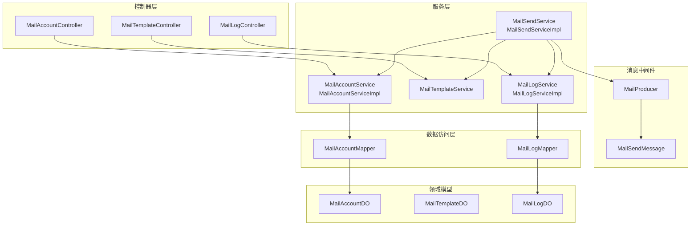
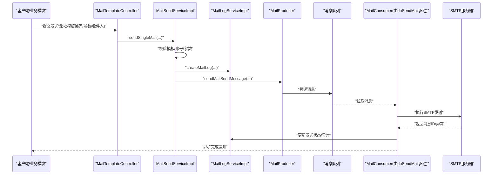
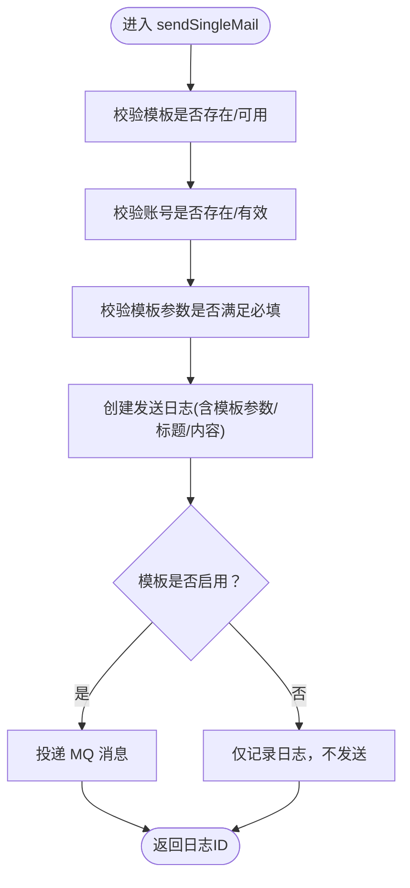
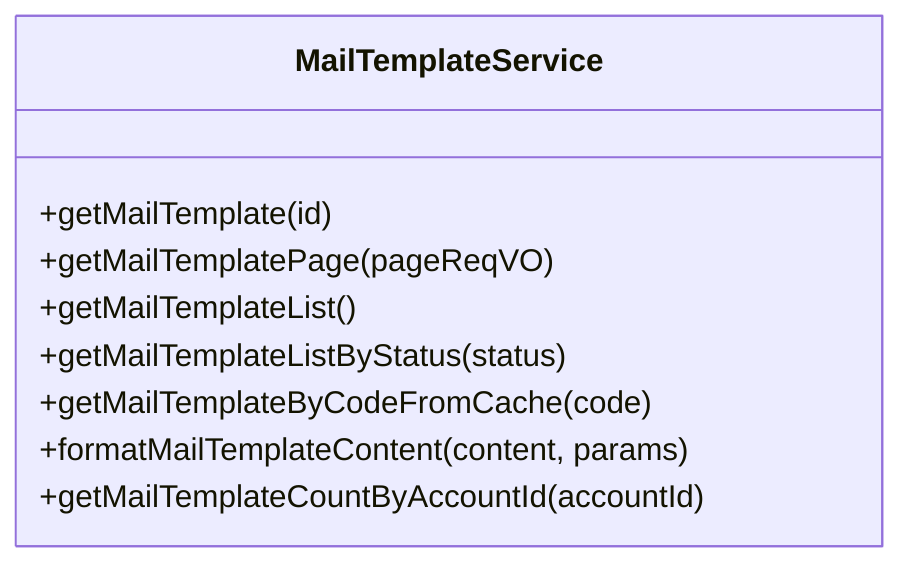
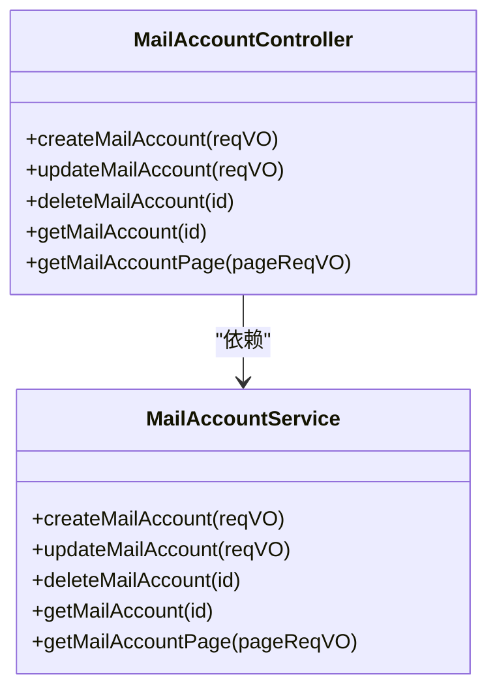
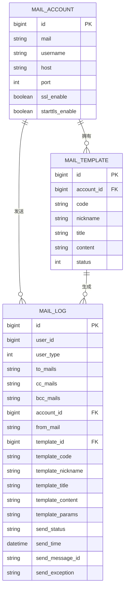
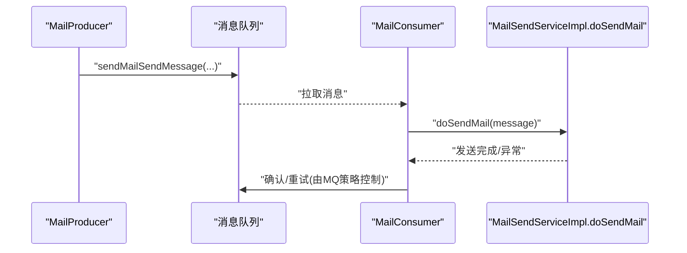
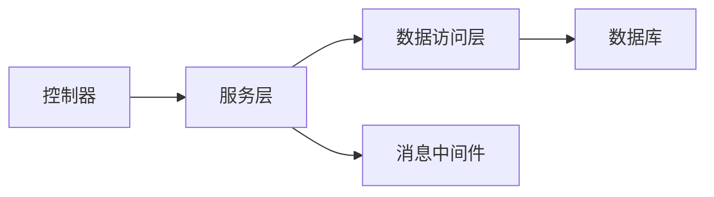

# 邮件服务集成

<cite>
**本文引用的文件**   
- [MailSendService.java](file://yudao-module-system/src/main/java/cn/iocoder/yudao/module/system/service/mail/MailSendService.java)
- [MailSendServiceImpl.java](file://yudao-module-system/src/main/java/cn/iocoder/yudao/module/system/service/mail/MailSendServiceImpl.java)
- [MailTemplateService.java](file://yudao-module-system/src/main/java/cn/iocoder/yudao/module/system/service/mail/MailTemplateService.java)
- [MailAccountService.java](file://yudao-module-system/src/main/java/cn/iocoder/yudao/module/system/service/mail/MailAccountService.java)
- [MailAccountServiceImpl.java](file://yudao-module-system/src/main/java/cn/iocoder/yudao/module/system/service/mail/MailAccountServiceImpl.java)
- [MailLogService.java](file://yudao-module-system/src/main/java/cn/iocoder/yudao/module/system/service/mail/MailLogService.java)
- [MailLogServiceImpl.java](file://yudao-module-system/src/main/java/cn/iocoder/yudao/module/system/service/mail/MailLogServiceImpl.java)
- [MailProducer.java](file://yudao-module-system/src/main/java/cn/iocoder/yudao/module/system/mq/producer/mail/MailProducer.java)
- [MailSendMessage.java](file://yudao-module-system/src/main/java/cn/iocoder/yudao/module/system/mq/message/mail/MailSendMessage.java)
- [MailAccountController.java](file://yudao-module-system/src/main/java/cn/iocoder/yudao/module/system/controller/admin/mail/MailAccountController.java)
- [MailTemplateController.java](file://yudao-module-system/src/main/java/cn/iocoder/yudao/module/system/controller/admin/mail/MailTemplateController.java)
- [MailLogController.java](file://yudao-module-system/src/main/java/cn/iocoder/yudao/module/system/controller/admin/mail/MailLogController.java)
- [MailAccountRespVO.java](file://yudao-module-system/src/main/java/cn/iocoder/yudao/module/system/controller/admin/mail/vo/account/MailAccountRespVO.java)
- [MailLogRespVO.java](file://yudao-module-system/src/main/java/cn/iocoder/yudao/module/system/controller/admin/mail/vo/log/MailLogRespVO.java)
- [MailAccountMapper.java](file://yudao-module-system/src/main/java/cn/iocoder/yudao/module/system/dal/mysql/mail/MailAccountMapper.java)
- [MailLogMapper.java](file://yudao-module-system/src/main/java/cn/iocoder/yudao/module/system/dal/mysql/mail/MailLogMapper.java)
- [MailTemplateDO.java](file://yudao-module-system/src/main/java/cn/iocoder/yudao/module/system/dal/dataobject/mail/MailTemplateDO.java)
- [MailAccountDO.java](file://yudao-module-system/src/main/java/cn/iocoder/yudao/module/system/dal/dataobject/mail/MailAccountDO.java)
- [MailLogDO.java](file://yudao-module-system/src/main/java/cn/iocoder/yudao/module/system/dal/dataobject/mail/MailLogDO.java)
- [MailSendServiceImplTest.java](file://yudao-module-system/src/test/java/cn/iocoder/yudao/module/system/service/mail/MailSendServiceImplTest.java)
- [MailAccountServiceImplTest.java](file://yudao-module-system/src/test/java/cn/iocoder/yudao/module/system/service/mail/MailAccountServiceImplTest.java)
- [MailLogServiceImplTest.java](file://yudao-module-system/src/test/java/cn/iocoder/yudao/module/system/service/mail/MailLogServiceImplTest.java)
- [create_tables.sql](file://yudao-module-system/src/test/resources/sql/create_tables.sql)
</cite>

## 目录
1. [简介](#简介)
2. [项目结构](#项目结构)
3. [核心组件](#核心组件)
4. [架构总览](#架构总览)
5. [详细组件分析](#详细组件分析)
6. [依赖关系分析](#依赖关系分析)
7. [性能与可靠性](#性能与可靠性)
8. [故障排查指南](#故障排查指南)
9. [结论](#结论)
10. [附录：配置与示例索引](#附录配置与示例索引)

## 简介
本文件面向“邮件服务集成”的完整落地实践，覆盖以下关键主题：
- SMTP 邮件服务器配置：Gmail、QQ 邮箱、企业邮箱等不同服务商的典型配置要点与注意事项
- 邮件模板系统：HTML 模板设计、变量占位符与批量渲染、模板缓存与参数校验
- 邮件队列管理：异步发送、消息生产者、消费者、重试与失败处理策略
- 邮件附件处理：文件上传、压缩打包、安全检查与合规限制
- 示例与最佳实践：发送示例、模板示例、常见问题排查

## 项目结构
邮件服务位于系统模块（system）下，采用“接口 + 实现 + 控制器 + 数据访问层 + MQ + VO”的分层组织方式，配合数据库表进行日志与配置持久化。

图表来源
- [MailAccountController.java:1-200](file://yudao-module-system/src/main/java/cn/iocoder/yudao/module/system/controller/admin/mail/MailAccountController.java#L1-L200)
- [MailTemplateController.java:1-200](file://yudao-module-system/src/main/java/cn/iocoder/yudao/module/system/controller/admin/mail/MailTemplateController.java#L1-L200)
- [MailLogController.java:1-200](file://yudao-module-system/src/main/java/cn/iocoder/yudao/module/system/controller/admin/mail/MailLogController.java#L1-L200)
- [MailAccountServiceImpl.java:1-200](file://yudao-module-system/src/main/java/cn/iocoder/yudao/module/system/service/mail/MailAccountServiceImpl.java#L1-L200)
- [MailSendServiceImpl.java:1-200](file://yudao-module-system/src/main/java/cn/iocoder/yudao/module/system/service/mail/MailSendServiceImpl.java#L1-L200)
- [MailLogServiceImpl.java:1-120](file://yudao-module-system/src/main/java/cn/iocoder/yudao/module/system/service/mail/MailLogServiceImpl.java#L1-L120)
- [MailProducer.java:1-200](file://yudao-module-system/src/main/java/cn/iocoder/yudao/module/system/mq/producer/mail/MailProducer.java#L1-L200)
- [MailAccountMapper.java:1-200](file://yudao-module-system/src/main/java/cn/iocoder/yudao/module/system/dal/mysql/mail/MailAccountMapper.java#L1-L200)
- [MailLogMapper.java:1-200](file://yudao-module-system/src/main/java/cn/iocoder/yudao/module/system/dal/mysql/mail/MailLogMapper.java#L1-L200)
- [MailAccountDO.java:1-200](file://yudao-module-system/src/main/java/cn/iocoder/yudao/module/system/dal/dataobject/mail/MailAccountDO.java#L1-L200)
- [MailTemplateDO.java:1-200](file://yudao-module-system/src/main/java/cn/iocoder/yudao/module/system/dal/dataobject/mail/MailTemplateDO.java#L1-L200)
- [MailLogDO.java:1-200](file://yudao-module-system/src/main/java/cn/iocoder/yudao/module/system/dal/dataobject/mail/MailLogDO.java#L1-L200)

章节来源
- [MailAccountController.java:1-200](file://yudao-module-system/src/main/java/cn/iocoder/yudao/module/system/controller/admin/mail/MailAccountController.java#L1-L200)
- [MailTemplateController.java:1-200](file://yudao-module-system/src/main/java/cn/iocoder/yudao/module/system/controller/admin/mail/MailTemplateController.java#L1-L200)
- [MailLogController.java:1-200](file://yudao-module-system/src/main/java/cn/iocoder/yudao/module/system/controller/admin/mail/MailLogController.java#L1-L200)

## 核心组件
- 邮件发送接口与实现：负责模板校验、账号校验、参数校验、日志创建、消息投递与异步发送
- 邮件模板服务：提供模板加载、缓存、内容格式化与参数替换
- 邮件账号服务：提供账号的增删改查、缓存与关联校验
- 邮件日志服务：记录发送请求、状态、异常与消息 ID
- 邮件消息生产者：将待发送任务封装为消息并投递至 MQ
- 控制器层：对外暴露账号、模板、日志的管理与查询接口

章节来源
- [MailSendService.java:1-84](file://yudao-module-system/src/main/java/cn/iocoder/yudao/module/system/service/mail/MailSendService.java#L1-L84)
- [MailSendServiceImpl.java:1-200](file://yudao-module-system/src/main/java/cn/iocoder/yudao/module/system/service/mail/MailSendServiceImpl.java#L1-L200)
- [MailTemplateService.java:1-120](file://yudao-module-system/src/main/java/cn/iocoder/yudao/module/system/service/mail/MailTemplateService.java#L1-L120)
- [MailAccountService.java:1-200](file://yudao-module-system/src/main/java/cn/iocoder/yudao/module/system/service/mail/MailAccountService.java#L1-L200)
- [MailAccountServiceImpl.java:1-200](file://yudao-module-system/src/main/java/cn/iocoder/yudao/module/system/service/mail/MailAccountServiceImpl.java#L1-L200)
- [MailLogService.java:1-200](file://yudao-module-system/src/main/java/cn/iocoder/yudao/module/system/service/mail/MailLogService.java#L1-L200)
- [MailLogServiceImpl.java:1-120](file://yudao-module-system/src/main/java/cn/iocoder/yudao/module/system/service/mail/MailLogServiceImpl.java#L1-L120)
- [MailProducer.java:1-200](file://yudao-module-system/src/main/java/cn/iocoder/yudao/module/system/mq/producer/mail/MailProducer.java#L1-L200)

## 架构总览
整体采用“同步入口 + 异步发送”的模式：调用方发起发送请求后，立即落库并投递 MQ；消费者异步拉取并执行实际 SMTP 发送，最终回写发送状态与异常信息。

图表来源
- [MailSendServiceImpl.java:57-102](file://yudao-module-system/src/main/java/cn/iocoder/yudao/module/system/service/mail/MailSendServiceImpl.java#L57-L102)
- [MailLogServiceImpl.java:44-64](file://yudao-module-system/src/main/java/cn/iocoder/yudao/module/system/service/mail/MailLogServiceImpl.java#L44-L64)
- [MailProducer.java:1-200](file://yudao-module-system/src/main/java/cn/iocoder/yudao/module/system/mq/producer/mail/MailProducer.java#L1-L200)
- [MailSendMessage.java:1-200](file://yudao-module-system/src/main/java/cn/iocoder/yudao/module/system/mq/message/mail/MailSendMessage.java#L1-L200)

## 详细组件分析

### 组件一：邮件发送流程与异步队列
- 入口方法：sendSingleMail(...)，负责参数校验、模板与账号解析、日志创建、消息投递
- 日志创建：根据是否启用模板决定发送状态（初始化或忽略），并持久化模板标题、内容、参数
- 消息投递：通过 MailProducer 封装 MailSendMessage 并投递 MQ
- 消费执行：doSendMail(...) 由 MQ 消费者触发，执行实际 SMTP 发送，并回写发送状态与异常

图表来源
- [MailSendServiceImpl.java:57-102](file://yudao-module-system/src/main/java/cn/iocoder/yudao/module/system/service/mail/MailSendServiceImpl.java#L57-L102)
- [MailLogServiceImpl.java:44-64](file://yudao-module-system/src/main/java/cn/iocoder/yudao/module/system/service/mail/MailLogServiceImpl.java#L44-L64)

章节来源
- [MailSendService.java:58-82](file://yudao-module-system/src/main/java/cn/iocoder/yudao/module/system/service/mail/MailSendService.java#L58-L82)
- [MailSendServiceImpl.java:57-102](file://yudao-module-system/src/main/java/cn/iocoder/yudao/module/system/service/mail/MailSendServiceImpl.java#L57-L102)
- [MailLogServiceImpl.java:44-64](file://yudao-module-system/src/main/java/cn/iocoder/yudao/module/system/service/mail/MailLogServiceImpl.java#L44-L64)

### 组件二：邮件模板系统
- 模板加载与缓存：支持按编码从缓存获取模板，避免重复查询
- 内容格式化：对标题与正文进行变量替换，支持 Map 参数传入
- 模板状态：启用状态下才允许发送，禁用则仅记录日志

图表来源
- [MailTemplateService.java:1-120](file://yudao-module-system/src/main/java/cn/iocoder/yudao/module/system/service/mail/MailTemplateService.java#L1-L120)

章节来源
- [MailTemplateService.java:80-95](file://yudao-module-system/src/main/java/cn/iocoder/yudao/module/system/service/mail/MailTemplateService.java#L80-L95)

### 组件三：邮件账号与控制器
- 账号管理：提供创建、更新、删除、分页查询与缓存能力
- 控制器响应：统一输出账号信息，包含 SMTP 主机、端口、SSL/STARTTLS 开关等

图表来源
- [MailAccountService.java:1-200](file://yudao-module-system/src/main/java/cn/iocoder/yudao/module/system/service/mail/MailAccountService.java#L1-L200)
- [MailAccountController.java:1-200](file://yudao-module-system/src/main/java/cn/iocoder/yudao/module/system/controller/admin/mail/MailAccountController.java#L1-L200)
- [MailAccountRespVO.java:1-39](file://yudao-module-system/src/main/java/cn/iocoder/yudao/module/system/controller/admin/mail/vo/account/MailAccountRespVO.java#L1-L39)

章节来源
- [MailAccountServiceImpl.java:1-200](file://yudao-module-system/src/main/java/cn/iocoder/yudao/module/system/service/mail/MailAccountServiceImpl.java#L1-L200)
- [MailAccountController.java:1-200](file://yudao-module-system/src/main/java/cn/iocoder/yudao/module/system/controller/admin/mail/MailAccountController.java#L1-L200)
- [MailAccountRespVO.java:15-34](file://yudao-module-system/src/main/java/cn/iocoder/yudao/module/system/controller/admin/mail/vo/account/MailAccountRespVO.java#L15-L34)

### 组件四：邮件日志与查询
- 日志字段：包含用户信息、收件人集合、发件账号、模板信息、发送状态、异常与消息 ID
- 分页查询：支持按用户、模板、状态、时间范围等条件筛选

图表来源
- [MailLogDO.java:1-200](file://yudao-module-system/src/main/java/cn/iocoder/yudao/module/system/dal/dataobject/mail/MailLogDO.java#L1-L200)
- [MailAccountDO.java:1-200](file://yudao-module-system/src/main/java/cn/iocoder/yudao/module/system/dal/dataobject/mail/MailAccountDO.java#L1-L200)
- [MailTemplateDO.java:1-200](file://yudao-module-system/src/main/java/cn/iocoder/yudao/module/system/dal/dataobject/mail/MailTemplateDO.java#L1-L200)
- [create_tables.sql:553-578](file://yudao-module-system/src/test/resources/sql/create_tables.sql#L553-L578)

章节来源
- [MailLogServiceImpl.java:44-64](file://yudao-module-system/src/main/java/cn/iocoder/yudao/module/system/service/mail/MailLogServiceImpl.java#L44-L64)
- [MailLogRespVO.java:35-71](file://yudao-module-system/src/main/java/cn/iocoder/yudao/module/system/controller/admin/mail/vo/log/MailLogRespVO.java#L35-L71)

### 组件五：消息生产与消费
- 生产者：封装发送参数为 MailSendMessage 并投递 MQ
- 消费者：在 doSendMail(...) 中执行实际 SMTP 发送逻辑，并回写日志

图表来源
- [MailProducer.java:1-200](file://yudao-module-system/src/main/java/cn/iocoder/yudao/module/system/mq/producer/mail/MailProducer.java#L1-L200)
- [MailSendMessage.java:1-200](file://yudao-module-system/src/main/java/cn/iocoder/yudao/module/system/mq/message/mail/MailSendMessage.java#L1-L200)
- [MailSendService.java:76-82](file://yudao-module-system/src/main/java/cn/iocoder/yudao/module/system/service/mail/MailSendService.java#L76-L82)

章节来源
- [MailProducer.java:1-200](file://yudao-module-system/src/main/java/cn/iocoder/yudao/module/system/mq/producer/mail/MailProducer.java#L1-L200)
- [MailSendMessage.java:1-200](file://yudao-module-system/src/main/java/cn/iocoder/yudao/module/system/mq/message/mail/MailSendMessage.java#L1-L200)
- [MailSendService.java:76-82](file://yudao-module-system/src/main/java/cn/iocoder/yudao/module/system/service/mail/MailSendService.java#L76-L82)

## 依赖关系分析
- 低耦合高内聚：控制器仅编排，核心逻辑集中在服务层；服务层通过 DAO 与 MQ 解耦
- 可观测性：日志表记录完整发送轨迹，便于审计与回溯
- 可扩展性：模板与账号解耦，支持多账号、多模板组合

图表来源
- [MailSendServiceImpl.java:1-200](file://yudao-module-system/src/main/java/cn/iocoder/yudao/module/system/service/mail/MailSendServiceImpl.java#L1-L200)
- [MailAccountMapper.java:1-200](file://yudao-module-system/src/main/java/cn/iocoder/yudao/module/system/dal/mysql/mail/MailAccountMapper.java#L1-L200)
- [MailLogMapper.java:1-200](file://yudao-module-system/src/main/java/cn/iocoder/yudao/module/system/dal/mysql/mail/MailLogMapper.java#L1-L200)

## 性能与可靠性
- 异步发送：通过 MQ 解耦发送耗时，提升接口响应速度
- 模板缓存：按编码从缓存获取模板，减少数据库压力
- 日志先行：无论是否发送均落库，保证可观测性与可追溯性
- 重试与失败处理：建议在 MQ 层面配置死信队列与最大重试次数，消费者侧幂等处理与异常归档

## 故障排查指南
- 发送无日志：确认模板状态是否启用；检查日志创建逻辑与返回值
- 投递失败：核对 MQ 配置与消费者是否启动；检查消息体序列化
- 发送异常：查看日志表中的异常字段；定位具体 SMTP 错误码
- 账号错误：核对账号主机、端口、SSL/STARTTLS 开关与认证信息
- 参数缺失：确保模板参数 Map 包含必要键值

章节来源
- [MailLogRespVO.java:65-66](file://yudao-module-system/src/main/java/cn/iocoder/yudao/module/system/controller/admin/mail/vo/log/MailLogRespVO.java#L65-L66)
- [MailLogServiceImpl.java:44-64](file://yudao-module-system/src/main/java/cn/iocoder/yudao/module/system/service/mail/MailLogServiceImpl.java#L44-L64)

## 结论
本邮件服务以“模板 + 账号 + 日志 + MQ”为核心，实现了可配置、可扩展、可观测的异步邮件发送体系。通过标准化的接口与清晰的分层，既满足企业级稳定性要求，也为后续接入更多 SMTP 服务商与增强附件能力提供了良好基础。

## 附录：配置与示例索引

### SMTP 配置要点（Gmail/QQ/企业邮箱）
- Gmail
  - SMTP 服务器：smtp.gmail.com
  - 端口：465（SSL）或 587（STARTTLS）
  - 认证：需开启“允许不够安全的应用”或使用应用专用密码
- QQ 邮箱
  - SMTP 服务器：smtp.qq.com
  - 端口：465 或 587
  - 认证：开启 SMTP 服务并获取授权码
- 企业邮箱（如钉钉/阿里云企业邮箱）
  - SMTP 服务器：企业邮箱提供的 SMTP 地址
  - 端口：465（SSL）或 587（STARTTLS）
  - 认证：用户名/密码或授权码

章节来源
- [MailAccountRespVO.java:24-34](file://yudao-module-system/src/main/java/cn/iocoder/yudao/module/system/controller/admin/mail/vo/account/MailAccountRespVO.java#L24-L34)

### 邮件模板设计与变量替换
- 模板字段：标题、正文（HTML）、参数 Map
- 替换规则：使用模板服务的格式化方法对标题与正文进行变量替换
- 缓存策略：按模板编码从缓存获取，避免频繁查询

章节来源
- [MailTemplateService.java:80-95](file://yudao-module-system/src/main/java/cn/iocoder/yudao/module/system/service/mail/MailTemplateService.java#L80-L95)

### 批量发送与异步队列
- 批量场景：同一模板与参数，向多个收件人发送
- 实现方式：循环调用 sendSingleMail(...)，或在上层聚合后批量投递 MQ
- 消费端：doSendMail(...) 逐条执行 SMTP 发送并回写日志

章节来源
- [MailSendService.java:58-74](file://yudao-module-system/src/main/java/cn/iocoder/yudao/module/system/service/mail/MailSendService.java#L58-L74)
- [MailSendServiceImpl.java:57-102](file://yudao-module-system/src/main/java/cn/iocoder/yudao/module/system/service/mail/MailSendServiceImpl.java#L57-L102)

### 邮件附件处理
- 文件上传：前端上传后返回文件路径或字节流
- 压缩打包：可选地对多个附件进行压缩（建议在业务侧完成）
- 安全检查：限制文件大小、类型白名单、病毒扫描（建议接入安全组件）

（本小节为通用实践建议，未直接对应具体源码文件）

### 发送示例与测试参考
- 快速测试：使用 Hutool MailUtil 直连 SMTP 发送一封简单邮件
- 单封发送：构造模板编码、参数、收件人集合，调用 sendSingleMail(...)
- 单元测试：参考测试类验证模板参数、账号有效性与日志创建行为

章节来源
- [MailSendServiceImplTest.java:55-83](file://yudao-module-system/src/test/java/cn/iocoder/yudao/module/system/service/mail/MailSendServiceImplTest.java#L55-L83)
- [MailAccountServiceImplTest.java:42-66](file://yudao-module-system/src/test/java/cn/iocoder/yudao/module/system/service/mail/MailAccountServiceImplTest.java#L42-L66)
- [MailLogServiceImplTest.java:143-169](file://yudao-module-system/src/test/java/cn/iocoder/yudao/module/system/service/mail/MailLogServiceImplTest.java#L143-L169)