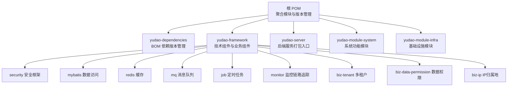
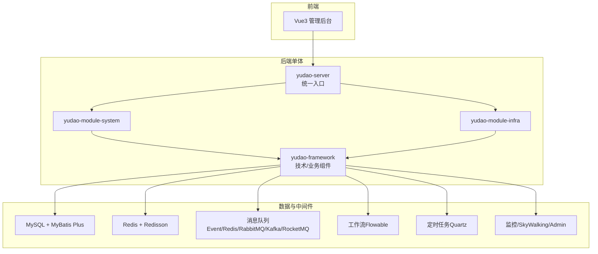
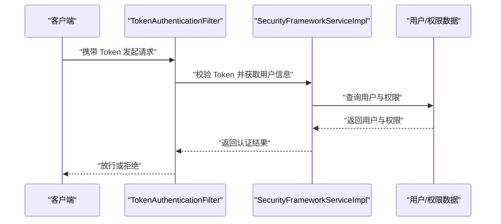
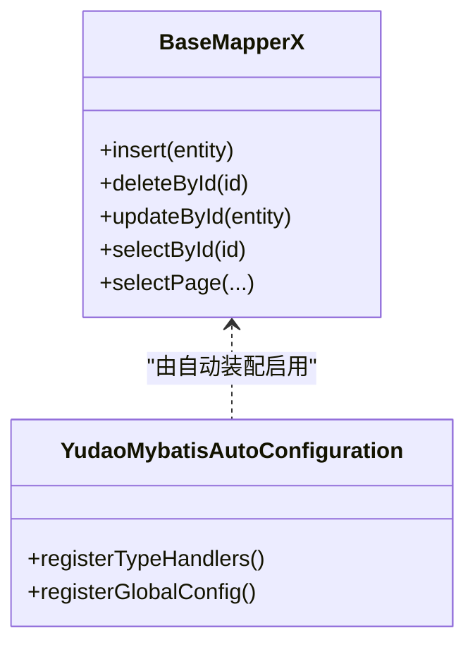
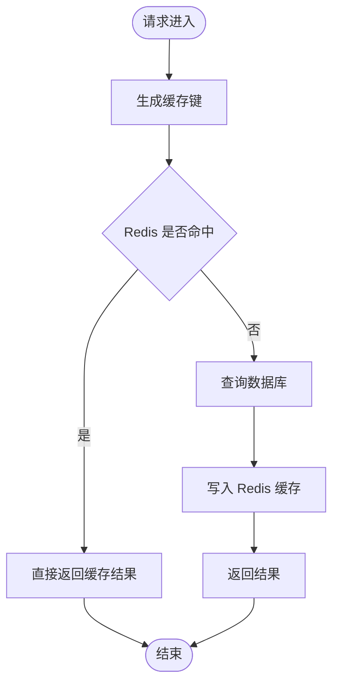
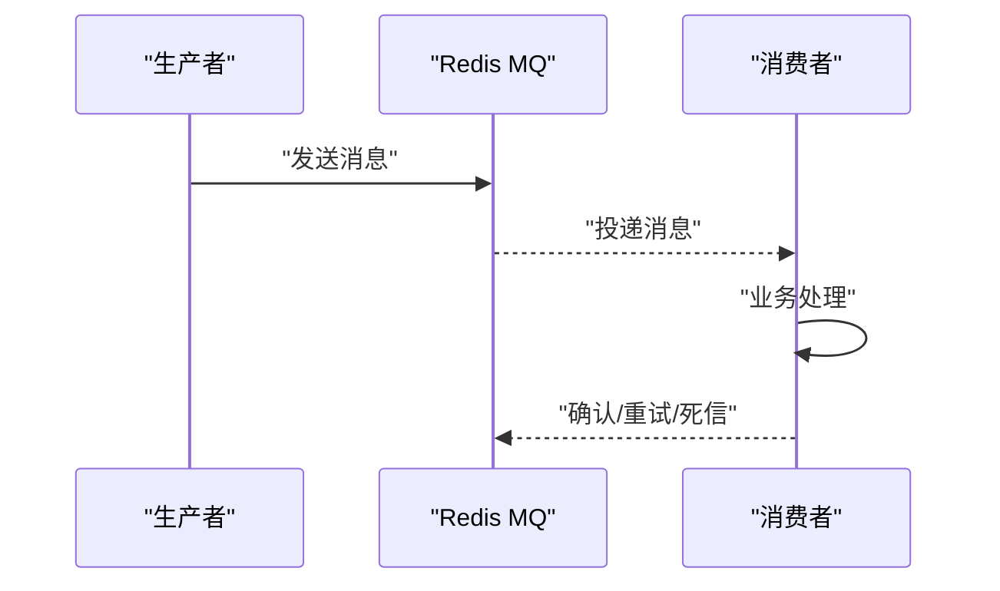
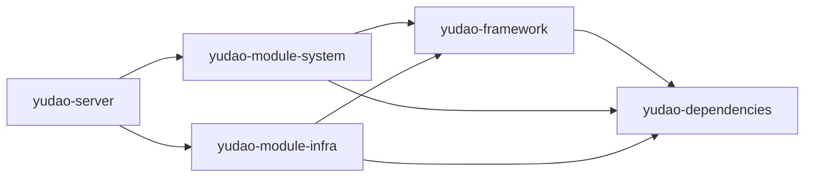

# 系统架构

<cite>
**本文引用的文件**
- [根 POM（聚合）](file://pom.xml)
- [yudao-server 启动器 POM](file://yudao-server/pom.xml)
- [yudao-server 启动类](file://yudao-server/src/main/java/cn/iocoder/yudao/server/YudaoServerApplication.java)
- [yudao-framework 聚合 POM](file://yudao-framework/pom.xml)
- [yudao-dependencies 依赖版本管理 POM](file://yudao-dependencies/pom.xml)
- [yudao-module-system POM](file://yudao-module-system/pom.xml)
- [yudao-module-infra POM](file://yudao-module-infra/pom.xml)
- [README（总体说明与架构图）](file://README.md)
- [安全框架自动装配（Security）](file://yudao-framework/yudao-spring-boot-starter-security/src/main/java/cn/iocoder/yudao/framework/security/config/YudaoSecurityAutoConfiguration.java)
- [安全过滤器（TokenAuthenticationFilter）](file://yudao-framework/yudao-spring-boot-starter-security/src/main/java/cn/iocoder/yudao/framework/security/core/filter/TokenAuthenticationFilter.java)
- [安全服务接口与实现（SecurityFrameworkService）](file://yudao-framework/yudao-spring-boot-starter-security/src/main/java/cn/iocoder/yudao/framework/security/core/service/SecurityFrameworkServiceImpl.java)
- [MyBatis 自动装配（MyBatis Plus）](file://yudao-framework/yudao-spring-boot-starter-mybatis/src/main/java/cn/iocoder/yudao/framework/mybatis/config/YudaoMybatisAutoConfiguration.java)
- [MyBatis 基类 Mapper（BaseMapperX）](file://yudao-framework/yudao-spring-boot-starter-mybatis/src/main/java/cn/iocoder/yudao/framework/mybatis/core/mapper/BaseMapperX.java)
- [Redis 自动装配（Redis）](file://yudao-framework/yudao-spring-boot-starter-redis/src/main/java/cn/iocoder/yudao/framework/redis/config/YudaoRedisAutoConfiguration.java)
- [Redis 缓存管理器（TimeoutRedisCacheManager）](file://yudao-framework/yudao-spring-boot-starter-redis/src/main/java/cn/iocoder/yudao/framework/redis/core/TimeoutRedisCacheManager.java)
- [消息队列自动装配（MQ）](file://yudao-framework/yudao-spring-boot-starter-mq/src/main/java/cn/iocoder/yudao/framework/mq/redis/config/YudaoRedisMQAutoConfiguration.java)
- [Redis MQ 生产者/消费者](file://yudao-framework/yudao-spring-boot-starter-mq/src/main/java/cn/iocoder/yudao/framework/mq/redis/core/RedisMQTemplate.java)
- [定时任务自动装配（Job）](file://yudao-framework/yudao-spring-boot-starter-job/src/main/java/cn/iocoder/yudao/framework/quartz/config/YudaoQuartzAutoConfiguration.java)
- [监控与链路追踪（Monitor）](file://yudao-framework/yudao-spring-boot-starter-monitor/src/main/java/cn/iocoder/yudao/framework/tracer/config/YudaoTracerAutoConfiguration.java)
- [Excel 工具（Excel）](file://yudao-framework/yudao-spring-boot-starter-excel/src/main/java/cn/iocoder/yudao/framework/excel/config/YudaoExcelAutoConfiguration.java)
- [业务组件：数据权限（Biz Data Permission）](file://yudao-framework/yudao-spring-boot-starter-biz-data-permission/pom.xml)
- [业务组件：多租户（Biz Tenant）](file://yudao-framework/yudao-spring-boot-starter-biz-tenant/pom.xml)
- [业务组件：IP 归属地（Biz IP）](file://yudao-framework/yudao-spring-boot-starter-biz-ip/pom.xml)
- [系统模块（System）业务组件依赖](file://yudao-module-system/pom.xml)
- [基础设施模块（Infra）业务组件依赖](file://yudao-module-infra/pom.xml)
- [yudao-server 应用配置（示例）](file://yudao-server/src/main/resources/application.yaml)
</cite>

## 目录
1. [引言](#引言)
2. [项目结构](#项目结构)
3. [核心组件](#核心组件)
4. [架构总览](#架构总览)
5. [详细组件分析](#详细组件分析)
6. [依赖分析](#依赖分析)
7. [性能考虑](#性能考虑)
8. [故障排查指南](#故障排查指南)
9. [结论](#结论)
10. [附录](#附录)

## 引言
本项目基于 Spring Boot 多模块架构，采用前后端分离设计，后端以 yudao-server 作为统一入口，通过引入 yudao-module-* 模块按需组合提供系统能力；前端提供 Vue3 管理后台与多套主题版本。后端技术栈覆盖 MySQL + MyBatis Plus、Redis + Redisson、消息队列（Event/Redis/RabbitMQ/Kafka/RocketMQ 等）、工作流（Flowable）、定时任务（Quartz）、监控（SkyWalking/Spring Boot Admin）、链路追踪、安全（Spring Security + Token + Redis）等，具备良好的扩展性与可维护性。

## 项目结构
项目采用 Maven 聚合工程，顶层 POM 管理模块与版本，yudao-server 作为打包与运行入口，yudao-framework 提供通用技术组件与业务组件，yudao-module-* 为具体业务域模块。

**图表来源**
- [根 POM（聚合）:10-31](file://pom.xml#L10-L31)
- [yudao-dependencies 依赖版本管理 POM:85-706](file://yudao-dependencies/pom.xml#L85-L706)
- [yudao-framework 聚合 POM:12-31](file://yudao-framework/pom.xml#L12-L31)
- [yudao-server 启动器 POM:23-145](file://yudao-server/pom.xml#L23-L145)
- [yudao-module-system POM:20-122](file://yudao-module-system/pom.xml#L20-L122)
- [yudao-module-infra POM:21-118](file://yudao-module-infra/pom.xml#L21-L118)

**章节来源**
- [根 POM（聚合）:10-31](file://pom.xml#L10-L31)
- [yudao-server 启动器 POM:23-145](file://yudao-server/pom.xml#L23-L145)
- [yudao-framework 聚合 POM:12-31](file://yudao-framework/pom.xml#L12-L31)
- [yudao-dependencies 依赖版本管理 POM:85-706](file://yudao-dependencies/pom.xml#L85-L706)

## 核心组件
- 启动器与打包：yudao-server 作为 Spring Boot 可执行 JAR 的打包入口，通过引入各 yudao-module-* 模块按需启用功能。
- 框架层：yudao-framework 提供通用技术组件（Web、Security、MyBatis、Redis、MQ、Job、Monitor、Excel 等）与业务组件（多租户、数据权限、IP 归属地）。
- 业务模块：yudao-module-system 与 yudao-module-infra 分别承载系统通用能力与基础设施能力，并通过 yudao-dependencies 统一版本管理。
- 前端：yudao-ui-admin-vue3 提供管理后台前端，与后端 REST API 交互。

**章节来源**
- [yudao-server 启动器 POM:23-145](file://yudao-server/pom.xml#L23-L145)
- [yudao-server 启动类:16-16](file://yudao-server/src/main/java/cn/iocoder/yudao/server/YudaoServerApplication.java#L16-L16)
- [yudao-framework 聚合 POM:12-31](file://yudao-framework/pom.xml#L12-L31)
- [yudao-module-system POM:20-122](file://yudao-module-system/pom.xml#L20-L122)
- [yudao-module-infra POM:21-118](file://yudao-module-infra/pom.xml#L21-L118)
- [README（总体说明与架构图）:44-61](file://README.md#L44-L61)

## 架构总览
系统采用“单体 + 微服务”双模式支持：
- 单体部署：yudao-server 通过依赖聚合各模块，打包为单一可执行 JAR，适合中小规模或快速交付场景。
- 微服务部署：README 明确存在基于 Spring Cloud 的微服务版本，可在保持业务域不变的前提下拆分为独立服务。

**图表来源**
- [README（总体说明与架构图）:44-61](file://README.md#L44-L61)
- [yudao-server 启动器 POM:23-145](file://yudao-server/pom.xml#L23-L145)
- [yudao-module-system POM:20-122](file://yudao-module-system/pom.xml#L20-L122)
- [yudao-module-infra POM:21-118](file://yudao-module-infra/pom.xml#L21-L118)
- [yudao-dependencies 依赖版本管理 POM:85-706](file://yudao-dependencies/pom.xml#L85-L706)

## 详细组件分析

### 安全与认证授权（Security）
- 自动装配：通过安全自动装配注册 WebSecurityConfigurerAdapter、请求授权定制器、异常处理器等。
- 认证流程：基于 Token 的无状态认证，TokenAuthenticationFilter 在请求链路中提取并校验 Token，完成后将用户上下文注入后续处理。
- 权限服务：SecurityFrameworkService 提供权限判断、菜单/按钮级权限控制等能力，结合 Redis 缓存提升性能。

**图表来源**
- [安全框架自动装配（Security）](file://yudao-framework/yudao-spring-boot-starter-security/src/main/java/cn/iocoder/yudao/framework/security/config/YudaoSecurityAutoConfiguration.java)
- [安全过滤器（TokenAuthenticationFilter）](file://yudao-framework/yudao-spring-boot-starter-security/src/main/java/cn/iocoder/yudao/framework/security/core/filter/TokenAuthenticationFilter.java)
- [安全服务接口与实现（SecurityFrameworkService）](file://yudao-framework/yudao-spring-boot-starter-security/src/main/java/cn/iocoder/yudao/framework/security/core/service/SecurityFrameworkServiceImpl.java)

**章节来源**
- [安全框架自动装配（Security）](file://yudao-framework/yudao-spring-boot-starter-security/src/main/java/cn/iocoder/yudao/framework/security/config/YudaoSecurityAutoConfiguration.java)
- [安全过滤器（TokenAuthenticationFilter）](file://yudao-framework/yudao-spring-boot-starter-security/src/main/java/cn/iocoder/yudao/framework/security/core/filter/TokenAuthenticationFilter.java)
- [安全服务接口与实现（SecurityFrameworkService）](file://yudao-framework/yudao-spring-boot-starter-security/src/main/java/cn/iocoder/yudao/framework/security/core/service/SecurityFrameworkServiceImpl.java)

### 数据访问层（MyBatis Plus）
- 自动装配：YudaoMybatisAutoConfiguration 注册 MyBatis Plus 配置、类型处理器、默认字段填充等。
- 基类 Mapper：BaseMapperX 提供通用 CRUD 能力，Lambda/Join 查询包装器简化复杂查询。
- 数据库支持：通过动态数据源与多数据库驱动适配 MySQL、Oracle、PostgreSQL、SQL Server、达梦、金仓、openGauss 等。

**图表来源**
- [MyBatis 自动装配（MyBatis Plus）](file://yudao-framework/yudao-spring-boot-starter-mybatis/src/main/java/cn/iocoder/yudao/framework/mybatis/config/YudaoMybatisAutoConfiguration.java)
- [MyBatis 基类 Mapper（BaseMapperX）](file://yudao-framework/yudao-spring-boot-starter-mybatis/src/main/java/cn/iocoder/yudao/framework/mybatis/core/mapper/BaseMapperX.java)

**章节来源**
- [MyBatis 自动装配（MyBatis Plus）](file://yudao-framework/yudao-spring-boot-starter-mybatis/src/main/java/cn/iocoder/yudao/framework/mybatis/config/YudaoMybatisAutoConfiguration.java)
- [MyBatis 基类 Mapper（BaseMapperX）](file://yudao-framework/yudao-spring-boot-starter-mybatis/src/main/java/cn/iocoder/yudao/framework/mybatis/core/mapper/BaseMapperX.java)

### 缓存与会话（Redis）
- 自动装配：YudaoRedisAutoConfiguration 注册 RedisTemplate、序列化策略、缓存管理器等。
- 缓存管理：TimeoutRedisCacheManager 提供过期策略与缓存键空间管理，配合 Redisson 提供分布式能力。
- 会话与令牌：结合安全框架，Token 与会话信息存储于 Redis，支持多终端与 SSO。

**图表来源**
- [Redis 自动装配（Redis）](file://yudao-framework/yudao-spring-boot-starter-redis/src/main/java/cn/iocoder/yudao/framework/redis/config/YudaoRedisAutoConfiguration.java)
- [Redis 缓存管理器（TimeoutRedisCacheManager）](file://yudao-framework/yudao-spring-boot-starter-redis/src/main/java/cn/iocoder/yudao/framework/redis/core/TimeoutRedisCacheManager.java)

**章节来源**
- [Redis 自动装配（Redis）](file://yudao-framework/yudao-spring-boot-starter-redis/src/main/java/cn/iocoder/yudao/framework/redis/config/YudaoRedisAutoConfiguration.java)
- [Redis 缓存管理器（TimeoutRedisCacheManager）](file://yudao-framework/yudao-spring-boot-starter-redis/src/main/java/cn/iocoder/yudao/framework/redis/core/TimeoutRedisCacheManager.java)

### 消息队列（MQ）
- 自动装配：YudaoRedisMQAutoConfiguration 注册 Redis MQ 生产者/消费者、拦截器与作业（重发、清理）。
- 能力：支持 Pub/Sub 广播、Stream 集群消费、延迟消息、幂等与重试策略，适配事件驱动与削峰填谷场景。

**图表来源**
- [消息队列自动装配（MQ）](file://yudao-framework/yudao-spring-boot-starter-mq/src/main/java/cn/iocoder/yudao/framework/mq/redis/config/YudaoRedisMQAutoConfiguration.java)
- [Redis MQ 生产者/消费者](file://yudao-framework/yudao-spring-boot-starter-mq/src/main/java/cn/iocoder/yudao/framework/mq/redis/core/RedisMQTemplate.java)

**章节来源**
- [消息队列自动装配（MQ）](file://yudao-framework/yudao-spring-boot-starter-mq/src/main/java/cn/iocoder/yudao/framework/mq/redis/config/YudaoRedisMQAutoConfiguration.java)
- [Redis MQ 生产者/消费者](file://yudao-framework/yudao-spring-boot-starter-mq/src/main/java/cn/iocoder/yudao/framework/mq/redis/core/RedisMQTemplate.java)

### 定时任务（Job）
- 自动装配：YudaoQuartzAutoConfiguration 注册 Quartz 调度器、任务监听与持久化配置。
- 能力：支持 Cron 表达式、并发控制、任务日志与失败重试，适用于周期性数据同步、报表生成等场景。

**章节来源**
- [定时任务自动装配（Job）](file://yudao-framework/yudao-spring-boot-starter-job/src/main/java/cn/iocoder/yudao/framework/quartz/config/YudaoQuartzAutoConfiguration.java)

### 监控与链路追踪（Monitor）
- 自动装配：YudaoTracerAutoConfiguration 注册 SkyWalking/Opentracing 组件，提供链路追踪与日志采集。
- 能力：与 Spring Boot Admin 结合，实现应用健康检查、指标暴露与可视化监控。

**章节来源**
- [监控与链路追踪（Monitor）](file://yudao-framework/yudao-spring-boot-starter-monitor/src/main/java/cn/iocoder/yudao/framework/tracer/config/YudaoTracerAutoConfiguration.java)

### Excel 工具（Excel）
- 自动装配：YudaoExcelAutoConfiguration 注册 Excel 导入导出工具，结合 FastExcel 提升大数据量处理性能。

**章节来源**
- [Excel 工具（Excel）](file://yudao-framework/yudao-spring-boot-starter-excel/src/main/java/cn/iocoder/yudao/framework/excel/config/YudaoExcelAutoConfiguration.java)

### 业务组件（多租户、数据权限、IP）
- 多租户：yudao-spring-boot-starter-biz-tenant 提供租户隔离与路由能力，支持 SaaS 场景。
- 数据权限：yudao-spring-boot-starter-biz-data-permission 提供基于角色/部门/自定义规则的数据权限控制。
- IP 归属地：yudao-spring-boot-starter-biz-ip 提供 IP 查询与归属地解析。

**章节来源**
- [业务组件：多租户（Biz Tenant）](file://yudao-framework/yudao-spring-boot-starter-biz-tenant/pom.xml)
- [业务组件：数据权限（Biz Data Permission）](file://yudao-framework/yudao-spring-boot-starter-biz-data-permission/pom.xml)
- [业务组件：IP 归属地（Biz IP）](file://yudao-framework/yudao-spring-boot-starter-biz-ip/pom.xml)

## 依赖分析
- 版本管理：yudao-dependencies 通过 Spring Boot Dependencies 与自研组件版本统一管理，确保模块间依赖一致性。
- 模块耦合：yudao-server 仅作为装配容器，实际业务逻辑分布在 yudao-module-*；yudao-module-system 依赖 yudao-module-infra 与 yudao-framework；yudao-module-infra 亦依赖 yudao-framework。
- 外部依赖：MyBatis Plus、Redisson、Quartz、Flowable、SkyWalking、Springdoc/Knife4j 等均通过 BOM 管控。

**图表来源**
- [根 POM（聚合）:10-31](file://pom.xml#L10-L31)
- [yudao-server 启动器 POM:23-145](file://yudao-server/pom.xml#L23-L145)
- [yudao-module-system POM:20-122](file://yudao-module-system/pom.xml#L20-L122)
- [yudao-module-infra POM:21-118](file://yudao-module-infra/pom.xml#L21-L118)
- [yudao-dependencies 依赖版本管理 POM:85-706](file://yudao-dependencies/pom.xml#L85-L706)

**章节来源**
- [根 POM（聚合）:10-31](file://pom.xml#L10-L31)
- [yudao-server 启动器 POM:23-145](file://yudao-server/pom.xml#L23-L145)
- [yudao-module-system POM:20-122](file://yudao-module-system/pom.xml#L20-L122)
- [yudao-module-infra POM:21-118](file://yudao-module-infra/pom.xml#L21-L118)
- [yudao-dependencies 依赖版本管理 POM:85-706](file://yudao-dependencies/pom.xml#L85-L706)

## 性能考虑
- 缓存策略：利用 Redis 缓存热点数据与权限信息，结合 TimeoutRedisCacheManager 控制过期与内存占用。
- 数据访问：MyBatis Plus 提供高效 ORM 与联表查询增强，配合动态数据源与多数据库驱动适配不同环境。
- 并发与限流：通过 yudao-spring-boot-starter-protection 提供分布式锁、幂等与限流能力，保障高并发场景稳定性。
- 监控与追踪：SkyWalking 与 Spring Boot Admin 提供端到端性能观测与告警能力。

## 故障排查指南
- 启动问题：若启动失败，优先检查 yudao-server 的扫描基包配置与模块依赖是否齐全。
- 安全认证：确认 TokenAuthenticationFilter 是否正确拦截与放行，检查 SecurityFrameworkServiceImpl 的权限判定逻辑。
- 数据访问：核对 MyBatis Plus 自动装配与数据库驱动版本，确保方言与类型处理器配置正确。
- 缓存问题：检查 Redis 连接与序列化配置，确认缓存键命名与过期策略符合预期。
- 消息队列：排查 Redis MQ 的生产/消费幂等、重试与死信队列配置，定位消息堆积与丢失问题。
- 定时任务：核对 Quartz 调度器配置与任务持久化，检查 Cron 表达式与并发策略。

**章节来源**
- [yudao-server 启动类:16-16](file://yudao-server/src/main/java/cn/iocoder/yudao/server/YudaoServerApplication.java#L16-L16)
- [安全服务接口与实现（SecurityFrameworkService）](file://yudao-framework/yudao-spring-boot-starter-security/src/main/java/cn/iocoder/yudao/framework/security/core/service/SecurityFrameworkServiceImpl.java)
- [MyBatis 自动装配（MyBatis Plus）](file://yudao-framework/yudao-spring-boot-starter-mybatis/src/main/java/cn/iocoder/yudao/framework/mybatis/config/YudaoMybatisAutoConfiguration.java)
- [Redis 自动装配（Redis）](file://yudao-framework/yudao-spring-boot-starter-redis/src/main/java/cn/iocoder/yudao/framework/redis/config/YudaoRedisAutoConfiguration.java)
- [消息队列自动装配（MQ）](file://yudao-framework/yudao-spring-boot-starter-mq/src/main/java/cn/iocoder/yudao/framework/mq/redis/config/YudaoRedisMQAutoConfiguration.java)
- [定时任务自动装配（Job）](file://yudao-framework/yudao-spring-boot-starter-job/src/main/java/cn/iocoder/yudao/framework/quartz/config/YudaoQuartzAutoConfiguration.java)

## 结论
本项目以 Spring Boot 多模块为核心，通过 yudao-framework 抽象出通用技术与业务组件，yudao-module-* 按领域解耦，yudao-server 统一打包与运行。系统在安全认证、数据访问、缓存、消息队列、定时任务、监控与链路追踪等方面形成完整能力闭环，既支持单体快速交付，也为未来微服务演进预留空间。

## 附录
- 架构演进路线图与模块化规划可参考 README 中的“架构演进”与“模块说明”，按需裁剪与扩展。
- 配置示例可参考 yudao-server 的 application.yaml，按环境调整数据库、Redis、MQ 等连接参数。

**章节来源**
- [README（总体说明与架构图）:64-66](file://README.md#L64-L66)
- [README（模块说明）:314-334](file://README.md#L314-L334)
- [yudao-server 应用配置（示例）](file://yudao-server/src/main/resources/application.yaml)