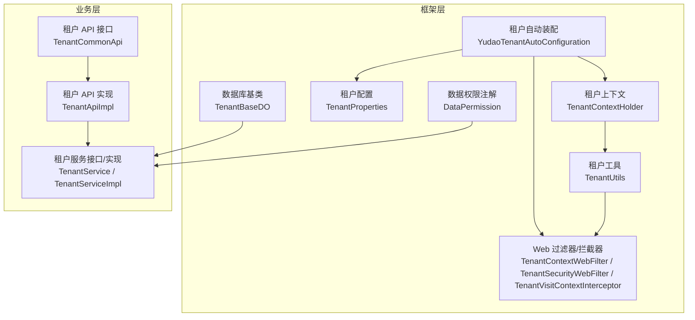
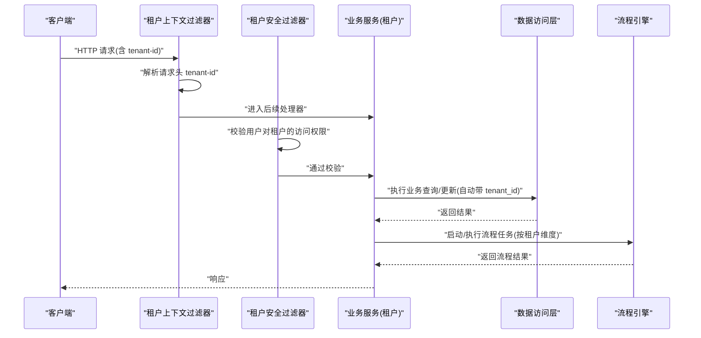
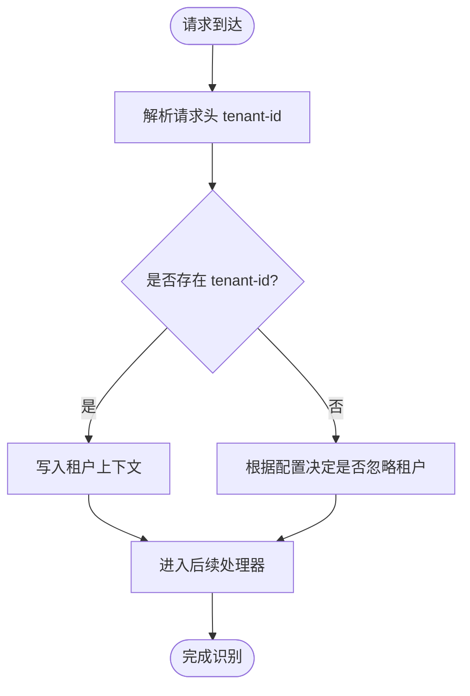
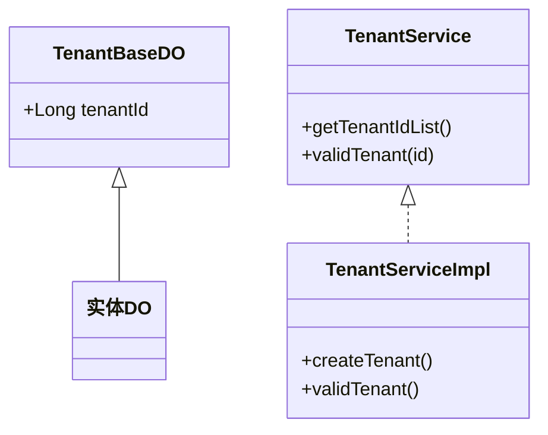
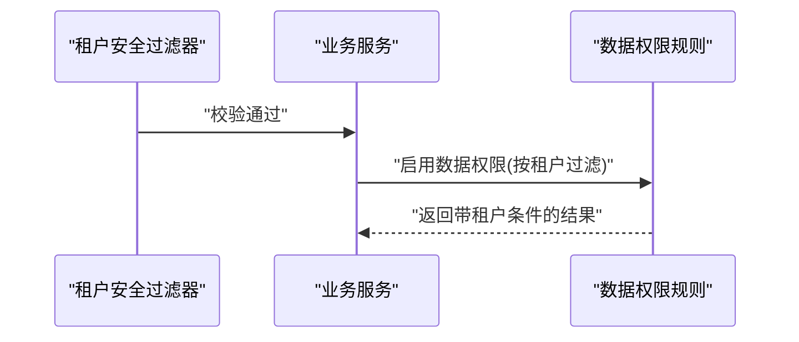
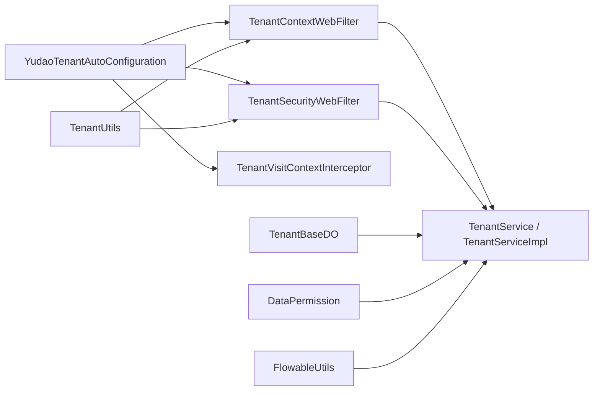

# 多租户架构

<cite>
**本文引用的文件**
- [YudaoTenantAutoConfiguration.java](file://yudao-framework/yudao-spring-boot-starter-biz-tenant/src/main/java/cn/iocoder/yudao/framework/tenant/config/YudaoTenantAutoConfiguration.java)
- [TenantContextHolder.java](file://yudao-framework/yudao-spring-boot-starter-biz-tenant/src/main/java/cn/iocoder/yudao/framework/tenant/core/context/TenantContextHolder.java)
- [TenantUtils.java](file://yudao-framework/yudao-spring-boot-starter-biz-tenant/src/main/java/cn/iocoder/yudao/framework/tenant/core/util/TenantUtils.java)
- [TenantProperties.java](file://yudao-framework/yudao-spring-boot-starter-biz-tenant/src/main/java/cn/iocoder/yudao/framework/tenant/config/TenantProperties.java)
- [TenantCommonApi.java](file://yudao-framework/yudao-common/src/main/java/cn/iocoder/yudao/framework/common/biz/system/tenant/TenantCommonApi.java)
- [TenantApiImpl.java](file://yudao-module-system/src/main/java/cn/iocoder/yudao/module/system/api/tenant/TenantApiImpl.java)
- [TenantService.java](file://yudao-module-system/src/main/java/cn/iocoder/yudao/module/system/service/tenant/TenantService.java)
- [TenantServiceImpl.java](file://yudao-module-system/src/main/java/cn/iocoder/yudao/module/system/service/tenant/TenantServiceImpl.java)
- [TenantBaseDO.java](file://yudao-framework/yudao-spring-boot-starter-biz-tenant/src/main/java/cn/iocoder/yudao/framework/tenant/core/db/TenantBaseDO.java)
- [WebFilterOrderEnum.java](file://yudao-framework/yudao-common/src/main/java/cn/iocoder/yudao/framework/common/enums/WebFilterOrderEnum.java)
- [TenantContextWebFilter.java](file://yudao-framework/yudao-spring-boot-starter-biz-tenant/src/main/java/cn/iocoder/yudao/framework/tenant/core/web/TenantContextWebFilter.java)
- [TenantSecurityWebFilter.java](file://yudao-framework/yudao-spring-boot-starter-biz-tenant/src/main/java/cn/iocoder/yudao/framework/tenant/core/security/TenantSecurityWebFilter.java)
- [TenantVisitContextInterceptor.java](file://yudao-framework/yudao-spring-boot-starter-biz-tenant/src/main/java/cn/iocoder/yudao/framework/tenant/core/web/TenantVisitContextInterceptor.java)
- [DataPermission.java](file://yudao-framework/yudao-spring-boot-starter-biz-data-permission/src/main/java/cn/iocoder/yudao/framework/datapermission/core/annotation/DataPermission.java)
- [FlowableUtils.java](file://yudao-module-bpm/src/main/java/cn/iocoder/yudao/module/bpm/framework/flowable/core/util/FlowableUtils.java)
- [PRD-用户权限设计.md](file://docs/PRD-用户权限设计.md)
</cite>

## 目录
1. [简介](#简介)
2. [项目结构](#项目结构)
3. [核心组件](#核心组件)
4. [架构总览](#架构总览)
5. [详细组件分析](#详细组件分析)
6. [依赖分析](#依赖分析)
7. [性能考虑](#性能考虑)
8. [故障排查指南](#故障排查指南)
9. [结论](#结论)
10. [附录](#附录)

## 简介
本文件面向芋道 Ruoyi-Vue-Pro 的多租户架构，系统性阐述其设计模式与实现要点，覆盖数据隔离策略、权限控制机制、资源配置方案、租户识别与切换、数据访问控制、配置管理与继承、以及多租户下的流程引擎集成等。文档以“可落地、可扩展、可运维”为目标，既适合技术读者深入理解，也便于非技术读者把握整体思路。

## 项目结构
多租户能力主要由“框架层 + 业务层 + 配置层”协同实现：
- 框架层：提供租户上下文、过滤器/拦截器、配置开关、工具方法、数据库基类等通用能力。
- 业务层：系统模块提供租户管理、套餐管理、租户维度的用户/角色/菜单/数据权限等。
- 配置层：通过配置文件控制租户开关、忽略路径、忽略表/缓存等。

图表来源
- [YudaoTenantAutoConfiguration.java:83-124](file://yudao-framework/yudao-spring-boot-starter-biz-tenant/src/main/java/cn/iocoder/yudao/framework/tenant/config/YudaoTenantAutoConfiguration.java#L83-L124)
- [TenantContextHolder.java:11-68](file://yudao-framework/yudao-spring-boot-starter-biz-tenant/src/main/java/cn/iocoder/yudao/framework/tenant/core/context/TenantContextHolder.java#L11-L68)
- [TenantUtils.java:15-113](file://yudao-framework/yudao-spring-boot-starter-biz-tenant/src/main/java/cn/iocoder/yudao/framework/tenant/core/util/TenantUtils.java#L15-L113)
- [TenantProperties.java:15-57](file://yudao-framework/yudao-spring-boot-starter-biz-tenant/src/main/java/cn/iocoder/yudao/framework/tenant/config/TenantProperties.java#L15-L57)
- [TenantContextWebFilter.java](file://yudao-framework/yudao-spring-boot-starter-biz-tenant/src/main/java/cn/iocoder/yudao/framework/tenant/core/web/TenantContextWebFilter.java)
- [TenantSecurityWebFilter.java](file://yudao-framework/yudao-spring-boot-starter-biz-tenant/src/main/java/cn/iocoder/yudao/framework/tenant/core/security/TenantSecurityWebFilter.java)
- [TenantVisitContextInterceptor.java](file://yudao-framework/yudao-spring-boot-starter-biz-tenant/src/main/java/cn/iocoder/yudao/framework/tenant/core/web/TenantVisitContextInterceptor.java)
- [DataPermission.java](file://yudao-framework/yudao-spring-boot-starter-biz-data-permission/src/main/java/cn/iocoder/yudao/framework/datapermission/core/annotation/DataPermission.java)
- [TenantBaseDO.java:1-21](file://yudao-framework/yudao-spring-boot-starter-biz-tenant/src/main/java/cn/iocoder/yudao/framework/tenant/core/db/TenantBaseDO.java#L1-L21)
- [TenantCommonApi.java:1-26](file://yudao-framework/yudao-common/src/main/java/cn/iocoder/yudao/framework/common/biz/system/tenant/TenantCommonApi.java#L1-L26)
- [TenantApiImpl.java:1-31](file://yudao-module-system/src/main/java/cn/iocoder/yudao/module/system/api/tenant/TenantApiImpl.java#L1-L31)
- [TenantService.java:115-145](file://yudao-module-system/src/main/java/cn/iocoder/yudao/module/system/service/tenant/TenantService.java#L115-L145)
- [TenantServiceImpl.java:1-106](file://yudao-module-system/src/main/java/cn/iocoder/yudao/module/system/service/tenant/TenantServiceImpl.java#L1-L106)

章节来源
- [YudaoTenantAutoConfiguration.java:83-124](file://yudao-framework/yudao-spring-boot-starter-biz-tenant/src/main/java/cn/iocoder/yudao/framework/tenant/config/YudaoTenantAutoConfiguration.java#L83-L124)
- [TenantProperties.java:15-57](file://yudao-framework/yudao-spring-boot-starter-biz-tenant/src/main/java/cn/iocoder/yudao/framework/tenant/config/TenantProperties.java#L15-L57)

## 核心组件
- 租户上下文与工具
  - 租户上下文：以 ThreadLocal + 可跨线程传递的容器保存当前租户 ID 与“是否忽略租户”标记。
  - 工具方法：提供“在指定租户下执行”、“忽略租户执行”、“向 HTTP 头部注入租户 ID”等能力。
- Web 层拦截与安全
  - 租户上下文过滤器：从请求头提取租户 ID，写入上下文；对忽略路径放行。
  - 租户访问拦截器：限制跨租户访问（如个人信息接口）。
  - 租户安全过滤器：在 Spring Security 之后执行，校验用户是否有权访问目标租户资源。
- 数据层隔离
  - 数据库基类：所有业务 DO 继承该基类，统一带有租户字段，配合数据权限注解实现自动过滤。
  - 数据权限注解：通过注解控制方法级数据权限规则启用/禁用与规则集。
- 配置与开关
  - 配置类：集中管理租户开关、忽略路径、忽略表/缓存等。
  - 自动装配：注册过滤器/拦截器，设置执行顺序，确保在合适时机生效。
- 业务能力
  - 租户 API 接口与实现：对外暴露租户 ID 列表查询与租户合法性校验。
  - 租户服务：提供租户创建、校验、套餐绑定、租户维度信息/菜单处理等。

章节来源
- [TenantContextHolder.java:11-68](file://yudao-framework/yudao-spring-boot-starter-biz-tenant/src/main/java/cn/iocoder/yudao/framework/tenant/core/context/TenantContextHolder.java#L11-L68)
- [TenantUtils.java:15-113](file://yudao-framework/yudao-spring-boot-starter-biz-tenant/src/main/java/cn/iocoder/yudao/framework/tenant/core/util/TenantUtils.java#L15-L113)
- [TenantContextWebFilter.java](file://yudao-framework/yudao-spring-boot-starter-biz-tenant/src/main/java/cn/iocoder/yudao/framework/tenant/core/web/TenantContextWebFilter.java)
- [TenantVisitContextInterceptor.java](file://yudao-framework/yudao-spring-boot-starter-biz-tenant/src/main/java/cn/iocoder/yudao/framework/tenant/core/web/TenantVisitContextInterceptor.java)
- [TenantSecurityWebFilter.java](file://yudao-framework/yudao-spring-boot-starter-biz-tenant/src/main/java/cn/iocoder/yudao/framework/tenant/core/security/TenantSecurityWebFilter.java)
- [DataPermission.java](file://yudao-framework/yudao-spring-boot-starter-biz-data-permission/src/main/java/cn/iocoder/yudao/framework/datapermission/core/annotation/DataPermission.java)
- [TenantBaseDO.java:1-21](file://yudao-framework/yudao-spring-boot-starter-biz-tenant/src/main/java/cn/iocoder/yudao/framework/tenant/core/db/TenantBaseDO.java#L1-L21)
- [TenantCommonApi.java:1-26](file://yudao-framework/yudao-common/src/main/java/cn/iocoder/yudao/framework/common/biz/system/tenant/TenantCommonApi.java#L1-L26)
- [TenantApiImpl.java:1-31](file://yudao-module-system/src/main/java/cn/iocoder/yudao/module/system/api/tenant/TenantApiImpl.java#L1-L31)
- [TenantService.java:115-145](file://yudao-module-system/src/main/java/cn/iocoder/yudao/module/system/service/tenant/TenantService.java#L115-L145)
- [TenantServiceImpl.java:1-106](file://yudao-module-system/src/main/java/cn/iocoder/yudao/module/system/service/tenant/TenantServiceImpl.java#L1-L106)

## 架构总览
多租户贯穿“请求接入—上下文构建—安全校验—数据访问—业务处理—返回”的全链路，关键节点如下：
- 请求进入：租户上下文过滤器解析请求头中的租户 ID，写入上下文。
- 安全校验：租户安全过滤器在 Spring Security 之后执行，防止越权访问。
- 数据隔离：业务方法通过数据权限注解启用租户维度过滤；DAO 层自动拼接租户条件。
- 资源共享：通过“忽略租户”能力在必要场景下绕过隔离，保障跨租户任务或回调处理。
- 流程引擎：流程引擎在启动/执行任务时尊重租户上下文，确保任务按租户维度并行执行。

图表来源
- [TenantContextWebFilter.java](file://yudao-framework/yudao-spring-boot-starter-biz-tenant/src/main/java/cn/iocoder/yudao/framework/tenant/core/web/TenantContextWebFilter.java)
- [TenantSecurityWebFilter.java](file://yudao-framework/yudao-spring-boot-starter-biz-tenant/src/main/java/cn/iocoder/yudao/framework/tenant/core/security/TenantSecurityWebFilter.java)
- [TenantServiceImpl.java:1-106](file://yudao-module-system/src/main/java/cn/iocoder/yudao/module/system/service/tenant/TenantServiceImpl.java#L1-L106)
- [FlowableUtils.java:30-104](file://yudao-module-bpm/src/main/java/cn/iocoder/yudao/module/bpm/framework/flowable/core/util/FlowableUtils.java#L30-L104)

## 详细组件分析

### 租户识别与切换机制
- 识别来源
  - 请求头：Web 过滤器从 HTTP 请求头中读取租户 ID，并写入租户上下文。
  - 配置开关：忽略路径集合允许特定接口无需携带租户 ID（如回调接口）。
- 切换方式
  - 代码内切换：通过工具方法在当前线程范围内临时设置租户 ID，执行完毕后恢复。
  - 忽略租户：在需要跨租户或系统级任务时，显式忽略租户隔离。
- 执行顺序
  - 租户上下文过滤器在日志/加密等过滤器之后、Spring Security 之前执行，确保上下文先就绪。
  - 租户安全过滤器在 Spring Security 之后执行，避免越权访问。

图表来源
- [TenantContextWebFilter.java](file://yudao-framework/yudao-spring-boot-starter-biz-tenant/src/main/java/cn/iocoder/yudao/framework/tenant/core/web/TenantContextWebFilter.java)
- [WebFilterOrderEnum.java:10-36](file://yudao-framework/yudao-common/src/main/java/cn/iocoder/yudao/framework/common/enums/WebFilterOrderEnum.java#L10-L36)
- [TenantProperties.java:15-57](file://yudao-framework/yudao-spring-boot-starter-biz-tenant/src/main/java/cn/iocoder/yudao/framework/tenant/config/TenantProperties.java#L15-L57)

章节来源
- [TenantContextHolder.java:11-68](file://yudao-framework/yudao-spring-boot-starter-biz-tenant/src/main/java/cn/iocoder/yudao/framework/tenant/core/context/TenantContextHolder.java#L11-L68)
- [TenantUtils.java:15-113](file://yudao-framework/yudao-spring-boot-starter-biz-tenant/src/main/java/cn/iocoder/yudao/framework/tenant/core/util/TenantUtils.java#L15-L113)
- [WebFilterOrderEnum.java:10-36](file://yudao-framework/yudao-common/src/main/java/cn/iocoder/yudao/framework/common/enums/WebFilterOrderEnum.java#L10-L36)

### 数据隔离策略
- 数据库层
  - 所有业务实体继承租户基类，统一具备租户字段，DAO 查询默认带入租户条件。
  - 支持忽略特定表的租户隔离，满足全局性或系统级表的需求。
- 缓存层
  - 默认对 Spring Cache 的键名加入租户维度，避免缓存污染。
  - 可配置忽略特定缓存的租户隔离。
- Redis/消息队列/定时任务
  - Redis Key 可按租户维度拼接；消息 Header 带租户 ID；任务按租户并行执行。

图表来源
- [TenantBaseDO.java:1-21](file://yudao-framework/yudao-spring-boot-starter-biz-tenant/src/main/java/cn/iocoder/yudao/framework/tenant/core/db/TenantBaseDO.java#L1-L21)
- [TenantService.java:115-145](file://yudao-module-system/src/main/java/cn/iocoder/yudao/module/system/service/tenant/TenantService.java#L115-L145)
- [TenantServiceImpl.java:1-106](file://yudao-module-system/src/main/java/cn/iocoder/yudao/module/system/service/tenant/TenantServiceImpl.java#L1-L106)

章节来源
- [TenantBaseDO.java:1-21](file://yudao-framework/yudao-spring-boot-starter-biz-tenant/src/main/java/cn/iocoder/yudao/framework/tenant/core/db/TenantBaseDO.java#L1-L21)
- [TenantProperties.java:15-57](file://yudao-framework/yudao-spring-boot-starter-biz-tenant/src/main/java/cn/iocoder/yudao/framework/tenant/config/TenantProperties.java#L15-L57)

### 权限控制机制
- 访问控制
  - 租户访问拦截器：对个人信息等敏感接口，限制跨租户访问。
  - 租户安全过滤器：在 Spring Security 之后校验用户对目标租户的访问权限。
- 数据权限
  - 数据权限注解：通过注解启用/禁用数据权限规则，或指定规则集，实现方法级的租户维度过滤。
  - 业务侧：系统模块在涉及租户维度的查询/更新时，配合注解与上下文自动生效。
- 流程引擎
  - 流程引擎在启动/执行任务时尊重租户上下文，确保任务按租户维度并行执行。

图表来源
- [TenantSecurityWebFilter.java](file://yudao-framework/yudao-spring-boot-starter-biz-tenant/src/main/java/cn/iocoder/yudao/framework/tenant/core/security/TenantSecurityWebFilter.java)
- [DataPermission.java](file://yudao-framework/yudao-spring-boot-starter-biz-data-permission/src/main/java/cn/iocoder/yudao/framework/datapermission/core/annotation/DataPermission.java)
- [FlowableUtils.java:30-104](file://yudao-module-bpm/src/main/java/cn/iocoder/yudao/module/bpm/framework/flowable/core/util/FlowableUtils.java#L30-L104)

章节来源
- [TenantVisitContextInterceptor.java](file://yudao-framework/yudao-spring-boot-starter-biz-tenant/src/main/java/cn/iocoder/yudao/framework/tenant/core/web/TenantVisitContextInterceptor.java)
- [DataPermission.java](file://yudao-framework/yudao-spring-boot-starter-biz-data-permission/src/main/java/cn/iocoder/yudao/framework/datapermission/core/annotation/DataPermission.java)
- [FlowableUtils.java:30-104](file://yudao-module-bpm/src/main/java/cn/iocoder/yudao/module/bpm/framework/flowable/core/util/FlowableUtils.java#L30-L104)

### 租户维度的用户/角色/菜单与数据权限
- 用户与角色
  - 系统模块提供租户维度的用户、角色、菜单管理能力，结合数据权限注解实现细粒度控制。
- 数据权限
  - 通过注解与规则类组合，实现“按租户过滤”的 SQL 重写，确保不同租户间数据隔离。
- 业务实践
  - PRD 文档明确了业务角色与数据权限的关系，强调“按产品线/经销商维度”的数据权限规则与系统管理模块的分离。

章节来源
- [PRD-用户权限设计.md:90-765](file://docs/PRD-用户权限设计.md#L90-L765)
- [DataPermission.java](file://yudao-framework/yudao-spring-boot-starter-biz-data-permission/src/main/java/cn/iocoder/yudao/framework/datapermission/core/annotation/DataPermission.java)

### 配置管理与继承机制
- 开关与忽略
  - 租户开关、忽略路径、忽略表/缓存等集中配置，便于在不同环境灵活调整。
- 继承与默认
  - 默认所有表/缓存均启用租户隔离，若需关闭则显式配置忽略集合。
- 生效顺序
  - 过滤器/拦截器注册顺序严格定义，确保上下文先建立、安全后校验、日志在后。

章节来源
- [TenantProperties.java:15-57](file://yudao-framework/yudao-spring-boot-starter-biz-tenant/src/main/java/cn/iocoder/yudao/framework/tenant/config/TenantProperties.java#L15-L57)
- [WebFilterOrderEnum.java:10-36](file://yudao-framework/yudao-common/src/main/java/cn/iocoder/yudao/framework/common/enums/WebFilterOrderEnum.java#L10-L36)

## 依赖分析
- 组件耦合
  - 框架层提供通用能力，业务层通过接口/注解/基类复用，耦合度低、内聚度高。
  - 过滤器/拦截器与配置类形成“装配—执行—校验”的闭环。
- 外部依赖
  - 流程引擎：通过工具方法在启动/执行任务时尊重租户上下文。
  - 数据权限：通过注解与规则类实现方法级过滤。

图表来源
- [YudaoTenantAutoConfiguration.java:83-124](file://yudao-framework/yudao-spring-boot-starter-biz-tenant/src/main/java/cn/iocoder/yudao/framework/tenant/config/YudaoTenantAutoConfiguration.java#L83-L124)
- [TenantUtils.java:15-113](file://yudao-framework/yudao-spring-boot-starter-biz-tenant/src/main/java/cn/iocoder/yudao/framework/tenant/core/util/TenantUtils.java#L15-L113)
- [TenantBaseDO.java:1-21](file://yudao-framework/yudao-spring-boot-starter-biz-tenant/src/main/java/cn/iocoder/yudao/framework/tenant/core/db/TenantBaseDO.java#L1-L21)
- [DataPermission.java](file://yudao-framework/yudao-spring-boot-starter-biz-data-permission/src/main/java/cn/iocoder/yudao/framework/datapermission/core/annotation/DataPermission.java)
- [FlowableUtils.java:30-104](file://yudao-module-bpm/src/main/java/cn/iocoder/yudao/module/bpm/framework/flowable/core/util/FlowableUtils.java#L30-L104)

章节来源
- [YudaoTenantAutoConfiguration.java:83-124](file://yudao-framework/yudao-spring-boot-starter-biz-tenant/src/main/java/cn/iocoder/yudao/framework/tenant/config/YudaoTenantAutoConfiguration.java#L83-L124)

## 性能考虑
- 线程传递：租户上下文采用可跨线程传递的容器，配合异步/定时任务保持隔离一致性，避免额外锁竞争。
- 过滤器顺序：合理的执行顺序减少重复处理与无效调用，提升吞吐。
- 缓存隔离：按租户维度缓存可避免脏读，但需关注内存占用；可通过忽略缓存隔离降低复杂度。
- 数据权限：注解驱动的规则在热点方法上应尽量减少不必要的重写成本，必要时结合缓存与白名单优化。

## 故障排查指南
- 问题：租户 ID 未生效
  - 检查请求头是否正确携带租户 ID；确认过滤器顺序与忽略路径配置。
- 问题：跨租户访问被拒绝
  - 检查租户访问拦截器与安全过滤器的配置；确认目标接口是否在忽略访问列表中。
- 问题：数据权限未生效
  - 确认方法是否标注了数据权限注解；检查规则类是否正确启用；核对业务实体是否继承租户基类。
- 问题：流程引擎任务未按租户隔离
  - 检查流程引擎工具方法是否正确读取租户上下文；确认任务启动/执行路径是否经过工具封装。

章节来源
- [WebFilterOrderEnum.java:10-36](file://yudao-framework/yudao-common/src/main/java/cn/iocoder/yudao/framework/common/enums/WebFilterOrderEnum.java#L10-L36)
- [TenantProperties.java:15-57](file://yudao-framework/yudao-spring-boot-starter-biz-tenant/src/main/java/cn/iocoder/yudao/framework/tenant/config/TenantProperties.java#L15-L57)
- [DataPermission.java](file://yudao-framework/yudao-spring-boot-starter-biz-data-permission/src/main/java/cn/iocoder/yudao/framework/datapermission/core/annotation/DataPermission.java)
- [FlowableUtils.java:30-104](file://yudao-module-bpm/src/main/java/cn/iocoder/yudao/module/bpm/framework/flowable/core/util/FlowableUtils.java#L30-L104)

## 结论
Ruoyi-Vue-Pro 的多租户架构以“上下文 + 过滤器 + 注解 + 基类 + 配置”为核心，实现了请求级租户识别、Web 层安全校验、数据库与缓存/消息/任务的租户隔离，并通过工具方法与流程引擎集成保障跨模块的一致性。该架构在保证强隔离的同时，提供了灵活的配置与切换能力，适用于 SaaS 场景下的多租户部署与演进。

## 附录
- 关键文件索引
  - 框架装配与过滤器：[YudaoTenantAutoConfiguration.java](file://yudao-framework/yudao-spring-boot-starter-biz-tenant/src/main/java/cn/iocoder/yudao/framework/tenant/config/YudaoTenantAutoConfiguration.java)
  - 上下文与工具：[TenantContextHolder.java](file://yudao-framework/yudao-spring-boot-starter-biz-tenant/src/main/java/cn/iocoder/yudao/framework/tenant/core/context/TenantContextHolder.java)、[TenantUtils.java](file://yudao-framework/yudao-spring-boot-starter-biz-tenant/src/main/java/cn/iocoder/yudao/framework/tenant/core/util/TenantUtils.java)
  - 配置与开关：[TenantProperties.java](file://yudao-framework/yudao-spring-boot-starter-biz-tenant/src/main/java/cn/iocoder/yudao/framework/tenant/config/TenantProperties.java)
  - 数据权限与基类：[DataPermission.java](file://yudao-framework/yudao-spring-boot-starter-biz-data-permission/src/main/java/cn/iocoder/yudao/framework/datapermission/core/annotation/DataPermission.java)、[TenantBaseDO.java](file://yudao-framework/yudao-spring-boot-starter-biz-tenant/src/main/java/cn/iocoder/yudao/framework/tenant/core/db/TenantBaseDO.java)
  - Web 过滤器/拦截器：[TenantContextWebFilter.java](file://yudao-framework/yudao-spring-boot-starter-biz-tenant/src/main/java/cn/iocoder/yudao/framework/tenant/core/web/TenantContextWebFilter.java)、[TenantSecurityWebFilter.java](file://yudao-framework/yudao-spring-boot-starter-biz-tenant/src/main/java/cn/iocoder/yudao/framework/tenant/core/security/TenantSecurityWebFilter.java)、[TenantVisitContextInterceptor.java](file://yudao-framework/yudao-spring-boot-starter-biz-tenant/src/main/java/cn/iocoder/yudao/framework/tenant/core/web/TenantVisitContextInterceptor.java)
  - 业务能力：[TenantCommonApi.java](file://yudao-framework/yudao-common/src/main/java/cn/iocoder/yudao/framework/common/biz/system/tenant/TenantCommonApi.java)、[TenantApiImpl.java](file://yudao-module-system/src/main/java/cn/iocoder/yudao/module/system/api/tenant/TenantApiImpl.java)、[TenantService.java](file://yudao-module-system/src/main/java/cn/iocoder/yudao/module/system/service/tenant/TenantService.java)、[TenantServiceImpl.java](file://yudao-module-system/src/main/java/cn/iocoder/yudao/module/system/service/tenant/TenantServiceImpl.java)
  - 流程引擎集成：[FlowableUtils.java](file://yudao-module-bpm/src/main/java/cn/iocoder/yudao/module/bpm/framework/flowable/core/util/FlowableUtils.java)
  - 权限设计参考：[PRD-用户权限设计.md](file://docs/PRD-用户权限设计.md)