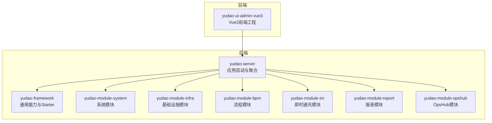
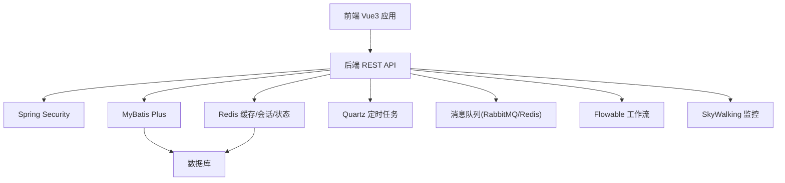
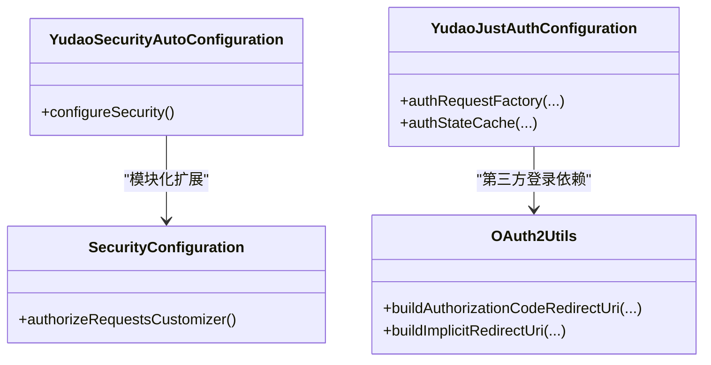
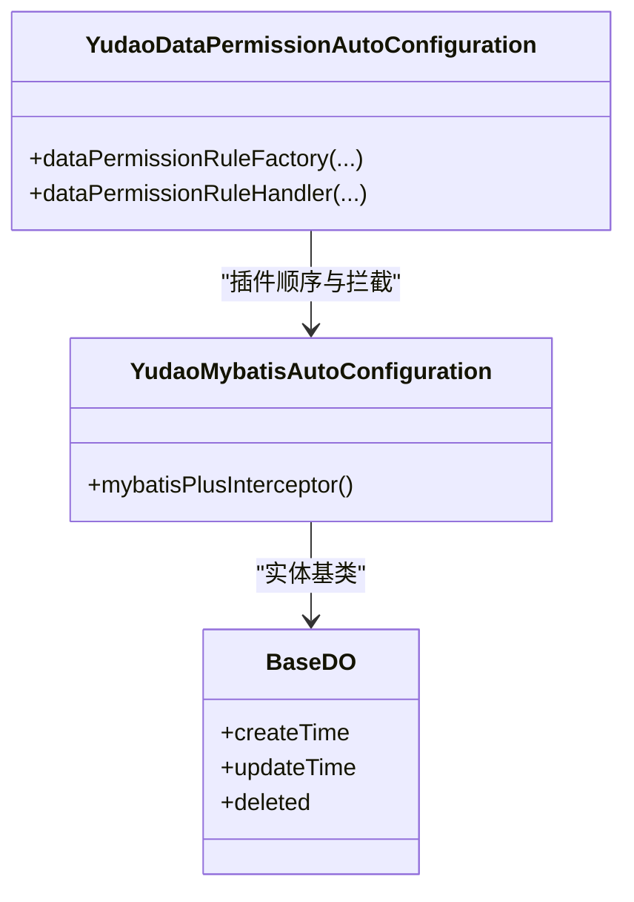
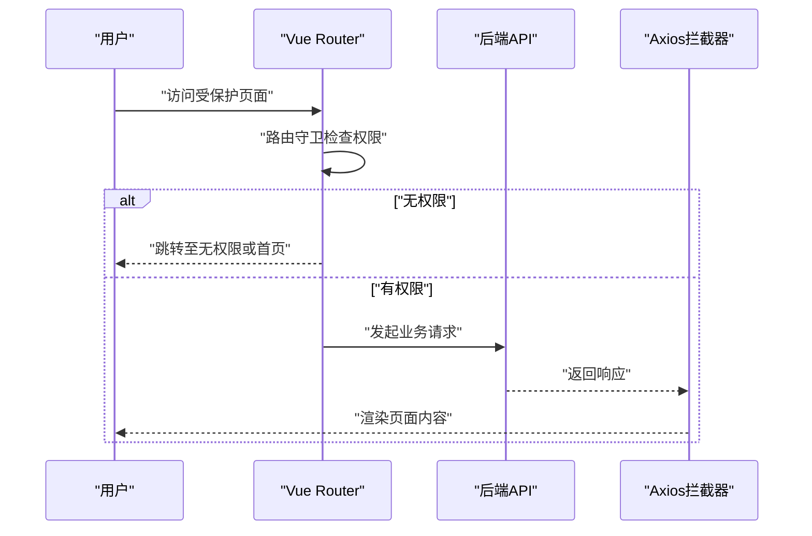
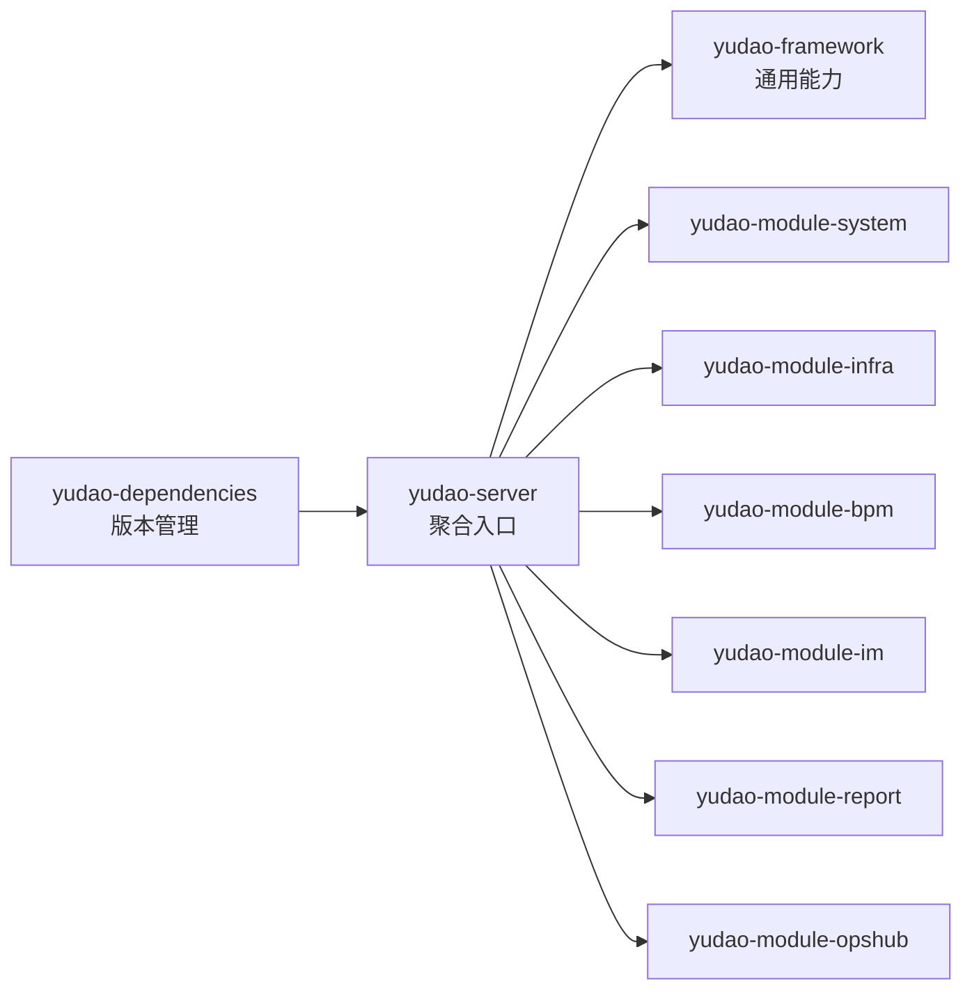

# 技术选型

<cite>
**本文引用的文件**
- [YudaoServerApplication.java](file://yudao-server/src/main/java/cn/iocoder/yudao/server/YudaoServerApplication.java)
- [application.yaml](file://yudao-server/src/main/resources/application.yaml)
- [application-dev.yaml](file://yudao-server/src/main/resources/application-dev.yaml)
- [pom.xml](file://yudao-server/pom.xml)
- [pom.xml](file://yudao-dependencies/pom.xml)
- [pom.xml](file://pom.xml)
- [YudaoMybatisAutoConfiguration.java](file://yudao-framework/yudao-spring-boot-starter-mybatis/src/main/java/cn/iocoder/yudao/framework/mybatis/config/YudaoMybatisAutoConfiguration.java)
- [BaseDO.java](file://yudao-framework/yudao-spring-boot-starter-mybatis/src/main/java/cn/iocoder/yudao/framework/mybatis/core/dataobject/BaseDO.java)
- [YudaoDataPermissionAutoConfiguration.java](file://yudao-framework/yudao-spring-boot-starter-biz-data-permission/src/main/java/cn/iocoder/yudao/framework/datapermission/config/YudaoDataPermissionAutoConfiguration.java)
- [YudaoSecurityAutoConfiguration.java](file://yudao-framework/yudao-spring-boot-starter-security/src/main/java/cn/iocoder/yudao/framework/security/config/YudaoSecurityAutoConfiguration.java)
- [SecurityConfiguration.java](file://yudao-module-opshub/src/main/java/cn/iocoder/yudao/module/opshub/framework/security/config/SecurityConfiguration.java)
- [OAuth2Utils.java](file://yudao-module-system/src/main/java/cn/iocoder/yudao/module/system/util/oauth2/OAuth2Utils.java)
- [YudaoJustAuthConfiguration.java](file://yudao-module-system/src/main/java/cn/iocoder/yudao/module/system/framework/justauth/config/YudaoJustAuthConfiguration.java)
- [YudaoRedisAutoConfiguration.java](file://yudao-framework/yudao-spring-boot-starter-redis/src/main/java/cn/iocoder/yudao/framework/redis/config/YudaoRedisAutoConfiguration.java)
- [YudaoJobAutoConfiguration.java](file://yudao-framework/yudao-spring-boot-starter-job/src/main/java/cn/iocoder/yudao/framework/quartz/config/YudaoJobAutoConfiguration.java)
- [YudaoMonitorAutoConfiguration.java](file://yudao-framework/yudao-spring-boot-starter-monitor/src/main/java/cn/iocoder/yudao/framework/tracer/config/YudaoMonitorAutoConfiguration.java)
- [YudaoMQAutoConfiguration.java](file://yudao-framework/yudao-spring-boot-starter-mq/src/main/java/cn/iocoder/yudao/framework/mq/config/YudaoMQAutoConfiguration.java)
- [YudaoWebAutoConfiguration.java](file://yudao-framework/yudao-spring-boot-starter-web/src/main/java/cn/iocoder/yudao/framework/web/config/YudaoWebAutoConfiguration.java)
- [YudaoTenantAutoConfiguration.java](file://yudao-framework/yudao-spring-boot-starter-biz-tenant/src/main/java/cn/iocoder/yudao/framework/tenant/config/YudaoTenantAutoConfiguration.java)
- [YudaoExcelAutoConfiguration.java](file://yudao-framework/yudao-spring-boot-starter-excel/src/main/java/cn/iocoder/yudao/framework/excel/config/YudaoExcelAutoConfiguration.java)
- [YudaoWebSocketAutoConfiguration.java](file://yudao-framework/yudao-spring-boot-starter-websocket/src/main/java/cn/iocoder/yudao/framework/websocket/config/YudaoWebSocketAutoConfiguration.java)
- [YudaoProtectionAutoConfiguration.java](file://yudao-framework/yudao-spring-boot-starter-protection/src/main/java/cn/iocoder/yudao/framework/protection/config/YudaoProtectionAutoConfiguration.java)
- [YudaoFlowableAutoConfiguration.java](file://yudao-module-bpm/src/main/java/cn/iocoder/yudao/module/bpm/framework/flowable/config/YudaoFlowableAutoConfiguration.java)
- [package.json](file://yudao-ui/yudao-ui-admin-vue3/package.json)
- [README.md](file://yudao-ui/yudao-ui-admin-vue3/README.md)
- [index.ts](file://yudao-ui/yudao-ui-admin-vue3/src/router/index.ts)
- [index.ts](file://yudao-ui/yudao-ui-admin-vue3/src/store/index.ts)
- [index.ts](file://yudao-ui/yudao-ui-admin-vue3/src/main.ts)
- [config.ts](file://yudao-ui/yudao-ui-admin-vue3/src/config/axios/config.ts)
- [service.ts](file://yudao-ui/yudao-ui-admin-vue3/src/config/axios/service.ts)
- [web-types.json](file://yudao-ui/yudao-ui-admin-vue3/web-types.json)
</cite>

## 目录
1. [引言](#引言)
2. [项目结构](#项目结构)
3. [核心组件](#核心组件)
4. [架构总览](#架构总览)
5. [详细组件分析](#详细组件分析)
6. [依赖分析](#依赖分析)
7. [性能考量](#性能考量)
8. [故障排查指南](#故障排查指南)
9. [结论](#结论)
10. [附录](#附录)

## 引言
本技术选型文档面向“芋道 Ruoyi-Vue-Pro”项目，系统阐述后端与前端技术栈的选择理由、组件职责与价值，并通过架构图与组件关系图帮助读者快速理解整体技术路线。后端以 Spring Boot 为核心，结合 Spring Security 提供安全能力、MyBatis Plus 简化数据访问、Redis 提升性能、Quartz 定时任务、SkyWalking 监控、RabbitMQ/Redis 消息队列、以及 Flowable 工作流引擎；前端基于 Vue 3 生态，采用 Element Plus、Pinia、Vue Router、TypeScript 等，形成高内聚、低耦合、易扩展的现代化企业级解决方案。

## 项目结构
项目采用多模块 Maven 结构，后端以 yudao-server 为聚合入口，按业务域拆分为 system、infra、bpm、im、report、opshub 等模块；yudao-framework 提供通用能力与 Starter；前端位于 yudao-ui/yudao-ui-admin-vue3。后端通过 yudao-dependencies 统一版本管理，确保依赖一致性。

图表来源
- [pom.xml](file://pom.xml)
- [pom.xml](file://yudao-server/pom.xml)
- [pom.xml](file://yudao-dependencies/pom.xml)

章节来源
- [pom.xml](file://pom.xml)
- [pom.xml](file://yudao-server/pom.xml)
- [pom.xml](file://yudao-dependencies/pom.xml)

## 核心组件
- 后端核心
  - Spring Boot：统一应用入口与自动装配，配合各 Starter 实现模块化能力。
  - Spring Security：提供认证、授权、操作日志等安全能力。
  - MyBatis Plus：增强 ORM 能力，内置分页、逻辑删除、租户隔离、数据权限等。
  - Redis：提供缓存、分布式锁、状态存储（如 JustAuth）等。
  - Quartz：定时任务调度。
  - SkyWalking：链路追踪与监控。
  - RabbitMQ/Redis MQ：异步消息与解耦。
  - Flowable：工作流引擎，支撑审批、流程编排。
- 前端核心
  - Vue 3 + TypeScript：现代响应式开发体验与类型安全。
  - Element Plus：企业级 UI 组件库。
  - Pinia：状态管理替代 Vuex，API 更简洁。
  - Vue Router：路由管理与权限控制。
  - Vite：快速构建与热更新。
  - UnoCSS：原子化 CSS。
  - vue-i18n：国际化。
  - vueuse：常用组合式工具集。

章节来源
- [YudaoServerApplication.java](file://yudao-server/src/main/java/cn/iocoder/yudao/server/YudaoServerApplication.java)
- [application.yaml](file://yudao-server/src/main/resources/application.yaml)
- [application-dev.yaml](file://yudao-server/src/main/resources/application-dev.yaml)
- [README.md](file://yudao-ui/yudao-ui-admin-vue3/README.md)

## 架构总览
后端通过 Spring Boot 自动装配加载各 Starter，形成安全、数据访问、缓存、任务、监控、消息、工作流等能力层；前端通过 Vue 3 生态与后端 RESTful API 交互，路由与状态管理解耦业务逻辑。

图表来源
- [YudaoSecurityAutoConfiguration.java](file://yudao-framework/yudao-spring-boot-starter-security/src/main/java/cn/iocoder/yudao/framework/security/config/YudaoSecurityAutoConfiguration.java)
- [YudaoMybatisAutoConfiguration.java](file://yudao-framework/yudao-spring-boot-starter-mybatis/src/main/java/cn/iocoder/yudao/framework/mybatis/config/YudaoMybatisAutoConfiguration.java)
- [YudaoRedisAutoConfiguration.java](file://yudao-framework/yudao-spring-boot-starter-redis/src/main/java/cn/iocoder/yudao/framework/redis/config/YudaoRedisAutoConfiguration.java)
- [YudaoJobAutoConfiguration.java](file://yudao-framework/yudao-spring-boot-starter-job/src/main/java/cn/iocoder/yudao/framework/quartz/config/YudaoJobAutoConfiguration.java)
- [YudaoMonitorAutoConfiguration.java](file://yudao-framework/yudao-spring-boot-starter-monitor/src/main/java/cn/iocoder/yudao/framework/tracer/config/YudaoMonitorAutoConfiguration.java)
- [YudaoMQAutoConfiguration.java](file://yudao-framework/yudao-spring-boot-starter-mq/src/main/java/cn/iocoder/yudao/framework/mq/config/YudaoMQAutoConfiguration.java)
- [YudaoFlowableAutoConfiguration.java](file://yudao-module-bpm/src/main/java/cn/iocoder/yudao/module/bpm/framework/flowable/config/YudaoFlowableAutoConfiguration.java)

## 详细组件分析

### 后端安全体系（Spring Security）
- 作用与价值
  - 统一认证与授权：拦截请求、校验 Token、判定资源访问权限。
  - 操作日志：记录“谁、何时、对何、做了何事”，便于审计与追踪。
  - 可扩展性：通过 AuthorizeRequestsCustomizer 为不同模块定制放行规则。
- 关键实现
  - 自动配置类负责装配安全过滤链与默认策略。
  - 模块级自定义：如 OpsHub 模块通过 Bean 定义放行策略。
  - OAuth2 工具：封装授权码与简化模式回调地址拼装。
  - 第三方登录：集成 JustAuth，使用 Redis 缓存 state，提升安全性与可用性。

图表来源
- [YudaoSecurityAutoConfiguration.java](file://yudao-framework/yudao-spring-boot-starter-security/src/main/java/cn/iocoder/yudao/framework/security/config/YudaoSecurityAutoConfiguration.java)
- [SecurityConfiguration.java](file://yudao-module-opshub/src/main/java/cn/iocoder/yudao/module/opshub/framework/security/config/SecurityConfiguration.java)
- [OAuth2Utils.java](file://yudao-module-system/src/main/java/cn/iocoder/yudao/module/system/util/oauth2/OAuth2Utils.java)
- [YudaoJustAuthConfiguration.java](file://yudao-module-system/src/main/java/cn/iocoder/yudao/module/system/framework/justauth/config/YudaoJustAuthConfiguration.java)

章节来源
- [YudaoSecurityAutoConfiguration.java](file://yudao-framework/yudao-spring-boot-starter-security/src/main/java/cn/iocoder/yudao/framework/security/config/YudaoSecurityAutoConfiguration.java)
- [SecurityConfiguration.java](file://yudao-module-opshub/src/main/java/cn/iocoder/yudao/module/opshub/framework/security/config/SecurityConfiguration.java)
- [OAuth2Utils.java](file://yudao-module-system/src/main/java/cn/iocoder/yudao/module/system/util/oauth2/OAuth2Utils.java)
- [YudaoJustAuthConfiguration.java](file://yudao-module-system/src/main/java/cn/iocoder/yudao/module/system/framework/justauth/config/YudaoJustAuthConfiguration.java)

### 数据访问层（MyBatis Plus + 企业级增强）
- 作用与价值
  - 简化 CRUD：提供通用 Mapper 与 Service，减少重复代码。
  - 企业级能力：分页、逻辑删除、租户隔离、动态表名、数据权限等。
  - 性能优化：SQL 解析缓存、懒初始化、拦截器链路优化。
- 关键实现
  - 自动配置：注册分页插件、可选阻断插件，保证安全与性能。
  - 基类设计：统一字段（创建时间、更新时间、删除标记等），兼容翻译组件。
  - 数据权限：拦截器前置，保障查询安全边界。

图表来源
- [YudaoMybatisAutoConfiguration.java](file://yudao-framework/yudao-spring-boot-starter-mybatis/src/main/java/cn/iocoder/yudao/framework/mybatis/config/YudaoMybatisAutoConfiguration.java)
- [BaseDO.java](file://yudao-framework/yudao-spring-boot-starter-mybatis/src/main/java/cn/iocoder/yudao/framework/mybatis/core/dataobject/BaseDO.java)
- [YudaoDataPermissionAutoConfiguration.java](file://yudao-framework/yudao-spring-boot-starter-biz-data-permission/src/main/java/cn/iocoder/yudao/framework/datapermission/config/YudaoDataPermissionAutoConfiguration.java)

章节来源
- [YudaoMybatisAutoConfiguration.java](file://yudao-framework/yudao-spring-boot-starter-mybatis/src/main/java/cn/iocoder/yudao/framework/mybatis/config/YudaoMybatisAutoConfiguration.java)
- [BaseDO.java](file://yudao-framework/yudao-spring-boot-starter-mybatis/src/main/java/cn/iocoder/yudao/framework/mybatis/core/dataobject/BaseDO.java)
- [YudaoDataPermissionAutoConfiguration.java](file://yudao-framework/yudao-spring-boot-starter-biz-data-permission/src/main/java/cn/iocoder/yudao/framework/datapermission/config/YudaoDataPermissionAutoConfiguration.java)

### 缓存与性能（Redis）
- 作用与价值
  - 缓存热点数据，降低数据库压力。
  - 分布式会话与限流、分布式锁等场景。
  - 与 JustAuth 集成，作为 state 缓存，提升第三方登录稳定性。
- 关键实现
  - 自动配置：注册 RedisTemplate、序列化策略、连接池等。
  - 与 JustAuth：通过 RedisStateCache 实现 state 缓存与过期控制。

章节来源
- [YudaoRedisAutoConfiguration.java](file://yudao-framework/yudao-spring-boot-starter-redis/src/main/java/cn/iocoder/yudao/framework/redis/config/YudaoRedisAutoConfiguration.java)
- [YudaoJustAuthConfiguration.java](file://yudao-module-system/src/main/java/cn/iocoder/yudao/module/system/framework/justauth/config/YudaoJustAuthConfiguration.java)

### 任务与监控（Quartz、SkyWalking）
- 作用与价值
  - Quartz：支持复杂调度场景，如清理、统计、通知等周期性任务。
  - SkyWalking：链路追踪与指标采集，辅助问题定位与性能分析。
- 关键实现
  - 自动配置：注册 JobStore、触发器、监听器等。

章节来源
- [YudaoJobAutoConfiguration.java](file://yudao-framework/yudao-spring-boot-starter-job/src/main/java/cn/iocoder/yudao/framework/quartz/config/YudaoJobAutoConfiguration.java)
- [YudaoMonitorAutoConfiguration.java](file://yudao-framework/yudao-spring-boot-starter-monitor/src/main/java/cn/iocoder/yudao/framework/tracer/config/YudaoMonitorAutoConfiguration.java)

### 消息与解耦（RabbitMQ/Redis MQ）
- 作用与价值
  - 异步处理：削峰填谷，提升用户体验与系统吞吐。
  - 事件驱动：模块间解耦，提高可维护性。
- 关键实现
  - 自动配置：注册 MQ 客户端、模板、监听器等。

章节来源
- [YudaoMQAutoConfiguration.java](file://yudao-framework/yudao-spring-boot-starter-mq/src/main/java/cn/iocoder/yudao/framework/mq/config/YudaoMQAutoConfiguration.java)

### 工作流（Flowable）
- 作用与价值
  - 企业级流程编排：审批、报销、入职等标准化流程。
  - 可视化设计器与运行时管理，降低业务理解成本。
- 关键实现
  - 自动配置：引擎初始化、表前缀、历史级别等。

章节来源
- [YudaoFlowableAutoConfiguration.java](file://yudao-module-bpm/src/main/java/cn/iocoder/yudao/module/bpm/framework/flowable/config/YudaoFlowableAutoConfiguration.java)

### 前端生态（Vue 3 + Element Plus + Pinia + Vue Router）
- 作用与价值
  - Vue 3：Composition API、更好的 Tree-shaking 与性能。
  - Element Plus：丰富的企业级组件，配套主题与图标。
  - Pinia：更直观的状态管理，替代 Vuex。
  - Vue Router：路由守卫与权限控制，结合后端 RBAC。
  - TypeScript：类型安全，提升开发效率与可维护性。
  - Vite：极速冷启与热更新，优化开发体验。
  - UnoCSS：原子化样式，减少打包体积。
  - vue-i18n：国际化多语言支持。
- 关键实现
  - 路由与权限：路由守卫结合后端菜单/权限标识进行鉴权。
  - 状态管理：Pinia Store 管理用户、菜单、标签页等全局状态。
  - Axios 封装：统一拦截器、错误码映射、重试与超时。
  - 插件生态：Element Plus、vueuse、iconify、wangeditor 等。

图表来源
- [index.ts](file://yudao-ui/yudao-ui-admin-vue3/src/router/index.ts)
- [service.ts](file://yudao-ui/yudao-ui-admin-vue3/src/config/axios/service.ts)

章节来源
- [README.md](file://yudao-ui/yudao-ui-admin-vue3/README.md)
- [package.json](file://yudao-ui/yudao-ui-admin-vue3/package.json)
- [index.ts](file://yudao-ui/yudao-ui-admin-vue3/src/router/index.ts)
- [index.ts](file://yudao-ui/yudao-ui-admin-vue3/src/store/index.ts)
- [index.ts](file://yudao-ui/yudao-ui-admin-vue3/src/main.ts)
- [config.ts](file://yudao-ui/yudao-ui-admin-vue3/src/config/axios/config.ts)
- [service.ts](file://yudao-ui/yudao-ui-admin-vue3/src/config/axios/service.ts)
- [web-types.json](file://yudao-ui/yudao-ui-admin-vue3/web-types.json)

## 依赖分析
- 后端依赖
  - 通过 yudao-dependencies 统一版本，避免冲突。
  - yudao-server 聚合模块引入各业务模块与框架模块。
  - 各 Starter 按需启用，避免不必要的依赖。
- 前端依赖
  - package.json 明确列出核心依赖版本，便于复现与升级。
  - 插件与工具链（Vite、UnoCSS、eslint、prettier 等）提升开发效率与质量。

图表来源
- [pom.xml](file://yudao-dependencies/pom.xml)
- [pom.xml](file://pom.xml)
- [pom.xml](file://yudao-server/pom.xml)

章节来源
- [pom.xml](file://yudao-dependencies/pom.xml)
- [pom.xml](file://pom.xml)
- [pom.xml](file://yudao-server/pom.xml)

## 性能考量
- 后端
  - MyBatis Plus：分页插件与 SQL 解析缓存减少数据库压力；必要时启用阻断插件防止误操作。
  - Redis：热点数据缓存、分布式会话与第三方登录 state 缓存，显著降低后端负载。
  - Quartz：合理设置任务并发与失败重试，避免对数据库造成冲击。
  - 监控：SkyWalking 提供链路追踪与指标，便于定位瓶颈。
- 前端
  - Vite 构建与按需加载，减少首屏体积。
  - UnoCSS 原子化样式，避免冗余 CSS。
  - Axios 统一拦截与错误处理，减少无效请求。

## 故障排查指南
- 安全相关
  - 若出现权限不足或登录异常，检查 SecurityConfiguration 的放行规则与 OAuth2Utils 的回调拼装是否正确。
- 数据访问
  - 若分页或数据权限不生效，确认 MyBatis Plus 拦截器顺序与数据权限工厂配置。
- 缓存相关
  - Redis 连接或序列化异常，核对 Redis 自动配置与 JustAuth 缓存策略。
- 任务与监控
  - Quartz 任务未执行，检查 JobStore 初始化与触发器配置；SkyWalking 未采集，确认探针与配置。
- 前端
  - 路由跳转异常或权限失效，检查路由守卫与后端菜单/权限标识一致性；Axios 错误码映射与重试策略。

章节来源
- [SecurityConfiguration.java](file://yudao-module-opshub/src/main/java/cn/iocoder/yudao/module/opshub/framework/security/config/SecurityConfiguration.java)
- [OAuth2Utils.java](file://yudao-module-system/src/main/java/cn/iocoder/yudao/module/system/util/oauth2/OAuth2Utils.java)
- [YudaoDataPermissionAutoConfiguration.java](file://yudao-framework/yudao-spring-boot-starter-biz-data-permission/src/main/java/cn/iocoder/yudao/framework/datapermission/config/YudaoDataPermissionAutoConfiguration.java)
- [YudaoRedisAutoConfiguration.java](file://yudao-framework/yudao-spring-boot-starter-redis/src/main/java/cn/iocoder/yudao/framework/redis/config/YudaoRedisAutoConfiguration.java)
- [YudaoJobAutoConfiguration.java](file://yudao-framework/yudao-spring-boot-starter-job/src/main/java/cn/iocoder/yudao/framework/quartz/config/YudaoJobAutoConfiguration.java)
- [YudaoMonitorAutoConfiguration.java](file://yudao-framework/yudao-spring-boot-starter-monitor/src/main/java/cn/iocoder/yudao/framework/tracer/config/YudaoMonitorAutoConfiguration.java)
- [service.ts](file://yudao-ui/yudao-ui-admin-vue3/src/config/axios/service.ts)

## 结论
本项目的技术选型以“稳定、可扩展、易维护”为目标：后端通过 Spring Boot 生态与企业级 Starter 快速搭建安全、高性能、可观测的中台能力；前端以 Vue 3 为核心，结合现代化工具链与 UI 组件库，提供优秀的开发与用户体验。整体架构清晰、模块边界明确，适合长期演进与团队协作。

## 附录
- 技术栈对比与权衡
  - 安全：Spring Security 相比 Shiro 更贴合 Spring 生态，且具备 OAuth2/SAML 等企业特性；Shiro 更轻量但生态相对薄弱。
  - ORM：MyBatis Plus 相比原生 MyBatis 开发效率更高，内置能力更强；Hibernate/JPA 更面向对象但复杂度较高。
  - 缓存：Redis 相比 EhCache 更适合分布式场景；EhCache 适合单机或小规模缓存。
  - 工作流：Flowable 相比 Activiti 更活跃，社区与生态更好；Activiti 更成熟但更新频率较低。
  - 前端：Vue 3 相比 React 在国内生态更成熟，TypeScript 集成更自然；React 生态同样强大但学习曲线略高。
- 部署与运维
  - 建议前后端容器化部署，结合 Nginx 做反向代理与静态资源分发。
  - 使用 SkyWalking 与 Spring Boot Admin 进行链路追踪与健康检查。
  - Redis、MQ、数据库建议独立部署并做好备份与监控。