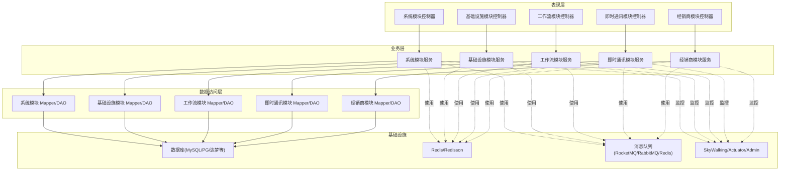
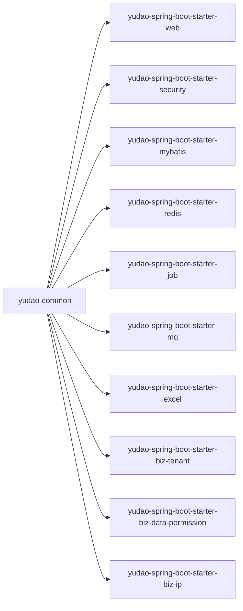
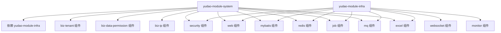
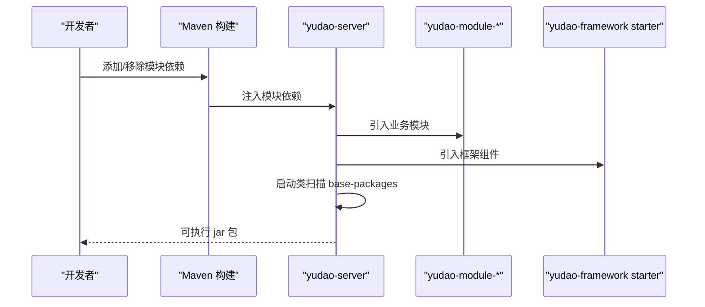
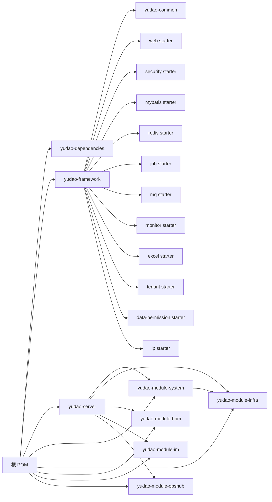

# 整体设计

<cite>
**本文引用的文件**
- [根聚合 POM](file://pom.xml)
- [yudao-dependencies 依赖管理](file://yudao-dependencies/pom.xml)
- [yudao-framework 框架聚合 POM](file://yudao-framework/pom.xml)
- [yudao-server 服务入口 POM](file://yudao-server/pom.xml)
- [yudao-server 启动类](file://yudao-server/src/main/java/cn/iocoder/yudao/server/YudaoServerApplication.java)
- [yudao-common 通用模块 POM](file://yudao-framework/yudao-common/pom.xml)
- [yudao-spring-boot-starter-web POM](file://yudao-framework/yudao-spring-boot-starter-web/pom.xml)
- [yudao-spring-boot-starter-security POM](file://yudao-framework/yudao-spring-boot-starter-security/pom.xml)
- [yudao-spring-boot-starter-mybatis POM](file://yudao-framework/yudao-spring-boot-starter-mybatis/pom.xml)
- [yudao-module-system POM](file://yudao-module-system/pom.xml)
- [yudao-module-infra POM](file://yudao-module-infra/pom.xml)
- [README 项目说明](file://README.md)
</cite>

## 目录
1. [引言](#引言)
2. [项目结构](#项目结构)
3. [核心组件](#核心组件)
4. [架构总览](#架构总览)
5. [详细组件分析](#详细组件分析)
6. [依赖分析](#依赖分析)
7. [性能考虑](#性能考虑)
8. [故障排查指南](#故障排查指南)
9. [结论](#结论)
10. [附录](#附录)

## 引言
本设计文档面向“芋道 Ruoyi-Vue-Pro”项目，系统阐述其整体架构理念与实现方式，重点覆盖：
- 前后端分离的微服务化思想与模块化组织
- Spring Boot 多模块项目的分层设计与职责边界
- yudao-framework 核心框架、yudao-module-* 业务模块、yudao-server 服务入口的协作关系
- 分层架构中的表现层、业务层、数据访问层职责划分
- 模块间通信机制与数据流转路径
- 系统架构图与模块关系图，帮助开发者快速理解并高效扩展

## 项目结构
项目采用 Maven 多模块聚合结构，顶层 POM 负责模块聚合与版本统一；yudao-dependencies 提供统一的依赖版本管理；yudao-framework 聚合各类技术与业务组件；yudao-module-* 为具体业务域模块；yudao-server 作为服务入口打包运行。

```mermaid
graph TB
Root["根聚合 POM<br/>yudao"] --> Deps["yudao-dependencies<br/>依赖版本管理"]
Root --> Fwk["yudao-framework<br/>框架聚合"]
Root --> Server["yudao-server<br/>服务入口"]
Root --> ModSys["yudao-module-system<br/>系统模块"]
Root --> ModInfra["yudao-module-infra<br/>基础设施模块"]
Root --> ModBpm["yudao-module-bpm<br/>工作流模块"]
Root --> ModIm["yudao-module-im<br/>即时通讯模块"]
Root --> ModOps["yudao-module-opshub<br/>经销商管理模块"]
Fwk --> FwkCommon["yudao-common"]
Fwk --> FwkWeb["yudao-spring-boot-starter-web"]
Fwk --> FwkSec["yudao-spring-boot-starter-security"]
Fwk --> FwkMyBatis["yudao-spring-boot-starter-mybatis"]
Fwk --> FwkRedis["yudao-spring-boot-starter-redis"]
Fwk --> FwkJob["yudao-spring-boot-starter-job"]
Fwk --> FwkMQ["yudao-spring-boot-starter-mq"]
Fwk --> FwkMonitor["yudao-spring-boot-starter-monitor"]
Fwk --> FwkExcel["yudao-spring-boot-starter-excel"]
Fwk --> FwkTenant["yudao-spring-boot-starter-biz-tenant"]
Fwk --> FwkDP["yudao-spring-boot-starter-biz-data-permission"]
Fwk --> FwkIP["yudao-spring-boot-starter-biz-ip"]
```

**图表来源**
- [根聚合 POM:10-33](file://pom.xml#L10-L33)
- [yudao-framework 框架聚合 POM:12-31](file://yudao-framework/pom.xml#L12-L31)
- [yudao-server 服务入口 POM:23-144](file://yudao-server/pom.xml#L23-L144)

**章节来源**
- [根聚合 POM:10-33](file://pom.xml#L10-L33)
- [README 项目说明:326-347](file://README.md#L326-L347)

## 核心组件
- yudao-dependencies：集中管理 Spring Boot、MyBatis、Redisson、Flowable、SkyWalking 等生态组件版本，确保模块间一致性与可升级性。
- yudao-framework：封装通用技术组件与业务组件，形成可复用的“技术组件 + 业务组件”双轨体系，降低模块耦合度。
- yudao-module-system：通用业务域，覆盖用户、部门、权限、数据字典、操作日志、短信/邮件/站内信等。
- yudao-module-infra：基础设施域，覆盖定时任务、代码生成、文件服务、WebSocket、API 日志、监控与服务保障等。
- yudao-module-bpm：工作流域，基于 Flowable 构建，支持 BPMN 设计器与 SIMPLE 设计器。
- yudao-module-im：即时通讯域，支持频道、好友、群组、消息、RTC 等能力。
- yudao-module-opshub：经销商管理客服 SaaS 场景模块。
- yudao-server：服务入口，聚合所需模块并打包为可运行的 Spring Boot 可执行包。

**章节来源**
- [yudao-dependencies 依赖管理:88-726](file://yudao-dependencies/pom.xml#L88-L726)
- [yudao-framework 框架聚合 POM:34-43](file://yudao-framework/pom.xml#L34-L43)
- [yudao-module-system POM:15-18](file://yudao-module-system/pom.xml#L15-L18)
- [yudao-module-infra POM:15-19](file://yudao-module-infra/pom.xml#L15-L19)
- [README 项目说明:326-347](file://README.md#L326-L347)

## 架构总览
系统采用“多模块 + 聚合打包”的架构，体现以下设计理念：
- 模块化：按业务域拆分模块，职责清晰、边界明确，便于独立演进与测试。
- 分层化：表现层（Controller）、业务层（Service）、数据访问层（Mapper/DAO）职责分离，中间通过 DTO/VO 与异常码解耦。
- 组件化：yudao-framework 将通用能力抽象为可插拔的 starter，模块仅按需引入。
- 服务化：yudao-server 作为统一入口，通过依赖装配实现“按需启用”的微服务化效果。

**图表来源**
- [yudao-module-system POM:53-91](file://yudao-module-system/pom.xml#L53-L91)
- [yudao-module-infra POM:40-96](file://yudao-module-infra/pom.xml#L40-L96)
- [yudao-spring-boot-starter-mybatis POM:72-98](file://yudao-framework/yudao-spring-boot-starter-mybatis/pom.xml#L72-L98)
- [yudao-spring-boot-starter-redis POM:1-80](file://yudao-framework/yudao-spring-boot-starter-redis/pom.xml#L1-L80)
- [yudao-spring-boot-starter-mq POM:1-120](file://yudao-framework/yudao-spring-boot-starter-mq/pom.xml#L1-L120)
- [yudao-spring-boot-starter-monitor POM:1-120](file://yudao-framework/yudao-spring-boot-starter-monitor/pom.xml#L1-L120)

## 详细组件分析

### yudao-framework 核心框架
- yudao-common：提供基础 POJO、枚举、工具类、异常体系、校验注解等，作为所有模块的“公共基座”。
- yudao-spring-boot-starter-web：封装全局异常、API 日志、脱敏、Knife4j/SpringDoc 文档等，统一对外接口风格。
- yudao-spring-boot-starter-security：集成 Spring Security 与操作日志组件，统一认证授权与审计能力。
- yudao-spring-boot-starter-mybatis：封装 Druid 连接池、MyBatis Plus、动态数据源、联表查询扩展等。
- yudao-spring-boot-starter-redis：封装 Redis/Redisson、序列化策略、分布式缓存等。
- yudao-spring-boot-starter-job：封装 Quartz 定时任务，提供统一的任务管理与日志。
- yudao-spring-boot-starter-mq：封装 RocketMQ/RabbitMQ/Redis 等消息队列能力。
- 业务组件：yudao-spring-boot-starter-biz-tenant（多租户）、yudao-spring-boot-starter-biz-data-permission（数据权限）、yudao-spring-boot-starter-biz-ip（IP 归属地）等。

**图表来源**
- [yudao-framework 框架聚合 POM:12-31](file://yudao-framework/pom.xml#L12-L31)
- [yudao-common 通用模块 POM:18-146](file://yudao-framework/yudao-common/pom.xml#L18-L146)
- [yudao-spring-boot-starter-web POM:18-79](file://yudao-framework/yudao-spring-boot-starter-web/pom.xml#L18-L79)
- [yudao-spring-boot-starter-security POM:21-61](file://yudao-framework/yudao-spring-boot-starter-security/pom.xml#L21-L61)
- [yudao-spring-boot-starter-mybatis POM:18-114](file://yudao-framework/yudao-spring-boot-starter-mybatis/pom.xml#L18-L114)

**章节来源**
- [yudao-common 通用模块 POM:14-16](file://yudao-framework/yudao-common/pom.xml#L14-L16)
- [yudao-spring-boot-starter-web POM:14-15](file://yudao-framework/yudao-spring-boot-starter-web/pom.xml#L14-L15)
- [yudao-spring-boot-starter-security POM:15-18](file://yudao-framework/yudao-spring-boot-starter-security/pom.xml#L15-L18)
- [yudao-spring-boot-starter-mybatis POM:14-15](file://yudao-framework/yudao-spring-boot-starter-mybatis/pom.xml#L14-L15)

### yudao-module-system 与 yudao-module-infra
- yudao-module-system：通用业务域，依赖 yudao-module-infra 与各类 yudao-spring-boot-starter-* 组件，提供用户/部门/权限、字典、操作日志、短信/邮件/站内信、验证码、社交登录、邮件等能力。
- yudao-module-infra：基础设施域，提供定时任务、代码生成、文件服务、WebSocket、API 日志、监控与服务保障等能力，并依赖 yudao-spring-boot-starter-* 组件。

**图表来源**
- [yudao-module-system POM:20-91](file://yudao-module-system/pom.xml#L20-L91)
- [yudao-module-infra POM:21-96](file://yudao-module-infra/pom.xml#L21-L96)

**章节来源**
- [yudao-module-system POM:15-18](file://yudao-module-system/pom.xml#L15-L18)
- [yudao-module-infra POM:15-19](file://yudao-module-infra/pom.xml#L15-L19)

### yudao-server 服务入口
- yudao-server 通过引入所需的 yudao-module-* 依赖，实现“按需启用”的微服务化效果；最终通过 spring-boot-maven-plugin 打包为可执行 jar。
- 启动类通过 @SpringBootApplication 指定扫描 base-packages，确保模块组件被正确发现与装配。

**图表来源**
- [yudao-server 服务入口 POM:23-165](file://yudao-server/pom.xml#L23-L165)
- [yudao-server 启动类:16-24](file://yudao-server/src/main/java/cn/iocoder/yudao/server/YudaoServerApplication.java#L16-L24)

**章节来源**
- [yudao-server 服务入口 POM:16-21](file://yudao-server/pom.xml#L16-L21)
- [yudao-server 启动类:16-24](file://yudao-server/src/main/java/cn/iocoder/yudao/server/YudaoServerApplication.java#L16-L24)

## 依赖分析
- 顶层聚合：根 POM 聚合 yudao-dependencies、yudao-framework、yudao-server 与各 yudao-module-* 模块。
- 版本统一：yudao-dependencies 通过 dependencyManagement 统一管理 Spring Boot、MyBatis、Redisson、Flowable、SkyWalking 等版本。
- 模块依赖：yudao-module-system 显式依赖 yudao-module-infra；yudao-server 显式依赖各 yudao-module-* 模块；yudao-framework 各 starter 依赖 yudao-common 与对应 Spring 生态组件。

**图表来源**
- [根聚合 POM:10-33](file://pom.xml#L10-L33)
- [yudao-dependencies 依赖管理:88-726](file://yudao-dependencies/pom.xml#L88-L726)
- [yudao-module-system POM:20-25](file://yudao-module-system/pom.xml#L20-L25)
- [yudao-server 服务入口 POM:23-144](file://yudao-server/pom.xml#L23-L144)
- [yudao-framework 框架聚合 POM:12-31](file://yudao-framework/pom.xml#L12-L31)

**章节来源**
- [根聚合 POM:55-65](file://pom.xml#L55-L65)
- [yudao-dependencies 依赖管理:88-104](file://yudao-dependencies/pom.xml#L88-L104)

## 性能考虑
- 缓存与限流：通过 yudao-spring-boot-starter-redis 与 yudao-spring-boot-starter-protection 提供缓存与服务保障能力，建议在热点接口与高频操作场景开启缓存与限流。
- 数据库连接池与多数据源：使用 Druid 与 Dynamic Datasource，建议针对不同业务域配置独立数据源，避免热点竞争。
- 消息队列削峰填谷：通过 yudao-spring-boot-starter-mq 异步化非关键路径，降低请求延迟。
- 监控与追踪：集成 SkyWalking、Spring Boot Admin、Actuator，建议在生产环境开启链路追踪与指标采集。
- 代码生成与文档：基础设施模块提供代码生成与接口文档能力，建议在新功能开发时优先使用，减少重复劳动并保持一致性。

## 故障排查指南
- 启动问题定位：yudao-server 启动类包含启动指引链接，遇到启动问题请先查阅文档。
- 依赖冲突排查：通过 yudao-dependencies 统一版本，避免 Spring Boot、MyBatis、Redisson 等组件版本不一致导致的冲突。
- 模块依赖缺失：确认 yudao-server 是否引入了所需 yudao-module-* 依赖；若未启用某些模块，可在 POM 中注释相应依赖以加速编译。
- 数据库驱动：yudao-server 显式引入 PostgreSQL 驱动，若使用其他数据库请替换或补充对应驱动依赖。

**章节来源**
- [yudao-server 启动类:10-11](file://yudao-server/src/main/java/cn/iocoder/yudao/server/YudaoServerApplication.java#L10-L11)
- [yudao-server 服务入口 POM:146-150](file://yudao-server/pom.xml#L146-L150)

## 结论
本项目通过“多模块 + 聚合打包 + 组件化”的架构设计，实现了高内聚、低耦合的系统组织方式。yudao-framework 将通用能力沉淀为可插拔组件，yudao-module-* 按业务域划分职责，yudao-server 作为服务入口实现“按需启用”。配合完善的监控、安全与数据访问层能力，项目具备良好的扩展性与可维护性，适合在多租户、多业务场景下持续演进。

## 附录
- 项目模块一览与职责说明可参考 README 的“模块”与“技术栈”章节。
- 如需进一步了解各模块的详细功能与使用方式，可结合各模块 POM 与 README 中的功能清单进行对照。

**章节来源**
- [README 项目说明:326-373](file://README.md#L326-L373)