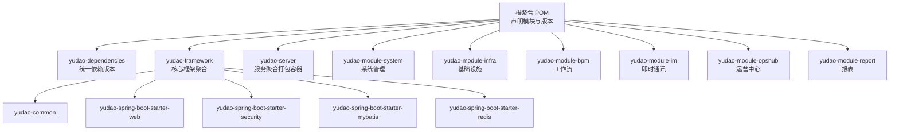
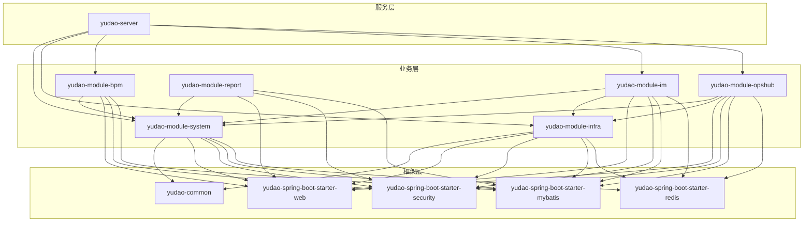
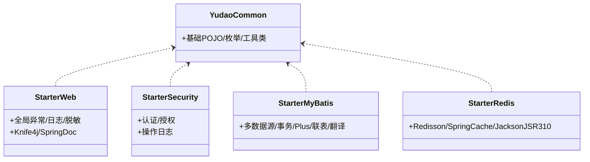
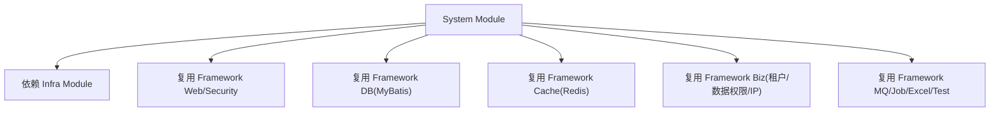
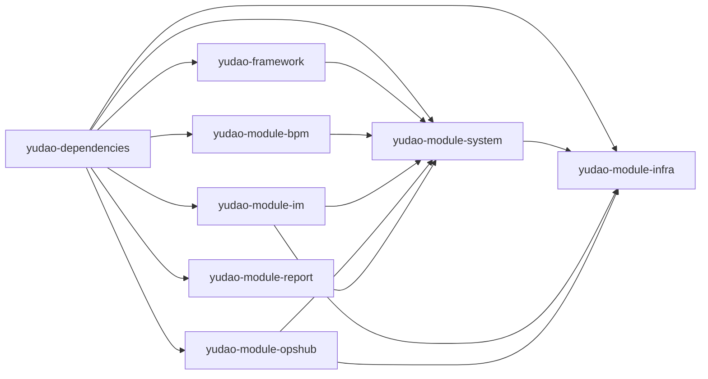

# 模块划分

<cite>
**本文引用的文件**
- [根聚合 POM](file://pom.xml)
- [yudao-dependencies 依赖管理](file://yudao-dependencies/pom.xml)
- [yudao-framework 框架聚合](file://yudao-framework/pom.xml)
- [yudao-server 服务聚合](file://yudao-server/pom.xml)
- [yudao-framework/yudao-common 公共模块](file://yudao-framework/yudao-common/pom.xml)
- [yudao-framework/yudao-spring-boot-starter-web Web 模块](file://yudao-framework/yudao-spring-boot-starter-web/pom.xml)
- [yudao-framework/yudao-spring-boot-starter-security 安全模块](file://yudao-framework/yudao-spring-boot-starter-security/pom.xml)
- [yudao-framework/yudao-spring-boot-starter-mybatis MyBatis 模块](file://yudao-framework/yudao-spring-boot-starter-mybatis/pom.xml)
- [yudao-framework/yudao-spring-boot-starter-redis Redis 模块](file://yudao-framework/yudao-spring-boot-starter-redis/pom.xml)
- [yudao-module-system 系统管理模块](file://yudao-module-system/pom.xml)
- [yudao-module-infra 基础设施模块](file://yudao-module-infra/pom.xml)
- [yudao-module-bpm 工作流模块](file://yudao-module-bpm/pom.xml)
- [yudao-module-im 即时通讯模块](file://yudao-module-im/pom.xml)
- [yudao-module-opshub 运营中心模块](file://yudao-module-opshub/pom.xml)
- [yudao-module-report 报表模块](file://yudao-module-report/pom.xml)
</cite>

## 目录
1. [引言](#引言)
2. [项目结构](#项目结构)
3. [核心组件](#核心组件)
4. [架构总览](#架构总览)
5. [详细组件分析](#详细组件分析)
6. [依赖分析](#依赖分析)
7. [性能考虑](#性能考虑)
8. [故障排查指南](#故障排查指南)
9. [结论](#结论)
10. [附录](#附录)

## 引言
本文件面向芋道 Ruoyi-Vue-Pro 的后端工程，系统性阐述模块化设计与划分，聚焦以下模块：
- yudao-framework 核心框架模块：提供通用能力与可复用组件（Web、安全、MyBatis、Redis、监控、保护、作业、消息队列、Excel、测试、租户、数据权限、IP 等）
- yudao-module-system 系统管理模块：通用业务支撑（用户、部门、权限、数据字典等）
- yudao-module-infra 基础设施模块：运维与研发工具（定时任务、代码生成、文件存储、监控等）
- yudao-module-bpm 工作流模块：基于 Flowable 的流程管理
- yudao-module-im 即时通讯模块：单聊/群聊/消息/音视频通话等
- yudao-module-opshub 运营中心模块：SaaS 经销商管理客服平台
- yudao-module-report 报表模块：基于积木报表的数据可视化

文档将说明各模块的功能定位、职责边界、模块间依赖关系与接口约定，并给出模块依赖图与交互流程图，帮助开发者快速理解与协作。

## 项目结构
项目采用 Maven 多模块聚合结构，顶层 POM 声明所有模块；yudao-framework 作为核心框架聚合模块，内部进一步拆分多个可复用的 starter；yudao-server 作为最终打包的“容器”模块，按需装配各业务模块。

图表来源
- [根聚合 POM:10-33](file://pom.xml#L10-L33)
- [yudao-framework 框架聚合:12-31](file://yudao-framework/pom.xml#L12-L31)
- [yudao-server 服务聚合:23-144](file://yudao-server/pom.xml#L23-L144)

章节来源
- [根聚合 POM:10-33](file://pom.xml#L10-L33)
- [yudao-framework 框架聚合:12-31](file://yudao-framework/pom.xml#L12-L31)
- [yudao-server 服务聚合:23-144](file://yudao-server/pom.xml#L23-L144)

## 核心组件
- yudao-common：定义基础 POJO、枚举、工具类，为上层模块提供通用能力
- yudao-spring-boot-starter-web：统一 Web 层能力（全局异常、API 日志、脱敏、Knife4j/SpringDoc 文档）
- yudao-spring-boot-starter-security：认证授权与操作日志
- yudao-spring-boot-starter-mybatis：数据库连接池、多数据源、事务、MyBatis Plus、联表查询、数据翻译
- yudao-spring-boot-starter-redis：Redisson、Spring Cache、Jackson JSR310 时间序列化
- 其他组件：监控、保护、作业、消息队列、Excel、测试、租户、数据权限、IP 等

这些组件以“starter”的形式提供自动装配与能力封装，业务模块仅需引入对应依赖即可获得相应能力。

章节来源
- [yudao-framework/yudao-common 公共模块:18-147](file://yudao-framework/yudao-common/pom.xml#L18-L147)
- [yudao-framework/yudao-spring-boot-starter-web Web 模块:18-79](file://yudao-framework/yudao-spring-boot-starter-web/pom.xml#L18-L79)
- [yudao-framework/yudao-spring-boot-starter-security 安全模块:21-62](file://yudao-framework/yudao-spring-boot-starter-security/pom.xml#L21-L62)
- [yudao-framework/yudao-spring-boot-starter-mybatis MyBatis 模块:18-115](file://yudao-framework/yudao-spring-boot-starter-mybatis/pom.xml#L18-L115)
- [yudao-framework/yudao-spring-boot-starter-redis Redis 模块:18-39](file://yudao-framework/yudao-spring-boot-starter-redis/pom.xml#L18-L39)

## 架构总览
整体采用“框架层 + 业务层”的分层设计：
- 框架层（yudao-framework）：提供横切能力与通用组件
- 业务层（各 module）：按领域划分，彼此独立，通过框架层能力协同
- 服务层（yudao-server）：装配业务模块并打包为可运行的服务

图表来源
- [yudao-module-system 系统管理模块:20-86](file://yudao-module-system/pom.xml#L20-L86)
- [yudao-module-infra 基础设施模块:21-118](file://yudao-module-infra/pom.xml#L21-L118)
- [yudao-module-bpm 工作流模块:23-78](file://yudao-module-bpm/pom.xml#L23-L78)
- [yudao-module-im 即时通讯模块:20-83](file://yudao-module-im/pom.xml#L20-L83)
- [yudao-module-opshub 运营中心模块:20-79](file://yudao-module-opshub/pom.xml#L20-L79)
- [yudao-module-report 报表模块:20-71](file://yudao-module-report/pom.xml#L20-L71)
- [yudao-server 服务聚合:23-144](file://yudao-server/pom.xml#L23-L144)

## 详细组件分析

### yudao-framework 核心框架模块
- 设计目标：提供横切能力与可复用组件，降低业务重复开发成本
- 组件分类：
  - 框架组件：Web、Security、MyBatis、Redis 等
  - 业务组件：租户、数据权限、IP 等
- 价值体现：统一异常处理、安全控制、数据访问、缓存、监控、作业、消息队列、Excel 导出、测试辅助、保护策略等

图表来源
- [yudao-framework/yudao-common 公共模块:18-147](file://yudao-framework/yudao-common/pom.xml#L18-L147)
- [yudao-framework/yudao-spring-boot-starter-web Web 模块:18-79](file://yudao-framework/yudao-spring-boot-starter-web/pom.xml#L18-L79)
- [yudao-framework/yudao-spring-boot-starter-security 安全模块:21-62](file://yudao-framework/yudao-spring-boot-starter-security/pom.xml#L21-L62)
- [yudao-framework/yudao-spring-boot-starter-mybatis MyBatis 模块:18-115](file://yudao-framework/yudao-spring-boot-starter-mybatis/pom.xml#L18-L115)
- [yudao-framework/yudao-spring-boot-starter-redis Redis 模块:18-39](file://yudao-framework/yudao-spring-boot-starter-redis/pom.xml#L18-L39)

章节来源
- [yudao-framework 框架聚合:12-31](file://yudao-framework/pom.xml#L12-L31)
- [yudao-framework/yudao-common 公共模块:18-147](file://yudao-framework/yudao-common/pom.xml#L18-L147)
- [yudao-framework/yudao-spring-boot-starter-web Web 模块:18-79](file://yudao-framework/yudao-spring-boot-starter-web/pom.xml#L18-L79)
- [yudao-framework/yudao-spring-boot-starter-security 安全模块:21-62](file://yudao-framework/yudao-spring-boot-starter-security/pom.xml#L21-L62)
- [yudao-framework/yudao-spring-boot-starter-mybatis MyBatis 模块:18-115](file://yudao-framework/yudao-spring-boot-starter-mybatis/pom.xml#L18-L115)
- [yudao-framework/yudao-spring-boot-starter-redis Redis 模块:18-39](file://yudao-framework/yudao-spring-boot-starter-redis/pom.xml#L18-L39)

### yudao-module-system 系统管理模块
- 功能定位：通用业务支撑，覆盖用户、部门、权限、数据字典、验证码、社交登录、邮件、Excel 等
- 依赖关系：依赖 yudao-module-infra 提供的基础设施能力；复用 yudao-framework 的 Web、Security、MyBatis、Redis、Excel、作业、消息队列、业务组件（租户、数据权限、IP）等
- 职责边界：系统级通用能力，不直接耦合具体业务域

图表来源
- [yudao-module-system 系统管理模块:20-86](file://yudao-module-system/pom.xml#L20-L86)
- [yudao-module-infra 基础设施模块:21-118](file://yudao-module-infra/pom.xml#L21-L118)

章节来源
- [yudao-module-system 系统管理模块:14-86](file://yudao-module-system/pom.xml#L14-L86)

### yudao-module-infra 基础设施模块
- 功能定位：基础设施运维与研发工具，包括定时任务、代码生成、文件存储、WebSocket、监控等
- 依赖关系：复用 yudao-framework 的 Web、Security、MyBatis、Redis、WebSocket、监控、作业、消息队列、Excel、测试等
- 职责边界：为上层通用与核心业务提供“基建底座”

章节来源
- [yudao-module-infra 基础设施模块:14-118](file://yudao-module-infra/pom.xml#L14-L118)

### yudao-module-bpm 工作流模块
- 功能定位：流程定义、表单配置、审核中心等，基于 Flowable
- 依赖关系：依赖 yudao-module-system 获取用户/权限等通用能力；复用 yudao-framework 的 Web、Security、MyBatis、Excel、业务组件（租户、数据权限）等
- 职责边界：专注于流程管理与审批场景

章节来源
- [yudao-module-bpm 工作流模块:14-78](file://yudao-module-bpm/pom.xml#L14-L78)

### yudao-module-im 即时通讯模块
- 功能定位：单聊、群聊、消息收发、消息撤回、消息已读、音视频通话等
- 依赖关系：依赖 yudao-module-system 与 yudao-module-infra；复用 yudao-framework 的 Web、Security、MyBatis、Redis、Excel、测试等；引入敏感词与拼音工具
- 职责边界：专注即时通讯与音视频通话

章节来源
- [yudao-module-im 即时通讯模块:14-83](file://yudao-module-im/pom.xml#L14-L83)

### yudao-module-opshub 运营中心模块
- 功能定位：SaaS 经销商管理客服平台，覆盖经销商、产品线、签约、售后、订单、基础数据、客户服务等
- 依赖关系：依赖 yudao-module-system 与 yudao-module-infra；复用 yudao-framework 的 Web、Security、MyBatis、Redis、Excel、测试、业务组件（租户、数据权限）等
- 职责边界：专注运营与客服 SaaS 场景

章节来源
- [yudao-module-opshub 运营中心模块:14-79](file://yudao-module-opshub/pom.xml#L14-L79)

### yudao-module-report 报表模块
- 功能定位：基于积木报表的数据可视化，涵盖打印设计、报表设计、图形设计、大屏设计等
- 依赖关系：依赖 yudao-module-system；复用 yudao-framework 的 Web、Security、MyBatis、Excel、测试、业务组件（租户）等
- 职责边界：专注数据可视化与报表设计

章节来源
- [yudao-module-report 报表模块:14-71](file://yudao-module-report/pom.xml#L14-L71)

## 依赖分析
- 依赖来源统一管理：yudao-dependencies 负责集中管理版本与依赖坐标，确保一致性
- 模块间依赖方向：
  - yudao-module-system → yudao-module-infra（系统依赖基础设施）
  - yudao-module-bpm → yudao-module-system（工作流依赖系统）
  - yudao-module-im → yudao-module-system、yudao-module-infra（IM 依赖系统与基础设施）
  - yudao-module-opshub → yudao-module-system、yudao-module-infra（运营中心依赖系统与基础设施）
  - yudao-module-report → yudao-module-system（报表依赖系统）
  - yudao-server → 各业务模块（服务聚合装配）

图表来源
- [yudao-dependencies 依赖管理:88-726](file://yudao-dependencies/pom.xml#L88-L726)
- [yudao-module-system 系统管理模块:20-86](file://yudao-module-system/pom.xml#L20-L86)
- [yudao-module-infra 基础设施模块:21-118](file://yudao-module-infra/pom.xml#L21-L118)
- [yudao-module-bpm 工作流模块:23-78](file://yudao-module-bpm/pom.xml#L23-L78)
- [yudao-module-im 即时通讯模块:20-83](file://yudao-module-im/pom.xml#L20-L83)
- [yudao-module-opshub 运营中心模块:20-79](file://yudao-module-opshub/pom.xml#L20-L79)
- [yudao-module-report 报表模块:20-71](file://yudao-module-report/pom.xml#L20-L71)

章节来源
- [yudao-dependencies 依赖管理:88-726](file://yudao-dependencies/pom.xml#L88-L726)
- [yudao-module-system 系统管理模块:20-86](file://yudao-module-system/pom.xml#L20-L86)
- [yudao-module-infra 基础设施模块:21-118](file://yudao-module-infra/pom.xml#L21-L118)
- [yudao-module-bpm 工作流模块:23-78](file://yudao-module-bpm/pom.xml#L23-L78)
- [yudao-module-im 即时通讯模块:20-83](file://yudao-module-im/pom.xml#L20-L83)
- [yudao-module-opshub 运营中心模块:20-79](file://yudao-module-opshub/pom.xml#L20-L79)
- [yudao-module-report 报表模块:20-71](file://yudao-module-report/pom.xml#L20-L71)

## 性能考虑
- 框架层组件复用：通过统一的 starter 减少重复配置与初始化开销
- 数据访问优化：MyBatis Plus、动态数据源、联表查询扩展、数据翻译等提升查询与写入效率
- 缓存策略：Redisson 与 Spring Cache 结合，结合 Jackson JSR310 序列化，减少数据库压力
- 监控与链路追踪：集成 SkyWalking 与 Spring Boot Admin，便于性能观测与问题定位
- 作业与消息队列：Quartz 与 MQ 组件配合，异步化非关键路径，提高吞吐

## 故障排查指南
- 依赖冲突：优先检查 yudao-dependencies 中的版本锁定，确保各模块使用统一版本
- 数据源与驱动：确认 yudao-spring-boot-starter-mybatis 中的数据库驱动与 JDBC 版本匹配
- 安全与日志：若认证或操作日志异常，检查 yudao-spring-boot-starter-security 的配置与 AOP 注解生效情况
- 缓存序列化：Redis 缓存对象需遵循 Jackson JSR310 规范，避免反序列化异常
- Web 文档：Knife4j/SpringDoc 文档异常时，检查 yudao-spring-boot-starter-web 的依赖与配置

章节来源
- [yudao-dependencies 依赖管理:88-726](file://yudao-dependencies/pom.xml#L88-L726)
- [yudao-framework/yudao-spring-boot-starter-mybatis MyBatis 模块:32-93](file://yudao-framework/yudao-spring-boot-starter-mybatis/pom.xml#L32-L93)
- [yudao-framework/yudao-spring-boot-starter-security 安全模块:21-62](file://yudao-framework/yudao-spring-boot-starter-security/pom.xml#L21-L62)
- [yudao-framework/yudao-spring-boot-starter-redis Redis 模块:18-39](file://yudao-framework/yudao-spring-boot-starter-redis/pom.xml#L18-L39)
- [yudao-framework/yudao-spring-boot-starter-web Web 模块:18-79](file://yudao-framework/yudao-spring-boot-starter-web/pom.xml#L18-L79)

## 结论
通过清晰的模块划分与统一的依赖管理，芋道 Ruoyi-Vue-Pro 实现了：
- 职责分离：框架层负责横切能力，业务层专注领域逻辑
- 代码复用：starter 组件最大化复用，降低重复开发
- 易于维护：模块边界明确，依赖关系清晰，便于演进与替换
- 可扩展性：yudao-server 作为装配容器，按需启用模块，支持灵活组合

## 附录
- 模块装配建议：根据业务需求在 yudao-server 中启用对应模块依赖，避免不必要的编译与运行时开销
- 版本治理：严格使用 yudao-dependencies 管理版本，避免第三方依赖版本漂移导致的兼容性问题