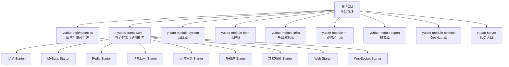
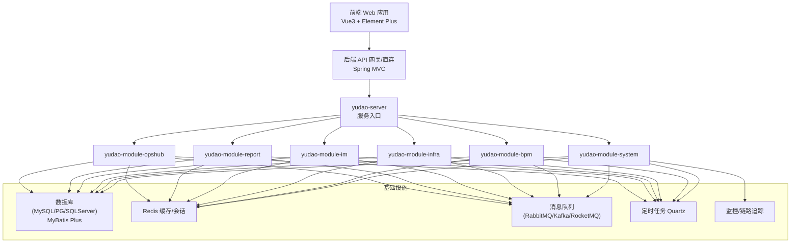
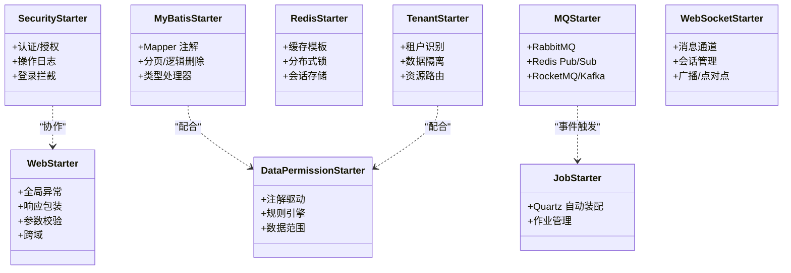
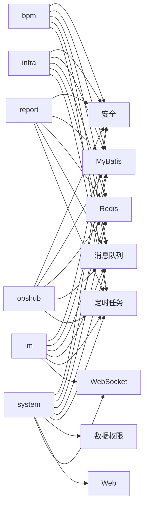
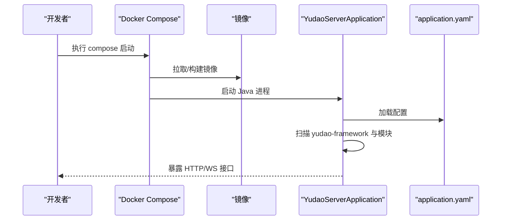
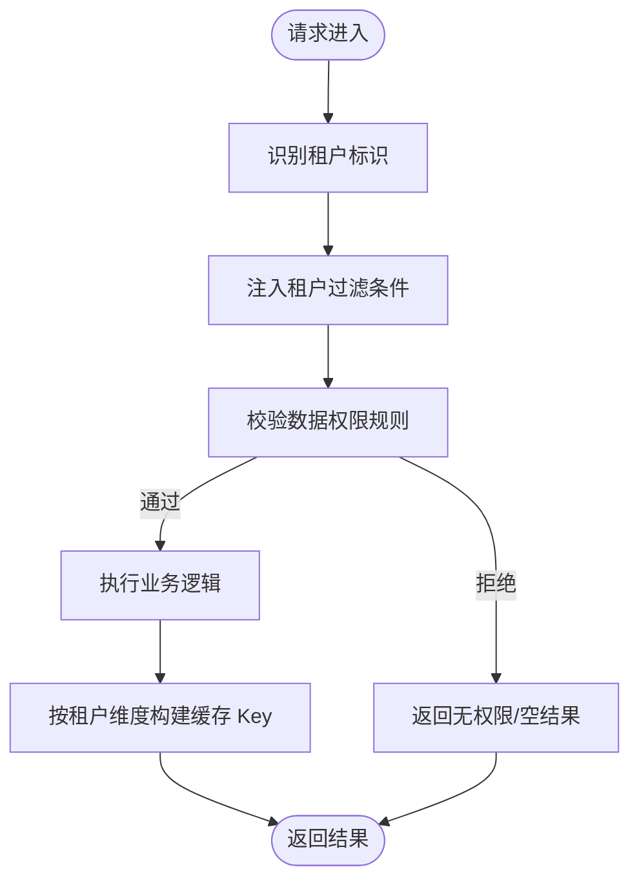
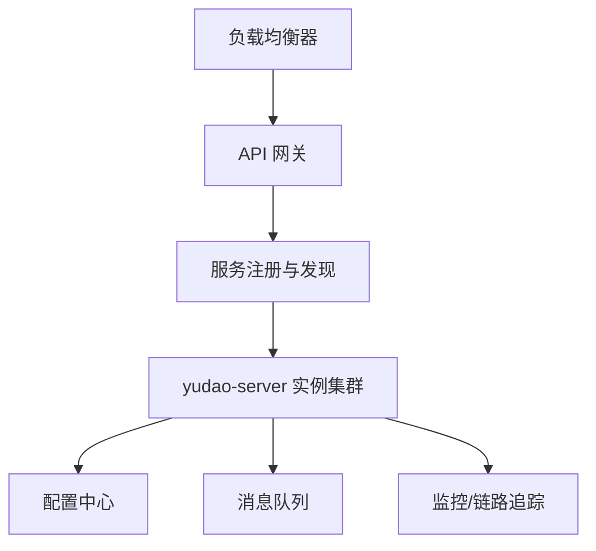
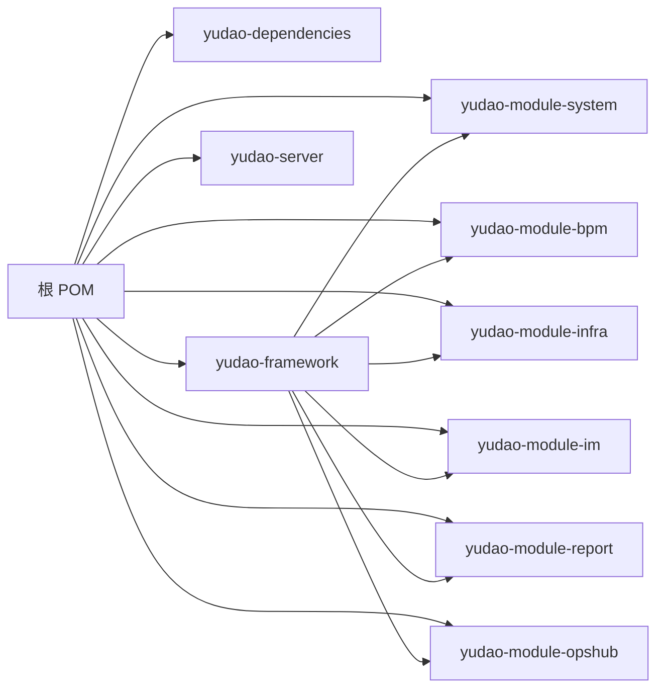

# 系统架构

<cite>
**本文引用的文件**
- [pom.xml](file://pom.xml)
- [yudao-dependencies/pom.xml](file://yudao-dependencies/pom.xml)
- [yudao-framework/pom.xml](file://yudao-framework/pom.xml)
- [yudao-framework/yudao-common/pom.xml](file://yudao-framework/yudao-common/pom.xml)
- [yudao-framework/yudao-spring-boot-starter-security/pom.xml](file://yudao-framework/yudao-spring-boot-starter-security/pom.xml)
- [yudao-framework/yudao-spring-boot-starter-mybatis/pom.xml](file://yudao-framework/yudao-spring-boot-starter-mybatis/pom.xml)
- [yudao-framework/yudao-spring-boot-starter-redis/pom.xml](file://yudao-framework/yudao-spring-boot-starter-redis/pom.xml)
- [yudao-framework/yudao-spring-boot-starter-mq/pom.xml](file://yudao-framework/yudao-spring-boot-starter-mq/pom.xml)
- [yudao-framework/yudao-spring-boot-starter-job/pom.xml](file://yudao-framework/yudao-spring-boot-starter-job/pom.xml)
- [yudao-framework/yudao-spring-boot-starter-biz-tenant/pom.xml](file://yudao-framework/yudao-spring-boot-starter-biz-tenant/pom.xml)
- [yudao-framework/yudao-spring-boot-starter-biz-data-permission/pom.xml](file://yudao-framework/yudao-spring-boot-starter-biz-data-permission/pom.xml)
- [yudao-framework/yudao-spring-boot-starter-web/pom.xml](file://yudao-framework/yudao-spring-boot-starter-web/pom.xml)
- [yudao-framework/yudao-spring-boot-starter-websocket/pom.xml](file://yudao-framework/yudao-spring-boot-starter-websocket/pom.xml)
- [yudao-module-system/pom.xml](file://yudao-module-system/pom.xml)
- [yudao-module-bpm/pom.xml](file://yudao-module-bpm/pom.xml)
- [yudao-module-infra/pom.xml](file://yudao-module-infra/pom.xml)
- [yudao-module-im/pom.xml](file://yudao-module-im/pom.xml)
- [yudao-module-report/pom.xml](file://yudao-module-report/pom.xml)
- [yudao-module-opshub/pom.xml](file://yudao-module-opshub/pom.xml)
- [yudao-server/pom.xml](file://yudao-server/pom.xml)
- [yudao-server/src/main/java/cn/iocoder/yudao/server/YudaoServerApplication.java](file://yudao-server/src/main/java/cn/iocoder/yudao/server/YudaoServerApplication.java)
- [yudao-server/src/main/resources/application.yaml](file://yudao-server/src/main/resources/application.yaml)
- [yudao-server/Dockerfile](file://yudao-server/Dockerfile)
- [script/docker/docker-compose.yml](file://script/docker/docker-compose.yml)
- [script/docker/docker.env](file://script/docker/docker.env)
- [README.md](file://README.md)
- [STARTUP.md](file://STARTUP.md)
</cite>

## 目录
1. [引言](#引言)
2. [项目结构](#项目结构)
3. [核心组件](#核心组件)
4. [架构总览](#架构总览)
5. [详细组件分析](#详细组件分析)
6. [依赖分析](#依赖分析)
7. [性能考虑](#性能考虑)
8. [故障排查指南](#故障排查指南)
9. [结论](#结论)
10. [附录](#附录)

## 引言
本文件面向芋道 Ruoyi-Vue-Pro 的系统架构文档，聚焦于前后端分离的微服务架构模式、模块化设计与分层架构实现，系统采用 Spring Boot 多模块工程组织，围绕 yudao-framework 核心框架、yudao-module-* 业务模块以及 yudao-server 服务入口展开，形成可扩展、可治理、可演进的企业级 SaaS 平台骨架。本文同时阐述技术选型的架构考量（如 Spring Security 安全、MyBatis Plus 数据访问、Redis 缓存、消息队列集成等），并给出多租户架构设计要点、分布式部署与微服务治理要素，辅以架构图与组件交互图，帮助开发者快速理解系统设计思路与扩展点。

## 项目结构
项目采用 Maven 多模块聚合结构，顶层 pom 聚合 yudao-dependencies、yudao-framework、yudao-module-* 业务模块与 yudao-server 服务入口；yudao-dependencies 统一版本与依赖管理；yudao-framework 提供通用能力与基础设施；yudao-module-* 按领域划分业务模块；yudao-server 作为统一服务入口启动器。

图表来源
- [pom.xml](file://pom.xml)
- [yudao-dependencies/pom.xml](file://yudao-dependencies/pom.xml)
- [yudao-framework/pom.xml](file://yudao-framework/pom.xml)
- [yudao-module-system/pom.xml](file://yudao-module-system/pom.xml)
- [yudao-module-bpm/pom.xml](file://yudao-module-bpm/pom.xml)
- [yudao-module-infra/pom.xml](file://yudao-module-infra/pom.xml)
- [yudao-module-im/pom.xml](file://yudao-module-im/pom.xml)
- [yudao-module-report/pom.xml](file://yudao-module-report/pom.xml)
- [yudao-module-opshub/pom.xml](file://yudao-module-opshub/pom.xml)
- [yudao-server/pom.xml](file://yudao-server/pom.xml)

章节来源
- [pom.xml](file://pom.xml)
- [yudao-dependencies/pom.xml](file://yudao-dependencies/pom.xml)
- [yudao-framework/pom.xml](file://yudao-framework/pom.xml)
- [yudao-server/pom.xml](file://yudao-server/pom.xml)

## 核心组件
- yudao-framework：提供通用能力与基础设施，包含安全、数据访问、缓存、消息队列、定时任务、多租户、数据权限、Web、WebSocket 等 Starter，支撑上层业务模块复用与一致性。
- yudao-module-*：按领域拆分的业务模块，每个模块独立开发、独立打包，通过 API 层暴露能力，内部遵循 Controller/Service/DAL 分层。
- yudao-server：统一的服务入口，聚合所有业务模块并对外提供 HTTP/WS 接口，负责应用启动、配置加载与容器编排。
- yudao-dependencies：集中管理版本号与依赖坐标，确保多模块一致性与可维护性。

章节来源
- [yudao-framework/pom.xml](file://yudao-framework/pom.xml)
- [yudao-module-system/pom.xml](file://yudao-module-system/pom.xml)
- [yudao-module-bpm/pom.xml](file://yudao-module-bpm/pom.xml)
- [yudao-module-infra/pom.xml](file://yudao-module-infra/pom.xml)
- [yudao-module-im/pom.xml](file://yudao-module-im/pom.xml)
- [yudao-module-report/pom.xml](file://yudao-module-report/pom.xml)
- [yudao-module-opshub/pom.xml](file://yudao-module-opshub/pom.xml)
- [yudao-server/pom.xml](file://yudao-server/pom.xml)

## 架构总览
系统采用“前后端分离 + 微服务 + 多租户 + 分布式”的企业级架构。前端基于 Vue3 生态，后端以 Spring Boot 多模块为核心，通过 yudao-server 统一对外提供 REST/WS 接口；yudao-framework 抽象出横切能力，yudao-module-* 实现业务域解耦；数据库采用 MyBatis Plus 访问，Redis 提供缓存与会话存储，消息队列用于异步解耦，定时任务支撑周期性作业；多租户通过租户维度隔离与权限控制保障 SaaS 场景下的数据与资源安全。

图表来源
- [yudao-server/src/main/java/cn/iocoder/yudao/server/YudaoServerApplication.java](file://yudao-server/src/main/java/cn/iocoder/yudao/server/YudaoServerApplication.java)
- [yudao-framework/yudao-spring-boot-starter-mybatis/pom.xml](file://yudao-framework/yudao-spring-boot-starter-mybatis/pom.xml)
- [yudao-framework/yudao-spring-boot-starter-redis/pom.xml](file://yudao-framework/yudao-spring-boot-starter-redis/pom.xml)
- [yudao-framework/yudao-spring-boot-starter-mq/pom.xml](file://yudao-framework/yudao-spring-boot-starter-mq/pom.xml)
- [yudao-framework/yudao-spring-boot-starter-job/pom.xml](file://yudao-framework/yudao-spring-boot-starter-job/pom.xml)
- [yudao-framework/yudao-spring-boot-starter-monitor/pom.xml](file://yudao-framework/yudao-spring-boot-starter-monitor/pom.xml)

## 详细组件分析

### yudao-framework 核心框架
- 职责边界：提供横切能力与通用抽象，避免业务重复造轮子，保证一致的安全、数据访问、缓存、消息、任务、多租户、数据权限、Web、WebSocket 等能力。
- 关键 Starter 与技术选型：
  - 安全：Spring Security 与操作日志、登录认证、权限拦截等能力。
  - 数据访问：MyBatis Plus，支持主从/读写分离、分页、逻辑删除、类型处理器等。
  - 缓存：Redis，提供序列化、模板封装、分布式锁、会话存储等。
  - 消息队列：对 RabbitMQ、Redis Pub/Sub、RocketMQ/Kafka 的适配与自动装配。
  - 定时任务：Quartz 自动装配与作业管理。
  - 多租户：租户维度识别、数据隔离、资源路由。
  - 数据权限：基于注解与规则的数据范围控制。
  - Web：全局异常、响应包装、跨域、参数校验、文档生成等。
  - WebSocket：消息通道、会话管理、广播/点对点推送。
- 设计原则：高内聚低耦合、可插拔、可配置、可扩展。

图表来源
- [yudao-framework/yudao-spring-boot-starter-security/pom.xml](file://yudao-framework/yudao-spring-boot-starter-security/pom.xml)
- [yudao-framework/yudao-spring-boot-starter-mybatis/pom.xml](file://yudao-framework/yudao-spring-boot-starter-mybatis/pom.xml)
- [yudao-framework/yudao-spring-boot-starter-redis/pom.xml](file://yudao-framework/yudao-spring-boot-starter-redis/pom.xml)
- [yudao-framework/yudao-spring-boot-starter-mq/pom.xml](file://yudao-framework/yudao-spring-boot-starter-mq/pom.xml)
- [yudao-framework/yudao-spring-boot-starter-job/pom.xml](file://yudao-framework/yudao-spring-boot-starter-job/pom.xml)
- [yudao-framework/yudao-spring-boot-starter-biz-tenant/pom.xml](file://yudao-framework/yudao-spring-boot-starter-biz-tenant/pom.xml)
- [yudao-framework/yudao-spring-boot-starter-biz-data-permission/pom.xml](file://yudao-framework/yudao-spring-boot-starter-biz-data-permission/pom.xml)
- [yudao-framework/yudao-spring-boot-starter-web/pom.xml](file://yudao-framework/yudao-spring-boot-starter-web/pom.xml)
- [yudao-framework/yudao-spring-boot-starter-websocket/pom.xml](file://yudao-framework/yudao-spring-boot-starter-websocket/pom.xml)

章节来源
- [yudao-framework/pom.xml](file://yudao-framework/pom.xml)
- [yudao-framework/yudao-spring-boot-starter-security/pom.xml](file://yudao-framework/yudao-spring-boot-starter-security/pom.xml)
- [yudao-framework/yudao-spring-boot-starter-mybatis/pom.xml](file://yudao-framework/yudao-spring-boot-starter-mybatis/pom.xml)
- [yudao-framework/yudao-spring-boot-starter-redis/pom.xml](file://yudao-framework/yudao-spring-boot-starter-redis/pom.xml)
- [yudao-framework/yudao-spring-boot-starter-mq/pom.xml](file://yudao-framework/yudao-spring-boot-starter-mq/pom.xml)
- [yudao-framework/yudao-spring-boot-starter-job/pom.xml](file://yudao-framework/yudao-spring-boot-starter-job/pom.xml)
- [yudao-framework/yudao-spring-boot-starter-biz-tenant/pom.xml](file://yudao-framework/yudao-spring-boot-starter-biz-tenant/pom.xml)
- [yudao-framework/yudao-spring-boot-starter-biz-data-permission/pom.xml](file://yudao-framework/yudao-spring-boot-starter-biz-data-permission/pom.xml)
- [yudao-framework/yudao-spring-boot-starter-web/pom.xml](file://yudao-framework/yudao-spring-boot-starter-web/pom.xml)
- [yudao-framework/yudao-spring-boot-starter-websocket/pom.xml](file://yudao-framework/yudao-spring-boot-starter-websocket/pom.xml)

### yudao-module-* 业务模块
- 模块化设计原则：按业务域划分，模块内聚、模块间低耦合；通过 API 层暴露接口，避免直接跨模块依赖；DAL 层与 Service 层清晰分离。
- 典型模块职责：
  - system：用户、角色、菜单、字典、部门、操作日志、短信、OAuth2 登录等系统基础能力。
  - bpm：流程定义、流程实例、任务管理、消息通知等工作流能力。
  - infra：代码生成、文件存储、数据源配置、定时任务、API 访问日志等基础设施。
  - im：消息、好友、群组、频道、音视频通话、敏感词等即时通讯能力。
  - report：报表集成（如 GoView）、数据可视化等。
  - opshub：OpsHub 经销商管理、客服 SaaS 能力。
- 依赖关系：各模块依赖 yudao-framework 的通用能力，彼此不直接依赖，通过 API 与事件进行协作。

图表来源
- [yudao-module-system/pom.xml](file://yudao-module-system/pom.xml)
- [yudao-module-bpm/pom.xml](file://yudao-module-bpm/pom.xml)
- [yudao-module-infra/pom.xml](file://yudao-module-infra/pom.xml)
- [yudao-module-im/pom.xml](file://yudao-module-im/pom.xml)
- [yudao-module-report/pom.xml](file://yudao-module-report/pom.xml)
- [yudao-module-opshub/pom.xml](file://yudao-module-opshub/pom.xml)
- [yudao-framework/pom.xml](file://yudao-framework/pom.xml)

章节来源
- [yudao-module-system/pom.xml](file://yudao-module-system/pom.xml)
- [yudao-module-bpm/pom.xml](file://yudao-module-bpm/pom.xml)
- [yudao-module-infra/pom.xml](file://yudao-module-infra/pom.xml)
- [yudao-module-im/pom.xml](file://yudao-module-im/pom.xml)
- [yudao-module-report/pom.xml](file://yudao-module-report/pom.xml)
- [yudao-module-opshub/pom.xml](file://yudao-module-opshub/pom.xml)

### yudao-server 服务入口
- 启动类：YudaoServerApplication 负责应用上下文加载与模块扫描。
- 配置：application.yaml 提供环境化配置，支持 dev/local 等 profile 切换。
- 容器化：Dockerfile 提供镜像构建；docker-compose.yml 与 docker.env 支持本地/预发一键拉起。
- 控制流：启动时加载 yudao-framework 与各 yudao-module-*，注册控制器与服务 Bean，对外提供 HTTP/WS 接口。

图表来源
- [yudao-server/src/main/java/cn/iocoder/yudao/server/YudaoServerApplication.java](file://yudao-server/src/main/java/cn/iocoder/yudao/server/YudaoServerApplication.java)
- [yudao-server/src/main/resources/application.yaml](file://yudao-server/src/main/resources/application.yaml)
- [yudao-server/Dockerfile](file://yudao-server/Dockerfile)
- [script/docker/docker-compose.yml](file://script/docker/docker-compose.yml)
- [script/docker/docker.env](file://script/docker/docker.env)

章节来源
- [yudao-server/src/main/java/cn/iocoder/yudao/server/YudaoServerApplication.java](file://yudao-server/src/main/java/cn/iocoder/yudao/server/YudaoServerApplication.java)
- [yudao-server/src/main/resources/application.yaml](file://yudao-server/src/main/resources/application.yaml)
- [yudao-server/Dockerfile](file://yudao-server/Dockerfile)
- [script/docker/docker-compose.yml](file://script/docker/docker-compose.yml)
- [script/docker/docker.env](file://script/docker/docker.env)

### 多租户架构设计
- 数据隔离：通过租户维度在查询/写入时自动注入过滤条件，结合数据库层面的 Schema/表前缀/字段隔离策略，确保租户间数据不可见。
- 权限控制：结合角色与数据权限规则，限制用户可见的数据范围，防止越权访问。
- 资源配置：不同租户共享应用实例，但拥有独立的缓存命名空间、消息分区或队列，避免资源冲突。
- 扩展点：租户识别可通过 Header/租户切换接口实现，租户维度的开关与白名单可在配置中心动态下发。

图表来源
- [yudao-framework/yudao-spring-boot-starter-biz-tenant/pom.xml](file://yudao-framework/yudao-spring-boot-starter-biz-tenant/pom.xml)
- [yudao-framework/yudao-spring-boot-starter-biz-data-permission/pom.xml](file://yudao-framework/yudao-spring-boot-starter-biz-data-permission/pom.xml)
- [yudao-framework/yudao-spring-boot-starter-redis/pom.xml](file://yudao-framework/yudao-spring-boot-starter-redis/pom.xml)

章节来源
- [yudao-framework/yudao-spring-boot-starter-biz-tenant/pom.xml](file://yudao-framework/yudao-spring-boot-starter-biz-tenant/pom.xml)
- [yudao-framework/yudao-spring-boot-starter-biz-data-permission/pom.xml](file://yudao-framework/yudao-spring-boot-starter-biz-data-permission/pom.xml)
- [yudao-framework/yudao-spring-boot-starter-redis/pom.xml](file://yudao-framework/yudao-spring-boot-starter-redis/pom.xml)

### 分布式部署与微服务治理
- 负载均衡：通过 Nginx 或云负载均衡器对 yudao-server 实例进行流量分发。
- 服务发现：可选 Consul/Nacos/Eureka，用于服务注册与健康检查。
- 配置中心：Nacos/Consul/本地配置，支持灰度发布与动态刷新。
- 网关：Gateway/Ingress 统一接入，鉴权、限流、路由、熔断。
- 监控与链路追踪：Actuator + SkyWalking/Spring Cloud Sleuth，结合告警平台。
- 消息队列：RabbitMQ/Redis Pub/Sub/Kafka/RocketMQ，实现异步解耦与削峰填谷。
- 容器化：Docker + Kubernetes，支持水平扩展与滚动更新。

图表来源
- [yudao-server/src/main/resources/application.yaml](file://yudao-server/src/main/resources/application.yaml)
- [yudao-framework/yudao-spring-boot-starter-mq/pom.xml](file://yudao-framework/yudao-spring-boot-starter-mq/pom.xml)
- [yudao-framework/yudao-spring-boot-starter-monitor/pom.xml](file://yudao-framework/yudao-spring-boot-starter-monitor/pom.xml)

章节来源
- [yudao-server/src/main/resources/application.yaml](file://yudao-server/src/main/resources/application.yaml)
- [yudao-framework/yudao-spring-boot-starter-mq/pom.xml](file://yudao-framework/yudao-spring-boot-starter-mq/pom.xml)
- [yudao-framework/yudao-spring-boot-starter-monitor/pom.xml](file://yudao-framework/yudao-spring-boot-starter-monitor/pom.xml)

## 依赖分析
- 耦合与内聚：yudao-framework 作为高内聚的基础设施层，向上提供稳定契约；yudao-module-* 保持低耦合，仅依赖框架与必要的 API。
- 直接与间接依赖：模块间通过 API 与事件通信，避免直接 DAL 依赖；公共依赖集中在 yudao-dependencies。
- 外部依赖：数据库、缓存、消息队列、调度、监控等均通过 Starter 自动装配，降低侵入性与学习成本。

图表来源
- [pom.xml](file://pom.xml)
- [yudao-dependencies/pom.xml](file://yudao-dependencies/pom.xml)
- [yudao-framework/pom.xml](file://yudao-framework/pom.xml)
- [yudao-module-system/pom.xml](file://yudao-module-system/pom.xml)
- [yudao-module-bpm/pom.xml](file://yudao-module-bpm/pom.xml)
- [yudao-module-infra/pom.xml](file://yudao-module-infra/pom.xml)
- [yudao-module-im/pom.xml](file://yudao-module-im/pom.xml)
- [yudao-module-report/pom.xml](file://yudao-module-report/pom.xml)
- [yudao-module-opshub/pom.xml](file://yudao-module-opshub/pom.xml)
- [yudao-server/pom.xml](file://yudao-server/pom.xml)

章节来源
- [pom.xml](file://pom.xml)
- [yudao-dependencies/pom.xml](file://yudao-dependencies/pom.xml)
- [yudao-framework/pom.xml](file://yudao-framework/pom.xml)
- [yudao-server/pom.xml](file://yudao-server/pom.xml)

## 性能考虑
- 数据访问：MyBatis Plus 分页与逻辑删除减少无效查询；合理索引与 SQL 优化；读写分离与只读副本提升查询吞吐。
- 缓存策略：热点数据走 Redis，设置合理过期时间与淘汰策略；分布式锁避免缓存击穿；批量操作与流水线命令降低 RTT。
- 消息队列：异步化高频操作，削峰填谷；幂等设计与死信队列处理异常；分区与并发消费提升吞吐。
- 并发与限流：网关层限流与熔断，服务内线程池隔离；热点接口缓存与降级预案。
- 监控与诊断：埋点与链路追踪定位瓶颈；慢查询与 GC 分析持续优化。

## 故障排查指南
- 启动失败：检查 application.yaml 配置项、数据库连接、Redis 可用性、消息中间件连通性。
- 权限问题：核对租户识别是否正确、数据权限规则是否匹配、角色与菜单授权是否生效。
- 缓存异常：确认 Key 命名规范、过期策略、序列化方式；排查缓存穿透与雪崩。
- 消息积压：检查消费者并发、重试策略、死信队列；评估生产者限速与削峰。
- 性能抖动：采集慢链路、CPU/GC、数据库慢 SQL、缓存命中率与队列长度。

章节来源
- [yudao-server/src/main/resources/application.yaml](file://yudao-server/src/main/resources/application.yaml)
- [yudao-framework/yudao-spring-boot-starter-biz-tenant/pom.xml](file://yudao-framework/yudao-spring-boot-starter-biz-tenant/pom.xml)
- [yudao-framework/yudao-spring-boot-starter-biz-data-permission/pom.xml](file://yudao-framework/yudao-spring-boot-starter-biz-data-permission/pom.xml)
- [yudao-framework/yudao-spring-boot-starter-redis/pom.xml](file://yudao-framework/yudao-spring-boot-starter-redis/pom.xml)
- [yudao-framework/yudao-spring-boot-starter-mq/pom.xml](file://yudao-framework/yudao-spring-boot-starter-mq/pom.xml)

## 结论
本架构以 yudao-framework 为核心，通过 yudao-module-* 实现业务域解耦，yudao-server 提供统一入口与运行时环境，结合多租户、分布式与微服务治理能力，满足企业级 SaaS 平台对扩展性、稳定性与可运维性的要求。建议在落地过程中优先完善配置中心、服务治理与可观测性体系，并持续以模块化与自动化手段提升交付效率。

## 附录
- 快速启动：参考 README 与 STARTUP 文档，使用 docker-compose 一键拉起本地环境。
- 版本与依赖：通过 yudao-dependencies 统一管理，确保多模块一致性。
- 前端生态：Vue3 + Element Plus，按模块化页面与 API 调用对接后端。

章节来源
- [README.md](file://README.md)
- [STARTUP.md](file://STARTUP.md)
- [yudao-dependencies/pom.xml](file://yudao-dependencies/pom.xml)