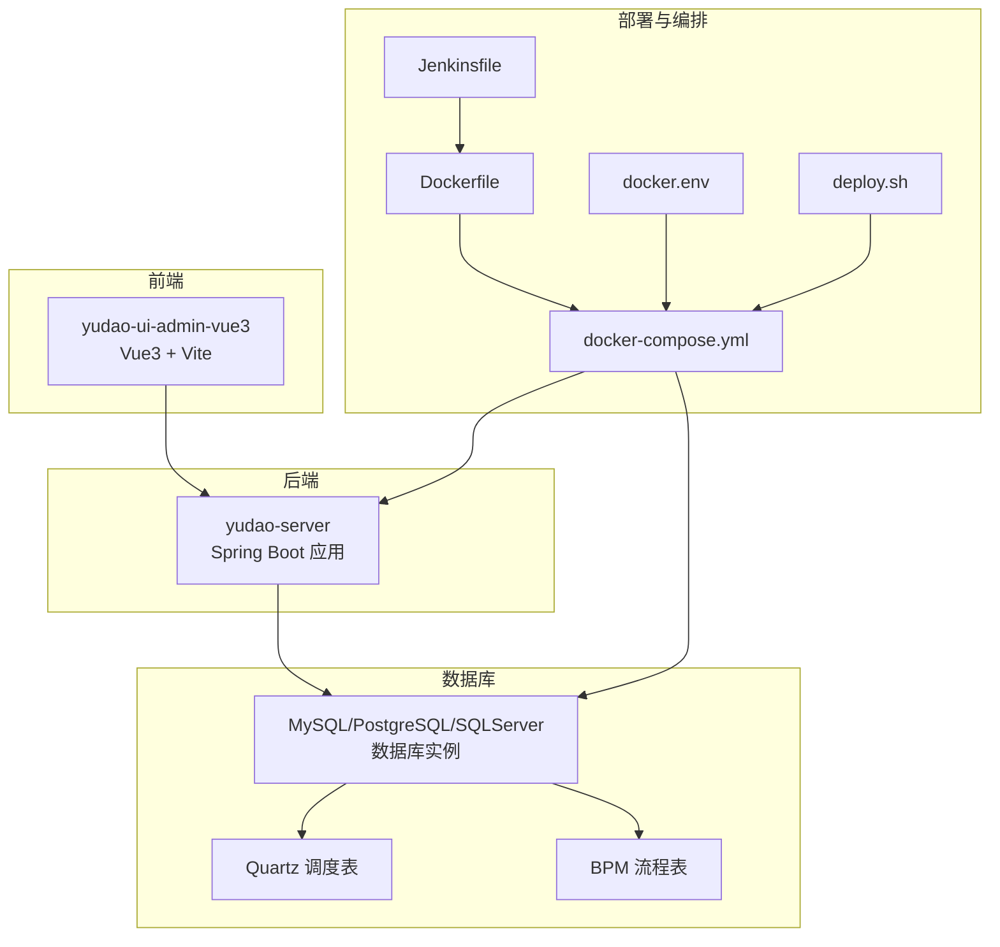
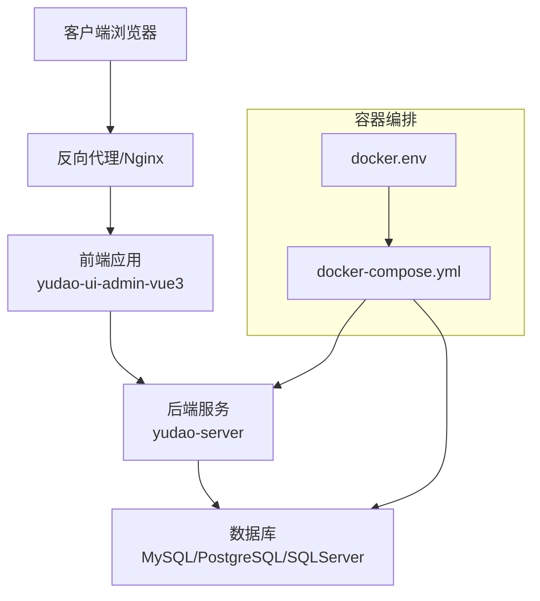
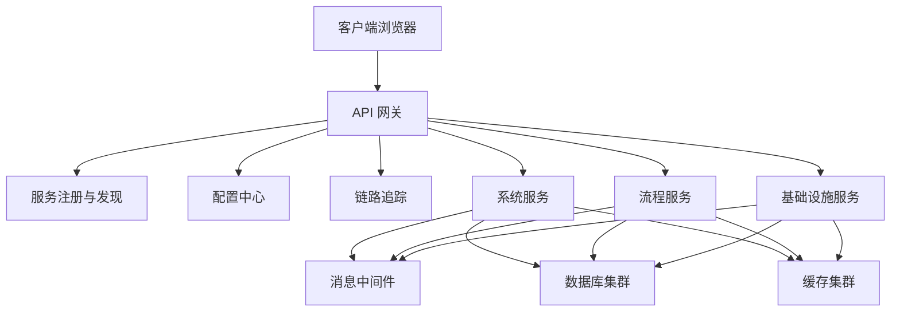
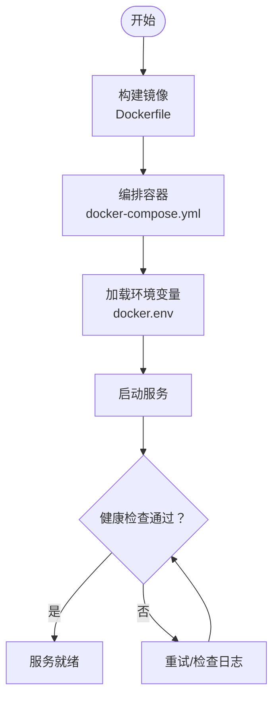
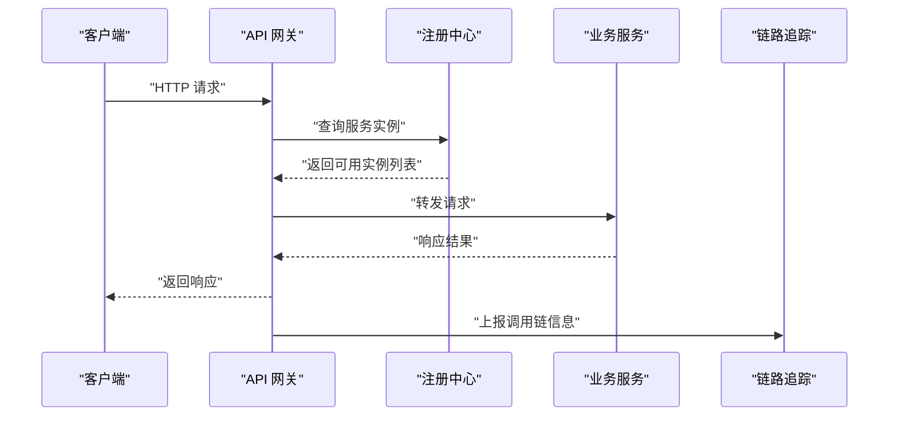
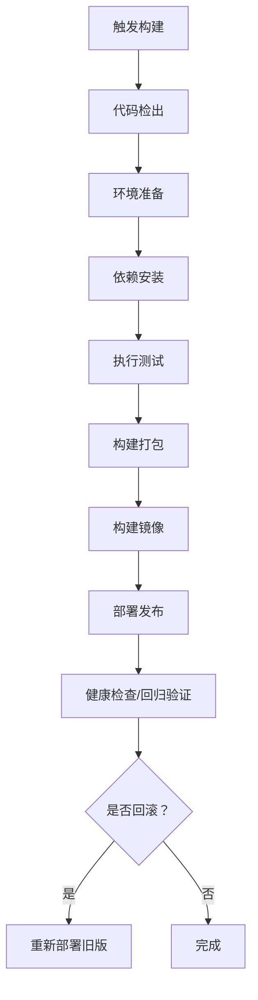
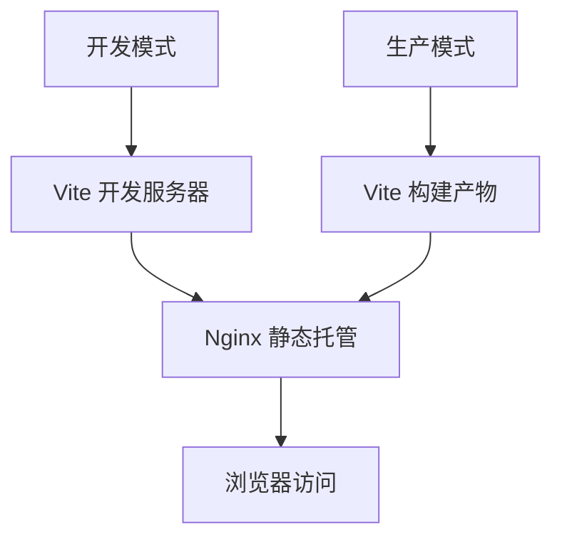
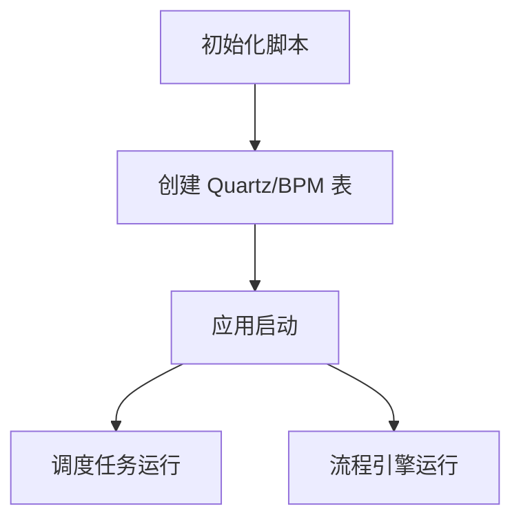
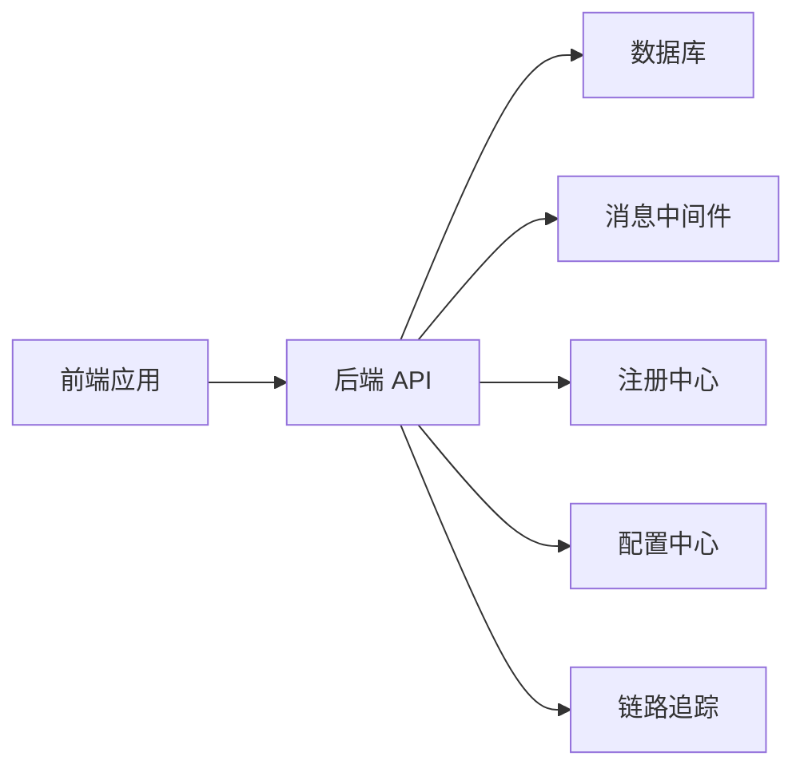

# 部署架构

<cite>
**本文引用的文件**
- [yudao-server/Dockerfile](file://yudao-server/Dockerfile)
- [script/docker/docker-compose.yml](file://script/docker/docker-compose.yml)
- [script/docker/docker.env](file://script/docker/docker.env)
- [script/docker/Docker-HOWTO.md](file://script/docker/Docker-HOWTO.md)
- [script/jenkins/Jenkinsfile](file://script/jenkins/Jenkinsfile)
- [yudao-server/src/main/resources/application.yaml](file://yudao-server/src/main/resources/application.yaml)
- [yudao-server/src/main/resources/application-dev.yaml](file://yudao-server/src/main/resources/application-dev.yaml)
- [yudao-server/src/main/resources/application-local.yaml](file://yudao-server/src/main/resources/application-local.yaml)
- [yudao-ui/yudao-ui-admin-vue3/vite.config.ts](file://yudao-ui/yudao-ui-admin-vue3/vite.config.ts)
- [yudao-ui/yudao-ui-admin-vue3/package.json](file://yudao-ui/yudao-ui-admin-vue3/package.json)
- [yudao-ui/yudao-ui-admin-vue3/index.html](file://yudao-ui/yudao-ui-admin-vue3/index.html)
- [sql/mysql/bpm.sql](file://sql/mysql/bpm.sql)
- [sql/mysql/quartz.sql](file://sql/mysql/quartz.sql)
- [sql/tools/docker-compose.yaml](file://sql/tools/docker-compose.yaml)
</cite>

## 目录
1. [引言](#引言)
2. [项目结构](#项目结构)
3. [核心组件](#核心组件)
4. [架构总览](#架构总览)
5. [详细组件分析](#详细组件分析)
6. [依赖关系分析](#依赖关系分析)
7. [性能考虑](#性能考虑)
8. [故障排查指南](#故障排查指南)
9. [结论](#结论)
10. [附录](#附录)

## 引言
本文件面向芋道 Ruoyi-Vue-Pro 的部署与运维团队，系统性阐述项目的部署架构设计，覆盖单体部署与分布式部署两种模式；详述 Docker 容器化方案（含 Dockerfile 构建、docker-compose 编排、环境变量配置）；介绍微服务治理要素（服务注册发现、负载均衡、配置中心、链路追踪等）；并给出 CI/CD 流水线设计（基于 Jenkins 自动化构建、测试集成与部署发布）。文末提供部署架构图与部署拓扑图，帮助读者在不同业务规模下快速选择合适的部署策略。

## 项目结构
从部署视角看，项目主要由以下部分组成：
- 后端服务：yudao-server（Spring Boot 应用），负责业务接口与数据访问。
- 前端应用：yudao-ui-admin-vue3（Vue3 + Vite），负责用户界面与交互。
- 部署脚本与编排：script/docker（Dockerfile、docker-compose、环境变量）、script/jenkins（Jenkinsfile）、script/shell（deploy.sh）。
- 数据库脚本：sql/mysql（包含 BPM、Quartz 等初始化脚本）。
- SQL 工具：sql/tools/docker-compose.yaml（数据库等基础设施编排）。

图表来源
- [yudao-server/Dockerfile](file://yudao-server/Dockerfile)
- [script/docker/docker-compose.yml](file://script/docker/docker-compose.yml)
- [script/docker/docker.env](file://script/docker/docker.env)
- [script/jenkins/Jenkinsfile](file://script/jenkins/Jenkinsfile)
- [yudao-ui/yudao-ui-admin-vue3/vite.config.ts](file://yudao-ui/yudao-ui-admin-vue3/vite.config.ts)

章节来源
- [yudao-server/Dockerfile](file://yudao-server/Dockerfile)
- [script/docker/docker-compose.yml](file://script/docker/docker-compose.yml)
- [script/docker/docker.env](file://script/docker/docker.env)
- [script/jenkins/Jenkinsfile](file://script/jenkins/Jenkinsfile)
- [yudao-ui/yudao-ui-admin-vue3/vite.config.ts](file://yudao-ui/yudao-ui-admin-vue3/vite.config.ts)

## 核心组件
- 后端服务（yudao-server）
  - 使用 Spring Boot 打包运行，支持多环境配置（application.yaml、application-dev.yaml、application-local.yaml）。
  - 提供统一的 API 接口，承载业务逻辑与数据访问。
- 前端应用（yudao-ui-admin-vue3）
  - 基于 Vue3 + Vite 构建，通过 Vite 配置进行开发与生产构建。
  - 通过 axios 服务与后端交互，支持国际化与主题配置。
- 数据库与调度
  - 支持 MySQL/PostgreSQL/SQLServer 等数据库，包含 Quartz 调度与 BPM 流程初始化脚本。
- 容器化与编排
  - Dockerfile 定义镜像构建过程；docker-compose.yml 统一编排后端与数据库；docker.env 提供环境变量。
- CI/CD 流水线
  - Jenkinsfile 描述自动化构建、测试与部署流程；deploy.sh 提供本地部署脚本。

章节来源
- [yudao-server/src/main/resources/application.yaml](file://yudao-server/src/main/resources/application.yaml)
- [yudao-server/src/main/resources/application-dev.yaml](file://yudao-server/src/main/resources/application-dev.yaml)
- [yudao-server/src/main/resources/application-local.yaml](file://yudao-server/src/main/resources/application-local.yaml)
- [yudao-ui/yudao-ui-admin-vue3/vite.config.ts](file://yudao-ui/yudao-ui-admin-vue3/vite.config.ts)
- [yudao-ui/yudao-ui-admin-vue3/package.json](file://yudao-ui/yudao-ui-admin-vue3/package.json)
- [yudao-ui/yudao-ui-admin-vue3/index.html](file://yudao-ui/yudao-ui-admin-vue3/index.html)
- [sql/mysql/quartz.sql](file://sql/mysql/quartz.sql)
- [sql/mysql/bpm.sql](file://sql/mysql/bpm.sql)
- [script/docker/docker-compose.yml](file://script/docker/docker-compose.yml)
- [script/docker/docker.env](file://script/docker/docker.env)
- [script/jenkins/Jenkinsfile](file://script/jenkins/Jenkinsfile)
- [script/shell/deploy.sh](file://script/shell/deploy.sh)

## 架构总览
本节给出两种部署模式的总体架构视图，并标注关键组件与交互路径。

### 单体部署模式
- 特点：后端与数据库在同一容器或同一主机上运行，适合开发、测试与小规模生产。
- 关键组件：后端服务容器、数据库容器、可选的 Nginx 反向代理（用于静态资源与 HTTPS）。
- 适用场景：演示环境、小型团队、低并发场景。

图表来源
- [script/docker/docker-compose.yml](file://script/docker/docker-compose.yml)
- [script/docker/docker.env](file://script/docker/docker.env)
- [yudao-ui/yudao-ui-admin-vue3/index.html](file://yudao-ui/yudao-ui-admin-vue3/index.html)
- [yudao-server/Dockerfile](file://yudao-server/Dockerfile)

### 分布式部署模式
- 特点：后端按模块拆分（如系统模块、流程模块、基础设施模块等），配合注册中心、网关、配置中心与链路追踪实现微服务治理。
- 关键组件：服务注册与发现（如 Nacos/Eureka）、API 网关（Spring Cloud Gateway）、配置中心（Nacos）、链路追踪（SkyWalking）、消息中间件（RabbitMQ/Redis Streams）、数据库与缓存集群。
- 适用场景：中大型企业级应用、高并发与高可用要求。

图表来源
- [yudao-server/src/main/resources/application.yaml](file://yudao-server/src/main/resources/application.yaml)
- [yudao-framework/yudao-spring-boot-starter-monitor/pom.xml](file://yudao-framework/yudao-spring-boot-starter-monitor/pom.xml)
- [yudao-framework/yudao-spring-boot-starter-mq/pom.xml](file://yudao-framework/yudao-spring-boot-starter-mq/pom.xml)

## 详细组件分析

### Docker 容器化部署
- Dockerfile 构建
  - 定义基础镜像、工作目录、复制产物、暴露端口与启动命令，确保后端服务可直接运行。
- docker-compose 编排
  - 统一编排后端服务容器与数据库容器，定义网络、卷与健康检查。
- 环境变量配置
  - 通过 docker.env 设置数据库连接、日志级别、服务端口等参数，便于不同环境切换。

图表来源
- [yudao-server/Dockerfile](file://yudao-server/Dockerfile)
- [script/docker/docker-compose.yml](file://script/docker/docker-compose.yml)
- [script/docker/docker.env](file://script/docker/docker.env)

章节来源
- [yudao-server/Dockerfile](file://yudao-server/Dockerfile)
- [script/docker/docker-compose.yml](file://script/docker/docker-compose.yml)
- [script/docker/docker.env](file://script/docker/docker.env)
- [script/docker/Docker-HOWTO.md](file://script/docker/Docker-HOWTO.md)

### 微服务治理要素
- 服务注册与发现
  - 在分布式模式下，服务通过注册中心自动注册与发现，降低硬编码配置成本。
- 负载均衡
  - 结合网关与注册中心实现请求分发，提升吞吐与可用性。
- 配置中心
  - 将配置集中管理，支持动态刷新与多环境隔离。
- 链路追踪
  - 通过监控与追踪组件定位性能瓶颈与异常路径。

图表来源
- [yudao-server/src/main/resources/application.yaml](file://yudao-server/src/main/resources/application.yaml)
- [yudao-framework/yudao-spring-boot-starter-monitor/pom.xml](file://yudao-framework/yudao-spring-boot-starter-monitor/pom.xml)

章节来源
- [yudao-server/src/main/resources/application.yaml](file://yudao-server/src/main/resources/application.yaml)
- [yudao-framework/yudao-spring-boot-starter-monitor/pom.xml](file://yudao-framework/yudao-spring-boot-starter-monitor/pom.xml)

### CI/CD 流水线设计（Jenkins）
- 触发方式
  - Git 提交、PR 合并或定时构建。
- 步骤概览
  - 代码检出 → 环境准备 → 依赖安装 → 单元测试 → 构建打包 → 镜像构建 → 部署到预发布/生产环境 → 回滚策略。
- 关键点
  - 测试阶段集成单元测试与集成测试；制品管理与版本标签；蓝绿/滚动发布策略。

图表来源
- [script/jenkins/Jenkinsfile](file://script/jenkins/Jenkinsfile)

章节来源
- [script/jenkins/Jenkinsfile](file://script/jenkins/Jenkinsfile)

### 前端构建与部署
- 开发与生产构建
  - 基于 Vite 进行开发服务器与生产打包，支持热更新与代码分割。
- 静态资源部署
  - 生产构建产物可部署至 Nginx 或对象存储，结合 CDN 加速。
- 环境变量
  - 通过环境变量注入 API 地址、站点标题等配置，适配不同环境。

图表来源
- [yudao-ui/yudao-ui-admin-vue3/vite.config.ts](file://yudao-ui/yudao-ui-admin-vue3/vite.config.ts)
- [yudao-ui/yudao-ui-admin-vue3/package.json](file://yudao-ui/yudao-ui-admin-vue3/package.json)
- [yudao-ui/yudao-ui-admin-vue3/index.html](file://yudao-ui/yudao-ui-admin-vue3/index.html)

章节来源
- [yudao-ui/yudao-ui-admin-vue3/vite.config.ts](file://yudao-ui/yudao-ui-admin-vue3/vite.config.ts)
- [yudao-ui/yudao-ui-admin-vue3/package.json](file://yudao-ui/yudao-ui-admin-vue3/package.json)
- [yudao-ui/yudao-ui-admin-vue3/index.html](file://yudao-ui/yudao-ui-admin-vue3/index.html)

### 数据库初始化与运维
- 初始化脚本
  - 包含 Quartz 调度表与 BPM 流程表的初始化 SQL，确保服务启动后具备运行所需的表结构。
- 多数据库支持
  - 提供 MySQL/PostgreSQL/SQLServer 的脚本，满足不同数据库偏好。
- 工具化编排
  - sql/tools/docker-compose.yaml 提供数据库等基础设施的快速搭建。

图表来源
- [sql/mysql/quartz.sql](file://sql/mysql/quartz.sql)
- [sql/mysql/bpm.sql](file://sql/mysql/bpm.sql)
- [sql/tools/docker-compose.yaml](file://sql/tools/docker-compose.yaml)

章节来源
- [sql/mysql/quartz.sql](file://sql/mysql/quartz.sql)
- [sql/mysql/bpm.sql](file://sql/mysql/bpm.sql)
- [sql/tools/docker-compose.yaml](file://sql/tools/docker-compose.yaml)

## 依赖关系分析
- 组件耦合
  - 前端通过 HTTP 与后端交互；后端依赖数据库与消息中间件；分布式模式下进一步依赖注册中心、配置中心与链路追踪。
- 外部依赖
  - Docker、docker-compose、Jenkins、Nginx、数据库与消息中间件等。
- 潜在风险
  - 网络连通性、数据库连接池配置、消息中间件可用性、镜像拉取与版本一致性。

图表来源
- [yudao-ui/yudao-ui-admin-vue3/vite.config.ts](file://yudao-ui/yudao-ui-admin-vue3/vite.config.ts)
- [yudao-server/src/main/resources/application.yaml](file://yudao-server/src/main/resources/application.yaml)
- [yudao-framework/yudao-spring-boot-starter-mq/pom.xml](file://yudao-framework/yudao-spring-boot-starter-mq/pom.xml)
- [yudao-framework/yudao-spring-boot-starter-monitor/pom.xml](file://yudao-framework/yudao-spring-boot-starter-monitor/pom.xml)

章节来源
- [yudao-ui/yudao-ui-admin-vue3/vite.config.ts](file://yudao-ui/yudao-ui-admin-vue3/vite.config.ts)
- [yudao-server/src/main/resources/application.yaml](file://yudao-server/src/main/resources/application.yaml)
- [yudao-framework/yudao-spring-boot-starter-mq/pom.xml](file://yudao-framework/yudao-spring-boot-starter-mq/pom.xml)
- [yudao-framework/yudao-spring-boot-starter-monitor/pom.xml](file://yudao-framework/yudao-spring-boot-starter-monitor/pom.xml)

## 性能考虑
- 前端性能
  - 采用 Vite 构建优化与按需加载；合理设置缓存与 CDN；减少首屏渲染时间。
- 后端性能
  - 合理配置数据库连接池与线程池；开启慢查询与指标监控；对热点接口做缓存与限流。
- 容器与编排
  - 合理设置资源限制与副本数；启用健康检查与优雅停机；使用持久化存储与备份策略。
- 分布式治理
  - 通过注册中心与网关实现流量治理；利用链路追踪定位性能瓶颈；配置中心统一管理配置变更。

## 故障排查指南
- 健康检查失败
  - 检查容器日志与端口占用；确认数据库连接与初始化脚本执行情况。
- 网关路由异常
  - 校验服务注册状态与路由规则；检查配置中心配置是否生效。
- 链路追踪缺失
  - 确认链路追踪组件接入与上报配置；检查采样率与过滤规则。
- CI/CD 失败
  - 查看 Jenkins 构建日志；核对依赖安装与测试报告；确认制品上传与部署脚本。

章节来源
- [script/jenkins/Jenkinsfile](file://script/jenkins/Jenkinsfile)
- [yudao-server/src/main/resources/application.yaml](file://yudao-server/src/main/resources/application.yaml)
- [yudao-framework/yudao-spring-boot-starter-monitor/pom.xml](file://yudao-framework/yudao-spring-boot-starter-monitor/pom.xml)

## 结论
本部署架构文档提供了从单体到分布式、从容器化到微服务治理的完整方案。通过 docker-compose 与环境变量实现快速部署，借助 Jenkins 实现自动化流水线，结合前端 Vite 构建与后端 Spring Boot 配置，满足不同规模与复杂度的业务需求。建议在生产环境中优先采用分布式与微服务治理方案，并配套完善的监控与告警体系。

## 附录
- 快速开始
  - 使用 docker-compose 一键启动后端与数据库；通过 docker.env 调整端口与数据库连接；在浏览器访问前端页面。
- 常见问题
  - 端口冲突：修改 docker.env 中的服务端口；数据库密码不一致：统一数据库凭据；网络不通：检查容器网络与防火墙。
- 扩展建议
  - 引入对象存储与 CDN；增加 WAF 与 HTTPS；完善灰度发布与 A/B 测试能力。