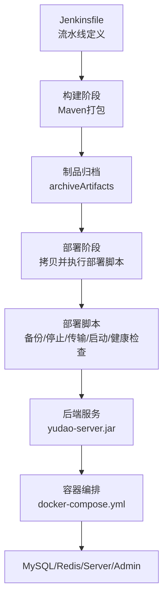
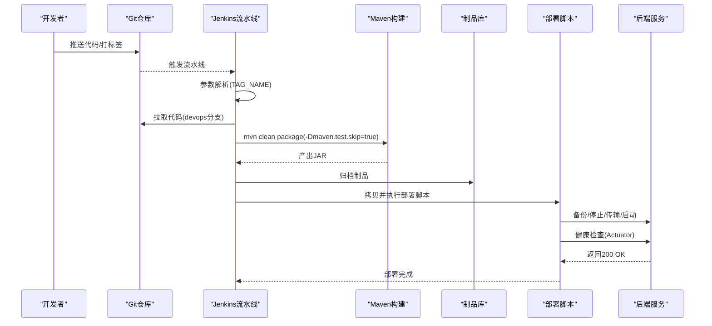
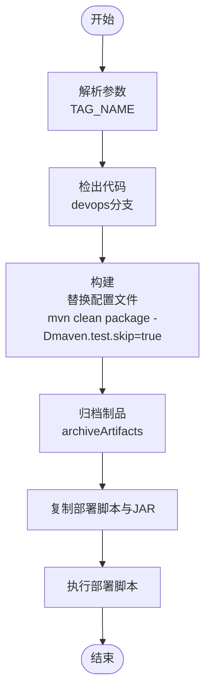
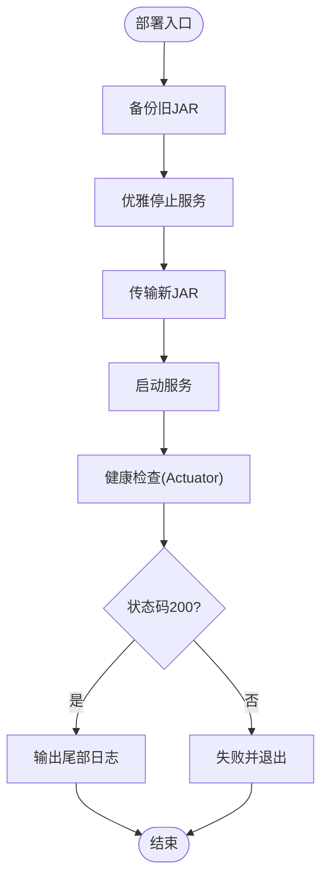
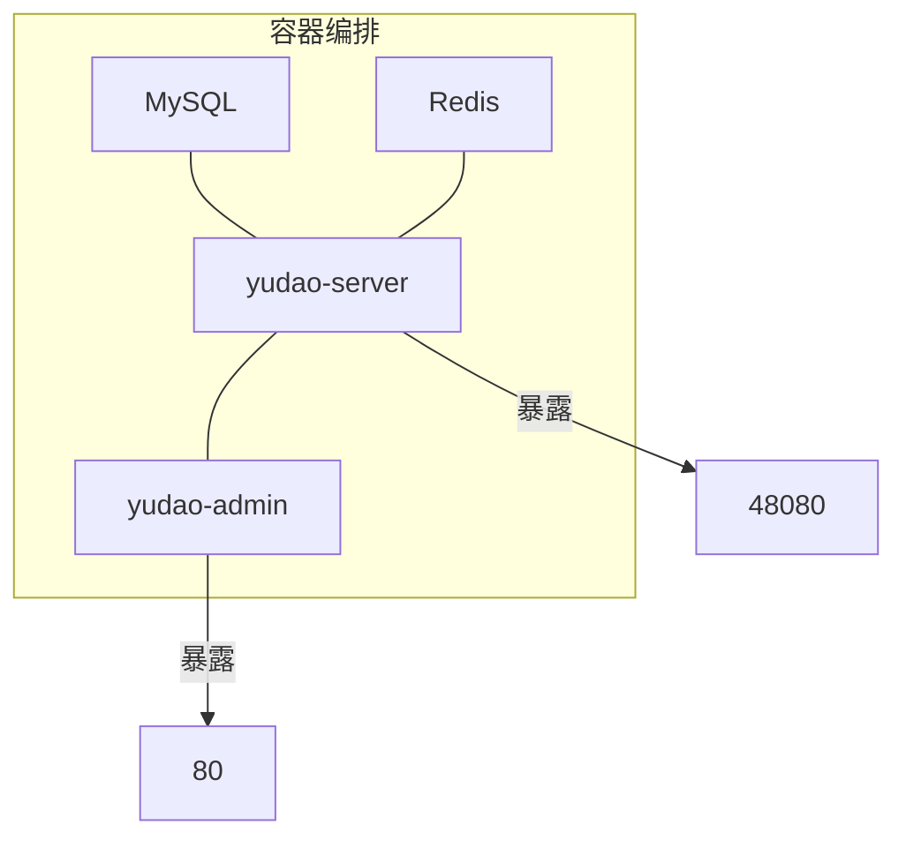
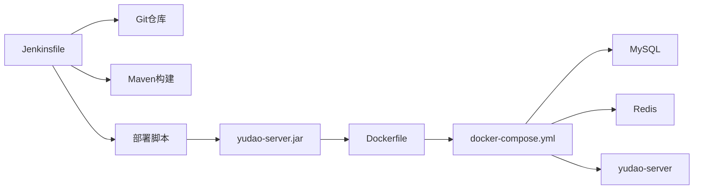

# CI/CD流水线

<cite>
**本文引用的文件**   
- [Jenkinsfile](file://script/jenkins/Jenkinsfile)
- [部署脚本](file://script/shell/deploy.sh)
- [后端Dockerfile](file://yudao-server/Dockerfile)
- [Docker Compose编排](file://script/docker/docker-compose.yml)
- [应用主配置](file://yudao-server/src/main/resources/application.yaml)
- [开发环境配置](file://yudao-server/src/main/resources/application-dev.yaml)
- [本地环境配置](file://yudao-server/src/main/resources/application-local.yaml)
</cite>

## 目录
1. [简介](#简介)
2. [项目结构](#项目结构)
3. [核心组件](#核心组件)
4. [架构总览](#架构总览)
5. [详细组件分析](#详细组件分析)
6. [依赖分析](#依赖分析)
7. [性能考虑](#性能考虑)
8. [故障排查指南](#故障排查指南)
9. [结论](#结论)
10. [附录](#附录)

## 简介
本文件面向芋道 Ruoyi-Vue-Pro 项目，系统化阐述基于 Jenkins 的 CI/CD 流水线设计与实施要点，涵盖：
- Jenkinsfile 流水线定义、构建触发条件、构建参数与阶段划分
- 代码质量检查流程（静态分析、单元测试、覆盖率、安全扫描）
- 多环境部署策略（测试/预发布/生产）与回滚机制
- 版本管理与发布管理（版本号规则、发布分支、变更日志）
- 部署脚本与自动化工具，确保部署标准化与可重复性

## 项目结构
围绕 CI/CD 的关键目录与文件如下：
- 流水线定义：script/jenkins/Jenkinsfile
- 部署脚本：script/shell/deploy.sh
- 后端镜像：yudao-server/Dockerfile
- 本地编排：script/docker/docker-compose.yml
- 应用配置：yudao-server/src/main/resources/application*.yaml

图表来源
- [Jenkinsfile](file://script/jenkins/Jenkinsfile)
- [部署脚本](file://script/shell/deploy.sh)
- [后端Dockerfile](file://yudao-server/Dockerfile)
- [Docker Compose编排](file://script/docker/docker-compose.yml)

章节来源
- [Jenkinsfile](file://script/jenkins/Jenkinsfile)
- [部署脚本](file://script/shell/deploy.sh)
- [后端Dockerfile](file://yudao-server/Dockerfile)
- [Docker Compose编排](file://script/docker/docker-compose.yml)

## 核心组件
- Jenkins 流水线：定义检出、构建、部署三个阶段，支持参数化构建（如 TAG_NAME），并使用凭证 ID 管理镜像仓库、Git 与 Kubernetes 访问凭据。
- Maven 构建：跳过测试执行进行快速构建，便于流水线加速。
- 部署脚本：实现备份、优雅停机、传输新包、启动与健康检查的完整闭环。
- 容器化运行：Dockerfile 固化运行时环境，docker-compose 提供本地联调的多服务编排。

章节来源
- [Jenkinsfile](file://script/jenkins/Jenkinsfile)
- [部署脚本](file://script/shell/deploy.sh)
- [后端Dockerfile](file://yudao-server/Dockerfile)
- [Docker Compose编排](file://script/docker/docker-compose.yml)

## 架构总览
下图展示从代码提交到部署的端到端流程，以及与外部系统的交互（镜像仓库、Git、Kubernetes）：

图表来源
- [Jenkinsfile](file://script/jenkins/Jenkinsfile)
- [部署脚本](file://script/shell/deploy.sh)

## 详细组件分析

### Jenkinsfile 流水线定义
- 构建参数
  - TAG_NAME：用于标记版本或触发特定发布流程。
- 环境变量
  - DOCKER_CREDENTIAL_ID、GITHUB_CREDENTIAL_ID、KUBECONFIG_CREDENTIAL_ID：分别用于镜像推送、Git 标签推送、K8s 访问。
  - REGISTRY、DOCKERHUB_NAMESPACE、GITHUB_ACCOUNT：镜像仓库与仓库地址。
  - APP_NAME、APP_DEPLOY_BASE_DIR：应用名与部署基路径。
- 阶段划分
  - 检出：从指定 Git 仓库拉取 devops 分支。
  - 构建：动态替换多环境配置文件，执行 Maven 打包（跳过测试）。
  - 部署：复制部署脚本与 JAR 至目标路径，赋予执行权限并执行部署脚本，归档制品。

图表来源
- [Jenkinsfile](file://script/jenkins/Jenkinsfile)

章节来源
- [Jenkinsfile](file://script/jenkins/Jenkinsfile)

### 部署脚本（备份/停止/传输/启动/健康检查）
- 备份：若存在旧 JAR，按时间戳备份至 backup 目录。
- 停止：通过进程名匹配查找 PID，优雅关闭（15），超时强制（9）。
- 传输：删除旧 JAR，复制新 JAR 至服务目录。
- 启动：设置 JVM 参数与 SkyWalking Agent（可选），nohup 启动。
- 健康检查：轮询 Actuator 健康端点，超时失败并输出最近日志，否则提示成功。

图表来源
- [部署脚本](file://script/shell/deploy.sh)

章节来源
- [部署脚本](file://script/shell/deploy.sh)

### 容器化与本地编排
- Dockerfile
  - 基于 Eclipse Temurin 21 JRE，创建工作目录，复制 JAR，设置时区与 JAVA_OPTS，暴露 48080 端口，CMD 启动。
- docker-compose.yml
  - 启动 MySQL、Redis、后端服务（yudao-server）、前端管理端（yudao-admin）。
  - 环境变量注入：SPRING_PROFILES_ACTIVE、JAVA_OPTS、ARGS（数据源、Redis 主机等）。
  - 服务间依赖：server 依赖 mysql 与 redis。

图表来源
- [后端Dockerfile](file://yudao-server/Dockerfile)
- [Docker Compose编排](file://script/docker/docker-compose.yml)

章节来源
- [后端Dockerfile](file://yudao-server/Dockerfile)
- [Docker Compose编排](file://script/docker/docker-compose.yml)

### 应用配置与环境隔离
- application.yaml：定义应用名、Profile、编码、Swagger、MyBatis Plus、消息队列、AI 配置、芋道自定义配置等。
- application-dev.yaml：开发环境数据库、Redis、Quartz、Actuator、Spring Boot Admin 等配置。
- application-local.yaml：本地开发环境数据库（PostgreSQL/MySQL/SQLServer/DM/OpenGauss/TDengine 等示例）、Redis、Quartz、日志级别、微信公众号/小程序配置等。

章节来源
- [应用主配置](file://yudao-server/src/main/resources/application.yaml)
- [开发环境配置](file://yudao-server/src/main/resources/application-dev.yaml)
- [本地环境配置](file://yudao-server/src/main/resources/application-local.yaml)

## 依赖分析
- 组件耦合
  - Jenkinsfile 依赖 Git 仓库与凭证；构建阶段依赖 Maven；部署阶段依赖部署脚本与目标主机。
  - 部署脚本依赖后端 JAR 与健康检查端点；容器编排依赖 Dockerfile 与 docker-compose.yml。
- 外部依赖
  - 镜像仓库（REGISTRY）、Git 仓库（GITHUB_ACCOUNT）、Kubernetes（KUBECONFIG_CREDENTIAL_ID）。
- 潜在风险
  - 健康检查仅基于 Actuator，若端点被屏蔽需调整策略。
  - 多环境配置文件替换逻辑依赖 HOME 下资源目录存在与否，需在流水线中统一管理。

图表来源
- [Jenkinsfile](file://script/jenkins/Jenkinsfile)
- [部署脚本](file://script/shell/deploy.sh)
- [后端Dockerfile](file://yudao-server/Dockerfile)
- [Docker Compose编排](file://script/docker/docker-compose.yml)

章节来源
- [Jenkinsfile](file://script/jenkins/Jenkinsfile)
- [部署脚本](file://script/shell/deploy.sh)
- [后端Dockerfile](file://yudao-server/Dockerfile)
- [Docker Compose编排](file://script/docker/docker-compose.yml)

## 性能考虑
- 构建加速
  - 跳过测试执行（-Dmaven.test.skip=true）缩短构建时间，建议在流水线中引入单元测试与覆盖率步骤时，仅在必要分支执行。
- 部署效率
  - 优雅停机与健康检查减少重启窗口；JVM 参数固定可降低启动波动。
- 容器优化
  - 使用精简基础镜像与合理的 JAVA_OPTS，避免过度分配内存导致资源争用。

## 故障排查指南
- 健康检查失败
  - 现象：健康检查超时或非 200。
  - 排查：查看部署脚本输出的日志尾部；确认 Actuator 端点是否开放；检查网络连通性与防火墙。
- 优雅停机无效
  - 现象：PID 仍存在。
  - 排查：确认进程名匹配逻辑；检查是否存在守护进程或后台作业；必要时强制终止。
- 配置文件替换失败
  - 现象：构建阶段未替换目标配置。
  - 排查：确认 HOME 下 resources 目录存在且包含所需 YAML；检查 Jenkins 工作空间权限。
- 容器编排异常
  - 现象：服务启动失败或端口冲突。
  - 排查：检查 docker-compose.yml 环境变量与卷挂载；确认端口占用；验证数据库初始化脚本可用性。

章节来源
- [部署脚本](file://script/shell/deploy.sh)
- [Jenkinsfile](file://script/jenkins/Jenkinsfile)
- [Docker Compose编排](file://script/docker/docker-compose.yml)

## 结论
本方案以 Jenkinsfile 为核心，结合 Maven 构建、标准化部署脚本与容器化编排，形成可重复、可观测的 CI/CD 流水线。建议后续增强：
- 在流水线中加入静态分析、单元测试与覆盖率统计步骤；
- 明确版本号规则与发布分支策略，完善变更日志生成；
- 在生产环境引入蓝绿/滚动发布与自动回滚策略；
- 将镜像构建纳入流水线，实现从代码到镜像的全链路自动化。

## 附录

### 代码质量检查流程建议
- 静态代码分析：集成 SpotBugs/Checkstyle/PMD/ESLint（前端）等工具，失败即阻断流水线。
- 单元测试与覆盖率：在非跳过测试的分支执行测试并生成覆盖率报告（JaCoCo/Codecov）。
- 安全扫描：引入 OWASP Dependency-Check、Snyk 或 SonarQube 扫描依赖漏洞。
- 建议在 Jenkinsfile 的构建阶段新增质量门禁步骤，失败时阻止进入部署阶段。

章节来源
- [Jenkinsfile](file://script/jenkins/Jenkinsfile)

### 多环境部署策略
- 测试环境：devops 分支合并后自动触发流水线，部署至测试集群，执行健康检查。
- 预发布环境：通过标签或分支触发，部署至预发布集群，进行冒烟测试与回归测试。
- 生产环境：通过审批与双人复核，使用蓝绿/滚动发布，保留回滚镜像与配置快照，异常时自动回滚。

章节来源
- [Jenkinsfile](file://script/jenkins/Jenkinsfile)
- [Docker Compose编排](file://script/docker/docker-compose.yml)

### 版本管理与发布管理
- 版本号规则：建议采用语义化版本（主.次.补丁），由流水线根据标签或分支推导。
- 发布分支：master/main 为主干，devops 为流水线专用分支；hotfix/release 分支用于紧急修复与功能发布。
- 变更日志：在打标签时生成 CHANGELOG，记录重大变更与已知问题，便于发布说明与回溯。

章节来源
- [Jenkinsfile](file://script/jenkins/Jenkinsfile)

### 部署脚本与自动化工具清单
- 部署脚本：备份、停止、传输、启动、健康检查一体化。
- 容器化工具：Dockerfile、docker-compose.yml。
- 配置管理：application*.yaml 多环境隔离，Jenkins 动态替换配置文件。
- 可观测性：Actuator 健康检查、日志文件路径、SkyWalking Agent（可选）。

章节来源
- [部署脚本](file://script/shell/deploy.sh)
- [后端Dockerfile](file://yudao-server/Dockerfile)
- [Docker Compose编排](file://script/docker/docker-compose.yml)
- [应用主配置](file://yudao-server/src/main/resources/application.yaml)
- [开发环境配置](file://yudao-server/src/main/resources/application-dev.yaml)
- [本地环境配置](file://yudao-server/src/main/resources/application-local.yaml)