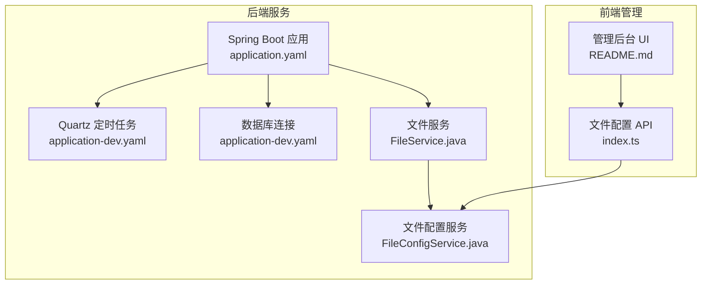
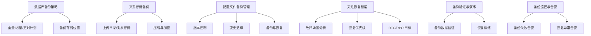
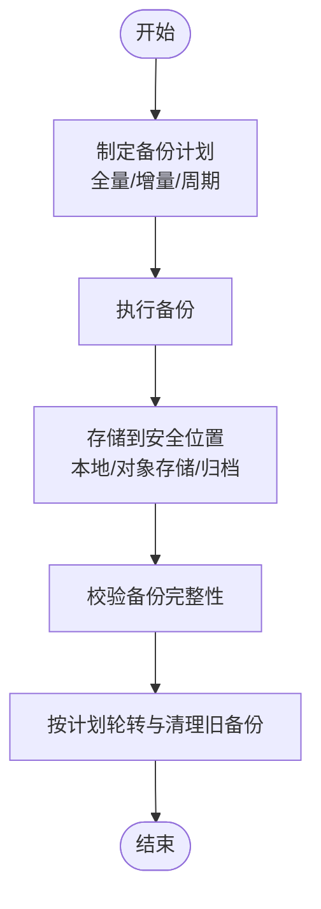
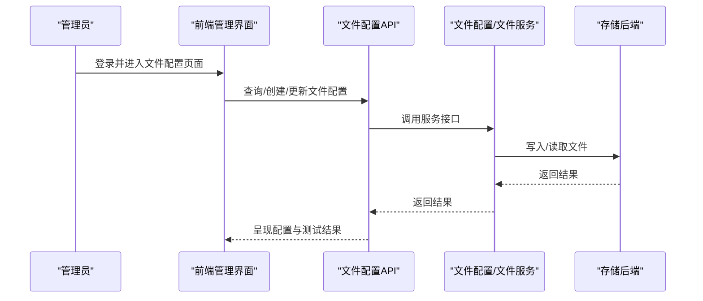
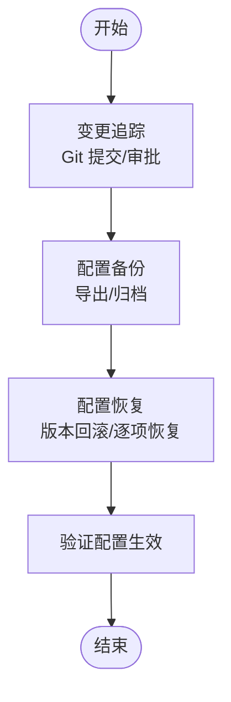
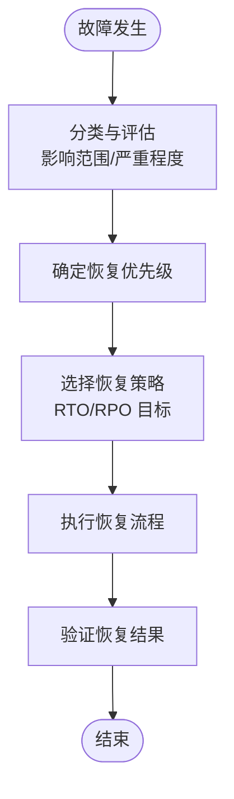

# 备份恢复

<cite>
**本文引用的文件**
- [application.yaml](file://yudao-server/src/main/resources/application.yaml)
- [application-dev.yaml](file://yudao-server/src/main/resources/application-dev.yaml)
- [application-local.yaml](file://yudao-server/src/main/resources/application-local.yaml)
- [FileConfigController.java](file://yudao-module-infra/src/main/java/cn/iocoder/yudao/module/infra/controller/admin/file/FileConfigController.java)
- [FileController.java](file://yudao-module-infra/src/main/java/cn/iocoder/yudao/module/infra/controller/admin/file/FileController.java)
- [FileConfigService.java](file://yudao-module-infra/src/main/java/cn/iocoder/yudao/module/infra/service/file/FileConfigService.java)
- [FileService.java](file://yudao-module-infra/src/main/java/cn/iocoder/yudao/module/infra/service/file/FileService.java)
- [index.ts](file://yudao-ui/yudao-ui-admin-vue3/src/api/infra/fileConfig/index.ts)
- [create_tables.sql](file://yudao-module-infra/src/test/resources/sql/create_tables.sql)
- [quartz.sql(PostgreSQL)](file://sql/postgresql/quartz.sql)
- [quartz.sql(SQLServer)](file://sql/sqlserver/quartz.sql)
- [README.md(前端UI)](file://yudao-ui/yudao-ui-admin-vue3/README.md)
- [README.md(项目总览)](file://README.md)
- [DEVELOPMENT-GUIDE.md](file://DEVELOPMENT-GUIDE.md)
</cite>

## 目录
1. [简介](#简介)
2. [项目结构](#项目结构)
3. [核心组件](#核心组件)
4. [架构总览](#架构总览)
5. [详细组件分析](#详细组件分析)
6. [依赖分析](#依赖分析)
7. [性能考虑](#性能考虑)
8. [故障排查指南](#故障排查指南)
9. [结论](#结论)
10. [附录](#附录)

## 简介
本文件面向芋道 Ruoyi-Vue-Pro 项目的备份与恢复实践，围绕数据库备份策略（全量/增量/定时计划/存储位置）、文件存储备份（上传目录/对象存储/压缩与加密）、配置文件备份管理（版本控制/变更追踪/恢复）、灾难恢复预案（故障场景/恢复优先级/目标指标）、备份数据验证与恢复演练、以及备份监控与告警机制展开，帮助团队建立系统化、可审计、可验证、可演练的备份体系。

## 项目结构
- 后端通过 yudao-server 的 Spring Boot 配置加载运行，数据库连接、定时任务（Quartz）、消息队列、缓存等均在配置文件中集中管理。
- 前端 UI 提供文件配置与文件服务的管理界面与 API 调用，支撑文件存储备份与恢复验证。
- 基础设施模块 infra 提供文件配置与文件服务能力，支撑多种存储后端（本地/FTP/数据库/OSS/MinIO 等）。

图表来源
- [application.yaml:1-354](file://yudao-server/src/main/resources/application.yaml#L1-L354)
- [application-dev.yaml:1-212](file://yudao-server/src/main/resources/application-dev.yaml#L1-L212)
- [FileService.java:1-99](file://yudao-module-infra/src/main/java/cn/iocoder/yudao/module/infra/service/file/FileService.java#L1-L99)
- [FileConfigService.java:1-95](file://yudao-module-infra/src/main/java/cn/iocoder/yudao/module/infra/service/file/FileConfigService.java#L1-L95)
- [index.ts:1-69](file://yudao-ui/yudao-ui-admin-vue3/src/api/infra/fileConfig/index.ts#L1-L69)
- [README.md(前端UI):171-190](file://yudao-ui/yudao-ui-admin-vue3/README.md#L171-L190)

章节来源
- [application.yaml:1-354](file://yudao-server/src/main/resources/application.yaml#L1-L354)
- [application-dev.yaml:1-212](file://yudao-server/src/main/resources/application-dev.yaml#L1-L212)
- [README.md(前端UI):171-190](file://yudao-ui/yudao-ui-admin-vue3/README.md#L171-L190)

## 核心组件
- 数据库层：通过 Spring Boot 配置加载多数据源与连接池，Quartz 定时任务持久化至数据库，便于备份与恢复。
- 文件存储层：文件配置与文件服务抽象，支持多种存储后端；前端提供配置与测试能力。
- 配置层：后端配置集中管理，前端提供配置页面与 API；结合版本控制与变更追踪实现配置备份与恢复。

章节来源
- [application-dev.yaml:13-58](file://yudao-server/src/main/resources/application-dev.yaml#L13-L58)
- [application-dev.yaml:69-96](file://yudao-server/src/main/resources/application-dev.yaml#L69-L96)
- [FileConfigController.java:1-98](file://yudao-module-infra/src/main/java/cn/iocoder/yudao/module/infra/controller/admin/file/FileConfigController.java#L1-L98)
- [FileController.java:31-55](file://yudao-module-infra/src/main/java/cn/iocoder/yudao/module/infra/controller/admin/file/FileController.java#L31-L55)
- [FileConfigService.java:1-95](file://yudao-module-infra/src/main/java/cn/iocoder/yudao/module/infra/service/file/FileConfigService.java#L1-L95)
- [FileService.java:1-99](file://yudao-module-infra/src/main/java/cn/iocoder/yudao/module/infra/service/file/FileService.java#L1-L99)

## 架构总览
备份与恢复涉及以下关键路径：
- 数据库备份：基于 Quartz 表结构与数据库连接配置，制定全量/增量/定时备份计划，并明确存储位置。
- 文件存储备份：通过文件配置与文件服务，将文件上传目录/对象存储作为备份对象，支持压缩与加密。
- 配置文件备份：结合后端配置与前端配置页面，实现配置版本控制与变更追踪，保障配置可恢复。
- 灾难恢复：定义故障场景、恢复优先级、RTO/RPO 目标，并配套验证与演练。
- 监控与告警：对备份与恢复过程进行监控与告警，确保及时发现问题。

## 详细组件分析

### 数据库备份策略
- 全量备份
  - 建议在业务低峰期执行，使用数据库自带工具（如 MySQL 的逻辑备份/物理备份、PostgreSQL 的逻辑备份/物理备份、SQL Server 的完整备份）。
  - 备份输出应包含 Quartz 表结构与业务表，确保定时任务与业务数据可独立恢复。
- 增量备份
  - 基于数据库的增量备份能力，按天/小时生成增量文件，降低备份窗口与存储占用。
- 定时备份计划
  - Quartz 定时任务持久化在数据库中，需纳入备份范围；结合配置中的 Quartz 存储类型与集群参数，确保备份一致性。
- 备份存储位置
  - 建议将备份文件存放于异地/对象存储/归档存储，定期轮转与校验，保留至少 N 代备份。

章节来源
- [application-dev.yaml:69-96](file://yudao-server/src/main/resources/application-dev.yaml#L69-L96)
- [quartz.sql(PostgreSQL):1-32](file://sql/postgresql/quartz.sql#L1-L32)
- [quartz.sql(PostgreSQL):194-208](file://sql/postgresql/quartz.sql#L194-L208)
- [quartz.sql(SQLServer):1-48](file://sql/sqlserver/quartz.sql#L1-L48)

### 文件存储备份
- 文件上传目录备份
  - 通过文件配置与文件服务，将上传目录映射到具体存储后端；备份时需对上传目录进行快照或归档。
- 对象存储备份
  - 支持多种对象存储（S3/MinIO/阿里云/腾讯云/七牛等），备份时可利用对象存储的生命周期策略与跨区域复制能力。
- 备份数据压缩与加密
  - 建议在备份过程中启用压缩以节省空间，在传输与静态存储阶段启用加密，确保数据安全。

图表来源
- [FileConfigController.java:1-98](file://yudao-module-infra/src/main/java/cn/iocoder/yudao/module/infra/controller/admin/file/FileConfigController.java#L1-L98)
- [FileController.java:31-55](file://yudao-module-infra/src/main/java/cn/iocoder/yudao/module/infra/controller/admin/file/FileController.java#L31-L55)
- [index.ts:1-69](file://yudao-ui/yudao-ui-admin-vue3/src/api/infra/fileConfig/index.ts#L1-L69)
- [FileConfigService.java:1-95](file://yudao-module-infra/src/main/java/cn/iocoder/yudao/module/infra/service/file/FileConfigService.java#L1-L95)
- [FileService.java:1-99](file://yudao-module-infra/src/main/java/cn/iocoder/yudao/module/infra/service/file/FileService.java#L1-L99)

章节来源
- [FileConfigController.java:1-98](file://yudao-module-infra/src/main/java/cn/iocoder/yudao/module/infra/controller/admin/file/FileConfigController.java#L1-L98)
- [FileController.java:31-55](file://yudao-module-infra/src/main/java/cn/iocoder/yudao/module/infra/controller/admin/file/FileController.java#L31-L55)
- [index.ts:1-69](file://yudao-ui/yudao-ui-admin-vue3/src/api/infra/fileConfig/index.ts#L1-L69)
- [README.md(前端UI):171-190](file://yudao-ui/yudao-ui-admin-vue3/README.md#L171-L190)

### 配置文件备份管理
- 配置版本控制
  - 后端配置集中于 application.yaml 及其 profile 文件；建议纳入版本控制系统，配合分支与标签管理。
- 配置变更追踪
  - 通过 Git 提交记录与 CI/CD 审批流程，追踪配置变更历史；对敏感配置使用密文管理。
- 配置备份与恢复
  - 定期导出配置文件与密钥材料，进行离线归档；恢复时按版本回滚或逐项恢复。

章节来源
- [application.yaml:1-354](file://yudao-server/src/main/resources/application.yaml#L1-L354)
- [application-dev.yaml:1-212](file://yudao-server/src/main/resources/application-dev.yaml#L1-L212)
- [DEVELOPMENT-GUIDE.md:780-830](file://DEVELOPMENT-GUIDE.md#L780-L830)

### 灾难恢复预案
- 故障场景分析
  - 数据库故障、文件存储不可用、配置丢失、定时任务异常等。
- 恢复优先级
  - 业务数据 > 定时任务 > 配置 > 文件存储；根据影响范围确定恢复顺序。
- 恢复时间目标（RTO）与恢复点目标（RPO）
  - 明确各类场景下的 RTO/RPO 目标，并据此选择备份策略与恢复流程。

### 备份数据验证与恢复演练
- 备份数据验证
  - 定期抽样验证备份文件完整性与可还原性，确保备份可用。
- 恢复演练
  - 定期开展模拟恢复演练，覆盖数据库、文件存储、配置等关键组件，检验流程有效性与人员熟练度。

### 备份监控与告警
- 备份失败告警
  - 对备份执行失败、存储空间不足、校验失败等情况进行告警。
- 恢复异常告警
  - 对恢复过程中出现的数据不一致、服务不可用、性能异常等情况进行告警。

## 依赖分析
- 数据库与定时任务
  - Quartz 表结构与数据库连接配置决定备份范围与一致性要求。
- 文件配置与文件服务
  - 文件配置控制器与服务接口定义了文件存储备份与恢复的关键入口。
- 前端配置与 API
  - 前端提供文件配置页面与 API，支撑备份与恢复验证。

图表来源
- [application-dev.yaml:69-96](file://yudao-server/src/main/resources/application-dev.yaml#L69-L96)
- [FileConfigController.java:1-98](file://yudao-module-infra/src/main/java/cn/iocoder/yudao/module/infra/controller/admin/file/FileConfigController.java#L1-L98)
- [FileConfigService.java:1-95](file://yudao-module-infra/src/main/java/cn/iocoder/yudao/module/infra/service/file/FileConfigService.java#L1-L95)
- [index.ts:1-69](file://yudao-ui/yudao-ui-admin-vue3/src/api/infra/fileConfig/index.ts#L1-L69)

章节来源
- [application-dev.yaml:69-96](file://yudao-server/src/main/resources/application-dev.yaml#L69-L96)
- [FileConfigController.java:1-98](file://yudao-module-infra/src/main/java/cn/iocoder/yudao/module/infra/controller/admin/file/FileConfigController.java#L1-L98)
- [index.ts:1-69](file://yudao-ui/yudao-ui-admin-vue3/src/api/infra/fileConfig/index.ts#L1-L69)

## 性能考虑
- 备份窗口与资源占用
  - 全量备份建议在业务低峰期执行；增量备份减少对在线业务的影响。
- 存储与网络带宽
  - 对象存储与压缩/加密会增加 CPU 与网络开销，需结合硬件能力与 SLA 要求进行权衡。
- 恢复效率
  - 通过并行恢复、预热缓存、灰度验证等方式提升恢复效率与稳定性。

## 故障排查指南
- 数据库备份失败
  - 检查数据库连接、权限、磁盘空间与备份工具参数；核对 Quartz 表结构是否存在。
- 文件存储不可用
  - 检查存储后端连通性、凭证与桶/路径权限；通过前端测试接口验证配置。
- 配置恢复异常
  - 核对版本与密钥材料；确认配置生效顺序与依赖关系。

章节来源
- [application-dev.yaml:13-58](file://yudao-server/src/main/resources/application-dev.yaml#L13-L58)
- [FileConfigController.java:91-98](file://yudao-module-infra/src/main/java/cn/iocoder/yudao/module/infra/controller/admin/file/FileConfigController.java#L91-L98)
- [index.ts:66-69](file://yudao-ui/yudao-ui-admin-vue3/src/api/infra/fileConfig/index.ts#L66-L69)

## 结论
通过将数据库、文件存储、配置文件纳入统一的备份与恢复体系，并结合定时备份计划、存储位置规划、压缩与加密、版本控制与变更追踪、灾难恢复预案、验证与演练以及监控告警，可以显著提升系统的数据安全性与业务连续性。建议在生产环境中严格执行上述策略，并持续优化备份与恢复流程。

## 附录
- 数据库表结构参考（参数配置与文件配置）
  - 参数配置表与文件配置表结构可用于备份范围确认与恢复验证。

章节来源
- [create_tables.sql:2-32](file://yudao-module-infra/src/test/resources/sql/create_tables.sql#L2-L32)