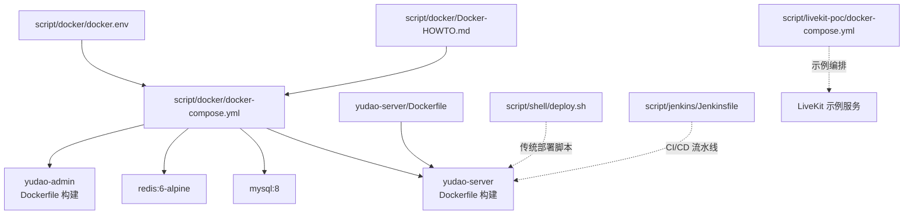
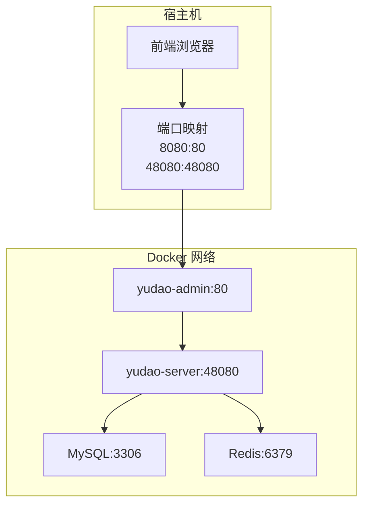
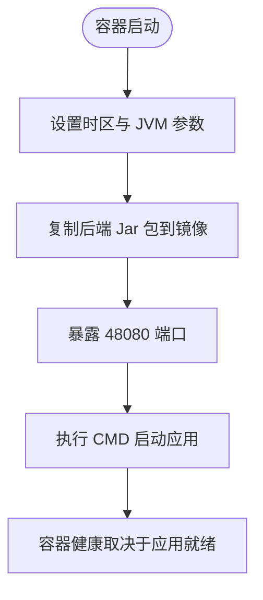
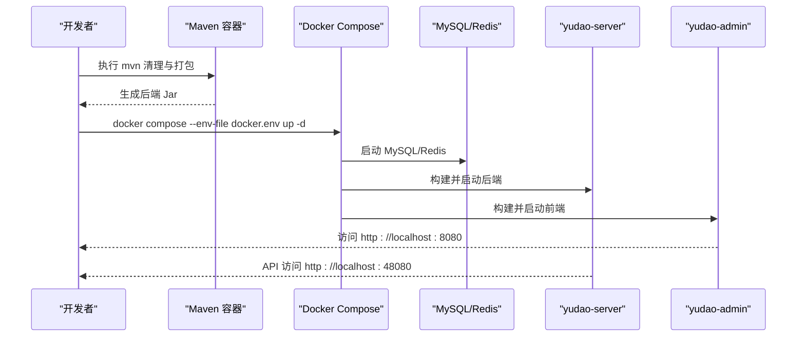
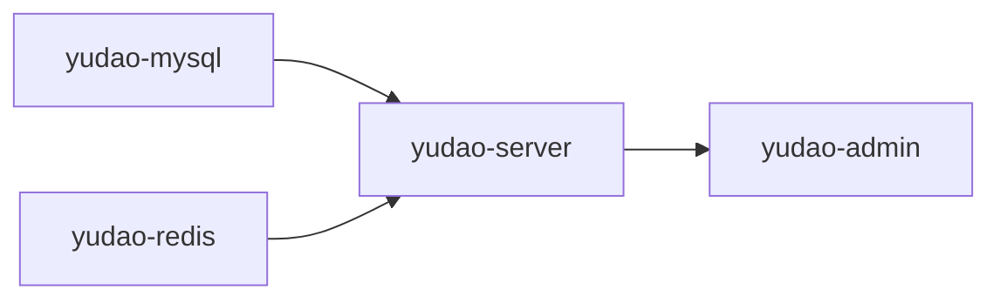

# 容器化部署

<cite>
**本文引用的文件**
- [script/docker/Docker-HOWTO.md](file://script/docker/Docker-HOWTO.md)
- [script/docker/docker-compose.yml](file://script/docker/docker-compose.yml)
- [script/docker/docker.env](file://script/docker/docker.env)
- [yudao-server/Dockerfile](file://yudao-server/Dockerfile)
- [script/shell/deploy.sh](file://script/shell/deploy.sh)
- [script/jenkins/Jenkinsfile](file://script/jenkins/Jenkinsfile)
- [script/livekit-poc/docker-compose.yml](file://script/livekit-poc/docker-compose.yml)
- [script/livekit-poc/livekit.yaml](file://script/livekit-poc/livekit.yaml)
</cite>

## 目录
1. [简介](#简介)
2. [项目结构](#项目结构)
3. [核心组件](#核心组件)
4. [架构总览](#架构总览)
5. [详细组件分析](#详细组件分析)
6. [依赖分析](#依赖分析)
7. [性能考虑](#性能考虑)
8. [故障排查指南](#故障排查指南)
9. [结论](#结论)
10. [附录](#附录)

## 简介
本指南面向希望使用 Docker 与 Docker Compose 在本地或生产环境中快速部署 ruoyi-vue-pro（芋道 ruoyi-vue-pro）系统的读者。内容涵盖：
- Docker 镜像构建流程与优化要点
- Docker Compose 编排配置与服务编排顺序
- 容器启动/停止与单容器/多容器协同部署
- 容器监控与日志管理
- 容器网络配置与服务发现
- 安全配置与资源限制建议
- 升级与回滚策略
- 常见故障排查方法

## 项目结构
与容器化部署直接相关的文件主要集中在 script/docker 与 yudao-server 目录中，配合少量运维脚本与示例编排文件。

图示来源
- [script/docker/docker-compose.yml:1-85](file://script/docker/docker-compose.yml#L1-L85)
- [script/docker/docker.env:1-26](file://script/docker/docker.env#L1-L26)
- [yudao-server/Dockerfile:1-24](file://yudao-server/Dockerfile#L1-L24)
- [script/docker/Docker-HOWTO.md:1-50](file://script/docker/Docker-HOWTO.md#L1-L50)
- [script/shell/deploy.sh:1-161](file://script/shell/deploy.sh#L1-L161)
- [script/jenkins/Jenkinsfile:1-60](file://script/jenkins/Jenkinsfile#L1-L60)
- [script/livekit-poc/docker-compose.yml:1-20](file://script/livekit-poc/docker-compose.yml#L1-L20)

章节来源
- [script/docker/docker-compose.yml:1-85](file://script/docker/docker-compose.yml#L1-L85)
- [script/docker/docker.env:1-26](file://script/docker/docker.env#L1-L26)
- [yudao-server/Dockerfile:1-24](file://yudao-server/Dockerfile#L1-L24)
- [script/docker/Docker-HOWTO.md:1-50](file://script/docker/Docker-HOWTO.md#L1-L50)

## 核心组件
- MySQL 8：持久化数据库，初始化 SQL 由宿主挂载注入。
- Redis 6-alpine：缓存与会话存储。
- yudao-server：基于 Eclipse Temurin 21 JRE 的后端服务，暴露 48080 端口。
- yudao-admin：基于 Nginx 的前端静态站点，反向代理后端 API，对外暴露 80 端口（映射到宿主 8080）。
- 环境变量与配置：通过 docker-compose.yml 与 docker.env 统一管理。

章节来源
- [script/docker/docker-compose.yml:5-84](file://script/docker/docker-compose.yml#L5-L84)
- [script/docker/docker.env:1-26](file://script/docker/docker.env#L1-L26)
- [yudao-server/Dockerfile:1-24](file://yudao-server/Dockerfile#L1-L24)

## 架构总览
容器化部署采用“后端 + 前端 + 数据库 + 缓存”的四服务模型，服务间通过 Docker 网络通信，前端通过 Nginx 反向代理后端 API。

图示来源
- [script/docker/docker-compose.yml:5-84](file://script/docker/docker-compose.yml#L5-L84)

## 详细组件分析

### 后端服务（yudao-server）
- 基础镜像：Eclipse Temurin 21 JRE
- 工作目录与应用包：/yudao-server/app.jar
- 环境变量：
  - JAVA_OPTS：内存与熵源配置
  - ARGS：Spring Boot 启动参数（数据源、Redis 主机等）
  - SPRING_PROFILES_ACTIVE：默认 local
- 端口：48080
- 启动方式：java ${JAVA_OPTS} -jar app.jar $ARGS

图示来源
- [yudao-server/Dockerfile:1-24](file://yudao-server/Dockerfile#L1-L24)

章节来源
- [yudao-server/Dockerfile:1-24](file://yudao-server/Dockerfile#L1-L24)

### 前端服务（yudao-admin）
- 构建上下文：yudao-ui-admin（当前仓库未提供其 Dockerfile/Nginx 配置，但 Compose 已声明 build 与 args）
- 端口映射：8080:80
- 依赖：后端服务就绪后方可提供静态资源与 API 反向代理
- 关键环境变量（通过 build.args 注入）：NODE_ENV、PUBLIC_PATH、VUE_APP_BASE_API、功能开关等

章节来源
- [script/docker/docker-compose.yml:58-78](file://script/docker/docker-compose.yml#L58-L78)

### 数据库与缓存
- MySQL：8，初始化 SQL 挂载注入；持久化卷 mysql
- Redis：6-alpine，持久化卷 redis
- 依赖：后端服务 depends_on

章节来源
- [script/docker/docker-compose.yml:6-27](file://script/docker/docker-compose.yml#L6-L27)

### 配置与环境变量
- docker-compose.yml：集中定义服务、端口、环境变量、卷与依赖
- docker.env：提供默认值，便于本地快速启动
- 优先级：Compose 中显式 environment > docker.env

章节来源
- [script/docker/docker-compose.yml:13-53](file://script/docker/docker-compose.yml#L13-L53)
- [script/docker/docker.env:1-26](file://script/docker/docker.env#L1-L26)

### 构建与启动流程
- Maven 构建 Jar：通过官方 Maven 镜像在容器内执行打包，使用独立 Maven 本地仓库卷加速
- Compose 启动：支持通过 --env-file docker.env 注入环境变量，也可直接使用 Compose 内置默认值

图示来源
- [script/docker/Docker-HOWTO.md:21-42](file://script/docker/Docker-HOWTO.md#L21-L42)
- [script/docker/docker-compose.yml:29-78](file://script/docker/docker-compose.yml#L29-L78)

章节来源
- [script/docker/Docker-HOWTO.md:21-42](file://script/docker/Docker-HOWTO.md#L21-L42)
- [script/docker/docker-compose.yml:29-78](file://script/docker/docker-compose.yml#L29-L78)

## 依赖分析
- 服务依赖：
  - server 依赖 mysql 与 redis
  - admin 依赖 server
- 网络：
  - 服务在同一 Compose 网络内，可直接通过服务名互访（如 yudao-mysql、yudao-redis）
- 数据持久化：
  - mysql 与 redis 使用本地命名卷，避免数据丢失

图示来源
- [script/docker/docker-compose.yml:54-56](file://script/docker/docker-compose.yml#L54-L56)
- [script/docker/docker-compose.yml:77-78](file://script/docker/docker-compose.yml#L77-L78)

章节来源
- [script/docker/docker-compose.yml:54-56](file://script/docker/docker-compose.yml#L54-L56)
- [script/docker/docker-compose.yml:77-78](file://script/docker/docker-compose.yml#L77-L78)

## 性能考虑
- JVM 内存：通过 JAVA_OPTS 控制初始与最大堆大小，建议结合实际并发与数据量调优
- 熵源：启用 -Djava.security.egd=file:/dev/./urandom，提升容器内随机数质量
- 端口与并发：合理设置后端线程与连接池，避免端口争用
- 镜像体积：Temurin JRE 已较精简，建议在 CI 中缓存 Maven 依赖以减少构建时间

章节来源
- [yudao-server/Dockerfile:11-14](file://yudao-server/Dockerfile#L11-L14)
- [script/docker/docker-compose.yml:40-45](file://script/docker/docker-compose.yml#L40-L45)

## 故障排查指南
- 容器启动失败
  - 检查后端日志：docker compose logs yudao-server
  - 检查前端日志：docker compose logs yudao-admin
  - 确认数据库与缓存已就绪（depends_on）
- 网络问题
  - 确认端口映射：宿主 8080:80、48080:48080 是否被占用
  - 确认服务名解析：后端能否通过 yudao-mysql、yudao-redis 访问
- 存储问题
  - 检查 mysql 与 redis 卷是否存在且有权限
- 健康检查
  - 后端提供 /actuator/health，可在自动化脚本中集成健康检查逻辑

章节来源
- [script/shell/deploy.sh:106-143](file://script/shell/deploy.sh#L106-L143)
- [script/docker/docker-compose.yml:35-36](file://script/docker/docker-compose.yml#L35-L36)
- [script/docker/docker-compose.yml:75-76](file://script/docker/docker-compose.yml#L75-L76)

## 结论
通过本指南，您可以在本地快速完成 ruoyi-vue-pro 的容器化部署，并理解各组件职责与依赖关系。建议在生产环境中进一步完善镜像分层、资源限制、安全加固与可观测性配置。

## 附录

### A. Docker 镜像构建与优化
- 使用官方 Eclipse Temurin 21 JRE 作为基础镜像，确保稳定与兼容
- 将后端 Jar 复制到镜像内，暴露 48080 端口
- 通过 ARGS 注入 Spring Boot 启动参数，避免频繁重建镜像
- 建议在 CI 中缓存 Maven 依赖，缩短构建时间

章节来源
- [yudao-server/Dockerfile:1-24](file://yudao-server/Dockerfile#L1-L24)
- [script/docker/Docker-HOWTO.md:21-32](file://script/docker/Docker-HOWTO.md#L21-L32)

### B. Docker Compose 编排配置
- 服务定义：mysql、redis、server、admin
- 网络与端口：默认桥接网络，按需映射宿主端口
- 卷挂载：mysql 与 redis 使用本地命名卷
- 环境变量：通过 docker.env 与 compose 文件共同控制

章节来源
- [script/docker/docker-compose.yml:1-85](file://script/docker/docker-compose.yml#L1-L85)
- [script/docker/docker.env:1-26](file://script/docker/docker.env#L1-L26)

### C. 容器启动与停止
- 启动：docker compose --env-file docker.env up -d
- 停止：docker compose down 或 docker compose stop
- 单容器：docker compose up -d yudao-server 或 yudao-admin
- 多容器：docker compose up -d 同时启动全部服务

章节来源
- [script/docker/Docker-HOWTO.md:34-42](file://script/docker/Docker-HOWTO.md#L34-L42)

### D. 容器监控与日志管理
- 日志：docker compose logs [-f] [服务名]
- 健康检查：后端提供 /actuator/health，可集成到自动化脚本
- 建议：在生产中引入集中式日志与指标采集（如 ELK/SkyWalking）

章节来源
- [script/shell/deploy.sh:106-143](file://script/shell/deploy.sh#L106-L143)

### E. 容器网络配置
- 端口映射：前端 8080:80，后端 48080:48080
- 服务发现：同网络内通过服务名访问（yudao-mysql、yudao-redis、yudao-server）
- 负载均衡：本示例为单实例，生产可扩展为多副本并通过外部 LB 暴露

章节来源
- [script/docker/docker-compose.yml:11-12](file://script/docker/docker-compose.yml#L11-L12)
- [script/docker/docker-compose.yml:24-25](file://script/docker/docker-compose.yml#L24-L25)
- [script/docker/docker-compose.yml:35-36](file://script/docker/docker-compose.yml#L35-L36)
- [script/docker/docker-compose.yml:75-76](file://script/docker/docker-compose.yml#L75-L76)

### F. 容器安全配置
- 用户权限：建议以非 root 用户运行（当前示例使用默认用户）
- 资源限制：在 Compose 中添加 deploy.resources（若使用 Swarm）或 docker run --memory/--cpus
- 网络安全：仅暴露必要端口；使用只读根文件系统与最小权限卷

章节来源
- [script/docker/docker-compose.yml:8-9](file://script/docker/docker-compose.yml#L8-L9)
- [script/docker/docker-compose.yml:22-23](file://script/docker/docker-compose.yml#L22-L23)

### G. 升级与回滚策略
- 滚动更新：在 Swarm/K8s 中可实现零停机；Compose 适合本地验证
- 版本管理：通过镜像标签区分版本；建议在 CI 中打 Tag 并推送 Registry
- 回滚：切换镜像标签或重新部署上一个版本

章节来源
- [script/jenkins/Jenkinsfile:10-27](file://script/jenkins/Jenkinsfile#L10-L27)
- [script/jenkins/Jenkinsfile:46-57](file://script/jenkins/Jenkinsfile#L46-L57)

### H. 示例：集成 LiveKit（可选）
- 通过独立 docker-compose 启动 LiveKit，挂载配置文件，按平台调整端口映射与 webhook 地址

章节来源
- [script/livekit-poc/docker-compose.yml:1-20](file://script/livekit-poc/docker-compose.yml#L1-L20)
- [script/livekit-poc/livekit.yaml:1-30](file://script/livekit-poc/livekit.yaml#L1-L30)