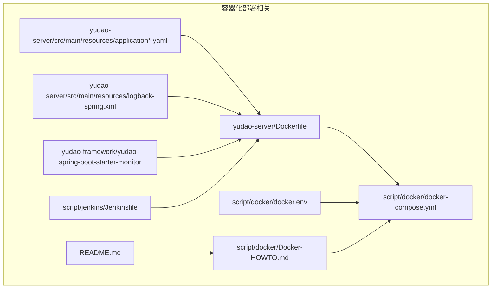
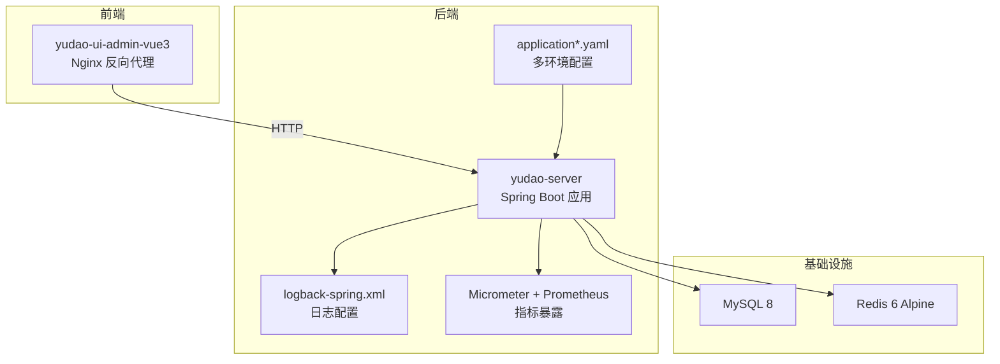
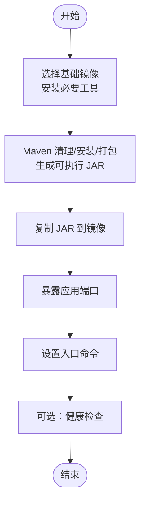
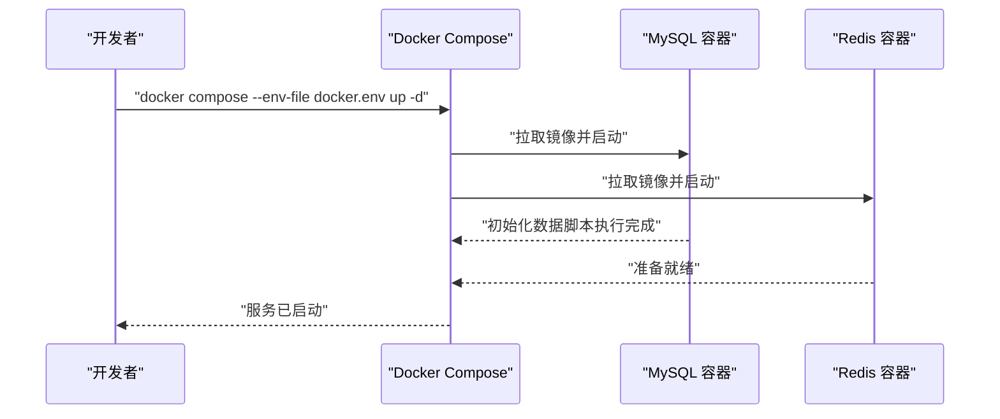
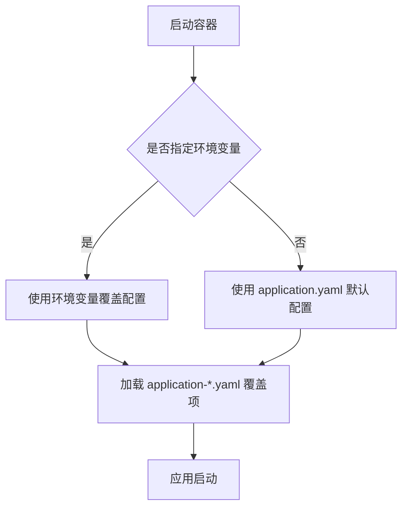
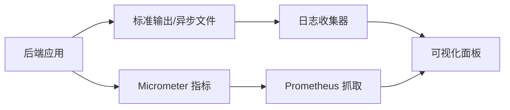
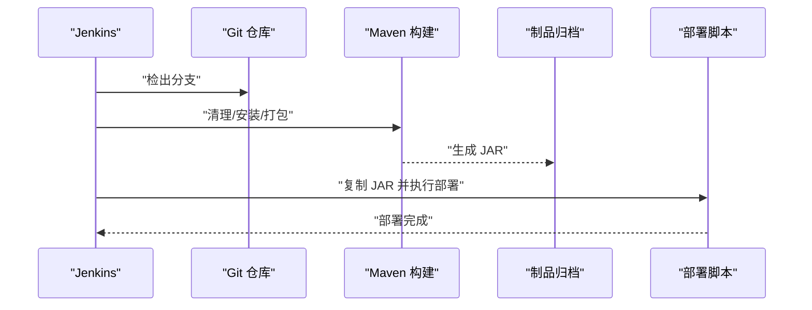
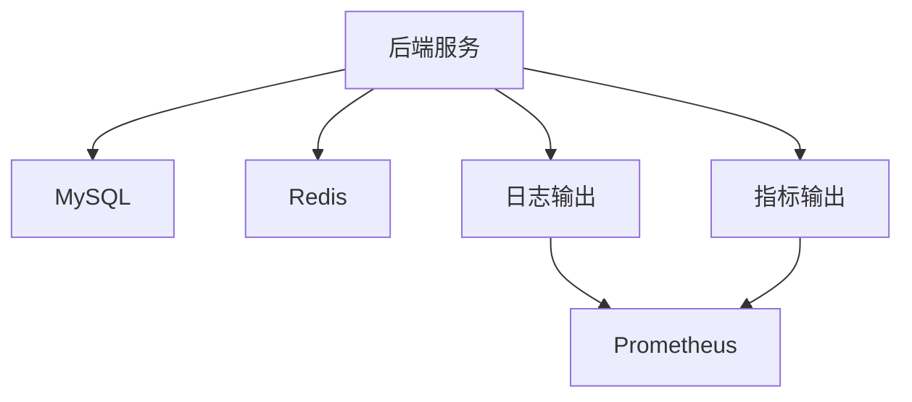

# 容器化部署

<cite>
**本文引用的文件**   
- [Dockerfile](file://yudao-server/Dockerfile)
- [docker-compose.yml](file://script/docker/docker-compose.yml)
- [docker.env](file://script/docker/docker.env)
- [Docker-HOWTO.md](file://script/docker/Docker-HOWTO.md)
- [application.yaml](file://yudao-server/src/main/resources/application.yaml)
- [application-dev.yaml](file://yudao-server/src/main/resources/application-dev.yaml)
- [application-local.yaml](file://yudao-server/src/main/resources/application-local.yaml)
- [logback-spring.xml](file://yudao-server/src/main/resources/logback-spring.xml)
- [YudaoMetricsAutoConfiguration.java](file://yudao-framework/yudao-spring-boot-starter-monitor/src/main/java/cn/iocoder/yudao/framework/tracer/config/YudaoMetricsAutoConfiguration.java)
- [pom.xml](file://yudao-server/pom.xml)
- [Jenkinsfile](file://script/jenkins/Jenkinsfile)
- [README.md](file://README.md)
</cite>

## 目录
1. [简介](#简介)
2. [项目结构](#项目结构)
3. [核心组件](#核心组件)
4. [架构总览](#架构总览)
5. [详细组件分析](#详细组件分析)
6. [依赖分析](#依赖分析)
7. [性能考虑](#性能考虑)
8. [故障排查指南](#故障排查指南)
9. [结论](#结论)
10. [附录](#附录)

## 简介
本文件面向芋道 Ruoyi-Vue-Pro 项目的容器化部署，覆盖 Dockerfile 构建配置、Docker Compose 编排方案、多环境部署策略、容器资源与性能调优、以及容器监控与日志收集方案。内容基于仓库中现有的 Docker 与部署相关文件整理而成，旨在帮助读者快速、稳定地完成本地与生产环境的容器化部署。

## 项目结构
围绕容器化部署的关键文件与位置如下：
- 后端服务镜像构建：yudao-server/Dockerfile
- 前后端联调编排：script/docker/docker-compose.yml
- 环境变量配置：script/docker/docker.env
- 构建与使用说明：script/docker/Docker-HOWTO.md
- 应用配置（多环境）：yudao-server/src/main/resources/application*.yaml
- 日志配置：yudao-server/src/main/resources/logback-spring.xml
- 监控与指标：yudao-framework/yudao-spring-boot-starter-monitor
- 持续集成：script/jenkins/Jenkinsfile
- 项目总体说明：README.md

图表来源
- [Dockerfile](file://yudao-server/Dockerfile)
- [docker-compose.yml](file://script/docker/docker-compose.yml)
- [docker.env](file://script/docker/docker.env)
- [Docker-HOWTO.md](file://script/docker/Docker-HOWTO.md)
- [application.yaml](file://yudao-server/src/main/resources/application.yaml)
- [application-dev.yaml](file://yudao-server/src/main/resources/application-dev.yaml)
- [application-local.yaml](file://yudao-server/src/main/resources/application-local.yaml)
- [logback-spring.xml](file://yudao-server/src/main/resources/logback-spring.xml)
- [YudaoMetricsAutoConfiguration.java](file://yudao-framework/yudao-spring-boot-starter-monitor/src/main/java/cn/iocoder/yudao/framework/tracer/config/YudaoMetricsAutoConfiguration.java)
- [Jenkinsfile](file://script/jenkins/Jenkinsfile)
- [README.md](file://README.md)

章节来源
- [Dockerfile](file://yudao-server/Dockerfile)
- [docker-compose.yml](file://script/docker/docker-compose.yml)
- [docker.env](file://script/docker/docker.env)
- [Docker-HOWTO.md](file://script/docker/Docker-HOWTO.md)
- [application.yaml](file://yudao-server/src/main/resources/application.yaml)
- [application-dev.yaml](file://yudao-server/src/main/resources/application-dev.yaml)
- [application-local.yaml](file://yudao-server/src/main/resources/application-local.yaml)
- [logback-spring.xml](file://yudao-server/src/main/resources/logback-spring.xml)
- [YudaoMetricsAutoConfiguration.java](file://yudao-framework/yudao-spring-boot-starter-monitor/src/main/java/cn/iocoder/yudao/framework/tracer/config/YudaoMetricsAutoConfiguration.java)
- [Jenkinsfile](file://script/jenkins/Jenkinsfile)
- [README.md](file://README.md)

## 核心组件
- 后端服务镜像构建：基于 yudao-server/Dockerfile，使用 Maven 构建并打包为可执行 JAR，容器内以 Java 运行。
- 数据库与缓存编排：通过 script/docker/docker-compose.yml 启动 MySQL 与 Redis，并挂载持久化卷。
- 环境变量与配置：docker.env 提供默认环境变量，application*.yaml 提供多环境配置（开发/本地/默认）。
- 监控与指标：启用 Micrometer Prometheus 指标与 Spring Boot Admin 客户端能力，便于容器化环境观测。
- 日志与链路追踪：logback-spring.xml 支持标准输出与异步日志，可按需接入 SkyWalking 日志中心。
- 持续集成：Jenkinsfile 展示了构建、打包与部署流程，可用于流水线化部署。

章节来源
- [Dockerfile](file://yudao-server/Dockerfile)
- [docker-compose.yml](file://script/docker/docker-compose.yml)
- [docker.env](file://script/docker/docker.env)
- [application.yaml](file://yudao-server/src/main/resources/application.yaml)
- [application-dev.yaml](file://yudao-server/src/main/resources/application-dev.yaml)
- [application-local.yaml](file://yudao-server/src/main/resources/application-local.yaml)
- [logback-spring.xml](file://yudao-server/src/main/resources/logback-spring.xml)
- [YudaoMetricsAutoConfiguration.java](file://yudao-framework/yudao-spring-boot-starter-monitor/src/main/java/cn/iocoder/yudao/framework/tracer/config/YudaoMetricsAutoConfiguration.java)
- [Jenkinsfile](file://script/jenkins/Jenkinsfile)

## 架构总览
下图展示容器化部署的整体架构：前端 UI 与后端 API 通过 Docker Compose 编排，后端依赖 MySQL 与 Redis，日志与指标分别输出至标准输出与 Prometheus。

图表来源
- [docker-compose.yml](file://script/docker/docker-compose.yml)
- [application.yaml](file://yudao-server/src/main/resources/application.yaml)
- [application-dev.yaml](file://yudao-server/src/main/resources/application-dev.yaml)
- [application-local.yaml](file://yudao-server/src/main/resources/application-local.yaml)
- [logback-spring.xml](file://yudao-server/src/main/resources/logback-spring.xml)
- [YudaoMetricsAutoConfiguration.java](file://yudao-framework/yudao-spring-boot-starter-monitor/src/main/java/cn/iocoder/yudao/framework/tracer/config/YudaoMetricsAutoConfiguration.java)

## 详细组件分析

### Dockerfile 构建配置
- 基础镜像与 JDK：使用官方 OpenJDK 镜像作为运行时基础，确保 Java 运行环境一致。
- 依赖安装与打包：通过 Maven 清理、安装与打包生成可执行 JAR，跳过测试以提升构建效率。
- 应用打包：将构建产物复制到镜像中，设置工作目录与入口命令。
- 端口暴露：容器对外暴露应用监听端口，便于宿主机访问。
- 用户与权限：建议以非 root 用户运行，提升安全性（如需可在 Dockerfile 中补充）。
- 健康检查：可增加 HTTP 或 TCP 健康检查探针，提升编排稳定性。

图表来源
- [Dockerfile](file://yudao-server/Dockerfile)

章节来源
- [Dockerfile](file://yudao-server/Dockerfile)

### Docker Compose 编排方案
- 服务定义：定义 mysql 与 redis 两个服务，分别指定镜像、重启策略、端口映射与持久化卷。
- 网络配置：默认使用 Docker 网络，服务间可通过服务名互访。
- 卷挂载：MySQL 数据目录与初始化 SQL 脚本挂载至宿主机卷，确保数据持久化与可恢复。
- 环境变量：通过 docker.env 提供默认值，compose 文件中使用环境变量注入数据库凭据。
- 启动顺序与依赖：可结合 depends_on 与健康检查，确保数据库可用后再启动后端服务。

图表来源
- [docker-compose.yml](file://script/docker/docker-compose.yml)
- [docker.env](file://script/docker/docker.env)
- [Docker-HOWTO.md](file://script/docker/Docker-HOWTO.md)

章节来源
- [docker-compose.yml](file://script/docker/docker-compose.yml)
- [docker.env](file://script/docker/docker.env)
- [Docker-HOWTO.md](file://script/docker/Docker-HOWTO.md)

### 多环境部署策略
- 开发环境（local/dev）：通过 application-local.yaml 与 application-dev.yaml 覆盖数据库与 Redis 连接信息，适合本地联调。
- 默认环境（prod-like）：application.yaml 提供通用配置，适合作为生产镜像的基础配置。
- 环境切换：在容器启动时通过 spring.profiles.active 指定环境，或在 docker-compose.yml 中设置环境变量覆盖。
- 配置优先级：容器环境变量 > application*.yaml > 默认配置，遵循 Spring Boot 配置优先级原则。

图表来源
- [application.yaml](file://yudao-server/src/main/resources/application.yaml)
- [application-dev.yaml](file://yudao-server/src/main/resources/application-dev.yaml)
- [application-local.yaml](file://yudao-server/src/main/resources/application-local.yaml)

章节来源
- [application.yaml](file://yudao-server/src/main/resources/application.yaml)
- [application-dev.yaml](file://yudao-server/src/main/resources/application-dev.yaml)
- [application-local.yaml](file://yudao-server/src/main/resources/application-local.yaml)

### 容器资源限制与性能调优
- CPU/内存限制：在 docker-compose.yml 中为服务设置 deploy.resources.limits 与 reservations，控制容器资源上限与预留。
- JVM 参数：通过 JAVA_TOOL_OPTIONS 或 spring-boot-jarmode-layout（如使用）传入 JVM 参数，如堆大小、GC 参数、线程栈大小等。
- 连接池优化：根据容器规模调整数据库连接池大小与超时时间，避免过度连接导致数据库压力过大。
- 并发与线程：合理设置应用线程池大小与阻塞队列长度，避免容器内线程争抢导致延迟升高。
- 指标与可观测性：启用 Micrometer Prometheus 指标，结合外部监控系统（如 Prometheus + Grafana）进行资源与业务指标观测。

章节来源
- [YudaoMetricsAutoConfiguration.java](file://yudao-framework/yudao-spring-boot-starter-monitor/src/main/java/cn/iocoder/yudao/framework/tracer/config/YudaoMetricsAutoConfiguration.java)
- [pom.xml](file://yudao-server/pom.xml)

### 容器监控与日志收集
- 指标采集：YudaoMetricsAutoConfiguration 将 common tags 注入 Micrometer，Prometheus 可抓取指标。
- 日志输出：logback-spring.xml 输出到标准输出与异步文件，便于容器日志收集。
- 链路追踪：README.md 提及 SkyWalking 链路追踪与日志中心，可在 logback-spring.xml 中按需启用 SkyWalking 日志 Appender。
- 监控客户端：Spring Boot Admin 客户端可暴露健康检查与指标端点，便于集中监控。

图表来源
- [logback-spring.xml](file://yudao-server/src/main/resources/logback-spring.xml)
- [YudaoMetricsAutoConfiguration.java](file://yudao-framework/yudao-spring-boot-starter-monitor/src/main/java/cn/iocoder/yudao/framework/tracer/config/YudaoMetricsAutoConfiguration.java)
- [README.md](file://README.md)

章节来源
- [logback-spring.xml](file://yudao-server/src/main/resources/logback-spring.xml)
- [YudaoMetricsAutoConfiguration.java](file://yudao-framework/yudao-spring-boot-starter-monitor/src/main/java/cn/iocoder/yudao/framework/tracer/config/YudaoMetricsAutoConfiguration.java)
- [README.md](file://README.md)

### 持续集成与部署流程
- 构建阶段：Jenkinsfile 展示了参数化构建、拉取代码、复制/替换配置文件、Maven 打包等步骤。
- 部署阶段：将构建产物复制到目标路径并执行部署脚本，可扩展为容器镜像推送与编排更新。
- 环境隔离：通过 docker.env 与 application*.yaml 实现不同环境的差异化配置。

图表来源
- [Jenkinsfile](file://script/jenkins/Jenkinsfile)

章节来源
- [Jenkinsfile](file://script/jenkins/Jenkinsfile)

## 依赖分析
- 组件耦合：后端服务依赖 MySQL 与 Redis；日志与指标通过标准输出与 Micrometer 暴露，便于容器化统一处理。
- 外部依赖：Docker Compose 依赖 Docker 环境；Prometheus 依赖指标端点；SkyWalking 可选用于日志与链路追踪。
- 配置契约：docker-compose.yml 与 docker.env 提供数据库连接与凭据；application*.yaml 提供应用层配置。

图表来源
- [docker-compose.yml](file://script/docker/docker-compose.yml)
- [application.yaml](file://yudao-server/src/main/resources/application.yaml)
- [logback-spring.xml](file://yudao-server/src/main/resources/logback-spring.xml)
- [YudaoMetricsAutoConfiguration.java](file://yudao-framework/yudao-spring-boot-starter-monitor/src/main/java/cn/iocoder/yudao/framework/tracer/config/YudaoMetricsAutoConfiguration.java)

章节来源
- [docker-compose.yml](file://script/docker/docker-compose.yml)
- [application.yaml](file://yudao-server/src/main/resources/application.yaml)
- [logback-spring.xml](file://yudao-server/src/main/resources/logback-spring.xml)
- [YudaoMetricsAutoConfiguration.java](file://yudao-framework/yudao-spring-boot-starter-monitor/src/main/java/cn/iocoder/yudao/framework/tracer/config/YudaoMetricsAutoConfiguration.java)

## 性能考虑
- 资源配额：为数据库与应用设置合理的 CPU/内存上限与预留，避免资源争抢。
- JVM 调优：根据容器 CPU 核数与内存大小设置堆大小与 GC 参数，减少 Full GC 频率。
- 连接池：依据并发与数据库规格调整连接池大小与空闲超时，避免连接泄漏。
- 网络与 I/O：使用 SSD 存储挂载 MySQL 数据卷，减少 I/O 瓶颈；合理设置 Redis 内存淘汰策略。
- 观测性：启用指标与日志，结合告警规则对关键指标进行阈值监控。

## 故障排查指南
- 服务无法启动：检查 docker-compose.yml 的端口映射与卷挂载，确认环境变量是否正确注入。
- 数据库连接失败：核对 application*.yaml 中的数据库地址、用户名与密码，确保容器网络可达。
- 日志缺失：确认 logback-spring.xml 是否输出到标准输出，容器日志驱动是否启用。
- 指标未采集：确认 Micrometer 配置与 Prometheus 抓取端点，检查 common tags 与应用名称。
- CI 构建失败：参考 Jenkinsfile 的构建步骤，检查 Maven 依赖与测试跳过参数。

章节来源
- [docker-compose.yml](file://script/docker/docker-compose.yml)
- [docker.env](file://script/docker/docker.env)
- [application-local.yaml](file://yudao-server/src/main/resources/application-local.yaml)
- [logback-spring.xml](file://yudao-server/src/main/resources/logback-spring.xml)
- [YudaoMetricsAutoConfiguration.java](file://yudao-framework/yudao-spring-boot-starter-monitor/src/main/java/cn/iocoder/yudao/framework/tracer/config/YudaoMetricsAutoConfiguration.java)
- [Jenkinsfile](file://script/jenkins/Jenkinsfile)

## 结论
通过现有 Dockerfile、Docker Compose 与多环境配置，芋道 Ruoyi-Vue-Pro 已具备完整的容器化部署基础。结合资源限制、JVM 调优、连接池优化与监控日志体系，可在开发、测试与生产环境中实现稳定、可观测的容器化运行。

## 附录
- 快速构建与启动：参考 Docker-HOWTO.md 中的构建与启动命令，先创建 Maven 缓存卷，再执行 Maven 打包，最后通过 docker compose 启动服务。
- 端口与访问：默认端口映射包括前端 UI 与后端 API，具体端口可在 HOWTO 文档中查询。

章节来源
- [Docker-HOWTO.md](file://script/docker/Docker-HOWTO.md)