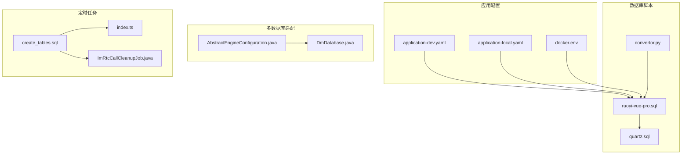
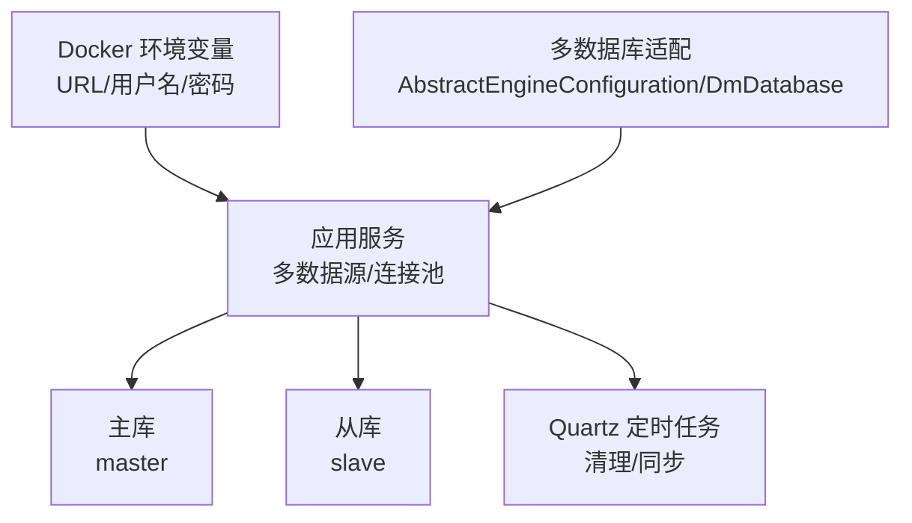
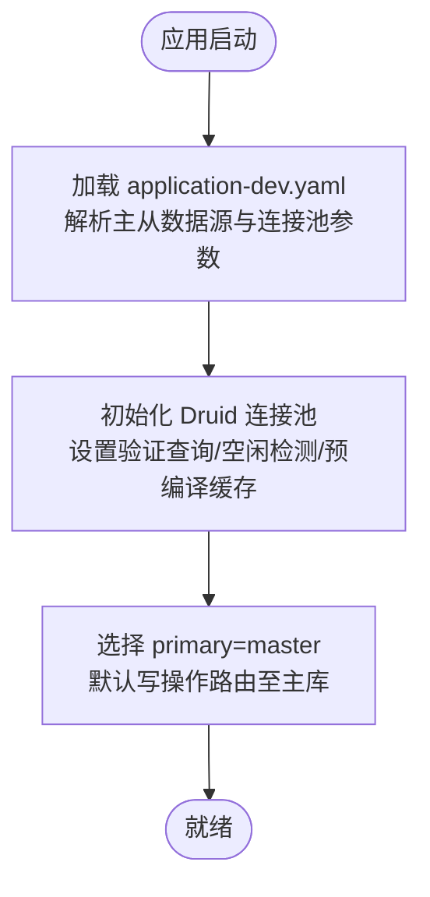
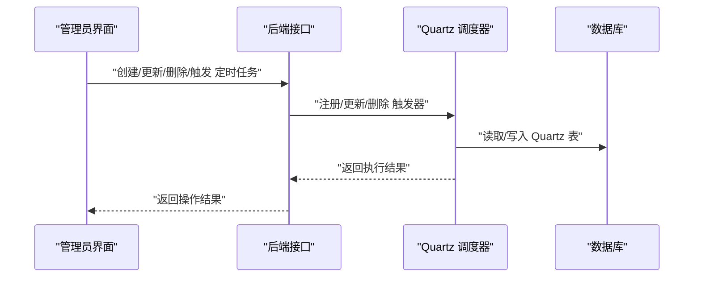
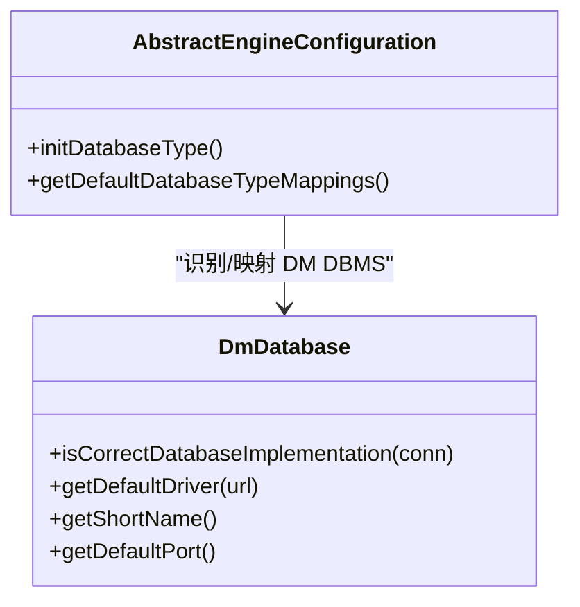
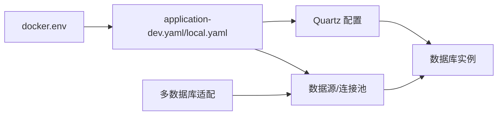

# 数据库维护

<cite>
**本文引用的文件**
- [application-dev.yaml](file://yudao-server/src/main/resources/application-dev.yaml)
- [application-local.yaml](file://yudao-server/src/main/resources/application-local.yaml)
- [docker.env](file://script/docker/docker.env)
- [quartz.sql](file://sql/mysql/quartz.sql)
- [ruoyi-vue-pro.sql](file://sql/mysql/ruoyi-vue-pro.sql)
- [AbstractEngineConfiguration.java](file://sql/dm/flowable-patch/src/main/java/org/flowable/common/engine/impl/AbstractEngineConfiguration.java)
- [DmDatabase.java](file://sql/dm/flowable-patch/src/main/java/liquibase/database/core/DmDatabase.java)
- [convertor.py](file://sql/tools/convertor.py)
- [create_tables.sql](file://yudao-module-infra/src/test/resources/sql/create_tables.sql)
- [index.ts](file://yudao-ui/yudao-ui-admin-vue3/src/api/infra/job/index.ts)
- [ImRtcCallCleanupJob.java](file://yudao-module-im/src/main/java/cn/iocoder/yudao/module/im/job/rtc/ImRtcCallCleanupJob.java)
</cite>

## 目录
1. [简介](#简介)
2. [项目结构](#项目结构)
3. [核心组件](#核心组件)
4. [架构总览](#架构总览)
5. [详细组件分析](#详细组件分析)
6. [依赖关系分析](#依赖关系分析)
7. [性能考虑](#性能考虑)
8. [故障排查指南](#故障排查指南)
9. [结论](#结论)
10. [附录](#附录)

## 简介
本指南面向 ruoyi-vue-pro 项目的数据库运维与开发团队，系统化梳理数据库部署配置、初始化脚本、备份策略、性能优化、监控配置、故障处理、版本管理、安全配置以及维护自动化等方面。文档以仓库中的配置文件、SQL 脚本与相关组件为依据，结合实际可落地的操作建议，帮助读者完成数据库的稳定运行与持续演进。

## 项目结构
围绕数据库相关的文件主要分布在以下位置：
- 应用配置：yudao-server/src/main/resources 下的环境配置文件，定义了多数据源（主库/从库）、连接池参数与数据源 URL、用户名、密码等。
- Docker 环境变量：script/docker/docker.env，集中定义了主从库地址、账号与密码，便于容器化部署。
- 初始化脚本：sql/mysql 下包含 Quartz 定时任务表与业务库初始化 SQL；sql/tools 提供跨数据库 DDL 转换工具。
- 多数据库适配：sql/dm/flowable-patch 中包含对达梦数据库（DM DBMS）的支持类与服务注册，体现对多种数据库的兼容能力。
- 测试与演示：yudao-module-infra/src/test/resources/sql 提供基础表结构示例，便于理解建表规范与字段设计。
- 定时任务：sql/mysql/quartz.sql 与 yudao-ui/yudao-ui-admin-vue3/src/api/infra/job/index.ts、yudao-module-im/src/main/java/cn/iocoder/yudao/module/im/job/rtc/ImRtcCallCleanupJob.java 展示了基于 Quartz 的定时任务清理策略。

**图表来源**
- [application-dev.yaml:36-57](file://yudao-server/src/main/resources/application-dev.yaml#L36-L57)
- [application-local.yaml:34-90](file://yudao-server/src/main/resources/application-local.yaml#L34-L90)
- [docker.env:1-25](file://script/docker/docker.env#L1-L25)
- [ruoyi-vue-pro.sql](file://sql/mysql/ruoyi-vue-pro.sql)
- [quartz.sql](file://sql/mysql/quartz.sql)
- [convertor.py:319-345](file://sql/tools/convertor.py#L319-L345)
- [AbstractEngineConfiguration.java:367-518](file://sql/dm/flowable-patch/src/main/java/org/flowable/common/engine/impl/AbstractEngineConfiguration.java#L367-L518)
- [DmDatabase.java:41-137](file://sql/dm/flowable-patch/src/main/java/liquibase/database/core/DmDatabase.java#L41-L137)
- [create_tables.sql:34-67](file://yudao-module-infra/src/test/resources/sql/create_tables.sql#L34-L67)
- [index.ts:1-68](file://yudao-ui/yudao-ui-admin-vue3/src/api/infra/job/index.ts#L1-L68)
- [ImRtcCallCleanupJob.java:43-58](file://yudao-module-im/src/main/java/cn/iocoder/yudao/module/im/job/rtc/ImRtcCallCleanupJob.java#L43-L58)

**章节来源**
- [application-dev.yaml:36-57](file://yudao-server/src/main/resources/application-dev.yaml#L36-L57)
- [application-local.yaml:34-90](file://yudao-server/src/main/resources/application-local.yaml#L34-L90)
- [docker.env:1-25](file://script/docker/docker.env#L1-L25)
- [ruoyi-vue-pro.sql](file://sql/mysql/ruoyi-vue-pro.sql)
- [quartz.sql](file://sql/mysql/quartz.sql)
- [convertor.py:319-345](file://sql/tools/convertor.py#L319-L345)
- [AbstractEngineConfiguration.java:367-518](file://sql/dm/flowable-patch/src/main/java/org/flowable/common/engine/impl/AbstractEngineConfiguration.java#L367-L518)
- [DmDatabase.java:41-137](file://sql/dm/flowable-patch/src/main/java/liquibase/database/core/DmDatabase.java#L41-L137)
- [create_tables.sql:34-67](file://yudao-module-infra/src/test/resources/sql/create_tables.sql#L34-L67)
- [index.ts:1-68](file://yudao-ui/yudao-ui-admin-vue3/src/api/infra/job/index.ts#L1-L68)
- [ImRtcCallCleanupJob.java:43-58](file://yudao-module-im/src/main/java/cn/iocoder/yudao/module/im/job/rtc/ImRtcCallCleanupJob.java#L43-L58)

## 核心组件
- 多数据源与连接池配置：通过 application-dev.yaml 与 application-local.yaml 定义主库与从库的数据源、连接池大小、等待时间、空闲检测周期、预编译语句缓存等参数，并设置 primary 指向 master。
- Docker 环境变量：docker.env 统一注入主从库 URL、用户名、密码，便于容器化部署时快速替换。
- Quartz 定时任务：quartz.sql 提供 Quartz 内置表结构与常用触发器记录，支撑系统内部的定时清理与同步任务。
- 多数据库适配：AbstractEngineConfiguration 与 DmDatabase 支持识别 DM DBMS 并映射到对应数据库类型，确保 Liquibase 等工具链正确工作。
- 初始化脚本：ruoyi-vue-pro.sql 作为业务库初始化脚本，配合 convertor.py 可实现不同数据库之间的 DDL 转换。
- 定时任务清理：create_tables.sql 展示了定时任务表结构；前端 API 与后端 Job 实现了任务的增删改查与触发执行。

**章节来源**
- [application-dev.yaml:36-57](file://yudao-server/src/main/resources/application-dev.yaml#L36-L57)
- [application-local.yaml:34-90](file://yudao-server/src/main/resources/application-local.yaml#L34-L90)
- [docker.env:1-25](file://script/docker/docker.env#L1-L25)
- [quartz.sql:71-76](file://sql/mysql/quartz.sql#L71-L76)
- [AbstractEngineConfiguration.java:379-463](file://sql/dm/flowable-patch/src/main/java/org/flowable/common/engine/impl/AbstractEngineConfiguration.java#L379-L463)
- [DmDatabase.java:41-137](file://sql/dm/flowable-patch/src/main/java/liquibase/database/core/DmDatabase.java#L41-L137)
- [convertor.py:319-345](file://sql/tools/convertor.py#L319-L345)
- [create_tables.sql:34-67](file://yudao-module-infra/src/test/resources/sql/create_tables.sql#L34-L67)
- [index.ts:1-68](file://yudao-ui/yudao-ui-admin-vue3/src/api/infra/job/index.ts#L1-L68)
- [ImRtcCallCleanupJob.java:43-58](file://yudao-module-im/src/main/java/cn/iocoder/yudao/module/im/job/rtc/ImRtcCallCleanupJob.java#L43-L58)

## 架构总览
下图展示了 ruoyi-vue-pro 的数据库侧架构要点：应用层通过多数据源连接池访问主库与从库；Quartz 定时任务负责后台清理与同步；容器化部署通过 docker.env 注入统一的数据库连接参数；多数据库适配层确保不同数据库类型下的兼容性。

**图表来源**
- [application-dev.yaml:36-57](file://yudao-server/src/main/resources/application-dev.yaml#L36-L57)
- [application-local.yaml:34-90](file://yudao-server/src/main/resources/application-local.yaml#L34-L90)
- [docker.env:1-25](file://script/docker/docker.env#L1-L25)
- [quartz.sql:71-76](file://sql/mysql/quartz.sql#L71-L76)
- [AbstractEngineConfiguration.java:367-518](file://sql/dm/flowable-patch/src/main/java/org/flowable/common/engine/impl/AbstractEngineConfiguration.java#L367-L518)
- [DmDatabase.java:41-137](file://sql/dm/flowable-patch/src/main/java/liquibase/database/core/DmDatabase.java#L41-L137)

## 详细组件分析

### 多数据源与连接池配置
- 主从库配置：application-dev.yaml 中定义了 master 与 slave 两个数据源，均采用 MySQL URL 样式，并通过 primary 指向 master，实现读写分离的默认路由。
- 连接池参数：包括初始连接数、最小空闲、最大活跃、获取连接最大等待时间、空闲连接驱逐周期、最小/最大空闲存活时间、验证查询、空闲检测开关等；同时启用 PreparedStatement 缓存与每连接最大缓存数量。
- 本地开发配置：application-local.yaml 同样提供类似配置，并包含 PostgreSQL 示例从库，便于多数据库验证。

**图表来源**
- [application-dev.yaml:36-57](file://yudao-server/src/main/resources/application-dev.yaml#L36-L57)
- [application-local.yaml:34-90](file://yudao-server/src/main/resources/application-local.yaml#L34-L90)

**章节来源**
- [application-dev.yaml:36-57](file://yudao-server/src/main/resources/application-dev.yaml#L36-L57)
- [application-local.yaml:34-90](file://yudao-server/src/main/resources/application-local.yaml#L34-L90)

### 容器化部署与环境变量
- docker.env 将主从库 URL、用户名、密码集中管理，便于在 Docker Compose 或 CI 环境中统一替换，减少硬编码风险。
- 建议在生产环境中通过密钥管理服务注入敏感信息，并限制容器网络访问范围。

**章节来源**
- [docker.env:1-25](file://script/docker/docker.env#L1-L25)

### Quartz 定时任务与清理策略
- Quartz 表结构与触发器：quartz.sql 提供 Quartz 内置表及常用触发器记录，用于后台任务的调度与持久化。
- 业务清理任务：create_tables.sql 展示了定时任务表结构；前端 API 与后端 Job 支持任务的增删改查、状态变更与立即执行；ImRtcCallCleanupJob 展示了基于参数的清理阈值解析逻辑，体现可配置的清理策略。

**图表来源**
- [quartz.sql:71-76](file://sql/mysql/quartz.sql#L71-L76)
- [create_tables.sql:34-67](file://yudao-module-infra/src/test/resources/sql/create_tables.sql#L34-L67)
- [index.ts:1-68](file://yudao-ui/yudao-ui-admin-vue3/src/api/infra/job/index.ts#L1-L68)
- [ImRtcCallCleanupJob.java:43-58](file://yudao-module-im/src/main/java/cn/iocoder/yudao/module/im/job/rtc/ImRtcCallCleanupJob.java#L43-L58)

**章节来源**
- [quartz.sql:71-76](file://sql/mysql/quartz.sql#L71-L76)
- [create_tables.sql:34-67](file://yudao-module-infra/src/test/resources/sql/create_tables.sql#L34-L67)
- [index.ts:1-68](file://yudao-ui/yudao-ui-admin-vue3/src/api/infra/job/index.ts#L1-L68)
- [ImRtcCallCleanupJob.java:43-58](file://yudao-module-im/src/main/java/cn/iocoder/yudao/module/im/job/rtc/ImRtcCallCleanupJob.java#L43-L58)

### 多数据库适配（含 DM DBMS）
- 类型识别与映射：AbstractEngineConfiguration 中包含数据库产品名到类型映射，支持 MySQL、PostgreSQL、Oracle、SQL Server、DB2、CockroachDB 等；对 DM DBMS 映射为 Oracle 类型，便于后续处理。
- DM 数据库支持：DmDatabase 提供 DM DBMS 的默认驱动、短名、默认端口、标识符长度、序列函数等特性，确保 Liquibase 等工具链在 DM 上正常工作。

**图表来源**
- [AbstractEngineConfiguration.java:367-518](file://sql/dm/flowable-patch/src/main/java/org/flowable/common/engine/impl/AbstractEngineConfiguration.java#L367-L518)
- [DmDatabase.java:41-137](file://sql/dm/flowable-patch/src/main/java/liquibase/database/core/DmDatabase.java#L41-L137)

**章节来源**
- [AbstractEngineConfiguration.java:367-518](file://sql/dm/flowable-patch/src/main/java/org/flowable/common/engine/impl/AbstractEngineConfiguration.java#L367-L518)
- [DmDatabase.java:41-137](file://sql/dm/flowable-patch/src/main/java/liquibase/database/core/DmDatabase.java#L41-L137)

### 初始化脚本与 DDL 转换
- 业务库初始化：ruoyi-vue-pro.sql 作为业务库初始化脚本，建议在新环境首次部署时执行。
- DDL 转换工具：convertor.py 支持剥离注释、解析 DDL、忽略特定表（如 Quartz），并输出目标数据库的建表脚本，便于跨数据库迁移与一致性验证。

**章节来源**
- [ruoyi-vue-pro.sql](file://sql/mysql/ruoyi-vue-pro.sql)
- [convertor.py:319-345](file://sql/tools/convertor.py#L319-L345)

## 依赖关系分析
- 应用配置依赖于数据库类型与连接参数，决定数据源路由与连接池行为。
- Quartz 依赖数据库表结构与触发器配置，保障后台任务的稳定执行。
- 多数据库适配层依赖 JDBC 驱动与数据库产品名识别，确保 Liquibase 等工具链正确工作。
- 容器化部署通过环境变量集中注入数据库连接信息，降低配置漂移风险。

**图表来源**
- [application-dev.yaml:36-57](file://yudao-server/src/main/resources/application-dev.yaml#L36-L57)
- [application-local.yaml:34-90](file://yudao-server/src/main/resources/application-local.yaml#L34-L90)
- [docker.env:1-25](file://script/docker/docker.env#L1-L25)
- [AbstractEngineConfiguration.java:367-518](file://sql/dm/flowable-patch/src/main/java/org/flowable/common/engine/impl/AbstractEngineConfiguration.java#L367-L518)
- [DmDatabase.java:41-137](file://sql/dm/flowable-patch/src/main/java/liquibase/database/core/DmDatabase.java#L41-L137)

**章节来源**
- [application-dev.yaml:36-57](file://yudao-server/src/main/resources/application-dev.yaml#L36-L57)
- [application-local.yaml:34-90](file://yudao-server/src/main/resources/application-local.yaml#L34-L90)
- [docker.env:1-25](file://script/docker/docker.env#L1-L25)
- [AbstractEngineConfiguration.java:367-518](file://sql/dm/flowable-patch/src/main/java/org/flowable/common/engine/impl/AbstractEngineConfiguration.java#L367-L518)
- [DmDatabase.java:41-137](file://sql/dm/flowable-patch/src/main/java/liquibase/database/core/DmDatabase.java#L41-L137)

## 性能考虑
- 连接池参数调优：根据并发峰值调整最大活跃连接、获取连接等待时间与空闲检测周期；启用预编译语句缓存可降低解析开销。
- 读写分离：将只读查询路由至从库，写操作路由至主库，缓解主库压力；注意事务内跨库一致性问题。
- Quartz 任务粒度：合理设置 CRON 表达式与重试间隔，避免高频扫描造成数据库压力。
- DDL 与索引：初始化脚本应包含必要的索引设计；上线前进行慢查询分析与 EXPLAIN 评估，避免全表扫描。
- 多数据库差异：针对不同数据库（如 DM）的特性进行参数微调，确保工具链（Liquibase）与驱动兼容。

[本节为通用指导，不直接分析具体文件]

## 故障排查指南
- 主从延迟与一致性：检查从库复制状态与延迟；在只读查询场景下增加容错与降级策略。
- 连接池异常：关注最大等待时间、空闲驱逐与验证查询配置；必要时缩短最大空闲存活时间或增大最大活跃连接。
- Quartz 任务堆积：查看触发器状态与执行日志，调整 CRON 表达式与并发度；对耗时任务拆分或异步化。
- 多数据库识别错误：确认 JDBC 驱动与数据库产品名映射，避免类型误判导致的迁移失败。
- 容器化部署：核对 docker.env 中的 URL、用户名、密码是否与目标数据库一致，避免启动失败。

**章节来源**
- [application-dev.yaml:36-57](file://yudao-server/src/main/resources/application-dev.yaml#L36-L57)
- [application-local.yaml:34-90](file://yudao-server/src/main/resources/application-local.yaml#L34-L90)
- [docker.env:1-25](file://script/docker/docker.env#L1-L25)
- [AbstractEngineConfiguration.java:367-518](file://sql/dm/flowable-patch/src/main/java/org/flowable/common/engine/impl/AbstractEngineConfiguration.java#L367-L518)
- [DmDatabase.java:41-137](file://sql/dm/flowable-patch/src/main/java/liquibase/database/core/DmDatabase.java#L41-L137)

## 结论
通过规范化的多数据源配置、完善的初始化脚本、容器化环境变量管理、Quartz 定时任务与多数据库适配层，ruoyi-vue-pro 在数据库层面具备良好的可扩展性与可维护性。建议在生产环境中进一步完善备份策略、监控告警与安全加固，并结合业务增长持续优化连接池与查询性能。

[本节为总结性内容，不直接分析具体文件]

## 附录

### 数据库部署配置清单
- 主库与从库 URL、用户名、密码：参考 application-dev.yaml、application-local.yaml 与 docker.env。
- 连接池参数：最大活跃、等待时间、空闲检测周期、验证查询、预编译缓存等。
- Quartz 表结构与触发器：参考 quartz.sql。
- 业务库初始化：参考 ruoyi-vue-pro.sql。
- 多数据库适配：参考 AbstractEngineConfiguration.java 与 DmDatabase.java。

**章节来源**
- [application-dev.yaml:36-57](file://yudao-server/src/main/resources/application-dev.yaml#L36-L57)
- [application-local.yaml:34-90](file://yudao-server/src/main/resources/application-local.yaml#L34-L90)
- [docker.env:1-25](file://script/docker/docker.env#L1-L25)
- [quartz.sql](file://sql/mysql/quartz.sql)
- [ruoyi-vue-pro.sql](file://sql/mysql/ruoyi-vue-pro.sql)
- [AbstractEngineConfiguration.java:367-518](file://sql/dm/flowable-patch/src/main/java/org/flowable/common/engine/impl/AbstractEngineConfiguration.java#L367-L518)
- [DmDatabase.java:41-137](file://sql/dm/flowable-patch/src/main/java/liquibase/database/core/DmDatabase.java#L41-L137)