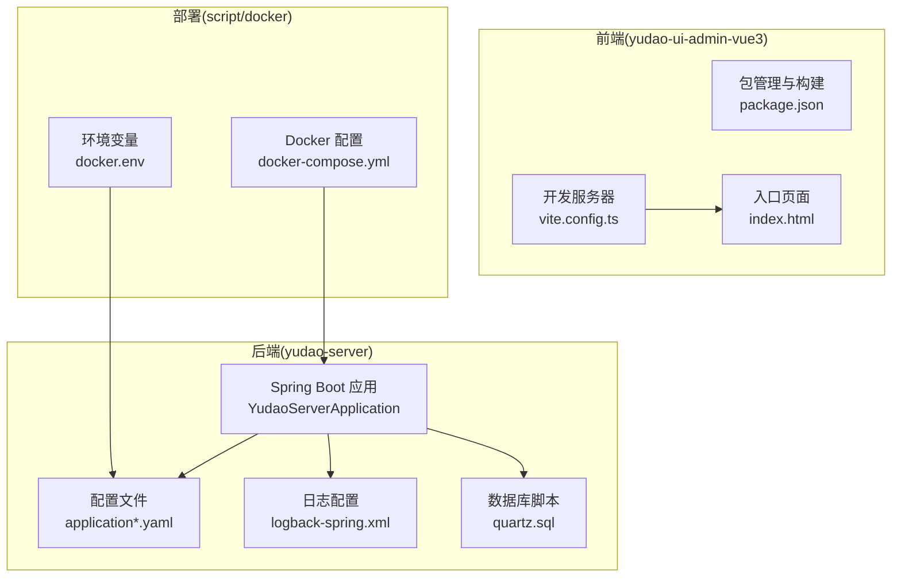
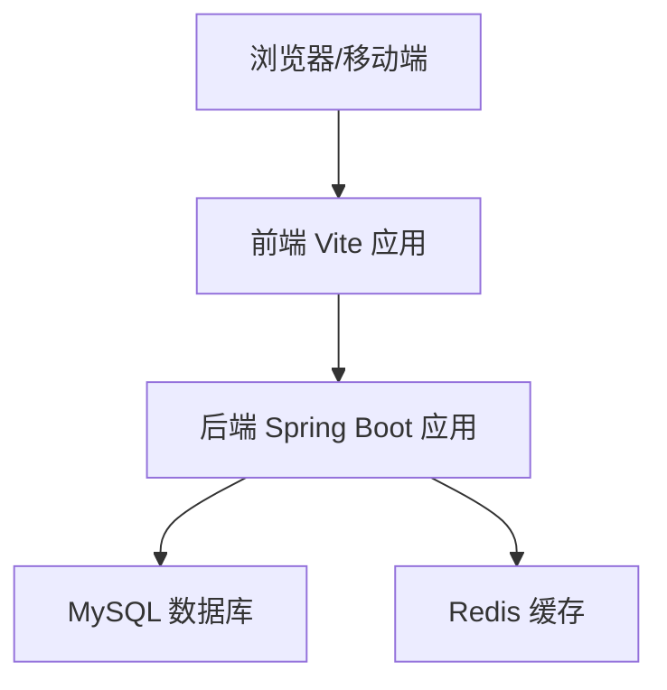
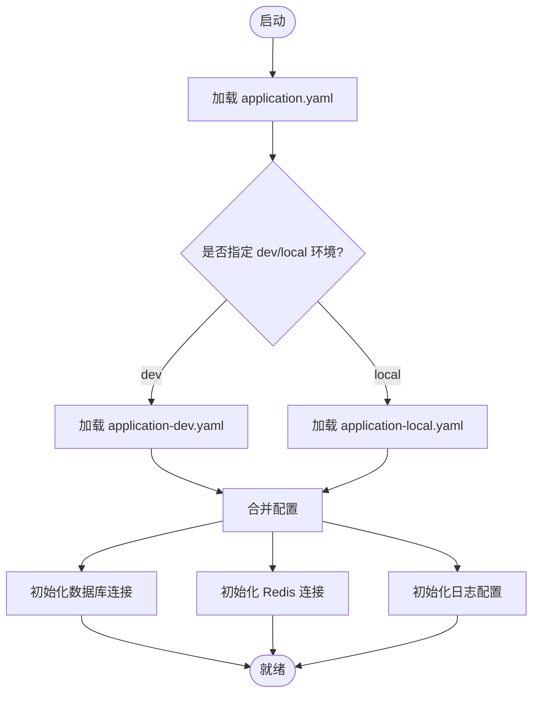
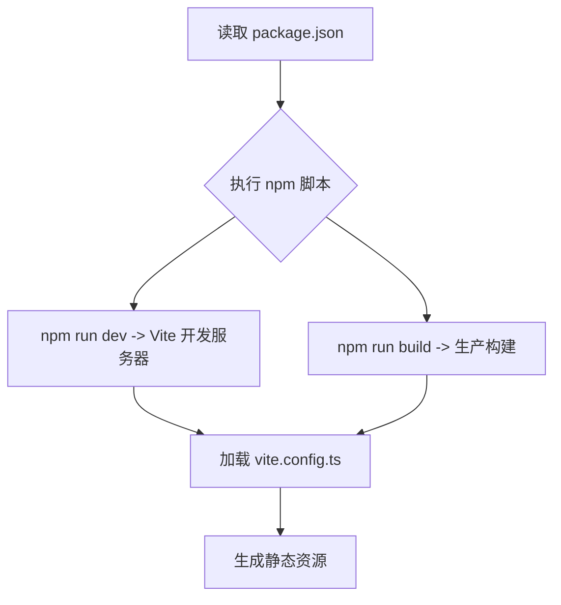
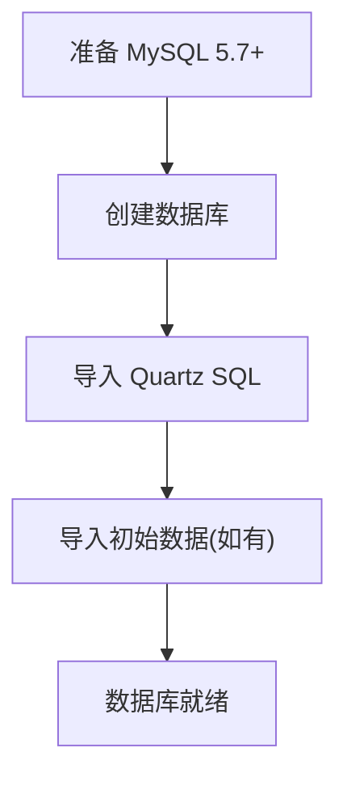
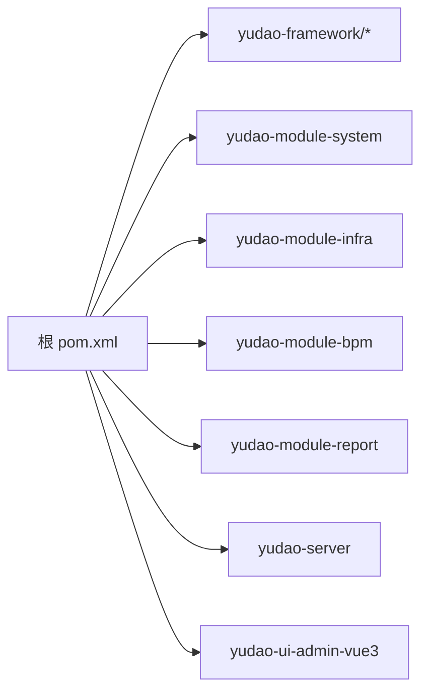

# 本地部署

<cite>
**本文引用的文件**
- [pom.xml](file://pom.xml)
- [yudao-server/src/main/resources/application.yaml](file://yudao-server/src/main/resources/application.yaml)
- [yudao-server/src/main/resources/application-local.yaml](file://yudao-server/src/main/resources/application-local.yaml)
- [yudao-server/src/main/resources/application-dev.yaml](file://yudao-server/src/main/resources/application-dev.yaml)
- [yudao-server/src/main/resources/logback-spring.xml](file://yudao-server/src/main/resources/logback-spring.xml)
- [yudao-server/Dockerfile](file://yudao-server/Dockerfile)
- [sql/mysql/quartz.sql](file://sql/mysql/quartz.sql)
- [yudao-ui/yudao-ui-admin-vue3/package.json](file://yudao-ui/yudao-ui-admin-vue3/package.json)
- [yudao-ui/yudao-ui-admin-vue3/vite.config.ts](file://yudao-ui/yudao-ui-admin-vue3/vite.config.ts)
- [yudao-ui/yudao-ui-admin-vue3/index.html](file://yudao-ui/yudao-ui-admin-vue3/index.html)
- [script/docker/docker-compose.yml](file://script/docker/docker-compose.yml)
- [script/docker/docker.env](file://script/docker/docker.env)
- [yudao-ui/yudao-ui-admin-vue3/.editorconfig](file://yudao-ui/yudao-ui-admin-vue3/.editorconfig)
- [yudao-ui/yudao-ui-admin-vue3/tsconfig.json](file://yudao-ui/yudao-ui-admin-vue3/tsconfig.json)
- [yudao-ui/yudao-ui-admin-vue3/eslint.config.mjs](file://yudao-ui/yudao-ui-admin-vue3/eslint.config.mjs)
- [yudao-ui/yudao-ui-admin-vue3/prettier.config.js](file://yudao-ui/yudao-ui-admin-vue3/prettier.config.js)
- [yudao-ui/yudao-ui-admin-vue3/stylelint.config.js](file://yudao-ui/yudao-ui-admin-vue3/stylelint.config.js)
- [yudao-ui/yudao-ui-admin-vue3/postcss.config.js](file://yudao-ui/yudao-ui-admin-vue3/postcss.config.js)
- [yudao-ui/yudao-ui-admin-vue3/uno.config.ts](file://yudao-ui/yudao-ui-admin-vue3/uno.config.ts)
- [yudao-ui/yudao-ui-admin-vue3/web-types.json](file://yudao-ui/yudao-ui-admin-vue3/web-types.json)
- [README.md](file://README.md)
</cite>

## 目录
1. [简介](#简介)
2. [项目结构](#项目结构)
3. [核心组件](#核心组件)
4. [架构总览](#架构总览)
5. [详细组件分析](#详细组件分析)
6. [依赖分析](#依赖分析)
7. [性能考虑](#性能考虑)
8. [故障排除指南](#故障排除指南)
9. [结论](#结论)
10. [附录](#附录)

## 简介
本指南面向希望在本地部署芋道 ruoyi-vue-pro 的开发者，涵盖从环境准备到应用启动、数据库初始化、配置修改、常见问题排查以及开发调试的完整流程。项目采用前后端分离架构：后端基于 Spring Boot 的多模块工程，前端基于 Vue 3 + Vite。

## 项目结构
- 后端服务位于 yudao-server，包含 Spring Boot 应用入口与配置文件。
- 前端位于 yudao-ui/yudao-ui-admin-vue3，使用 Vite 构建与开发。
- 数据库脚本位于 sql/mysql，包含 Quartz 调度相关 SQL。
- Docker 部署参考位于 script/docker，可作为本地或生产部署的参考。
- 顶层 pom.xml 管理多模块聚合构建。

**图表来源**
- [yudao-server/src/main/resources/application.yaml](file://yudao-server/src/main/resources/application.yaml)
- [yudao-server/src/main/resources/application-local.yaml](file://yudao-server/src/main/resources/application-local.yaml)
- [yudao-server/src/main/resources/application-dev.yaml](file://yudao-server/src/main/resources/application-dev.yaml)
- [yudao-server/src/main/resources/logback-spring.xml](file://yudao-server/src/main/resources/logback-spring.xml)
- [sql/mysql/quartz.sql](file://sql/mysql/quartz.sql)
- [yudao-ui/yudao-ui-admin-vue3/package.json](file://yudao-ui/yudao-ui-admin-vue3/package.json)
- [yudao-ui/yudao-ui-admin-vue3/vite.config.ts](file://yudao-ui/yudao-ui-admin-vue3/vite.config.ts)
- [yudao-ui/yudao-ui-admin-vue3/index.html](file://yudao-ui/yudao-ui-admin-vue3/index.html)
- [script/docker/docker-compose.yml](file://script/docker/docker-compose.yml)
- [script/docker/docker.env](file://script/docker/docker.env)

**章节来源**
- [pom.xml](file://pom.xml)
- [README.md](file://README.md)

## 核心组件
- 后端 Spring Boot 应用：负责业务接口、定时任务、消息队列、安全认证等。
- 前端 Vite 应用：提供管理后台界面，支持热更新与 TypeScript。
- 数据库脚本：包含 Quartz 调度表结构，用于定时任务。
- Docker 编排：提供容器化部署参考，便于本地快速搭建。

**章节来源**
- [yudao-server/src/main/resources/application.yaml](file://yudao-server/src/main/resources/application.yaml)
- [yudao-ui/yudao-ui-admin-vue3/package.json](file://yudao-ui/yudao-ui-admin-vue3/package.json)
- [sql/mysql/quartz.sql](file://sql/mysql/quartz.sql)
- [script/docker/docker-compose.yml](file://script/docker/docker-compose.yml)

## 架构总览
系统采用前后端分离架构，后端通过 HTTP API 提供数据与业务能力，前端通过 Vite 进行开发与构建。数据库与缓存（Redis）由后端统一配置访问。

[此图为概念性架构示意，无需图表来源]

## 详细组件分析

### 后端应用配置
- 配置文件层次
  - application.yaml：基础配置与激活的环境配置。
  - application-dev.yaml：开发环境专用配置（如数据库、Redis、文件存储等）。
  - application-local.yaml：本地开发覆盖项（优先级更高）。
- 日志配置
  - logback-spring.xml：定义日志输出格式、级别与文件输出策略。
- Docker 支持
  - Dockerfile：定义镜像构建步骤。
  - docker-compose.yml：编排后端服务与依赖（数据库、缓存等）。
  - docker.env：环境变量模板，便于替换数据库、Redis 等连接参数。

**图表来源**
- [yudao-server/src/main/resources/application.yaml](file://yudao-server/src/main/resources/application.yaml)
- [yudao-server/src/main/resources/application-dev.yaml](file://yudao-server/src/main/resources/application-dev.yaml)
- [yudao-server/src/main/resources/application-local.yaml](file://yudao-server/src/main/resources/application-local.yaml)
- [yudao-server/src/main/resources/logback-spring.xml](file://yudao-server/src/main/resources/logback-spring.xml)

**章节来源**
- [yudao-server/src/main/resources/application.yaml](file://yudao-server/src/main/resources/application.yaml)
- [yudao-server/src/main/resources/application-dev.yaml](file://yudao-server/src/main/resources/application-dev.yaml)
- [yudao-server/src/main/resources/application-local.yaml](file://yudao-server/src/main/resources/application-local.yaml)
- [yudao-server/src/main/resources/logback-spring.xml](file://yudao-server/src/main/resources/logback-spring.xml)
- [yudao-server/Dockerfile](file://yudao-server/Dockerfile)
- [script/docker/docker-compose.yml](file://script/docker/docker-compose.yml)
- [script/docker/docker.env](file://script/docker/docker.env)

### 前端开发配置
- 包管理与依赖
  - package.json：声明依赖与脚本命令（如 dev、build）。
- 构建与开发
  - vite.config.ts：Vite 开发服务器与构建配置。
  - index.html：前端入口页面。
- 工程质量工具
  - tsconfig.json、eslint.config.mjs、prettier.config.js、stylelint.config.js、postcss.config.js、uno.config.ts、web-types.json、.editorconfig：统一代码风格与构建规范。

**图表来源**
- [yudao-ui/yudao-ui-admin-vue3/package.json](file://yudao-ui/yudao-ui-admin-vue3/package.json)
- [yudao-ui/yudao-ui-admin-vue3/vite.config.ts](file://yudao-ui/yudao-ui-admin-vue3/vite.config.ts)
- [yudao-ui/yudao-ui-admin-vue3/index.html](file://yudao-ui/yudao-ui-admin-vue3/index.html)

**章节来源**
- [yudao-ui/yudao-ui-admin-vue3/package.json](file://yudao-ui/yudao-ui-admin-vue3/package.json)
- [yudao-ui/yudao-ui-admin-vue3/vite.config.ts](file://yudao-ui/yudao-ui-admin-vue3/vite.config.ts)
- [yudao-ui/yudao-ui-admin-vue3/index.html](file://yudao-ui/yudao-ui-admin-vue3/index.html)
- [yudao-ui/yudao-ui-admin-vue3/tsconfig.json](file://yudao-ui/yudao-ui-admin-vue3/tsconfig.json)
- [yudao-ui/yudao-ui-admin-vue3/eslint.config.mjs](file://yudao-ui/yudao-ui-admin-vue3/eslint.config.mjs)
- [yudao-ui/yudao-ui-admin-vue3/prettier.config.js](file://yudao-ui/yudao-ui-admin-vue3/prettier.config.js)
- [yudao-ui/yudao-ui-admin-vue3/stylelint.config.js](file://yudao-ui/yudao-ui-admin-vue3/stylelint.config.js)
- [yudao-ui/yudao-ui-admin-vue3/postcss.config.js](file://yudao-ui/yudao-ui-admin-vue3/postcss.config.js)
- [yudao-ui/yudao-ui-admin-vue3/uno.config.ts](file://yudao-ui/yudao-ui-admin-vue3/uno.config.ts)
- [yudao-ui/yudao-ui-admin-vue3/web-types.json](file://yudao-ui/yudao-ui-admin-vue3/web-types.json)
- [yudao-ui/yudao-ui-admin-vue3/.editorconfig](file://yudao-ui/yudao-ui-admin-vue3/.editorconfig)

### 数据库与缓存
- MySQL 初始化
  - 使用 sql/mysql/quartz.sql 初始化调度相关表。
- Redis
  - 在后端配置文件中设置连接参数（主机、端口、密码、数据库索引等）。

**图表来源**
- [sql/mysql/quartz.sql](file://sql/mysql/quartz.sql)

**章节来源**
- [sql/mysql/quartz.sql](file://sql/mysql/quartz.sql)

## 依赖分析
- 顶层聚合工程
  - pom.xml：管理 yudao-framework、yudao-module-*、yudao-server、yudao-ui 等模块的构建顺序与版本。
- 后端模块
  - yudao-server：Spring Boot 应用模块，依赖 yudao-framework 与各业务模块。
- 前端模块
  - yudao-ui-admin-vue3：独立的前端工程，通过 package.json 管理依赖。

**图表来源**
- [pom.xml](file://pom.xml)

**章节来源**
- [pom.xml](file://pom.xml)

## 性能考虑
- 合理设置日志级别，避免在生产环境开启过细的日志。
- 前端开发阶段启用 Vite 的热更新与按需打包，减少不必要的资源加载。
- 后端使用连接池与缓存（Redis）优化数据库访问与热点数据读取。

[本节为通用建议，无需章节来源]

## 故障排除指南
- 端口冲突
  - 后端默认端口可在 application-dev.yaml 中调整；前端开发服务器端口在 vite.config.ts 中配置。
- 数据库连接失败
  - 检查 application-dev.yaml 中的数据库连接字符串、用户名、密码与数据库名；确保 MySQL 5.7+ 正常运行且网络可达。
- Redis 连接失败
  - 检查 application-dev.yaml 中 Redis 主机、端口、密码与数据库索引；确保 Redis 5+ 正常运行。
- 依赖缺失或版本不兼容
  - 后端使用 Maven 管理依赖，确保 JDK 版本满足要求；前端使用 pnpm 管理依赖，确保 Node.js 版本满足要求。
- 前端无法启动
  - 确认已安装 pnpm 并执行依赖安装；检查 vite.config.ts 与 package.json 中的脚本命令。
- Docker 启动异常
  - 参考 docker-compose.yml 与 docker.env，确保环境变量与端口映射正确。

**章节来源**
- [yudao-server/src/main/resources/application-dev.yaml](file://yudao-server/src/main/resources/application-dev.yaml)
- [yudao-ui/yudao-ui-admin-vue3/vite.config.ts](file://yudao-ui/yudao-ui-admin-vue3/vite.config.ts)
- [script/docker/docker-compose.yml](file://script/docker/docker-compose.yml)
- [script/docker/docker.env](file://script/docker/docker.env)

## 结论
通过本指南，您可以在本地完成 ruoyi-vue-pro 的环境准备、数据库初始化、配置修改与服务启动，并具备常见问题的排查能力。建议在开发过程中结合热部署与日志配置提升调试效率。

[本节为总结性内容，无需章节来源]

## 附录

### 开发环境准备清单
- JDK 8+
- MySQL 5.7+
- Redis 5+

**章节来源**
- [yudao-server/src/main/resources/application-dev.yaml](file://yudao-server/src/main/resources/application-dev.yaml)

### 项目克隆与依赖安装
- 克隆仓库后，后端使用 Maven 下载依赖，前端使用 pnpm 安装依赖。
- 若使用 Docker，可参考 script/docker/docker-compose.yml 一键拉起后端与依赖服务。

**章节来源**
- [pom.xml](file://pom.xml)
- [yudao-ui/yudao-ui-admin-vue3/package.json](file://yudao-ui/yudao-ui-admin-vue3/package.json)
- [script/docker/docker-compose.yml](file://script/docker/docker-compose.yml)

### 数据库初始化步骤
- 创建数据库
- 导入 sql/mysql/quartz.sql
- 如有需要，导入其他初始数据脚本

**章节来源**
- [sql/mysql/quartz.sql](file://sql/mysql/quartz.sql)

### 应用配置文件修改要点
- 数据库连接：application-dev.yaml 中的数据库连接参数
- Redis 配置：application-dev.yaml 中的 Redis 连接参数
- 文件存储路径：根据实际部署路径在配置中设置
- 环境选择：通过 application.yaml 激活 dev 或 local 环境

**章节来源**
- [yudao-server/src/main/resources/application.yaml](file://yudao-server/src/main/resources/application.yaml)
- [yudao-server/src/main/resources/application-dev.yaml](file://yudao-server/src/main/resources/application-dev.yaml)
- [yudao-server/src/main/resources/application-local.yaml](file://yudao-server/src/main/resources/application-local.yaml)

### 服务启动方法
- 后端 Spring Boot 应用：通过 IDE 或命令行启动 yudao-server 模块
- 前端 Vite 开发服务器：在 yudao-ui-admin-vue3 目录下执行开发命令
- Docker：使用 docker-compose 启动

**章节来源**
- [yudao-server/Dockerfile](file://yudao-server/Dockerfile)
- [script/docker/docker-compose.yml](file://script/docker/docker-compose.yml)
- [yudao-ui/yudao-ui-admin-vue3/package.json](file://yudao-ui/yudao-ui-admin-vue3/package.json)

### 开发调试配置
- 热部署：前端使用 Vite 热更新；后端可配合 devtools 或重启策略
- 断点调试：IDE 中以 debug 模式启动后端应用
- 日志配置：通过 logback-spring.xml 设置日志级别与输出位置

**章节来源**
- [yudao-ui/yudao-ui-admin-vue3/vite.config.ts](file://yudao-ui/yudao-ui-admin-vue3/vite.config.ts)
- [yudao-server/src/main/resources/logback-spring.xml](file://yudao-server/src/main/resources/logback-spring.xml)