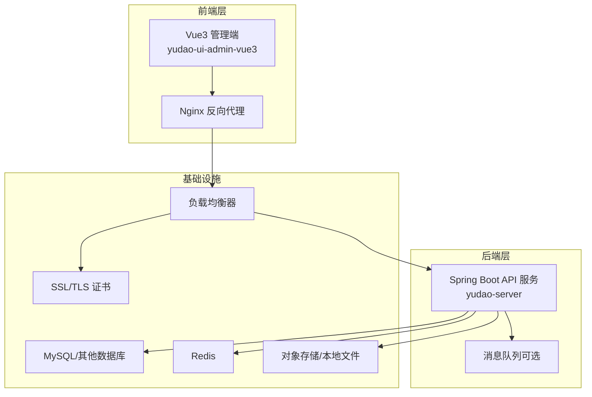
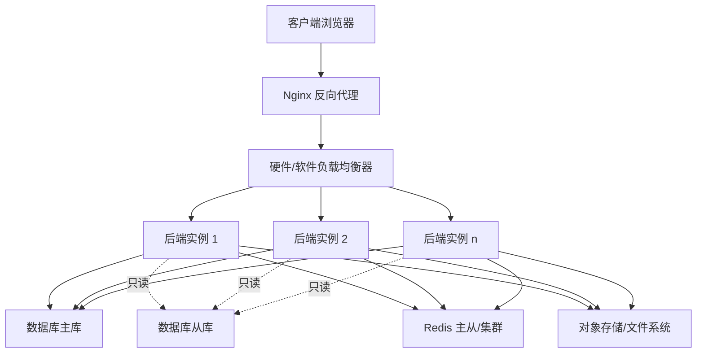
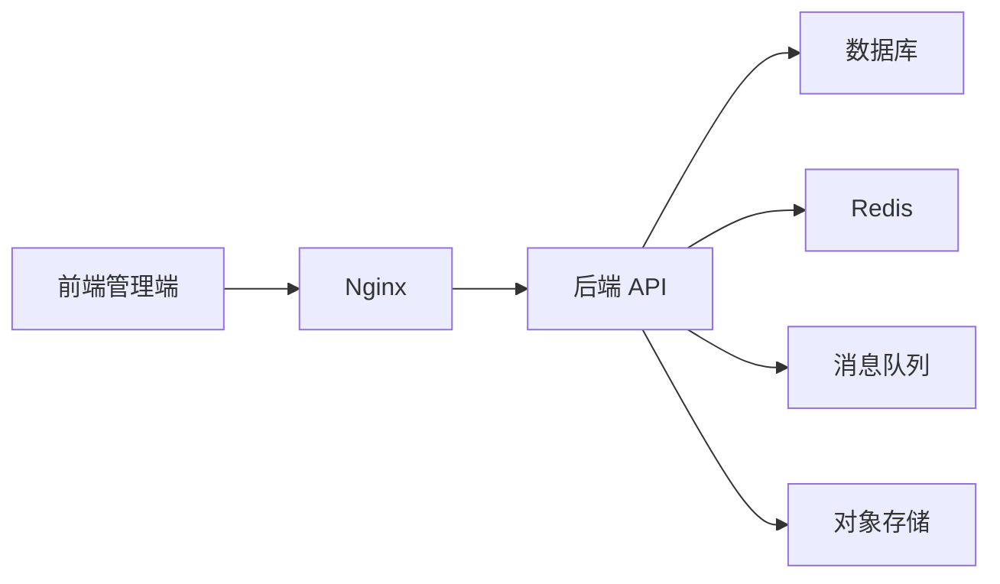

# 生产环境部署

<cite>
**本文引用的文件**
- [Docker-HOWTO.md](file://script/docker/Docker-HOWTO.md)
- [docker-compose.yml](file://script/docker/docker-compose.yml)
- [docker.env](file://script/docker/docker.env)
- [application.yaml](file://yudao-server/src/main/resources/application.yaml)
- [application-dev.yaml](file://yudao-server/src/main/resources/application-dev.yaml)
- [application-local.yaml](file://yudao-server/src/main/resources/application-local.yaml)
- [YudaoMetricsAutoConfiguration.java](file://yudao-framework/yudao-spring-boot-starter-monitor/src/main/java/cn/iocoder/yudao/framework/tracer/config/YudaoMetricsAutoConfiguration.java)
- [pom.xml（监控模块）](file://yudao-framework/yudao-spring-boot-starter-monitor/pom.xml)
- [Jenkinsfile](file://script/jenkins/Jenkinsfile)
- [deploy.sh](file://script/shell/deploy.sh)
- [Dockerfile（后端）](file://yudao-server/Dockerfile)
</cite>

## 目录
1. [简介](#简介)
2. [项目结构](#项目结构)
3. [核心组件](#核心组件)
4. [架构总览](#架构总览)
5. [详细组件分析](#详细组件分析)
6. [依赖分析](#依赖分析)
7. [性能考虑](#性能考虑)
8. [故障排查指南](#故障排查指南)
9. [结论](#结论)
10. [附录](#附录)

## 简介
本指南面向生产环境部署“芋道 ruoyi-vue-pro”，围绕服务器配置、网络拓扑与高可用架构、Nginx 反向代理、负载均衡、SSL 证书、数据库配置（主从/读写分离/集群）、应用服务器（JVM/线程池/内存）、文件存储、备份与恢复、性能监控等维度，提供可落地的实施建议与参考配置来源。

## 项目结构
- 后端服务：基于 Spring Boot 的 yudao-server，提供 API 服务与业务能力。
- 前端界面：yudao-ui-admin-vue3，打包为静态资源由 Nginx 提供。
- 部署与自动化：提供 Docker Compose 快速编排、Jenkinsfile CI/CD 流水线、Shell 部署脚本。
- 监控与可观测性：内置 Micrometer + Prometheus + Spring Boot Admin 客户端能力。

图示来源
- [docker-compose.yml:29-78](file://script/docker/docker-compose.yml#L29-L78)
- [application.yaml](file://yudao-server/src/main/resources/application.yaml)

章节来源
- [Docker-HOWTO.md:1-50](file://script/docker/Docker-HOWTO.md#L1-L50)
- [docker-compose.yml:29-78](file://script/docker/docker-compose.yml#L29-L78)

## 核心组件
- 后端 API 服务（yudao-server）
  - 多数据源与读写分离配置位于 application-dev.yaml、application-local.yaml 中。
  - 监控与指标暴露通过 yudao-spring-boot-starter-monitor 提供。
- 前端管理端（yudao-ui-admin-vue3）
  - 通过 Nginx 提供静态资源与 API 反向代理。
- 基础设施
  - MySQL/Redis 作为默认持久化与缓存；可扩展至集群/分片。
  - 可选消息队列（RabbitMQ/Kafka/RocketMQ）用于异步解耦。
  - 文件存储可采用对象存储或分布式文件系统。

章节来源
- [application-dev.yaml:1-37](file://yudao-server/src/main/resources/application-dev.yaml#L1-L37)
- [application-local.yaml:1-90](file://yudao-server/src/main/resources/application-local.yaml#L1-L90)
- [YudaoMetricsAutoConfiguration.java:1-27](file://yudao-framework/yudao-spring-boot-starter-monitor/src/main/java/cn/iocoder/yudao/framework/tracer/config/YudaoMetricsAutoConfiguration.java#L1-L27)

## 架构总览
生产环境推荐采用“Nginx + 负载均衡 + 多实例后端 + 数据库主从/集群 + 缓存 + 对象存储”的高可用架构。前端静态资源与 API 请求经由 Nginx 统一入口，后端通过多实例横向扩展，数据库采用主从复制与只读路由实现读写分离，缓存提升热点数据访问性能，对象存储承载文件上传与归档。

图示来源
- [docker-compose.yml:29-78](file://script/docker/docker-compose.yml#L29-L78)
- [application-dev.yaml:32-37](file://yudao-server/src/main/resources/application-dev.yaml#L32-L37)
- [application-local.yaml:68-89](file://yudao-server/src/main/resources/application-local.yaml#L68-L89)

## 详细组件分析

### Nginx 反向代理配置
- 静态资源服务
  - 将前端构建产物（dist）挂载到 Nginx 的静态目录，启用 gzip 压缩与缓存头，减少带宽与延迟。
- 反向代理规则
  - 将 /prod-api 前缀的请求转发至后端 API 服务，设置合理的超时与缓冲区大小，避免长尾请求拖垮网关。
- 缓存配置
  - 对静态资源（如 JS/CSS/图片）设置强缓存策略；对动态接口设置合理的 Cache-Control 或 ETag。
- SSL 与安全
  - 启用 HTTPS，配置现代加密套件与 TLS 版本；开启 HSTS；限制 HTTP 方法与来源域名。

章节来源
- [Docker-HOWTO.md:18-18](file://script/docker/Docker-HOWTO.md#L18-L18)

### 负载均衡配置
- 硬件负载均衡器
  - 在入口处部署 F5/A10/阿里 SLB 等，配置健康检查、会话保持（如需）、权重与故障切换。
- 软件负载均衡器
  - 使用 Nginx/LVS/Haproxy，结合后端多实例与健康检查实现高可用。
- 后端实例
  - 建议至少 3 个实例，跨机房/可用区部署，配合数据库主从与缓存集群。

章节来源
- [docker-compose.yml:35-36](file://script/docker/docker-compose.yml#L35-L36)
- [Jenkinsfile:50-58](file://script/jenkins/Jenkinsfile#L50-L58)

### SSL 证书配置
- 证书申请
  - 通过 Let’s Encrypt（ACME）或商业 CA 申请证书，支持通配符与多域名。
- 安装与轮换
  - 将证书与私钥放置在受保护目录，Nginx 加载；配置自动续期（acme.sh/certbot），并验证续期脚本。
- 安全加固
  - 禁用弱密码套件，启用 OCSP Stapling，配置安全响应头。

章节来源
- [Docker-HOWTO.md:46-49](file://script/docker/Docker-HOWTO.md#L46-L49)

### 数据库生产环境配置
- 主从复制与只读分离
  - MySQL 主库写入，多个从库提供只读流量；后端通过多数据源路由读请求至从库，写请求至主库。
- 数据库集群
  - 可选 MySQL Group Replication/InnoDB Cluster、PXC 或云托管集群（RDS/云原生数据库）。
- 连接池优化
  - 参考 application-dev.yaml 中的 Druid 连接池参数，按并发与 QPS 调整初始/最大连接数、超时与慢查询阈值。
- 备份策略
  - 全量+增量备份，Binlog 归档，跨地域异地备份，定期演练恢复。

章节来源
- [application-dev.yaml:32-37](file://yudao-server/src/main/resources/application-dev.yaml#L32-L37)
- [application-local.yaml:68-89](file://yudao-server/src/main/resources/application-local.yaml#L68-L89)

### 应用服务器配置（JVM/线程池/内存）
- JVM 参数
  - 基于容器场景，合理设置堆大小（如 -Xms/-Xmx），启用容器感知 GC，关闭不必要的安全随机源阻塞。
  - 参考 docker-compose.yml 中的 JAVA_OPTS。
- 线程池与并发
  - 后端线程池大小与 CPU 核数、IO 特性匹配；对阻塞型任务（DB/Redis/File）与非阻塞型任务（HTTP）隔离。
- 内存管理
  - 关注 GC 日志与堆外内存（Netty/序列化/直接内存），避免 OOM。
- 运行时与容器
  - 使用 Docker/K8s 部署，设置资源限制与探针，确保健康检查与优雅停机。

章节来源
- [docker-compose.yml:40-45](file://script/docker/docker-compose.yml#L40-L45)
- [deploy.sh:146-158](file://script/shell/deploy.sh#L146-L158)

### 文件存储配置
- 对象存储
  - 阿里 OSS/腾讯 COS/MinIO 等，统一上传/下载入口，支持 CDN 与鉴权。
- 分布式文件系统
  - GlusterFS/CephFS 等，适合需要本地挂载的场景。
- 本地文件
  - 仅限单实例或共享存储，生产建议对象存储或分布式 FS。

章节来源
- [application-local.yaml:82-89](file://yudao-server/src/main/resources/application-local.yaml#L82-L89)

### 备份与恢复策略
- 数据库备份
  - 全量备份（Percona XtraBackup/MySQLDump）+ Binlog 增量；保留至少 3 份异地副本。
- 文件备份
  - 对象存储版本控制与生命周期策略；本地备份与归档。
- 灾难恢复
  - RTO/RPO 明确，定期演练；确保 DNS/证书/密钥/网络链路的可恢复性。

章节来源
- [application-dev.yaml:13-37](file://yudao-server/src/main/resources/application-dev.yaml#L13-L37)

### 性能监控配置
- 指标体系
  - Micrometer + Prometheus 暴露 JVM/业务指标；Spring Boot Admin 客户端采集健康与指标。
- 链路追踪
  - 可选 SkyWalking/Zipkin，对关键链路打点。
- 告警与可视化
  - Grafana 展示指标，Prometheus Alertmanager 告警；Nginx/应用日志集中化。

章节来源
- [YudaoMetricsAutoConfiguration.java:1-27](file://yudao-framework/yudao-spring-boot-starter-monitor/src/main/java/cn/iocoder/yudao/framework/tracer/config/YudaoMetricsAutoConfiguration.java#L1-L27)
- [pom.xml（监控模块）:65-70](file://yudao-framework/yudao-spring-boot-starter-monitor/pom.xml#L65-L70)

## 依赖分析
- 组件耦合
  - 后端依赖数据库与缓存；消息队列为可选增强；前端依赖后端 API。
- 外部依赖
  - Docker Compose 编排；Jenkins CI/CD；Nginx 与负载均衡器；对象存储/数据库/缓存服务。
- 部署流程
  - 构建镜像 → 启动容器 → 健康检查 → 上线流量。

图示来源
- [docker-compose.yml:29-78](file://script/docker/docker-compose.yml#L29-L78)

章节来源
- [docker-compose.yml:29-78](file://script/docker/docker-compose.yml#L29-L78)

## 性能考虑
- 网络与带宽
  - 前端静态资源走 CDN；API 走内网或专线；合理设置缓存与压缩。
- 数据库性能
  - 读写分离、索引优化、慢查询分析、连接池容量与超时。
- 缓存策略
  - L1（本地缓存）+ L2（Redis）分层；热点数据预热与失效策略。
- 并发与线程
  - I/O 密集与 CPU 密集任务分离；线程池大小与队列长度平衡。
- 监控与压测
  - 定期压测与容量规划，结合指标与日志定位瓶颈。

## 故障排查指南
- 健康检查
  - 部署脚本提供健康检查逻辑，若未配置则默认等待一段时间后查看日志。
- 日志定位
  - 关注后端启动日志、数据库连接日志、缓存连接日志与 Nginx 访问/错误日志。
- 常见问题
  - 数据库连接失败：核对连接串、账号密码、网络连通性与防火墙。
  - 缓存不可用：确认 Redis 集群状态与网络策略。
  - 前端 404/跨域：核对 Nginx 反代路径与 CORS 配置。
  - 部署失败：查看 Jenkins 构建日志与 Shell 脚本输出。

章节来源
- [deploy.sh:127-158](file://script/shell/deploy.sh#L127-L158)
- [Jenkinsfile:37-58](file://script/jenkins/Jenkinsfile#L37-L58)

## 结论
本指南基于现有仓库中的 Docker 编排、配置文件与监控模块，给出了生产环境部署的总体思路与落地方案。实际部署中应结合业务规模与合规要求，细化数据库与缓存集群、对象存储与备份策略、监控告警与应急演练，确保系统在高并发、高可用与高安全性的前提下稳定运行。

## 附录
- 部署命令与端口
  - Docker Compose 启动：参考 Docker-HOWTO.md。
  - 端口映射：admin UI 8080，API 48080，MySQL 3306，Redis 6379。
- CI/CD 参考
  - Jenkinsfile 提供了构建与部署流水线的参考实现。

章节来源
- [Docker-HOWTO.md:44-49](file://script/docker/Docker-HOWTO.md#L44-L49)
- [Jenkinsfile:1-60](file://script/jenkins/Jenkinsfile#L1-L60)