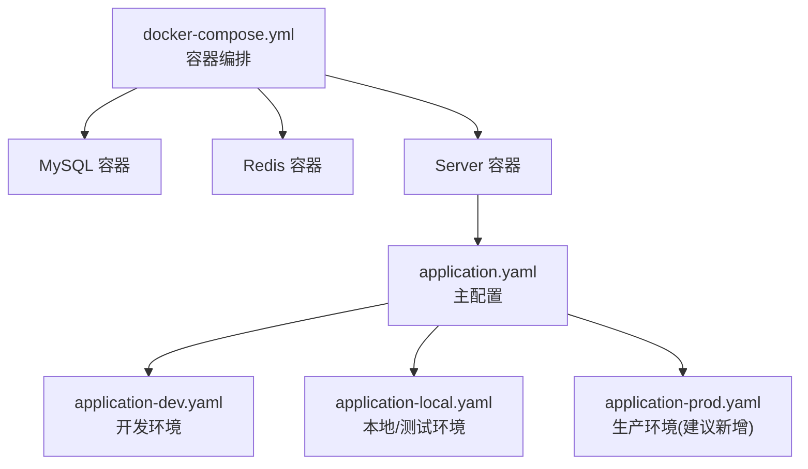
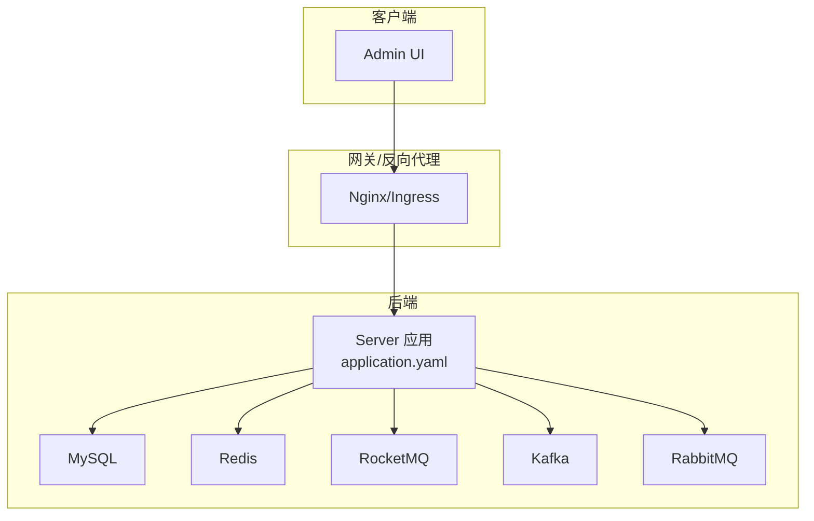
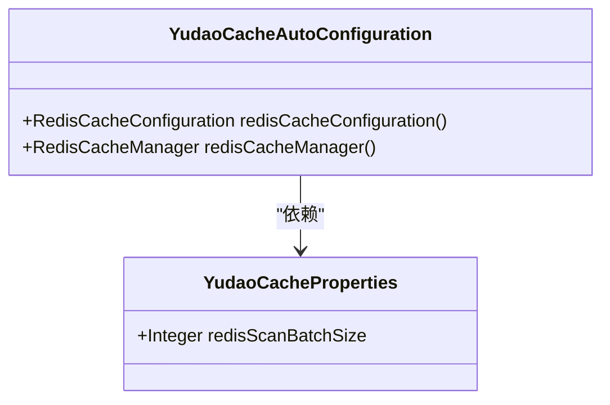
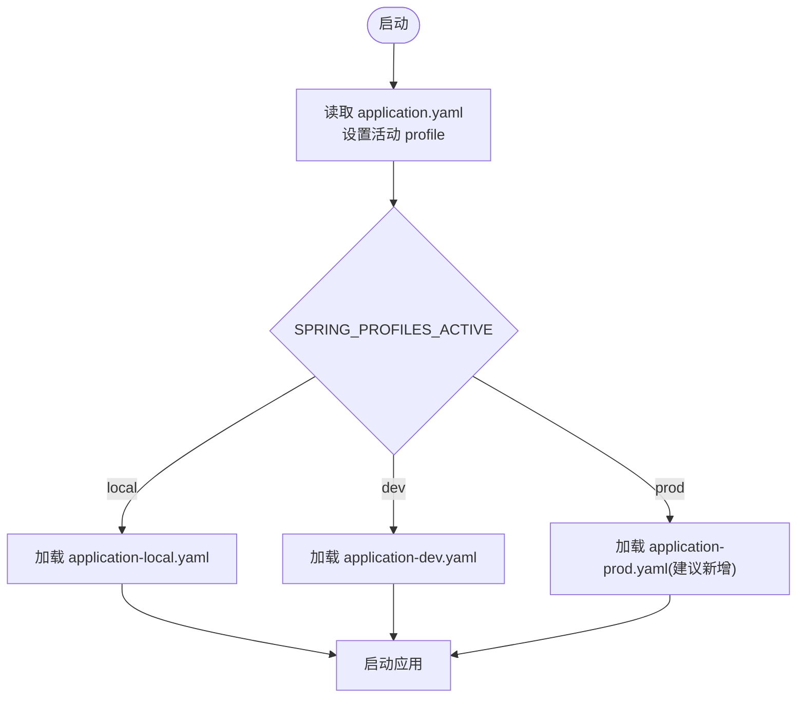

# 生产环境配置

<cite>
**本文引用的文件**
- [application.yaml](file://yudao-server/src/main/resources/application.yaml)
- [application-dev.yaml](file://yudao-server/src/main/resources/application-dev.yaml)
- [application-local.yaml](file://yudao-server/src/main/resources/application-local.yaml)
- [docker-compose.yml](file://script/docker/docker-compose.yml)
- [docker.env](file://script/docker/docker.env)
- [YudaoCacheAutoConfiguration.java](file://yudao-framework/yudao-spring-boot-starter-redis/src/main/java/cn/iocoder/yudao/framework/redis/config/YudaoCacheAutoConfiguration.java)
- [YudaoCacheProperties.java](file://yudao-framework/yudao-spring-boot-starter-redis/src/main/java/cn/iocoder/yudao/framework/redis/config/YudaoCacheProperties.java)
- [YudaoDataSourceAutoConfiguration.java](file://yudao-framework/yudao-spring-boot-starter-mybatis/src/main/java/cn/iocoder/yudao/framework/datasource/config/YudaoDataSourceAutoConfiguration.java)
</cite>

## 目录
1. [简介](#简介)
2. [项目结构](#项目结构)
3. [核心组件与配置总览](#核心组件与配置总览)
4. [架构概览](#架构概览)
5. [详细组件配置解析](#详细组件配置解析)
6. [依赖与环境差异分析](#依赖与环境差异分析)
7. [性能优化配置指南](#性能优化配置指南)
8. [安全配置最佳实践](#安全配置最佳实践)
9. [日志与监控参数](#日志与监控参数)
10. [故障排查指南](#故障排查指南)
11. [结论](#结论)

## 简介
本文件面向生产环境，系统梳理并解读 Ruoyi-Vue-Pro 后端应用的配置体系，重点覆盖数据库连接池、Redis 缓存、消息队列、文件存储、安全与认证、日志与监控等关键领域，并给出不同环境（开发、本地、生产）的配置模板与切换机制，以及性能与安全优化建议。

## 项目结构
后端应用位于 yudao-server 模块，核心配置集中在 application.yaml 及其按环境拆分的 profile 文件中；容器化部署通过 docker-compose.yml 与 docker.env 统一编排。

图表来源
- [application.yaml:1-354](file://yudao-server/src/main/resources/application.yaml#L1-L354)
- [application-dev.yaml:1-212](file://yudao-server/src/main/resources/application-dev.yaml#L1-L212)
- [application-local.yaml:1-285](file://yudao-server/src/main/resources/application-local.yaml#L1-L285)
- [docker-compose.yml:1-85](file://script/docker/docker-compose.yml#L1-L85)

章节来源
- [application.yaml:1-354](file://yudao-server/src/main/resources/application.yaml#L1-L354)
- [application-dev.yaml:1-212](file://yudao-server/src/main/resources/application-dev.yaml#L1-L212)
- [application-local.yaml:1-285](file://yudao-server/src/main/resources/application-local.yaml#L1-L285)
- [docker-compose.yml:1-85](file://script/docker/docker-compose.yml#L1-L85)

## 核心组件与配置总览
- 应用与运行
  - 应用名、活动 profile、Servlet 上传限制、Jackson 序列化、编码设置
- 数据库与连接池
  - 动态多数据源、Druid 连接池参数、慢 SQL 监控、主从配置
- 缓存与 Redis
  - Cache 类型、TTL、Redis 序列化与扫描批大小
- 消息队列
  - RocketMQ 生产者组、Kafka 生产者/消费者/监听器、RabbitMQ 主机与凭据
- AI 与向量存储
  - Redis/Qdrant/Milvus 向量索引与集合命名、OpenAI/Anthropic/通义等模型配置
- 安全与认证
  - API 加密开关与算法、AES/RSA 密钥、WebSocket 路径与消息发送类型
- 多租户与业务配置
  - 租户开关、忽略 URL/Caches、短信验证码有效期与频率、交易订单过期时间
- 监控与可观测性
  - Actuator 暴露、Spring Boot Admin 客户端/服务端、日志文件位置

章节来源
- [application.yaml:1-354](file://yudao-server/src/main/resources/application.yaml#L1-L354)

## 架构概览
生产环境典型拓扑：前端 Admin UI 通过反向代理访问后端 Server，Server 通过动态数据源连接 MySQL，通过 Redis 缓存与消息队列（RocketMQ/Kafka/RabbitMQ）实现异步与分布式能力。

图表来源
- [application.yaml:120-145](file://yudao-server/src/main/resources/application.yaml#L120-L145)
- [application.yaml:90-96](file://yudao-server/src/main/resources/application.yaml#L90-L96)
- [application.yaml:217-257](file://yudao-server/src/main/resources/application.yaml#L217-L257)

## 详细组件配置解析

### 数据库与连接池（Druid）
- 动态多数据源
  - 主库/从库 URL、用户名、密码；从库懒加载提升启动速度
- Druid 连接池关键参数
  - 初始连接数、最小空闲、最大活跃、获取连接最大等待、空闲回收周期、最小/最大空闲存活时间
  - 连接有效性检测 SQL、空闲检测、借用/归还检测、预编译语句缓存与每连接上限
- 开发环境示例
  - MySQL 主从示例、慢 SQL 记录与白名单控制台
- 自动配置排除
  - Quartz 自动配置（local 环境默认关闭）、AI 向量存储自动配置（手动创建）

章节来源
- [application-dev.yaml:32-57](file://yudao-server/src/main/resources/application-dev.yaml#L32-L57)
- [application-dev.yaml:14-31](file://yudao-server/src/main/resources/application-dev.yaml#L14-L31)
- [application-local.yaml:33-46](file://yudao-server/src/main/resources/application-local.yaml#L33-L46)
- [application-local.yaml:8-11](file://yudao-server/src/main/resources/application-local.yaml#L8-L11)
- [YudaoDataSourceAutoConfiguration.java:1-20](file://yudao-framework/yudao-spring-boot-starter-mybatis/src/main/java/cn/iocoder/yudao/framework/datasource/config/YudaoDataSourceAutoConfiguration.java#L1-L20)

### Redis 缓存
- Cache 类型与 TTL
  - 显式设置缓存类型为 REDIS，TTL 为 1 小时
- Redis 序列化与扫描批大小
  - 使用 JSON 序列化；scan 批大小可配置，默认 30
- 事务感知缓存管理器
  - @Transactional 包裹下的缓存变更延迟至 afterCommit，避免读穿

图表来源
- [YudaoCacheProperties.java:1-27](file://yudao-framework/yudao-spring-boot-starter-redis/src/main/java/cn/iocoder/yudao/framework/redis/config/YudaoCacheProperties.java#L1-L27)
- [YudaoCacheAutoConfiguration.java:37-84](file://yudao-framework/yudao-spring-boot-starter-redis/src/main/java/cn/iocoder/yudao/framework/redis/config/YudaoCacheAutoConfiguration.java#L37-L84)

章节来源
- [application.yaml:26-31](file://yudao-server/src/main/resources/application.yaml#L26-L31)
- [YudaoCacheAutoConfiguration.java:37-84](file://yudao-framework/yudao-spring-boot-starter-redis/src/main/java/cn/iocoder/yudao/framework/redis/config/YudaoCacheAutoConfiguration.java#L37-L84)
- [YudaoCacheProperties.java:12-27](file://yudao-framework/yudao-spring-boot-starter-redis/src/main/java/cn/iocoder/yudao/framework/redis/config/YudaoCacheProperties.java#L12-L27)

### 消息队列
- RocketMQ
  - 生产者组基于应用名拼接后缀
- Kafka
  - 生产者 acks=1、重试次数、JSON 序列化；消费者从最早位点开始、信任包白名单
  - 监听器主题不存在时不致命
- RabbitMQ
  - 主机、端口、账号、密码（示例）

章节来源
- [application.yaml:122-145](file://yudao-server/src/main/resources/application.yaml#L122-L145)

### AI 与向量存储
- 向量存储
  - Redis：索引名、键前缀、初始化模式
  - Qdrant：集合名、主机/端口
  - Milvus：数据库名、集合名、客户端主机/端口
- 多模型提供商
  - 文心一言、智谱、OpenAI、Azure OpenAI、Anthropic、Ollama、StabilityAI、通义千问、Minimax、Moonshot、DeepSeek、Gemini、豆包、混元、硅基流动、讯飞星火、百川智能、Midjourney、Suno、WebSearch 等

章节来源
- [application.yaml:148-257](file://yudao-server/src/main/resources/application.yaml#L148-L257)

### 安全与认证
- API 加密
  - 开关、算法（AES/RSA）、请求/响应密钥（示例为 AES）
- WebSocket
  - 开关、路径、消息发送类型（local/redis/rocketmq/kafka/rabbitmq）
- XSS 与跨域
  - XSS 开关与排除 URL；安全放行列表（如微信回调）
- 多租户
  - 开关、忽略 URL/Caches、忽略访问 URL

章节来源
- [application.yaml:272-329](file://yudao-server/src/main/resources/application.yaml#L272-L329)

### 业务配置
- 短信验证码
  - 过期时间、发送频率、单日最大发送量、测试验证码范围
- 交易订单
  - 支付过期、收货过期、评论过期、状态同步到小程序
- 物流与快递
  - 客户端与平台配置（KD-100/KD-Niao）

章节来源
- [application.yaml:329-349](file://yudao-server/src/main/resources/application.yaml#L329-L349)

## 依赖与环境差异分析
- 环境激活
  - application.yaml 指定活动 profile 为 local；可通过 docker-compose.yml 的 SPRING_PROFILES_ACTIVE 覆盖为 local 或自建的 prod
- 开发环境（dev）
  - Druid 监控控制台、慢 SQL 记录、Quartz JDBC 存储、Actuator 全量暴露、SB Admin 客户端/服务端配置
- 本地环境（local）
  - 默认关闭 Quartz 自动配置、禁用 AI 向量存储自动配置、Redis 密码、日志级别细化、微信公众号/小程序测试号配置
- 生产环境（建议新增）
  - 建议独立 application-prod.yaml，集中屏蔽 Actuator 暴露、关闭 Druid 控制台、严格密码与 TLS、启用生产级线程池与 JVM 参数

图表来源
- [application.yaml:5-6](file://yudao-server/src/main/resources/application.yaml#L5-L6)
- [docker-compose.yml:39](file://script/docker/docker-compose.yml#L39)

章节来源
- [application.yaml:5-6](file://yudao-server/src/main/resources/application.yaml#L5-L6)
- [application-dev.yaml:124-145](file://yudao-server/src/main/resources/application-dev.yaml#L124-L145)
- [application-local.yaml:8-11](file://yudao-server/src/main/resources/application-local.yaml#L8-L11)
- [docker-compose.yml:39-46](file://script/docker/docker-compose.yml#L39-L46)

## 性能优化配置指南
- 数据库连接池
  - 基于业务 QPS 与并发，合理设置初始连接数、最小空闲、最大活跃、最大等待与空闲回收周期
  - 开启预编译语句缓存并限制每连接上限，减少 GC 压力
  - 启用空闲连接检测与有效性校验，避免僵尸连接
- 缓存策略
  - 为热点数据设置合理 TTL，结合业务生命周期调整
  - 使用 JSON 序列化，避免复杂对象的默认二进制序列化带来的体积与兼容问题
  - 调整 Redis Scan 批大小，平衡内存与 CPU
- 线程池与定时任务
  - Quartz 线程池大小与优先级根据作业复杂度与并发需求调优
  - 生产环境建议持久化作业存储（JDBC），并开启集群模式
- 消息队列
  - Kafka 生产者 acks 与重试策略需权衡一致性与吞吐；消费者位点策略按业务容忍度选择
  - RocketMQ/RabbitMQ Topic/Exchange/Queue 命名规范与路由策略清晰
- JVM 与容器
  - 通过 JAVA_OPTS 设置堆大小与垃圾收集器参数；容器资源限制与健康检查完善

章节来源
- [application-dev.yaml:33-46](file://yudao-server/src/main/resources/application-dev.yaml#L33-L46)
- [application-local.yaml:114-117](file://yudao-server/src/main/resources/application-local.yaml#L114-L117)
- [YudaoCacheAutoConfiguration.java:37-84](file://yudao-framework/yudao-spring-boot-starter-redis/src/main/java/cn/iocoder/yudao/framework/redis/config/YudaoCacheAutoConfiguration.java#L37-L84)
- [YudaoCacheProperties.java:12-27](file://yudao-framework/yudao-spring-boot-starter-redis/src/main/java/cn/iocoder/yudao/framework/redis/config/YudaoCacheProperties.java#L12-L27)

## 安全配置最佳实践
- 密码与密钥
  - 生产环境务必启用 Redis 密码；API 加密建议使用 RSA 并妥善保管私钥
- SSL/TLS
  - 反向代理层启用 HTTPS；数据库连接建议开启 SSL
- 跨域与 CORS
  - 明确放行域名与路径，避免通配符滥用；XSS 开关与排除 URL 精准控制
- 安全放行
  - 将微信回调等必要接口加入放行列表，其余接口强制鉴权
- 监控端点
  - 生产环境仅暴露必要端点，限制访问来源与认证

章节来源
- [application-local.yaml:87-88](file://yudao-server/src/main/resources/application-local.yaml#L87-L88)
- [application.yaml:272-281](file://yudao-server/src/main/resources/application.yaml#L272-L281)
- [application-dev.yaml:124-131](file://yudao-server/src/main/resources/application-dev.yaml#L124-L131)

## 日志与监控参数
- 日志
  - 日志文件路径统一配置；本地环境提供细粒度日志级别示例，生产环境建议收敛到 INFO/ERROR
- 监控
  - Actuator 端点按需开放；Spring Boot Admin 客户端注册与服务端上下文路径配置
- 健康与可观测性
  - 建议结合链路追踪与指标采集（如 SkyWalking/Actuator/Micrometer）完善生产可观测性

章节来源
- [application-dev.yaml:147-150](file://yudao-server/src/main/resources/application-dev.yaml#L147-L150)
- [application-local.yaml:171-201](file://yudao-server/src/main/resources/application-local.yaml#L171-L201)
- [application-dev.yaml:124-145](file://yudao-server/src/main/resources/application-dev.yaml#L124-L145)

## 故障排查指南
- 数据库
  - 关注慢 SQL 日志与连接池状态，定位高耗时 SQL 与连接泄漏
- 缓存
  - 观察 TTL 与序列化异常，核对键前缀与命名空间冲突
- 消息队列
  - 消费堆积、重复消费、死信队列；核对 acks/重试与监听器配置
- 安全
  - API 加密失败、密钥不匹配、跨域拒绝；逐项比对密钥与放行规则
- 监控
  - Actuator 端点不可达或权限不足；确认暴露策略与认证

章节来源
- [application-dev.yaml:14-31](file://yudao-server/src/main/resources/application-dev.yaml#L14-L31)
- [application.yaml:272-281](file://yudao-server/src/main/resources/application.yaml#L272-L281)

## 结论
生产环境配置应围绕“安全、稳定、可观测、可扩展”展开。建议：
- 新增 application-prod.yaml，集中屏蔽敏感端点与默认配置
- 明确数据库连接池、缓存、消息队列与 JVM 的生产级参数
- 强化安全策略（密码、TLS、CORS、放行列表）
- 完善日志与监控，建立告警与回溯机制