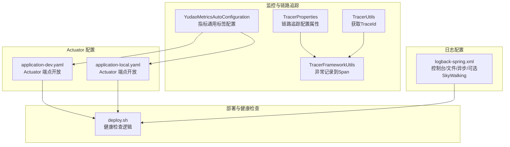
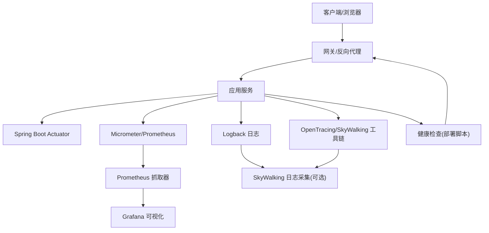
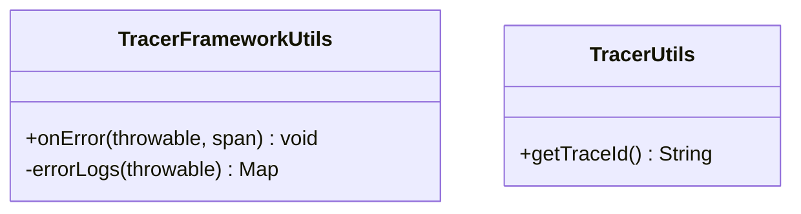
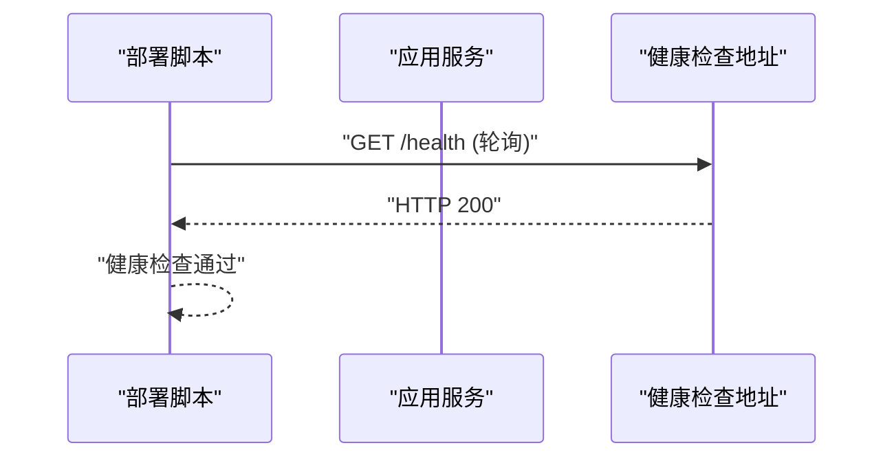
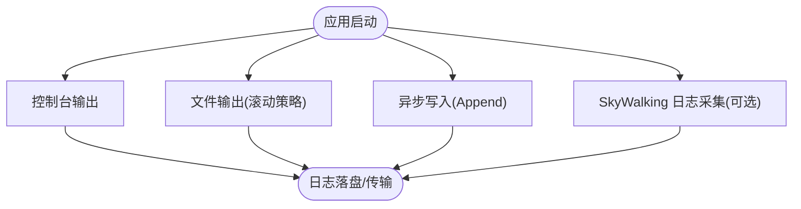
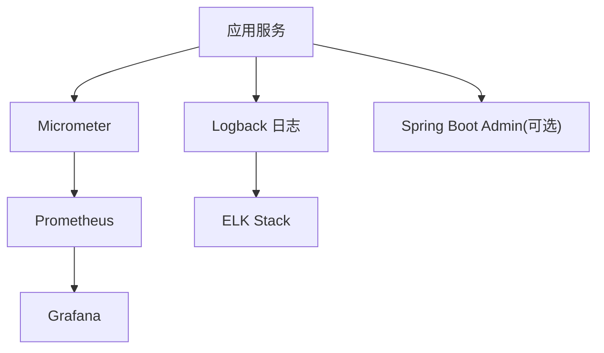
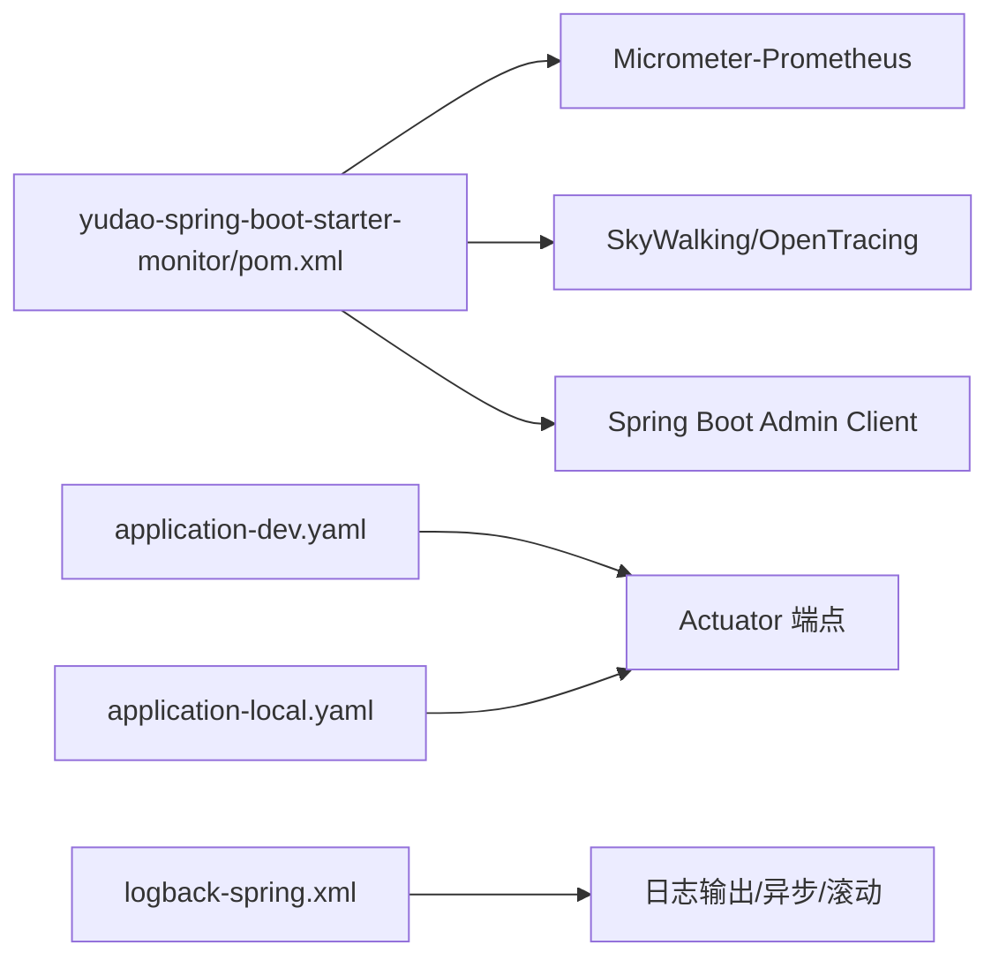

# 监控告警

<cite>
**本文引用的文件**
- [YudaoMetricsAutoConfiguration.java](file://yudao-framework/yudao-spring-boot-starter-monitor/src/main/java/cn/iocoder/yudao/framework/tracer/config/YudaoMetricsAutoConfiguration.java)
- [TracerProperties.java](file://yudao-framework/yudao-spring-boot-starter-monitor/src/main/java/cn/iocoder/yudao/framework/tracer/config/TracerProperties.java)
- [TracerFrameworkUtils.java](file://yudao-framework/yudao-spring-boot-starter-monitor/src/main/java/cn/iocoder/yudao/framework/tracer/core/util/TracerFrameworkUtils.java)
- [TracerUtils.java](file://yudao-framework/yudao-common/src/main/java/cn/iocoder/yudao/framework/common/util/monitor/TracerUtils.java)
- [logback-spring.xml](file://yudao-server/src/main/resources/logback-spring.xml)
- [application-dev.yaml](file://yudao-server/src/main/resources/application-dev.yaml)
- [application-local.yaml](file://yudao-server/src/main/resources/application-local.yaml)
- [deploy.sh](file://script/shell/deploy.sh)
- [yudao-spring-boot-starter-monitor/pom.xml](file://yudao-framework/yudao-spring-boot-starter-monitor/pom.xml)
- [README.md](file://README.md)
</cite>

## 目录
1. [简介](#简介)
2. [项目结构](#项目结构)
3. [核心组件](#核心组件)
4. [架构总览](#架构总览)
5. [详细组件分析](#详细组件分析)
6. [依赖关系分析](#依赖关系分析)
7. [性能考量](#性能考量)
8. [故障排查指南](#故障排查指南)
9. [结论](#结论)
10. [附录](#附录)

## 简介
本文件面向芋道 Ruoyi-Vue-Pro 项目的监控与告警体系建设，围绕以下目标展开：
- 应用监控基础设施：Spring Boot Actuator 端点配置、健康检查接口、指标收集机制
- 性能监控指标：响应时间、吞吐量、错误率、资源使用率等关键指标的监控与可视化
- 日志监控与分析：日志采集、日志聚合、日志查询、异常日志告警等实践
- 告警规则配置：阈值设定、告警级别、通知渠道、告警抑制等策略
- 监控工具集成：Prometheus、Grafana、ELK Stack 等工具的集成与使用
- 监控仪表板设计与告警处理流程：确保监控体系有效运行

## 项目结构
本项目在监控与告警方面主要涉及如下模块与文件：
- 监控与链路追踪 Starter：提供 Micrometer、Prometheus、SkyWalking 等能力的基础封装
- Actuator 配置：在开发与本地环境开放 Actuator 端点，便于健康检查与指标暴露
- 日志配置：基于 Logback 的控制台、文件与异步写入配置，并预留 SkyWalking 日志采集接入
- 部署脚本：提供健康检查逻辑，用于容器或运维部署后的可用性验证

**图表来源**
- [YudaoMetricsAutoConfiguration.java:1-27](file://yudao-framework/yudao-spring-boot-starter-monitor/src/main/java/cn/iocoder/yudao/framework/tracer/config/YudaoMetricsAutoConfiguration.java#L1-L27)
- [TracerProperties.java:1-14](file://yudao-framework/yudao-spring-boot-starter-monitor/src/main/java/cn/iocoder/yudao/framework/tracer/config/TracerProperties.java#L1-L14)
- [TracerFrameworkUtils.java:1-46](file://yudao-framework/yudao-spring-boot-starter-monitor/src/main/java/cn/iocoder/yudao/framework/tracer/core/util/TracerFrameworkUtils.java#L1-L46)
- [TracerUtils.java:1-30](file://yudao-framework/yudao-common/src/main/java/cn/iocoder/yudao/framework/common/util/monitor/TracerUtils.java#L1-L30)
- [application-dev.yaml:127-129](file://yudao-server/src/main/resources/application-dev.yaml#L127-L129)
- [application-local.yaml:150-152](file://yudao-server/src/main/resources/application-local.yaml#L150-L152)
- [logback-spring.xml:1-56](file://yudao-server/src/main/resources/logback-spring.xml#L1-L56)
- [deploy.sh:106-125](file://script/shell/deploy.sh#L106-L125)

**章节来源**
- [application-dev.yaml:127-129](file://yudao-server/src/main/resources/application-dev.yaml#L127-L129)
- [application-local.yaml:150-152](file://yudao-server/src/main/resources/application-local.yaml#L150-L152)
- [logback-spring.xml:1-56](file://yudao-server/src/main/resources/logback-spring.xml#L1-L56)
- [deploy.sh:106-125](file://script/shell/deploy.sh#L106-L125)

## 核心组件
- 指标与通用标签
  - 通过自动配置类为 Micrometer 注册 common tags，统一打上应用标识，便于跨实例对比与聚合
- 链路追踪与异常标注
  - 提供异常到 Span 的记录工具，便于在链路追踪中定位错误上下文
  - 提供获取 TraceId 的工具类，便于日志与链路关联
- Actuator 端点
  - 在开发与本地环境开放 Actuator 端点，便于健康检查与指标拉取
- 日志配置
  - 控制台输出、文件滚动、异步写入，以及可选的 SkyWalking 日志采集接入
- 健康检查
  - 部署脚本内置健康检查逻辑，轮询指定地址并等待 200 响应

**章节来源**
- [YudaoMetricsAutoConfiguration.java:1-27](file://yudao-framework/yudao-spring-boot-starter-monitor/src/main/java/cn/iocoder/yudao/framework/tracer/config/YudaoMetricsAutoConfiguration.java#L1-L27)
- [TracerFrameworkUtils.java:1-46](file://yudao-framework/yudao-spring-boot-starter-monitor/src/main/java/cn/iocoder/yudao/framework/tracer/core/util/TracerFrameworkUtils.java#L1-L46)
- [TracerUtils.java:1-30](file://yudao-framework/yudao-common/src/main/java/cn/iocoder/yudao/framework/common/util/monitor/TracerUtils.java#L1-L30)
- [application-dev.yaml:127-129](file://yudao-server/src/main/resources/application-dev.yaml#L127-L129)
- [application-local.yaml:150-152](file://yudao-server/src/main/resources/application-local.yaml#L150-L152)
- [logback-spring.xml:1-56](file://yudao-server/src/main/resources/logback-spring.xml#L1-L56)
- [deploy.sh:106-125](file://script/shell/deploy.sh#L106-L125)

## 架构总览
下图展示了监控与告警的关键交互路径：应用通过 Actuator 暴露健康与指标；Prometheus 抓取指标；Grafana 进行可视化；日志通过 Logback 输出并可接入 SkyWalking；异常与链路信息通过 OpenTracing/SkyWalking 工具链串联。

**图表来源**
- [application-dev.yaml:127-129](file://yudao-server/src/main/resources/application-dev.yaml#L127-L129)
- [application-local.yaml:150-152](file://yudao-server/src/main/resources/application-local.yaml#L150-L152)
- [logback-spring.xml:1-56](file://yudao-server/src/main/resources/logback-spring.xml#L1-L56)
- [yudao-spring-boot-starter-monitor/pom.xml:66-70](file://yudao-framework/yudao-spring-boot-starter-monitor/pom.xml#L66-L70)
- [deploy.sh:106-125](file://script/shell/deploy.sh#L106-L125)

## 详细组件分析

### 指标与通用标签配置
- 自动配置类负责注册 MeterRegistryCustomizer，为所有指标打上 common tag，如 application 名称，便于多实例对比与聚合
- 通过配置开关 yudao.metrics.enable 控制是否启用指标（默认启用）

**图表来源**
- [YudaoMetricsAutoConfiguration.java:1-27](file://yudao-framework/yudao-spring-boot-starter-monitor/src/main/java/cn/iocoder/yudao/framework/tracer/config/YudaoMetricsAutoConfiguration.java#L1-L27)

**章节来源**
- [YudaoMetricsAutoConfiguration.java:1-27](file://yudao-framework/yudao-spring-boot-starter-monitor/src/main/java/cn/iocoder/yudao/framework/tracer/config/YudaoMetricsAutoConfiguration.java#L1-L27)

### 链路追踪与异常标注
- 异常到 Span 的记录工具：在发生异常时标记错误事件、记录堆栈与消息，便于链路追踪中快速定位问题
- 获取 TraceId 工具：直接返回 SkyWalking 的 TraceId，便于日志与链路关联

**图表来源**
- [TracerFrameworkUtils.java:1-46](file://yudao-framework/yudao-spring-boot-starter-monitor/src/main/java/cn/iocoder/yudao/framework/tracer/core/util/TracerFrameworkUtils.java#L1-L46)
- [TracerUtils.java:1-30](file://yudao-framework/yudao-common/src/main/java/cn/iocoder/yudao/framework/common/util/monitor/TracerUtils.java#L1-L30)

**章节来源**
- [TracerFrameworkUtils.java:1-46](file://yudao-framework/yudao-spring-boot-starter-monitor/src/main/java/cn/iocoder/yudao/framework/tracer/core/util/TracerFrameworkUtils.java#L1-L46)
- [TracerUtils.java:1-30](file://yudao-framework/yudao-common/src/main/java/cn/iocoder/yudao/framework/common/util/monitor/TracerUtils.java#L1-L30)

### Actuator 端点与健康检查
- 在开发与本地环境，Actuator 端点根路径与开放范围已配置，默认开放 health 与 info，也可通过通配符开放全部端点
- 部署脚本提供健康检查逻辑：轮询指定健康检查地址，最多等待 120 秒，直至收到 200 响应

**图表来源**
- [application-dev.yaml:127-129](file://yudao-server/src/main/resources/application-dev.yaml#L127-L129)
- [application-local.yaml:150-152](file://yudao-server/src/main/resources/application-local.yaml#L150-L152)
- [deploy.sh:106-125](file://script/shell/deploy.sh#L106-L125)

**章节来源**
- [application-dev.yaml:127-129](file://yudao-server/src/main/resources/application-dev.yaml#L127-L129)
- [application-local.yaml:150-152](file://yudao-server/src/main/resources/application-local.yaml#L150-L152)
- [deploy.sh:106-125](file://script/shell/deploy.sh#L106-L125)

### 日志采集与分析
- 控制台输出：本地开发时高亮输出，便于快速观察
- 文件输出：按大小与日期滚动，保留历史天数与单文件上限
- 异步写入：通过 AsyncAppender 提升日志写入性能，避免阻塞业务线程
- SkyWalking 日志采集：预留 GRPC 日志采集 Appender，可选接入以实现日志中心

**图表来源**
- [logback-spring.xml:1-56](file://yudao-server/src/main/resources/logback-spring.xml#L1-L56)

**章节来源**
- [logback-spring.xml:1-56](file://yudao-server/src/main/resources/logback-spring.xml#L1-L56)

### 监控工具集成
- Prometheus：通过 Micrometer 与 Prometheus Registry 暴露指标，Prometheus 抓取器定期抓取
- Grafana：导入 Prometheus 数据源，基于 common tags 与指标名称构建仪表板
- ELK Stack：可通过日志采集器将 Logback 输出的日志推送至 ELK，实现日志检索与分析
- Spring Boot Admin：作为客户端接入，实现应用状态与指标的集中展示（可选）

**图表来源**
- [yudao-spring-boot-starter-monitor/pom.xml:66-70](file://yudao-framework/yudao-spring-boot-starter-monitor/pom.xml#L66-L70)
- [README.md:203-222](file://README.md#L203-L222)

**章节来源**
- [yudao-spring-boot-starter-monitor/pom.xml:66-70](file://yudao-framework/yudao-spring-boot-starter-monitor/pom.xml#L66-L70)
- [README.md:203-222](file://README.md#L203-L222)

## 依赖关系分析
- 指标与监控
  - Micrometer 与 Prometheus Registry 依赖用于指标暴露
  - Actuator 依赖用于健康检查与指标端点
- 链路追踪
  - SkyWalking Toolkit 与 OpenTracing 工具链用于链路追踪与日志采集
- 日志
  - Logback 作为默认日志实现，支持异步与滚动策略

**图表来源**
- [yudao-spring-boot-starter-monitor/pom.xml:66-70](file://yudao-framework/yudao-spring-boot-starter-monitor/pom.xml#L66-L70)
- [application-dev.yaml:127-129](file://yudao-server/src/main/resources/application-dev.yaml#L127-L129)
- [application-local.yaml:150-152](file://yudao-server/src/main/resources/application-local.yaml#L150-L152)
- [logback-spring.xml:1-56](file://yudao-server/src/main/resources/logback-spring.xml#L1-L56)

**章节来源**
- [yudao-spring-boot-starter-monitor/pom.xml:66-70](file://yudao-framework/yudao-spring-boot-starter-monitor/pom.xml#L66-L70)
- [application-dev.yaml:127-129](file://yudao-server/src/main/resources/application-dev.yaml#L127-L129)
- [application-local.yaml:150-152](file://yudao-server/src/main/resources/application-local.yaml#L150-L152)
- [logback-spring.xml:1-56](file://yudao-server/src/main/resources/logback-spring.xml#L1-L56)

## 性能考量
- 指标与标签
  - common tags 统一打标，减少查询时的过滤成本；但需避免过多维度导致指标基数爆炸
- 日志性能
  - 异步写入可显著降低日志对业务线程的影响；合理设置队列长度与丢弃阈值
  - 滚动策略需平衡磁盘占用与查询效率
- 健康检查
  - 轮询间隔与超时时间需结合实例启动时间与网络状况调整，避免误判

[本节为通用指导，无需列出具体文件来源]

## 故障排查指南
- Actuator 端点不可访问
  - 检查 Actuator 端点开放配置，确认根路径与 include 规则
- 健康检查失败
  - 使用部署脚本中的健康检查逻辑，确认返回码与超时设置
- 日志缺失或堆积
  - 检查异步 Appender 队列大小与丢弃阈值；核对滚动策略与文件权限
- 链路追踪异常
  - 确认异常到 Span 的记录是否生效；检查 TraceId 获取是否为空

**章节来源**
- [application-dev.yaml:127-129](file://yudao-server/src/main/resources/application-dev.yaml#L127-L129)
- [application-local.yaml:150-152](file://yudao-server/src/main/resources/application-local.yaml#L150-L152)
- [deploy.sh:106-125](file://script/shell/deploy.sh#L106-L125)
- [logback-spring.xml:1-56](file://yudao-server/src/main/resources/logback-spring.xml#L1-L56)
- [TracerFrameworkUtils.java:1-46](file://yudao-framework/yudao-spring-boot-starter-monitor/src/main/java/cn/iocoder/yudao/framework/tracer/core/util/TracerFrameworkUtils.java#L1-L46)
- [TracerUtils.java:1-30](file://yudao-framework/yudao-common/src/main/java/cn/iocoder/yudao/framework/common/util/monitor/TracerUtils.java#L1-L30)

## 结论
本项目已具备完善的监控与告警基础能力：Actuator 健康检查与指标端点、Micrometer 指标与 Prometheus 集成、Logback 日志输出与异步写入、可选 SkyWalking 日志与链路追踪接入。建议在此基础上完善告警规则与仪表板设计，形成闭环的监控体系。

[本节为总结性内容，无需列出具体文件来源]

## 附录
- 关键配置位置
  - Actuator 端点：开发与本地环境配置文件
  - 指标通用标签：自动配置类
  - 日志输出：Logback 配置文件
  - 健康检查：部署脚本

**章节来源**
- [application-dev.yaml:127-129](file://yudao-server/src/main/resources/application-dev.yaml#L127-L129)
- [application-local.yaml:150-152](file://yudao-server/src/main/resources/application-local.yaml#L150-L152)
- [YudaoMetricsAutoConfiguration.java:1-27](file://yudao-framework/yudao-spring-boot-starter-monitor/src/main/java/cn/iocoder/yudao/framework/tracer/config/YudaoMetricsAutoConfiguration.java#L1-L27)
- [logback-spring.xml:1-56](file://yudao-server/src/main/resources/logback-spring.xml#L1-L56)
- [deploy.sh:106-125](file://script/shell/deploy.sh#L106-L125)