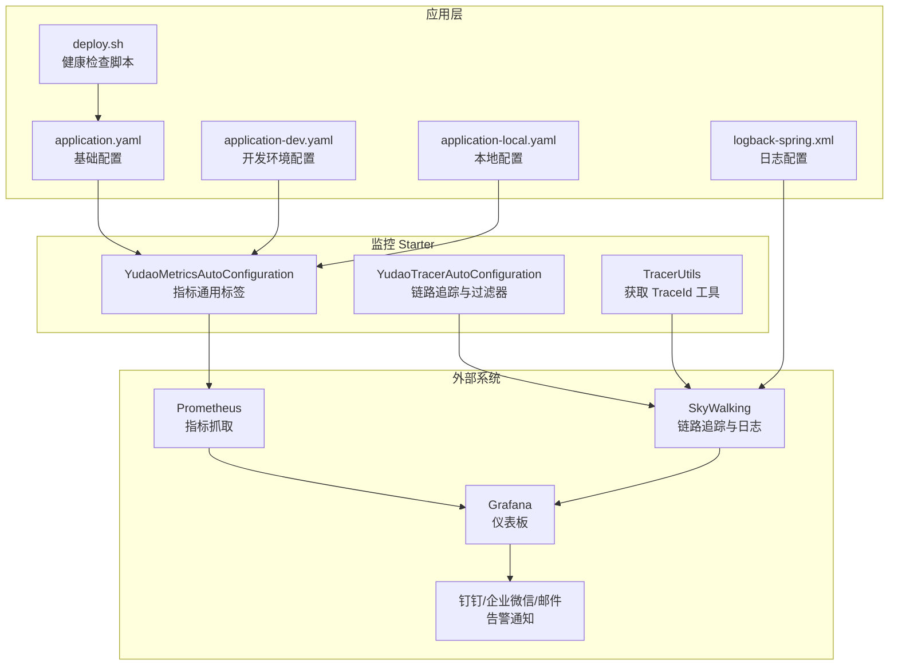
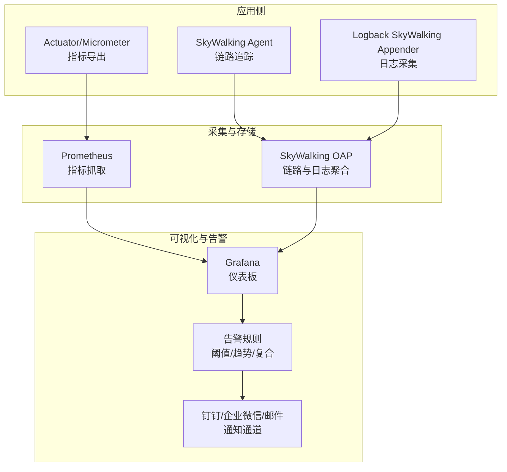
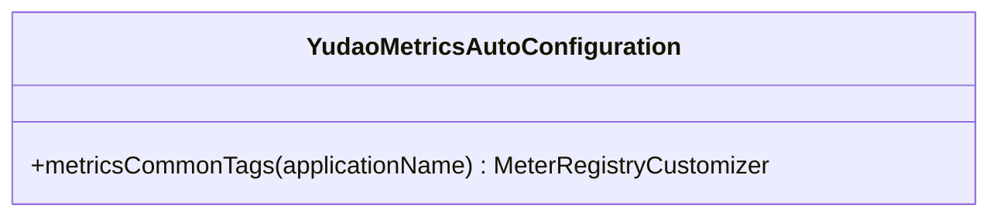
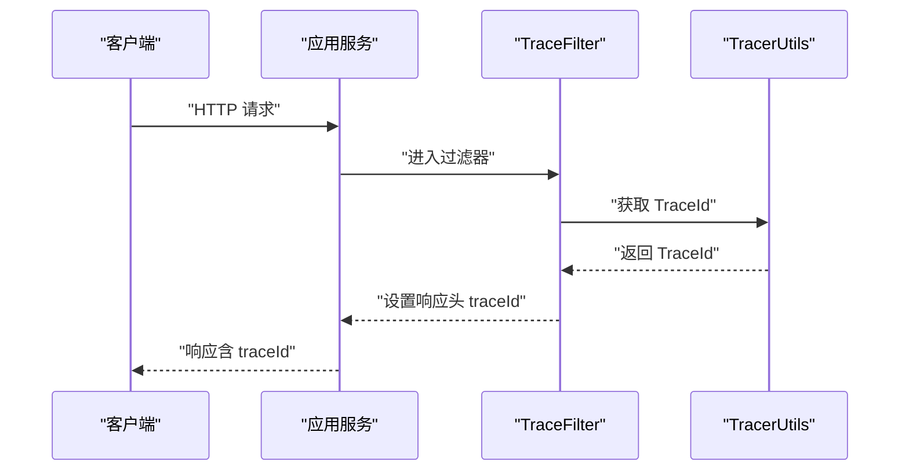
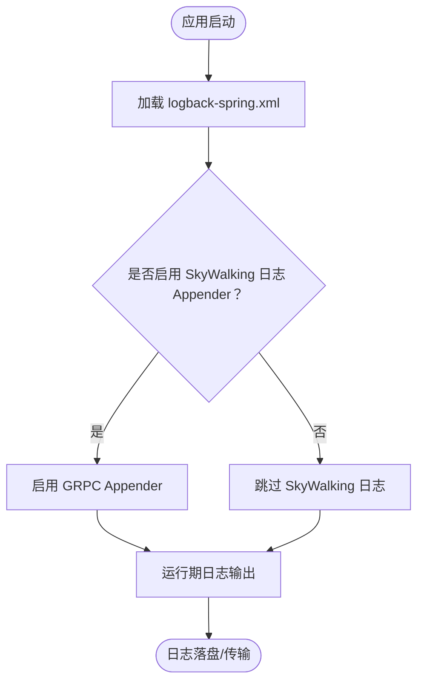
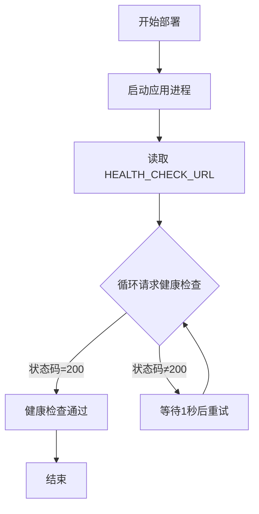
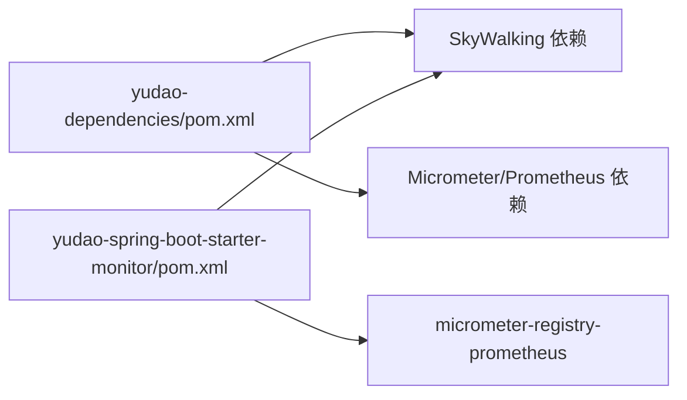

# 监控告警

<cite>
**本文引用的文件**
- [YudaoMetricsAutoConfiguration.java](file://yudao-framework/yudao-spring-boot-starter-monitor/src/main/java/cn/iocoder/yudao/framework/tracer/config/YudaoMetricsAutoConfiguration.java)
- [YudaoTracerAutoConfiguration.java](file://yudao-framework/yudao-spring-boot-starter-monitor/src/main/java/cn/iocoder/yudao/framework/tracer/config/YudaoTracerAutoConfiguration.java)
- [TracerUtils.java](file://yudao-framework/yudao-common/src/main/java/cn/iocoder/yudao/framework/common/util/monitor/TracerUtils.java)
- [logback-spring.xml](file://yudao-server/src/main/resources/logback-spring.xml)
- [deploy.sh](file://script/shell/deploy.sh)
- [pom.xml（依赖管理）](file://yudao-dependencies/pom.xml)
- [pom.xml（监控 Starter）](file://yudao-framework/yudao-spring-boot-starter-monitor/pom.xml)
- [application.yaml](file://yudao-server/src/main/resources/application.yaml)
- [application-dev.yaml](file://yudao-server/src/main/resources/application-dev.yaml)
- [application-local.yaml](file://yudao-server/src/main/resources/application-local.yaml)
</cite>

## 目录
1. [简介](#简介)
2. [项目结构](#项目结构)
3. [核心组件](#核心组件)
4. [架构总览](#架构总览)
5. [详细组件分析](#详细组件分析)
6. [依赖关系分析](#依赖关系分析)
7. [性能考量](#性能考量)
8. [故障排查指南](#故障排查指南)
9. [结论](#结论)
10. [附录](#附录)

## 简介
本指南面向 ruoyi-vue-pro 项目的监控与告警体系，围绕以下目标展开：
- 应用监控配置：Spring Boot Actuator 指标采集、Micrometer 与 Prometheus 集成、自定义指标与标签。
- 链路追踪：SkyWalking 集成配置、分布式追踪与日志关联。
- 日志收集与分析：Logback 与 SkyWalking 日志采集、日志聚合与分析思路。
- 性能监控指标：CPU、内存、磁盘、网络等系统级指标的采集与展示建议。
- 告警规则：阈值、趋势、复合告警的配置思路与落地方式。
- 监控仪表板：Grafana 仪表板、Prometheus 查询与可视化图表。
- 健康检查：应用健康状态监控与自动故障转移。
- 数据存储与保留：时序数据管理与长期存储策略。
- 告警集成：钉钉、企业微信、邮件等通知渠道的对接思路。

## 项目结构
ruoyi-vue-pro 将监控能力以“starter”形式封装在 yudao-spring-boot-starter-monitor 中，并通过依赖管理统一引入 SkyWalking 与 Micrometer/Prometheus 相关依赖。应用层通过配置文件启用相关功能，并在部署脚本中集成健康检查。

图示来源
- [YudaoMetricsAutoConfiguration.java:1-27](file://yudao-framework/yudao-spring-boot-starter-monitor/src/main/java/cn/iocoder/yudao/framework/tracer/config/YudaoMetricsAutoConfiguration.java#L1-L27)
- [YudaoTracerAutoConfiguration.java:27-53](file://yudao-framework/yudao-spring-boot-starter-monitor/src/main/java/cn/iocoder/yudao/framework/tracer/config/YudaoTracerAutoConfiguration.java#L27-L53)
- [TracerUtils.java:1-30](file://yudao-framework/yudao-common/src/main/java/cn/iocoder/yudao/framework/common/util/monitor/TracerUtils.java#L1-L30)
- [logback-spring.xml:37-56](file://yudao-server/src/main/resources/logback-spring.xml#L37-L56)
- [deploy.sh:106-125](file://script/shell/deploy.sh#L106-L125)
- [application.yaml](file://yudao-server/src/main/resources/application.yaml)
- [application-dev.yaml](file://yudao-server/src/main/resources/application-dev.yaml)
- [application-local.yaml](file://yudao-server/src/main/resources/application-local.yaml)

章节来源
- [YudaoMetricsAutoConfiguration.java:1-27](file://yudao-framework/yudao-spring-boot-starter-monitor/src/main/java/cn/iocoder/yudao/framework/tracer/config/YudaoMetricsAutoConfiguration.java#L1-L27)
- [YudaoTracerAutoConfiguration.java:27-53](file://yudao-framework/yudao-spring-boot-starter-monitor/src/main/java/cn/iocoder/yudao/framework/tracer/config/YudaoTracerAutoConfiguration.java#L27-L53)
- [TracerUtils.java:1-30](file://yudao-framework/yudao-common/src/main/java/cn/iocoder/yudao/framework/common/util/monitor/TracerUtils.java#L1-L30)
- [logback-spring.xml:37-56](file://yudao-server/src/main/resources/logback-spring.xml#L37-L56)
- [deploy.sh:106-125](file://script/shell/deploy.sh#L106-L125)
- [application.yaml](file://yudao-server/src/main/resources/application.yaml)
- [application-dev.yaml](file://yudao-server/src/main/resources/application-dev.yaml)
- [application-local.yaml](file://yudao-server/src/main/resources/application-local.yaml)

## 核心组件
- 指标与标签配置：通过自动配置类为所有 Micrometer 指标添加通用标签（如 application），便于多实例聚合查询。
- 链路追踪：提供 TraceFilter 注入与 TraceId 获取工具，结合 SkyWalking 实现跨服务调用链追踪。
- 日志采集：通过 Logback 配置 SkyWalking GRPC Appender，实现日志中心化与链路关联。
- 健康检查：部署脚本内置对应用健康检查接口的轮询，确保上线后服务可用。

章节来源
- [YudaoMetricsAutoConfiguration.java:16-27](file://yudao-framework/yudao-spring-boot-starter-monitor/src/main/java/cn/iocoder/yudao/framework/tracer/config/YudaoMetricsAutoConfiguration.java#L16-L27)
- [YudaoTracerAutoConfiguration.java:45-51](file://yudao-framework/yudao-spring-boot-starter-monitor/src/main/java/cn/iocoder/yudao/framework/tracer/config/YudaoTracerAutoConfiguration.java#L45-L51)
- [TracerUtils.java:26-28](file://yudao-framework/yudao-common/src/main/java/cn/iocoder/yudao/framework/common/util/monitor/TracerUtils.java#L26-L28)
- [logback-spring.xml:37-56](file://yudao-server/src/main/resources/logback-spring.xml#L37-L56)
- [deploy.sh:106-125](file://script/shell/deploy.sh#L106-L125)

## 架构总览
ruoyi-vue-pro 的监控与告警由“应用内指标与链路”“外部采集与存储”“可视化与告警”三层组成。应用侧通过 Actuator/Micrometer 输出指标，SkyWalking 提供链路追踪与日志；Prometheus 抓取指标，Grafana 可视化；告警通过系统通知模块对接第三方平台。

图示来源
- [YudaoMetricsAutoConfiguration.java:16-27](file://yudao-framework/yudao-spring-boot-starter-monitor/src/main/java/cn/iocoder/yudao/framework/tracer/config/YudaoMetricsAutoConfiguration.java#L16-L27)
- [YudaoTracerAutoConfiguration.java:45-51](file://yudao-framework/yudao-spring-boot-starter-monitor/src/main/java/cn/iocoder/yudao/framework/tracer/config/YudaoTracerAutoConfiguration.java#L45-L51)
- [logback-spring.xml:37-56](file://yudao-server/src/main/resources/logback-spring.xml#L37-L56)

## 详细组件分析

### 指标与标签配置（Micrometer + Prometheus）
- 自动配置：在满足条件时注册 MeterRegistryCustomizer，为所有指标添加通用标签（如 application），便于多实例聚合。
- 启用条件：默认启用，可通过配置项禁用。
- 适配 Prometheus：starter 中包含 Micrometer 对 Prometheus 的依赖，应用需暴露 Actuator 指标端点并由 Prometheus 抓取。

图示来源
- [YudaoMetricsAutoConfiguration.java:16-27](file://yudao-framework/yudao-spring-boot-starter-monitor/src/main/java/cn/iocoder/yudao/framework/tracer/config/YudaoMetricsAutoConfiguration.java#L16-L27)

章节来源
- [YudaoMetricsAutoConfiguration.java:16-27](file://yudao-framework/yudao-spring-boot-starter-monitor/src/main/java/cn/iocoder/yudao/framework/tracer/config/YudaoMetricsAutoConfiguration.java#L16-L27)
- [pom.xml（监控 Starter）:65-70](file://yudao-framework/yudao-spring-boot-starter-monitor/pom.xml#L65-L70)

### 链路追踪（SkyWalking）
- 过滤器：注册 TraceFilter，将 TraceId 写入响应头，便于前端与下游服务传递。
- 工具类：提供 TracerUtils.getTraceId() 获取当前请求的 TraceId。
- 依赖：在依赖管理中引入 SkyWalking apm-toolkit-* 与 OpenTracing 兼容依赖。

图示来源
- [YudaoTracerAutoConfiguration.java:45-51](file://yudao-framework/yudao-spring-boot-starter-monitor/src/main/java/cn/iocoder/yudao/framework/tracer/config/YudaoTracerAutoConfiguration.java#L45-L51)
- [TracerUtils.java:26-28](file://yudao-framework/yudao-common/src/main/java/cn/iocoder/yudao/framework/common/util/monitor/TracerUtils.java#L26-L28)

章节来源
- [YudaoTracerAutoConfiguration.java:45-51](file://yudao-framework/yudao-spring-boot-starter-monitor/src/main/java/cn/iocoder/yudao/framework/tracer/config/YudaoTracerAutoConfiguration.java#L45-L51)
- [TracerUtils.java:26-28](file://yudao-framework/yudao-common/src/main/java/cn/iocoder/yudao/framework/common/util/monitor/TracerUtils.java#L26-L28)
- [pom.xml（依赖管理）:335-361](file://yudao-dependencies/pom.xml#L335-L361)

### 日志采集（Logback + SkyWalking）
- Logback 配置：提供 SkyWalking GRPC Appender 的注释示例，可将日志发送至 SkyWalking 日志服务，实现日志中心化与链路关联。
- 使用建议：根据部署环境选择性启用，避免生产环境日志风暴。

图示来源
- [logback-spring.xml:37-56](file://yudao-server/src/main/resources/logback-spring.xml#L37-L56)

章节来源
- [logback-spring.xml:37-56](file://yudao-server/src/main/resources/logback-spring.xml#L37-L56)

### 健康检查（部署脚本）
- 部署脚本：在启动应用后，循环请求健康检查地址，最多等待 120 秒，直至返回 200。
- 配置项：通过环境变量 HEALTH_CHECK_URL 指定健康检查地址。

图示来源
- [deploy.sh:106-125](file://script/shell/deploy.sh#L106-L125)

章节来源
- [deploy.sh:106-125](file://script/shell/deploy.sh#L106-L125)

## 依赖关系分析
- 依赖管理：集中声明 SkyWalking 与 Micrometer/Prometheus 相关依赖版本，保证各模块一致性。
- 监控 Starter：提供自动配置与可选依赖，按需启用链路追踪、日志采集与指标导出。

图示来源
- [pom.xml（依赖管理）:335-361](file://yudao-dependencies/pom.xml#L335-L361)
- [pom.xml（监控 Starter）:44-70](file://yudao-framework/yudao-spring-boot-starter-monitor/pom.xml#L44-L70)

章节来源
- [pom.xml（依赖管理）:335-361](file://yudao-dependencies/pom.xml#L335-L361)
- [pom.xml（监控 Starter）:44-70](file://yudao-framework/yudao-spring-boot-starter-monitor/pom.xml#L44-L70)

## 性能考量
- 指标开销：启用通用标签与大量指标会增加内存与序列化成本，建议按需开启并控制标签数量。
- 链路采样：SkyWalking Agent 默认采样策略需结合业务流量调整，避免高并发场景下追踪数据爆炸。
- 日志传输：SkyWalking 日志 Appender 在高吞吐场景下可能成为瓶颈，建议评估网络与存储资源。
- 存储容量：Prometheus 本地存储有限，建议配合远端存储（如 Cortex、Thanos）实现长期保留。

## 故障排查指南
- 指标缺失
  - 检查是否启用 yudao.metrics.enable，默认启用。
  - 确认 Actuator 指标端点已暴露且 Prometheus 可访问。
- 链路追踪异常
  - 确认 SkyWalking Agent 已正确注入与连接 OAP。
  - 检查 TraceFilter 是否生效，响应头是否包含 traceId。
- 日志未被 SkyWalking 收集
  - 确认 logback-spring.xml 中 SkyWalking Appender 已启用。
  - 检查 OAP 日志服务是否可用。
- 健康检查失败
  - 检查 HEALTH_CHECK_URL 是否正确。
  - 查看应用健康端点返回状态与错误信息。

章节来源
- [YudaoMetricsAutoConfiguration.java:16-19](file://yudao-framework/yudao-spring-boot-starter-monitor/src/main/java/cn/iocoder/yudao/framework/tracer/config/YudaoMetricsAutoConfiguration.java#L16-L19)
- [YudaoTracerAutoConfiguration.java:45-51](file://yudao-framework/yudao-spring-boot-starter-monitor/src/main/java/cn/iocoder/yudao/framework/tracer/config/YudaoTracerAutoConfiguration.java#L45-L51)
- [logback-spring.xml:37-56](file://yudao-server/src/main/resources/logback-spring.xml#L37-L56)
- [deploy.sh:106-125](file://script/shell/deploy.sh#L106-L125)

## 结论
ruoyi-vue-pro 已在框架层面提供了完善的监控与告警基础：Micrometer 指标与 Prometheus 集成、SkyWalking 链路追踪与日志采集、以及部署脚本中的健康检查。在此基础上，建议团队补充：
- 明确告警规则与阈值，完善 Grafana 仪表板与告警策略。
- 规划 Prometheus 远端存储与长期保留策略。
- 对接钉钉/企业微信/邮件等通知渠道，形成闭环。

## 附录

### 配置参考（路径定位）
- 指标与标签配置：[YudaoMetricsAutoConfiguration.java:16-27](file://yudao-framework/yudao-spring-boot-starter-monitor/src/main/java/cn/iocoder/yudao/framework/tracer/config/YudaoMetricsAutoConfiguration.java#L16-L27)
- 链路追踪与过滤器：[YudaoTracerAutoConfiguration.java:45-51](file://yudao-framework/yudao-spring-boot-starter-monitor/src/main/java/cn/iocoder/yudao/framework/tracer/config/YudaoTracerAutoConfiguration.java#L45-L51)
- TraceId 工具类：[TracerUtils.java:26-28](file://yudao-framework/yudao-common/src/main/java/cn/iocoder/yudao/framework/common/util/monitor/TracerUtils.java#L26-L28)
- 日志采集配置：[logback-spring.xml:37-56](file://yudao-server/src/main/resources/logback-spring.xml#L37-L56)
- 健康检查脚本：[deploy.sh:106-125](file://script/shell/deploy.sh#L106-L125)
- 依赖管理（SkyWalking/Micrometer）：[pom.xml（依赖管理）:335-361](file://yudao-dependencies/pom.xml#L335-L361)
- 监控 Starter 依赖（Prometheus）：[pom.xml（监控 Starter）:65-70](file://yudao-framework/yudao-spring-boot-starter-monitor/pom.xml#L65-L70)
- 应用基础配置：[application.yaml](file://yudao-server/src/main/resources/application.yaml)
- 开发环境配置：[application-dev.yaml](file://yudao-server/src/main/resources/application-dev.yaml)
- 本地环境配置：[application-local.yaml](file://yudao-server/src/main/resources/application-local.yaml)