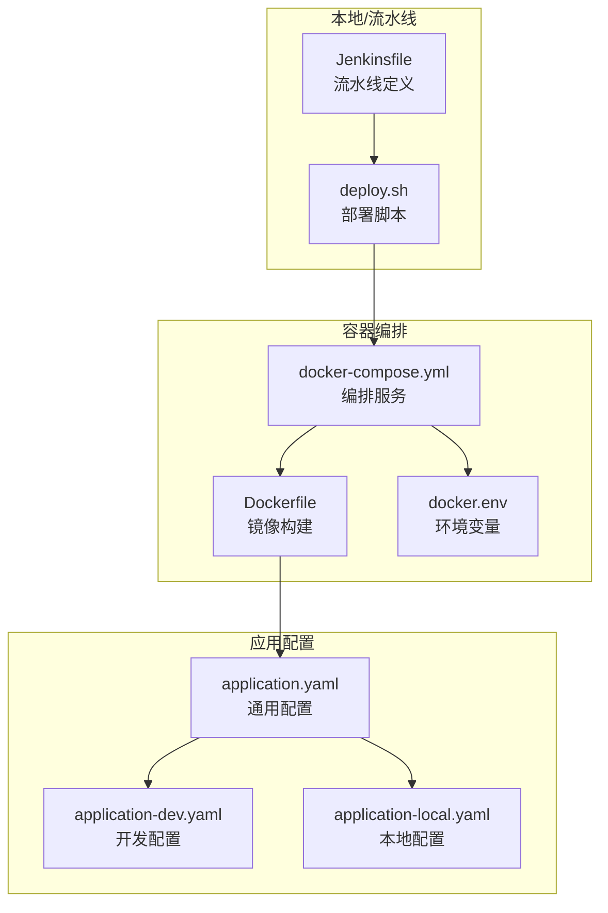
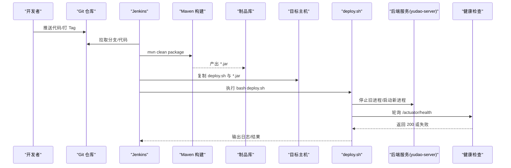
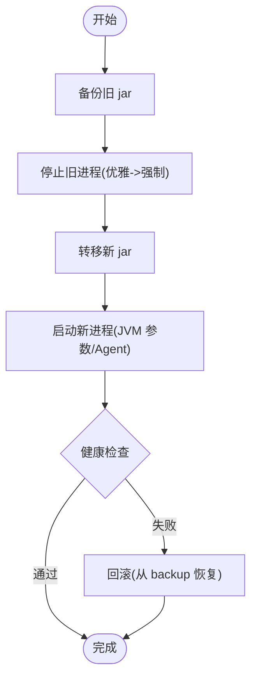
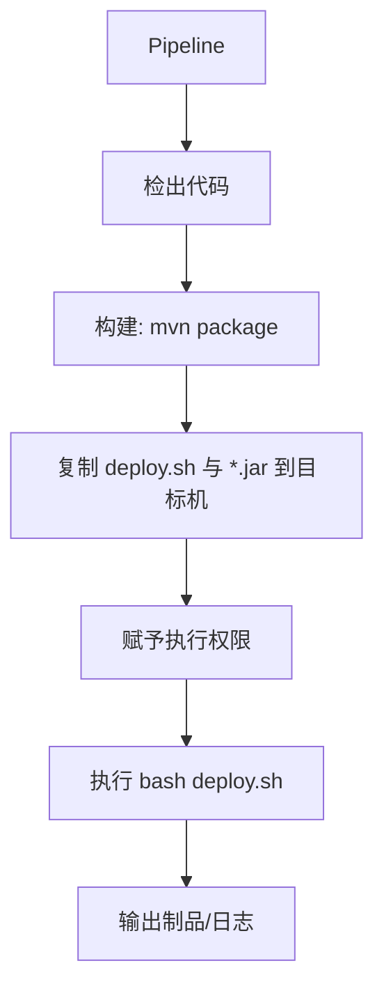
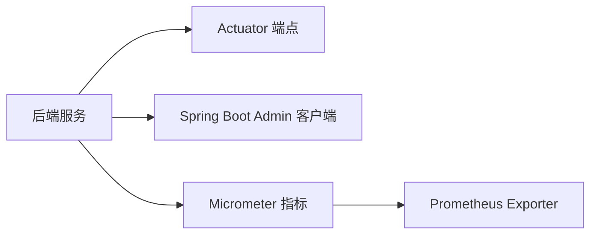
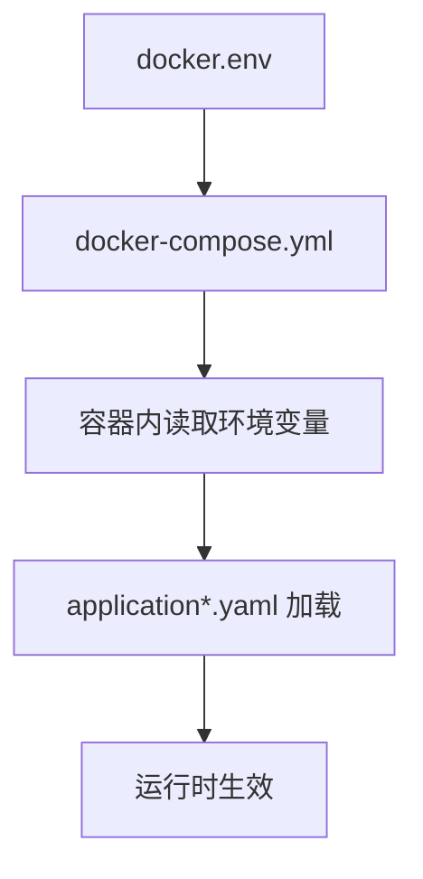
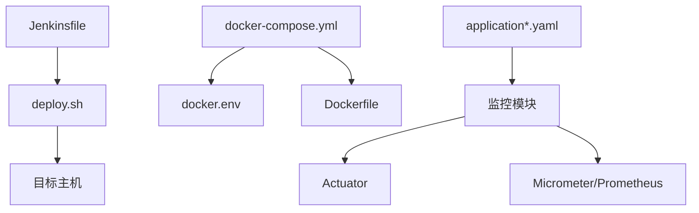

# 运维自动化

<cite>
**本文引用的文件**
- [script/shell/deploy.sh](file://script/shell/deploy.sh)
- [script/jenkins/Jenkinsfile](file://script/jenkins/Jenkinsfile)
- [script/docker/docker-compose.yml](file://script/docker/docker-compose.yml)
- [script/docker/docker.env](file://script/docker/docker.env)
- [yudao-server/Dockerfile](file://yudao-server/Dockerfile)
- [yudao-server/src/main/resources/application.yaml](file://yudao-server/src/main/resources/application.yaml)
- [yudao-server/src/main/resources/application-dev.yaml](file://yudao-server/src/main/resources/application-dev.yaml)
- [yudao-server/src/main/resources/application-local.yaml](file://yudao-server/src/main/resources/application-local.yaml)
- [yudao-framework/yudao-spring-boot-starter-monitor/src/main/java/cn/iocoder/yudao/framework/tracer/config/YudaoMetricsAutoConfiguration.java](file://yudao-framework/yudao-spring-boot-starter-monitor/src/main/java/cn/iocoder/yudao/framework/tracer/config/YudaoMetricsAutoConfiguration.java)
- [yudao-framework/yudao-spring-boot-starter-monitor/pom.xml](file://yudao-framework/yudao-spring-boot-starter-monitor/pom.xml)
</cite>

## 目录
1. [简介](#简介)
2. [项目结构](#项目结构)
3. [核心组件](#核心组件)
4. [架构总览](#架构总览)
5. [详细组件分析](#详细组件分析)
6. [依赖分析](#依赖分析)
7. [性能考虑](#性能考虑)
8. [故障排查指南](#故障排查指南)
9. [结论](#结论)
10. [附录](#附录)

## 简介
本指南面向运维与开发团队，围绕 ruoyi-vue-pro 的部署自动化、持续集成、监控自动化、配置管理、日志处理、备份与恢复、扩容与弹性、安全自动化以及常用运维工具进行系统化梳理。文档结合仓库中的 Shell 部署脚本、Jenkins Pipeline、Docker Compose 编排、Spring Boot 配置与监控模块，给出可落地的实践步骤与可视化流程图。

## 项目结构
- 运维自动化相关位置
  - 部署与编排：script/shell/deploy.sh、script/docker/docker-compose.yml、yudao-server/Dockerfile
  - 持续集成：script/jenkins/Jenkinsfile
  - 配置管理：yudao-server/src/main/resources/*.yaml、script/docker/docker.env
  - 监控与指标：yudao-framework/yudao-spring-boot-starter-monitor/*、application*.yaml 中的 Actuator 与 Spring Boot Admin 配置
- 项目特性
  - 后端服务通过 Dockerfile 打包为镜像，容器暴露 48080 端口
  - Docker Compose 统一编排 MySQL、Redis、后端服务与前端管理端
  - Jenkins Pipeline 负责检出、构建、制品归档与远程部署

图表来源
- [script/jenkins/Jenkinsfile:1-61](file://script/jenkins/Jenkinsfile#L1-L61)
- [script/shell/deploy.sh:1-161](file://script/shell/deploy.sh#L1-L161)
- [script/docker/docker-compose.yml:1-85](file://script/docker/docker-compose.yml#L1-L85)
- [yudao-server/Dockerfile:1-24](file://yudao-server/Dockerfile#L1-L24)
- [yudao-server/src/main/resources/application.yaml:1-354](file://yudao-server/src/main/resources/application.yaml#L1-L354)
- [yudao-server/src/main/resources/application-dev.yaml:1-212](file://yudao-server/src/main/resources/application-dev.yaml#L1-L212)
- [yudao-server/src/main/resources/application-local.yaml:1-285](file://yudao-server/src/main/resources/application-local.yaml#L1-L285)

章节来源
- [script/jenkins/Jenkinsfile:1-61](file://script/jenkins/Jenkinsfile#L1-L61)
- [script/shell/deploy.sh:1-161](file://script/shell/deploy.sh#L1-L161)
- [script/docker/docker-compose.yml:1-85](file://script/docker/docker-compose.yml#L1-L85)
- [yudao-server/Dockerfile:1-24](file://yudao-server/Dockerfile#L1-L24)
- [yudao-server/src/main/resources/application.yaml:1-354](file://yudao-server/src/main/resources/application.yaml#L1-L354)

## 核心组件
- 部署自动化脚本
  - 功能：备份旧 jar、停止服务、转移新 jar、启动服务、健康检查
  - 关键变量：基础路径、源 jar 路径、服务名、活动 profile、健康检查 URL、JVM 参数、堆转储路径
- 持续集成流水线
  - 功能：拉取代码、按需替换配置、打包构建、复制制品到目标机、赋予执行权限、远程执行部署脚本
- 容器化编排
  - 功能：统一声明 MySQL、Redis、后端服务、前端管理端的镜像、端口映射、环境变量与依赖关系
- 配置管理
  - 功能：通过 application*.yaml 分层配置，docker.env 管理环境变量，Dockerfile 暴露参数
- 监控与指标
  - 功能：Actuator 暴露端点、Spring Boot Admin 客户端注册、Micrometer + Prometheus 指标标签

章节来源
- [script/shell/deploy.sh:1-161](file://script/shell/deploy.sh#L1-L161)
- [script/jenkins/Jenkinsfile:1-61](file://script/jenkins/Jenkinsfile#L1-L61)
- [script/docker/docker-compose.yml:1-85](file://script/docker/docker-compose.yml#L1-L85)
- [script/docker/docker.env:1-26](file://script/docker/docker.env#L1-L26)
- [yudao-server/Dockerfile:1-24](file://yudao-server/Dockerfile#L1-L24)
- [yudao-server/src/main/resources/application.yaml:1-354](file://yudao-server/src/main/resources/application.yaml#L1-L354)
- [yudao-server/src/main/resources/application-dev.yaml:1-212](file://yudao-server/src/main/resources/application-dev.yaml#L1-L212)
- [yudao-server/src/main/resources/application-local.yaml:1-285](file://yudao-server/src/main/resources/application-local.yaml#L1-L285)
- [yudao-framework/yudao-spring-boot-starter-monitor/src/main/java/cn/iocoder/yudao/framework/tracer/config/YudaoMetricsAutoConfiguration.java:1-27](file://yudao-framework/yudao-spring-boot-starter-monitor/src/main/java/cn/iocoder/yudao/framework/tracer/config/YudaoMetricsAutoConfiguration.java#L1-L27)
- [yudao-framework/yudao-spring-boot-starter-monitor/pom.xml:37-79](file://yudao-framework/yudao-spring-boot-starter-monitor/pom.xml#L37-L79)

## 架构总览
下图展示从 CI 触发到远程部署与健康检查的端到端流程，以及容器编排与配置注入的关键节点。

图表来源
- [script/jenkins/Jenkinsfile:29-61](file://script/jenkins/Jenkinsfile#L29-L61)
- [script/shell/deploy.sh:145-161](file://script/shell/deploy.sh#L145-L161)
- [yudao-server/src/main/resources/application-dev.yaml:124-145](file://yudao-server/src/main/resources/application-dev.yaml#L124-L145)

章节来源
- [script/jenkins/Jenkinsfile:1-61](file://script/jenkins/Jenkinsfile#L1-L61)
- [script/shell/deploy.sh:1-161](file://script/shell/deploy.sh#L1-L161)
- [yudao-server/src/main/resources/application-dev.yaml:124-145](file://yudao-server/src/main/resources/application-dev.yaml#L124-L145)

## 详细组件分析

### 部署自动化脚本（Shell）
- 设计要点
  - 备份策略：若存在旧 jar，则复制到 backup 目录并带时间戳
  - 停机策略：查找 PID，先优雅关闭（15），超时后强制关闭（9），最多等待 120 秒
  - 启动策略：nohup 后台启动，设置 JVM 参数与可选 Agent，注入 spring.profiles.active
  - 健康检查：轮询 Actuator 健康端点，超时输出最近日志并失败退出
- 回滚机制
  - 通过备份目录保留上一版本 jar，可在部署失败时手动回退
- 可扩展点
  - 增加蓝绿/滚动发布策略
  - 增加灰度流量切换与自动回滚阈值

图表来源
- [script/shell/deploy.sh:28-161](file://script/shell/deploy.sh#L28-L161)

章节来源
- [script/shell/deploy.sh:1-161](file://script/shell/deploy.sh#L1-L161)

### 持续集成（Jenkins Pipeline）
- 阶段划分
  - 检出：指定分支与仓库地址
  - 构建：按需替换配置文件后执行打包
  - 部署：复制脚本与制品到目标机，赋予执行权限并执行部署脚本
- 环境变量
  - DockerHub/GitHub/K8s 凭证 ID、镜像仓库与命名空间、应用名与部署路径
- 触发方式
  - 支持传入 TAG_NAME 参数，便于版本化发布

图表来源
- [script/jenkins/Jenkinsfile:29-61](file://script/jenkins/Jenkinsfile#L29-L61)

章节来源
- [script/jenkins/Jenkinsfile:1-61](file://script/jenkins/Jenkinsfile#L1-L61)

### 监控自动化（Actuator + Spring Boot Admin + Micrometer）
- Actuator 端点
  - 开放根路径与端点暴露范围，便于集中监控
- Spring Boot Admin
  - 客户端注册与上下文路径配置，便于集中查看实例状态
- Micrometer + Prometheus
  - 通过自动配置为指标添加通用标签，便于多实例聚合与告警

图表来源
- [yudao-server/src/main/resources/application-dev.yaml:124-145](file://yudao-server/src/main/resources/application-dev.yaml#L124-L145)
- [yudao-framework/yudao-spring-boot-starter-monitor/src/main/java/cn/iocoder/yudao/framework/tracer/config/YudaoMetricsAutoConfiguration.java:1-27](file://yudao-framework/yudao-spring-boot-starter-monitor/src/main/java/cn/iocoder/yudao/framework/tracer/config/YudaoMetricsAutoConfiguration.java#L1-L27)
- [yudao-framework/yudao-spring-boot-starter-monitor/pom.xml:65-70](file://yudao-framework/yudao-spring-boot-starter-monitor/pom.xml#L65-L70)

章节来源
- [yudao-server/src/main/resources/application-dev.yaml:124-145](file://yudao-server/src/main/resources/application-dev.yaml#L124-L145)
- [yudao-framework/yudao-spring-boot-starter-monitor/src/main/java/cn/iocoder/yudao/framework/tracer/config/YudaoMetricsAutoConfiguration.java:1-27](file://yudao-framework/yudao-spring-boot-starter-monitor/src/main/java/cn/iocoder/yudao/framework/tracer/config/YudaoMetricsAutoConfiguration.java#L1-L27)
- [yudao-framework/yudao-spring-boot-starter-monitor/pom.xml:65-70](file://yudao-framework/yudao-spring-boot-starter-monitor/pom.xml#L65-L70)

### 配置管理自动化（模板、环境变量与更新）
- 配置层次
  - application.yaml 为通用配置，application-dev.yaml 与 application-local.yaml 为环境差异化配置
- 环境变量
  - docker.env 统一管理数据库、Redis、前端参数等
  - Dockerfile 暴露 JAVA_OPTS 与 ARGS，便于容器启动时覆盖
- 更新策略
  - 通过 CI 将环境配置注入到目标机，随后由部署脚本或容器编排读取

图表来源
- [script/docker/docker-compose.yml:37-56](file://script/docker/docker-compose.yml#L37-L56)
- [script/docker/docker.env:1-26](file://script/docker/docker.env#L1-L26)
- [yudao-server/Dockerfile:13-18](file://yudao-server/Dockerfile#L13-L18)
- [yudao-server/src/main/resources/application.yaml:1-354](file://yudao-server/src/main/resources/application.yaml#L1-L354)

章节来源
- [script/docker/docker-compose.yml:1-85](file://script/docker/docker-compose.yml#L1-L85)
- [script/docker/docker.env:1-26](file://script/docker/docker.env#L1-L26)
- [yudao-server/Dockerfile:1-24](file://yudao-server/Dockerfile#L1-L24)
- [yudao-server/src/main/resources/application.yaml:1-354](file://yudao-server/src/main/resources/application.yaml#L1-L354)

### 日志自动化处理（收集、轮转与分析）
- 日志落盘
  - application-dev.yaml 与 application-local.yaml 中配置了日志文件路径
- 建议实践
  - 使用集中式日志采集（如 Filebeat/Fluent Bit）投递到 ELK/EFK
  - 配合 logback/log4j2 的 RollingPolicy 实现按天/大小轮转
  - 在容器编排中挂载日志卷并设置合理的保留策略

章节来源
- [yudao-server/src/main/resources/application-dev.yaml:146-150](file://yudao-server/src/main/resources/application-dev.yaml#L146-L150)
- [yudao-server/src/main/resources/application-local.yaml:171-175](file://yudao-server/src/main/resources/application-local.yaml#L171-L175)

### 备份自动化（定时、验证与恢复）
- 备份策略
  - 部署脚本内置备份逻辑，保留上一版本 jar
- 数据库与持久化
  - docker-compose 声明卷，MySQL/Redis 数据持久化
- 建议实践
  - 定时快照/导出策略（如每天凌晨备份数据库）
  - 备份链路验证（周期性恢复演练）
  - 恢复脚本与回滚流程标准化

章节来源
- [script/shell/deploy.sh:28-39](file://script/shell/deploy.sh#L28-L39)
- [script/docker/docker-compose.yml:16-27](file://script/docker/docker-compose.yml#L16-L27)
- [script/docker/docker-compose.yml:80-85](file://script/docker/docker-compose.yml#L80-L85)

### 扩容自动化（自动伸缩、LB 与监控）
- 容器编排
  - 通过 docker-compose 可横向扩展后端服务副本（需配合外部 LB）
- 建议实践
  - 使用 Kubernetes HPA/HPA 曲线扩缩容
  - 负载均衡器（Nginx/Ingress）分发流量
  - 结合 Micrometer + Prometheus + Grafana 实时观测 CPU/内存/请求数

章节来源
- [script/docker/docker-compose.yml:29-56](file://script/docker/docker-compose.yml#L29-L56)
- [yudao-framework/yudao-spring-boot-starter-monitor/pom.xml:65-70](file://yudao-framework/yudao-spring-boot-starter-monitor/pom.xml#L65-L70)

### 安全自动化（扫描、检测与补丁）
- 建议实践
  - 镜像安全扫描（Trivy/Snyk）与依赖漏洞扫描（OWASP Dependency-Check）
  - 定期更新基础镜像与依赖版本
  - 配置 Secret 管理（如 Vault/Credentials Binding）

章节来源
- [script/docker/docker-compose.yml:1-85](file://script/docker/docker-compose.yml#L1-L85)

### 运维工具集（常用命令与排查）
- 常用命令
  - 查看进程与端口占用、容器日志、卷与网络
- 故障排查
  - 健康检查失败：查看 nohup.out 与 Actuator 日志
  - 数据库/缓存连通性：使用 telnet/curl 验证端口
- 性能分析
  - 结合 Micrometer 指标与 JVM 参数优化（堆大小、GC 参数）

章节来源
- [script/shell/deploy.sh:107-143](file://script/shell/deploy.sh#L107-L143)
- [yudao-server/src/main/resources/application-dev.yaml:124-145](file://yudao-server/src/main/resources/application-dev.yaml#L124-L145)

## 依赖分析
- 组件耦合
  - Jenkinsfile 依赖 deploy.sh 与 Maven 构建产物
  - deploy.sh 依赖目标主机的目录结构与健康检查端点
  - docker-compose.yml 依赖 docker.env 与 Dockerfile
  - 监控模块依赖 Actuator 与 Micrometer/Prometheus
- 外部依赖
  - MySQL/Redis 容器、前端静态资源、Jenkins 凭证

图表来源
- [script/jenkins/Jenkinsfile:1-61](file://script/jenkins/Jenkinsfile#L1-L61)
- [script/shell/deploy.sh:1-161](file://script/shell/deploy.sh#L1-L161)
- [script/docker/docker-compose.yml:1-85](file://script/docker/docker-compose.yml#L1-L85)
- [script/docker/docker.env:1-26](file://script/docker/docker.env#L1-L26)
- [yudao-server/Dockerfile:1-24](file://yudao-server/Dockerfile#L1-L24)
- [yudao-server/src/main/resources/application.yaml:1-354](file://yudao-server/src/main/resources/application.yaml#L1-L354)
- [yudao-framework/yudao-spring-boot-starter-monitor/pom.xml:65-70](file://yudao-framework/yudao-spring-boot-starter-monitor/pom.xml#L65-L70)

章节来源
- [script/jenkins/Jenkinsfile:1-61](file://script/jenkins/Jenkinsfile#L1-L61)
- [script/shell/deploy.sh:1-161](file://script/shell/deploy.sh#L1-L161)
- [script/docker/docker-compose.yml:1-85](file://script/docker/docker-compose.yml#L1-L85)
- [script/docker/docker.env:1-26](file://script/docker/docker.env#L1-L26)
- [yudao-server/Dockerfile:1-24](file://yudao-server/Dockerfile#L1-L24)
- [yudao-server/src/main/resources/application.yaml:1-354](file://yudao-server/src/main/resources/application.yaml#L1-L354)
- [yudao-framework/yudao-spring-boot-starter-monitor/pom.xml:65-70](file://yudao-framework/yudao-spring-boot-starter-monitor/pom.xml#L65-L70)

## 性能考虑
- JVM 参数
  - 通过 docker.env 与 Dockerfile 的 JAVA_OPTS 控制初始/最大堆与安全熵源
- 连接池与数据库
  - application-dev.yaml/application-local.yaml 中配置 Druid 连接池参数，确保高并发下的稳定性
- 指标与可观测性
  - 通过 Micrometer + Prometheus + Grafana 实时观测关键指标，结合告警规则实现主动治理

章节来源
- [script/docker/docker.env:5-6](file://script/docker/docker.env#L5-L6)
- [yudao-server/Dockerfile:13-14](file://yudao-server/Dockerfile#L13-L14)
- [yudao-server/src/main/resources/application-dev.yaml:32-47](file://yudao-server/src/main/resources/application-dev.yaml#L32-L47)
- [yudao-server/src/main/resources/application-local.yaml:13-81](file://yudao-server/src/main/resources/application-local.yaml#L13-L81)
- [yudao-framework/yudao-spring-boot-starter-monitor/pom.xml:65-70](file://yudao-framework/yudao-spring-boot-starter-monitor/pom.xml#L65-L70)

## 故障排查指南
- 健康检查失败
  - 检查 Actuator 端点是否开放、网络连通性、日志尾部输出
- 启动失败
  - 查看 nohup.out 与容器日志，核对 JVM 参数与环境变量
- 数据库/缓存异常
  - 使用容器网络连通性测试，核对 application-dev.yaml/application-local.yaml 中的数据源与 Redis 配置

章节来源
- [script/shell/deploy.sh:107-143](file://script/shell/deploy.sh#L107-L143)
- [yudao-server/src/main/resources/application-dev.yaml:124-145](file://yudao-server/src/main/resources/application-dev.yaml#L124-L145)
- [yudao-server/src/main/resources/application-local.yaml:146-175](file://yudao-server/src/main/resources/application-local.yaml#L146-L175)

## 结论
本指南基于仓库现有脚本与配置，给出了部署自动化、CI 流水线、容器编排、监控与指标、配置管理、日志处理、备份恢复、扩容与安全自动化及运维工具的系统化实践路径。建议在此基础上进一步完善蓝绿发布、自动化回滚、集中式日志与告警、Kubernetes 自动扩缩容与安全扫描，以满足生产级运维需求。

## 附录
- 关键路径速览
  - 部署脚本：[script/shell/deploy.sh:1-161](file://script/shell/deploy.sh#L1-L161)
  - Jenkins 流水线：[script/jenkins/Jenkinsfile:1-61](file://script/jenkins/Jenkinsfile#L1-L61)
  - 容器编排：[script/docker/docker-compose.yml:1-85](file://script/docker/docker-compose.yml#L1-L85)、[script/docker/docker.env:1-26](file://script/docker/docker.env#L1-L26)
  - 镜像构建：[yudao-server/Dockerfile:1-24](file://yudao-server/Dockerfile#L1-L24)
  - 应用配置：[application.yaml:1-354](file://yudao-server/src/main/resources/application.yaml#L1-L354)、[application-dev.yaml:1-212](file://yudao-server/src/main/resources/application-dev.yaml#L1-L212)、[application-local.yaml:1-285](file://yudao-server/src/main/resources/application-local.yaml#L1-L285)
  - 监控模块：[YudaoMetricsAutoConfiguration.java:1-27](file://yudao-framework/yudao-spring-boot-starter-monitor/src/main/java/cn/iocoder/yudao/framework/tracer/config/YudaoMetricsAutoConfiguration.java#L1-L27)、[pom.xml:65-70](file://yudao-framework/yudao-spring-boot-starter-monitor/pom.xml#L65-L70)