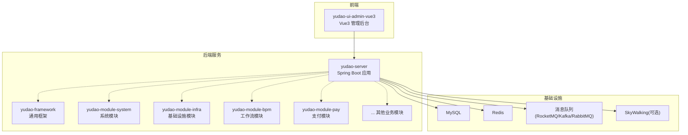
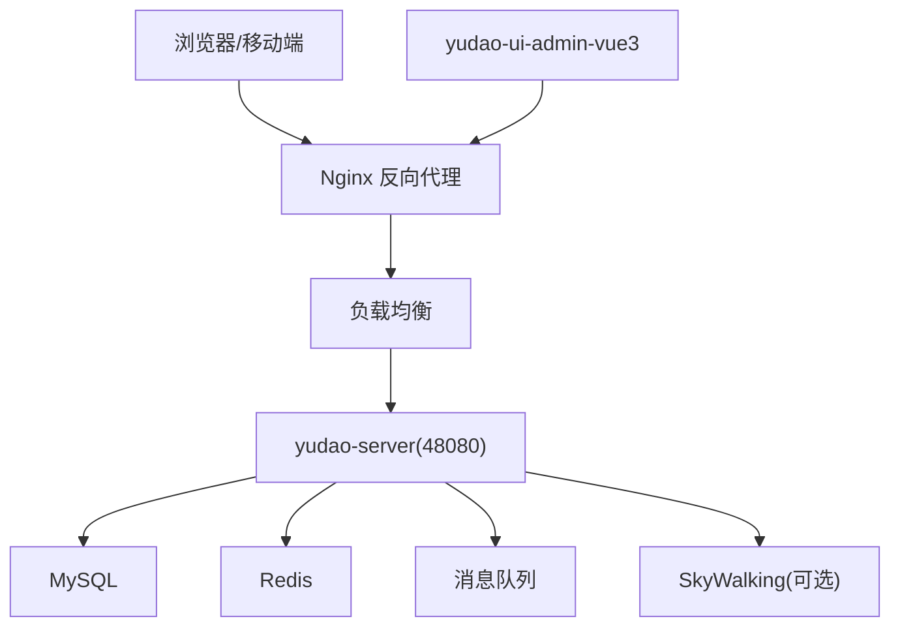
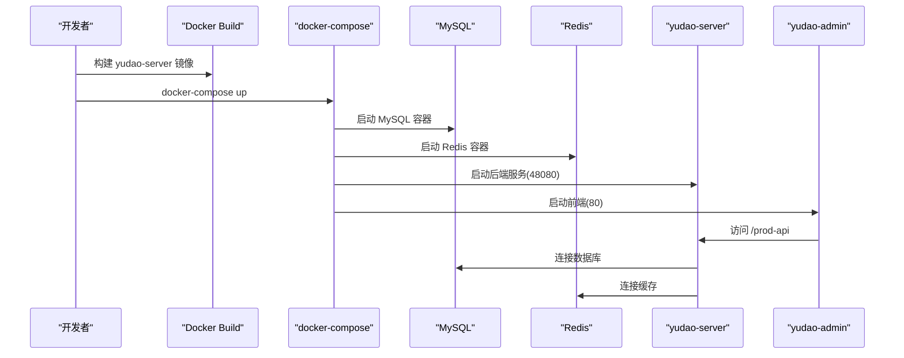
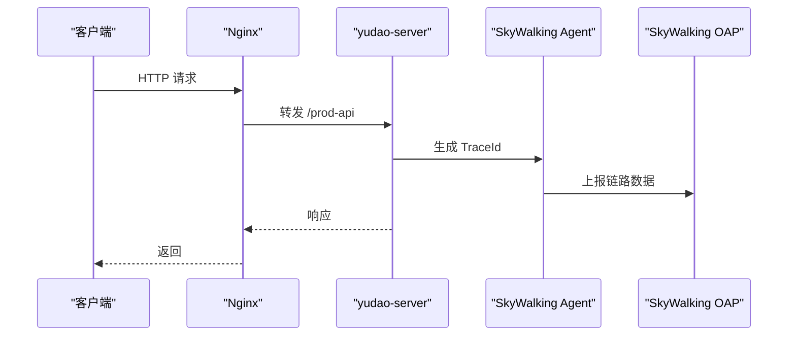
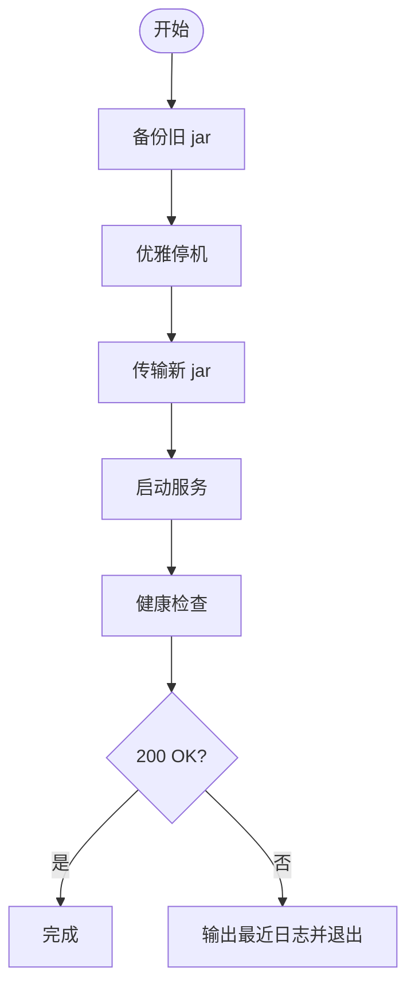
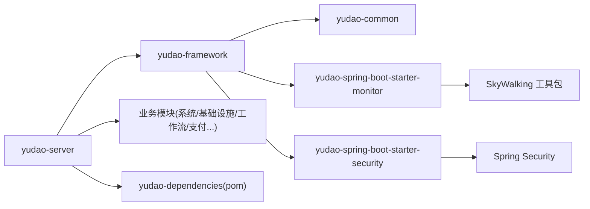

# 郃道 ruoyi-vue-pro 部署运维指南

<cite>
**本文引用的文件**
- [README.md](file://README.md)
- [Dockerfile](file://yudao-server/Dockerfile)
- [docker-compose.yml](file://script/docker/docker-compose.yml)
- [docker.env](file://script/docker/docker.env)
- [deploy.sh](file://script/shell/deploy.sh)
- [application.yaml](file://yudao-server/src/main/resources/application.yaml)
- [application-local.yaml](file://yudao-server/src/main/resources/application-local.yaml)
- [application-dev.yaml](file://yudao-server/src/main/resources/application-dev.yaml)
- [logback-spring.xml](file://yudao-server/src/main/resources/logback-spring.xml)
- [TracerUtils.java](file://yudao-framework/yudao-common/src/main/java/cn/iocoder/yudao/framework/common/util/monitor/TracerUtils.java)
- [pom.xml（yudao-dependencies）](file://yudao-dependencies/pom.xml)
- [pom.xml（yudao-spring-boot-starter-monitor）](file://yudao-framework/yudao-spring-boot-starter-monitor/pom.xml)
- [pom.xml（yudao-spring-boot-starter-security）](file://yudao-framework/yudao-spring-boot-starter-security/pom.xml)
- [WebFilterOrderEnum.java](file://yudao-framework/yudao-common/src/main/java/cn/iocoder/yudao/framework/common/enums/WebFilterOrderEnum.java)
- [quartz.sql（MySQL）](file://sql/mysql/quartz.sql)
- [ruoyi-vue-pro.sql（MySQL）](file://sql/mysql/ruoyi-vue-pro.sql)
</cite>

## 目录
1. [简介](#简介)
2. [项目结构](#项目结构)
3. [核心组件](#核心组件)
4. [架构概览](#架构概览)
5. [详细组件分析](#详细组件分析)
6. [依赖分析](#依赖分析)
7. [性能考虑](#性能考虑)
8. [故障排查指南](#故障排查指南)
9. [结论](#结论)
10. [附录](#附录)

## 简介
本指南面向运维工程师与开发团队，围绕芋道 ruoyi-vue-pro 提供从本地部署到容器化、再到生产环境的完整运维实践，覆盖以下主题：
- 本地部署：环境准备、服务启动、配置要点与常见问题
- 容器化部署：Docker 镜像构建、Compose 编排与镜像参数
- 生产环境：Nginx 反向代理、负载均衡、SSL 证书与安全加固
- 监控告警：应用监控、链路追踪、日志收集与性能指标
- 数据库：部署、初始化脚本、备份与故障恢复
- 运维自动化：部署脚本、监控脚本与维护脚本
- 性能优化：JVM 调优、数据库优化与前端资源优化
- 故障排查：常见问题诊断与解决方案

## 项目结构
ruoyi-vue-pro 采用前后端分离架构，后端为 Spring Boot 多模块工程，前端为 Vue3 管理后台，配合数据库、缓存与消息队列等基础设施。

**图表来源**
- [README.md:311-334](file://README.md#L311-L334)
- [application.yaml:1-354](file://yudao-server/src/main/resources/application.yaml#L1-L354)

**章节来源**
- [README.md:311-334](file://README.md#L311-L334)
- [application.yaml:1-354](file://yudao-server/src/main/resources/application.yaml#L1-L354)

## 核心组件
- 后端服务：yudao-server，提供管理后台与用户 APP 的后端能力，包含接口文档、定时任务、消息队列、WebSocket、多租户、安全与监控等特性。
- 前端管理后台：yudao-ui-admin-vue3，基于 Vue3 + Element Plus，提供统一的管理界面。
- 基础设施：MySQL、Redis、消息队列（RocketMQ/Kafka/RabbitMQ），以及可选的 SkyWalking 链路追踪与 Spring Boot Admin 监控。
- 运维脚本：Shell 部署脚本、Docker 镜像与 Compose 编排文件。

**章节来源**
- [application.yaml:1-354](file://yudao-server/src/main/resources/application.yaml#L1-L354)
- [application-local.yaml:1-281](file://yudao-server/src/main/resources/application-local.yaml#L1-L281)
- [application-dev.yaml:1-212](file://yudao-server/src/main/resources/application-dev.yaml#L1-L212)

## 架构概览
后端服务通过 Spring Boot 启动，加载多环境配置，连接数据库与缓存，提供 REST 接口与内部服务。前端通过反向代理访问后端 API，后端可选接入 SkyWalking 进行链路追踪与日志中心。

**图表来源**
- [docker-compose.yml:58-78](file://script/docker/docker-compose.yml#L58-L78)
- [application.yaml:1-354](file://yudao-server/src/main/resources/application.yaml#L1-L354)

## 详细组件分析

### 本地部署流程
- 环境要求
  - JDK：项目支持 JDK 8 + Spring Boot 2.7 与 JDK 17/21 + Spring Boot 3.2（详见 README 的版本说明）。
  - 数据库：MySQL 5.7/8.0+，或兼容数据库（Oracle、PostgreSQL、SQL Server、达梦、OpenGauss 等）。
  - 缓存：Redis 5/6/7。
  - 消息队列：Event、Redis、RabbitMQ、Kafka、RocketMQ。
- 启动步骤
  - 准备数据库：执行对应数据库的初始化 SQL（MySQL 示例见 sql/mysql/ruoyi-vue-pro.sql）。
  - 配置文件：application-local.yaml 提供本地开发默认配置，包括数据库、Redis、定时任务、监控端点等。
  - 启动后端：使用 application-local.yaml 激活本地配置，端口默认 48080。
  - 启动前端：yudao-ui-admin-vue3 通过 Vite 启动，访问 /prod-api 前缀转发到后端。
- 常见问题
  - 数据库连接失败：检查 application-local.yaml 中的数据库 URL、用户名与密码。
  - Redis 连接失败：确认 Redis 地址与端口。
  - Actuator 端点未开放：确保 management.endpoints.web.exposure.include 设置为 *。
  - Druid 监控：默认开放 /druid/* 控制台，可配置登录凭据。

**章节来源**
- [application-local.yaml:1-281](file://yudao-server/src/main/resources/application-local.yaml#L1-L281)
- [application-dev.yaml:1-212](file://yudao-server/src/main/resources/application-dev.yaml#L1-L212)
- [ruoyi-vue-pro.sql（MySQL）](file://sql/mysql/ruoyi-vue-pro.sql)

### 容器化部署方案
- Docker 镜像构建
  - 基于 eclipse-temurin:21-jre，设置时区 Asia/Shanghai，JAVA_OPTS 默认堆大小 512m，暴露 48080 端口。
  - 可通过 docker run -e "JAVA_OPTS=" 覆盖默认 JVM 参数。
- Compose 编排
  - 启动 mysql:8、redis:6-alpine、yudao-server 与 yudao-admin（前端）。
  - 环境变量来自 docker.env，支持主从数据源、Redis 主机等参数注入。
  - 前端通过 Nginx 暴露 80 端口，后端通过 48080 端口。
- 镜像参数
  - SPRING_PROFILES_ACTIVE: local
  - JAVA_OPTS/ARGS：传入数据源与 Redis 连接参数
  - MASTER_DATASOURCE_* / SLAVE_DATASOURCE_*：主从数据源配置
  - REDIS_HOST：Redis 地址

**图表来源**
- [Dockerfile:1-24](file://yudao-server/Dockerfile#L1-L24)
- [docker-compose.yml:1-85](file://script/docker/docker-compose.yml#L1-L85)
- [docker.env:1-26](file://script/docker/docker.env#L1-L26)

**章节来源**
- [Dockerfile:1-24](file://yudao-server/Dockerfile#L1-L24)
- [docker-compose.yml:1-85](file://script/docker/docker-compose.yml#L1-L85)
- [docker.env:1-26](file://script/docker/docker.env#L1-L26)

### 生产环境部署
- Nginx 反向代理
  - 将前端静态资源与后端 API 路由统一入口，建议将 /prod-api 转发到 yudao-server。
  - 配置 gzip、缓存与安全头，结合 HTTPS。
- 负载均衡
  - 使用 Nginx/HAProxy/LVS 等实现多实例后端负载均衡，注意 Session/Token 策略与 Redis 共享。
- SSL 证书
  - 使用 Let's Encrypt 或商业证书，配置 TLS 1.3，禁用弱加密套件。
- 安全加固
  - 防火墙仅开放必要端口（80/443/22/48080/6379/3306），限制来源 IP。
  - 启用 WAF（如 Nginx-Plus、ModSecurity），开启 OWASP 核心规则集。
  - 后端开启 Spring Security、XSS 过滤、接口加密与访问日志。

**章节来源**
- [application.yaml:267-281](file://yudao-server/src/main/resources/application.yaml#L267-L281)
- [WebFilterOrderEnum.java:1-36](file://yudao-framework/yudao-common/src/main/java/cn/iocoder/yudao/framework/common/enums/WebFilterOrderEnum.java#L1-L36)
- [pom.xml（yudao-spring-boot-starter-security）:1-31](file://yudao-framework/yudao-spring-boot-starter-security/pom.xml#L1-L31)

### 监控告警系统
- 应用监控
  - Spring Boot Admin：客户端注册到 Admin Server，查看健康、指标与日志。
  - Actuator：开放 /actuator/* 端点，采集运行时指标。
- 链路追踪
  - SkyWalking：通过 apm-toolkit-* 与日志插件接入，实现 TraceId 注入与日志中心。
  - TracerUtils：提供获取 TraceId 的工具方法。
- 日志收集
  - Logback：可选接入 SkyWalking GRPC 日志收集器，实现日志中心。
- 性能指标
  - Micrometer + Prometheus：导出指标到 Prometheus，结合 Grafana 可视化。

**图表来源**
- [TracerUtils.java:1-30](file://yudao-framework/yudao-common/src/main/java/cn/iocoder/yudao/framework/common/util/monitor/TracerUtils.java#L1-L30)
- [logback-spring.xml:37-56](file://yudao-server/src/main/resources/logback-spring.xml#L37-L56)
- [pom.xml（yudao-dependencies）:332-371](file://yudao-dependencies/pom.xml#L332-L371)
- [pom.xml（yudao-spring-boot-starter-monitor）:37-79](file://yudao-framework/yudao-spring-boot-starter-monitor/pom.xml#L37-L79)

**章节来源**
- [logback-spring.xml:37-56](file://yudao-server/src/main/resources/logback-spring.xml#L37-L56)
- [TracerUtils.java:1-30](file://yudao-framework/yudao-common/src/main/java/cn/iocoder/yudao/framework/common/util/monitor/TracerUtils.java#L1-L30)
- [pom.xml（yudao-dependencies）:332-371](file://yudao-dependencies/pom.xml#L332-L371)
- [pom.xml（yudao-spring-boot-starter-monitor）:37-79](file://yudao-framework/yudao-spring-boot-starter-monitor/pom.xml#L37-L79)

### 数据库部署与维护
- 初始化脚本
  - MySQL：使用 sql/mysql/ruoyi-vue-pro.sql 初始化业务表，quartz.sql 初始化定时任务表。
- 备份策略
  - 全量备份：每周一次，增量备份：每日一次。
  - 备份保留周期：至少 14 天，异地存储。
- 故障恢复
  - RTO/RPO：基于备份与 Binlog 恢复，演练季度一次。
  - 主从切换：使用半同步复制，监控延迟，异常自动切换。

**章节来源**
- [quartz.sql（MySQL）](file://sql/mysql/quartz.sql)
- [ruoyi-vue-pro.sql（MySQL）](file://sql/mysql/ruoyi-vue-pro.sql)

### 运维自动化脚本
- Shell 部署脚本
  - deploy.sh：支持备份、优雅停机、部署新包、启动与健康检查。
  - 支持 HeapDumpOnOutOfMemoryError，便于 OOM 问题定位。
  - 可选启用 SkyWalking Agent。
- 使用建议
  - 在 CI/CD 中调用，结合 Jenkinsfile 执行。
  - 健康检查 URL 可配置，失败自动退出并输出最近日志。

**图表来源**
- [deploy.sh:1-161](file://script/shell/deploy.sh#L1-L161)

**章节来源**
- [deploy.sh:1-161](file://script/shell/deploy.sh#L1-L161)

### 安全加固措施
- 防火墙
  - 仅开放 80/443/22/48080/6379/3306，限制来源 IP。
- 访问控制
  - Spring Security + Token + Redis，支持多终端与 SSO。
  - XSS 过滤、接口加密（AES/RSA）、白名单 URL。
- 安全审计
  - 操作日志与登录日志，记录关键操作与异常登录。

**章节来源**
- [application.yaml:267-281](file://yudao-server/src/main/resources/application.yaml#L267-L281)
- [WebFilterOrderEnum.java:1-36](file://yudao-framework/yudao-common/src/main/java/cn/iocoder/yudao/framework/common/enums/WebFilterOrderEnum.java#L1-L36)
- [pom.xml（yudao-spring-boot-starter-security）:1-31](file://yudao-framework/yudao-spring-boot-starter-security/pom.xml#L1-L31)

### 性能优化建议
- JVM 调优
  - 初始堆与最大堆：依据容器资源与业务峰值调整，避免频繁 GC。
  - GC 策略：G1/ ZGC（JDK 11+），开启并行回收与压缩指针。
  - 参数：-XX:+UseStringDeduplication、-XX:+OptimizeStringConcat。
- 数据库优化
  - 连接池：HikariCP/Druid，合理设置最大连接与空闲时间。
  - SQL：慢查询日志、索引优化、分页优化、读写分离。
- 前端资源优化
  - CDN、gzip/br 压缩、路由懒加载、图片优化、缓存策略。

## 依赖分析
后端服务通过 Maven 多模块管理，核心依赖包括 Spring Boot、MyBatis Plus、Redisson、SkyWalking、Spring Boot Admin 等。

**图表来源**
- [README.md:311-334](file://README.md#L311-L334)
- [pom.xml（yudao-dependencies）:332-371](file://yudao-dependencies/pom.xml#L332-L371)
- [pom.xml（yudao-spring-boot-starter-monitor）:37-79](file://yudao-framework/yudao-spring-boot-starter-monitor/pom.xml#L37-L79)
- [pom.xml（yudao-spring-boot-starter-security）:1-31](file://yudao-framework/yudao-spring-boot-starter-security/pom.xml#L1-L31)

**章节来源**
- [README.md:311-334](file://README.md#L311-L334)
- [pom.xml（yudao-dependencies）:332-371](file://yudao-dependencies/pom.xml#L332-L371)
- [pom.xml（yudao-spring-boot-starter-monitor）:37-79](file://yudao-framework/yudao-spring-boot-starter-monitor/pom.xml#L37-L79)
- [pom.xml（yudao-spring-boot-starter-security）:1-31](file://yudao-framework/yudao-spring-boot-starter-security/pom.xml#L1-L31)

## 性能考虑
- 启动与运行
  - 本地开发环境禁用 Quartz 自动配置，避免不必要的任务加载。
  - 生产环境开启 Quartz JDBC 存储与集群模式，确保任务一致性。
- 缓存与会话
  - Redis 缓存热点数据，开启连接池与序列化优化。
  - WebSocket 消息发送支持本地/Redis/RocketMQ/Kafka/RabbitMQ。
- 监控与可观测性
  - 开启 Actuator 端点，结合 Spring Boot Admin 与 SkyWalking 实现全链路观测。

**章节来源**
- [application-local.yaml:8-11](file://yudao-server/src/main/resources/application-local.yaml#L8-L11)
- [application-dev.yaml:67-96](file://yudao-server/src/main/resources/application-dev.yaml#L67-L96)
- [application.yaml:282-294](file://yudao-server/src/main/resources/application.yaml#L282-L294)

## 故障排查指南
- 启动失败
  - 检查 JAVA_OPTS 与端口占用，确认容器网络连通性。
  - 查看 nohup 输出与日志文件，定位异常堆栈。
- 数据库连接
  - 校验 URL、用户名、密码与字符集，确认网络可达与防火墙放行。
- Redis 连接
  - 检查主机、端口、认证与网络策略。
- 健康检查
  - 使用 /actuator/health 校验服务状态，失败时输出最近日志。
- 链路追踪
  - 确认 SkyWalking Agent 注入与 OAP 连通性，查看 TraceId 定位问题。

**章节来源**
- [deploy.sh:106-143](file://script/shell/deploy.sh#L106-L143)
- [application-local.yaml:146-198](file://yudao-server/src/main/resources/application-local.yaml#L146-L198)
- [logback-spring.xml:37-56](file://yudao-server/src/main/resources/logback-spring.xml#L37-L56)

## 结论
本指南提供了从本地到生产的完整部署与运维实践，结合容器化与自动化脚本，辅以监控、安全与性能优化建议，帮助团队稳定交付与持续演进业务系统。

## 附录
- 快速链接
  - 启动文档与视频教程：README 中的“启动文档”与“视频教程”链接。
  - 演示地址：README 中的演示站点。
- 版本与技术栈
  - README 中的版本说明与技术栈清单。

**章节来源**
- [README.md:16-23](file://README.md#L16-L23)
- [README.md:24-30](file://README.md#L24-L30)
- [README.md:311-359](file://README.md#L311-L359)