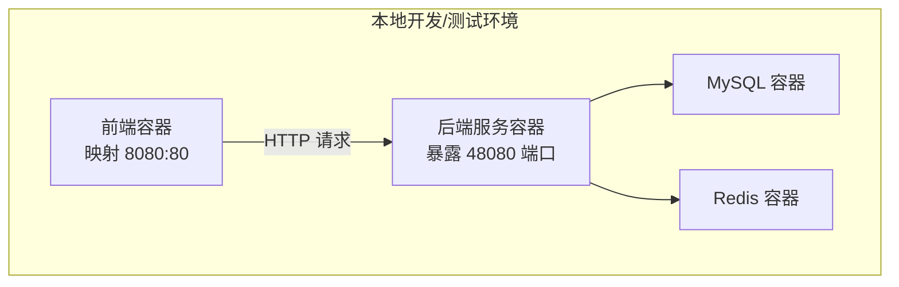
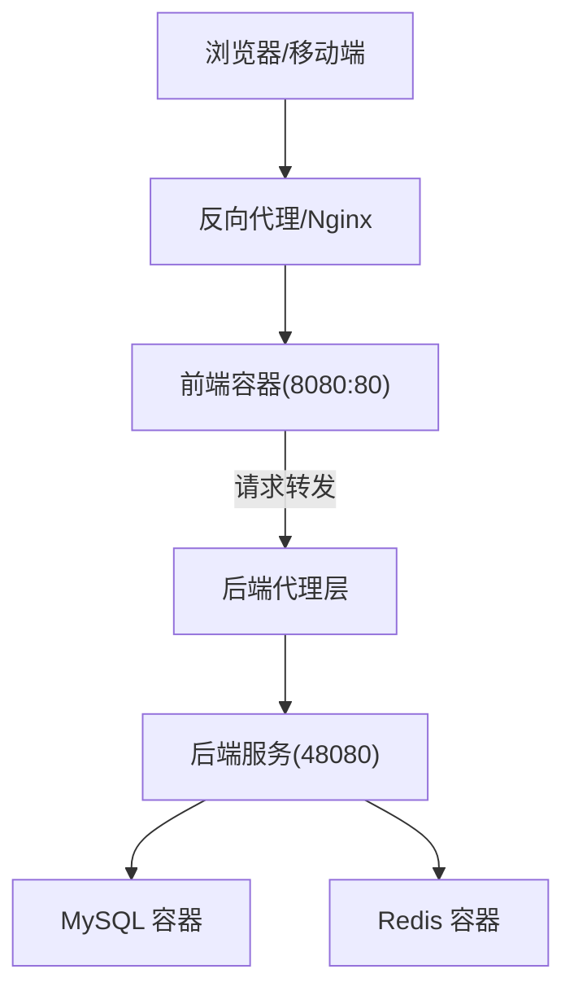
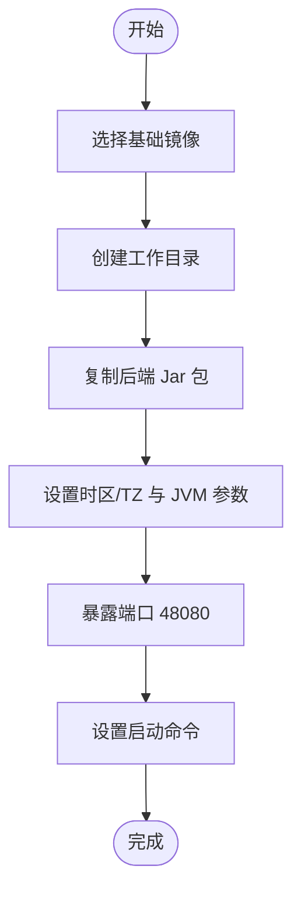
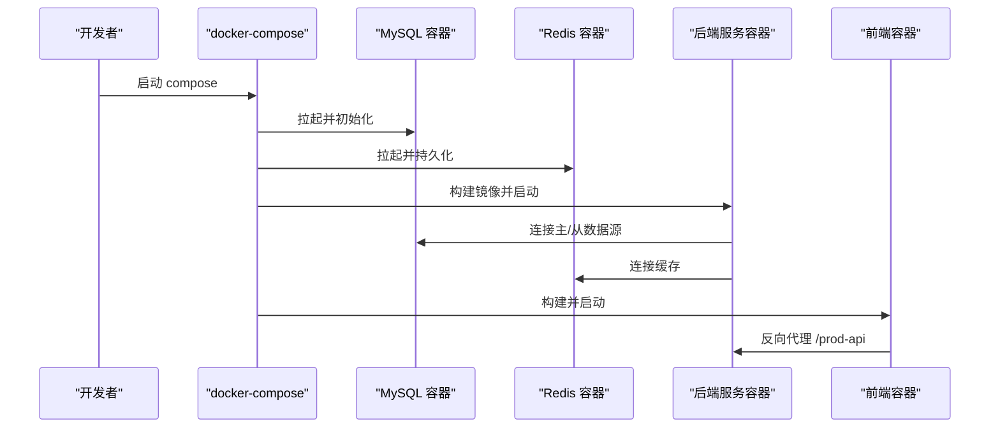
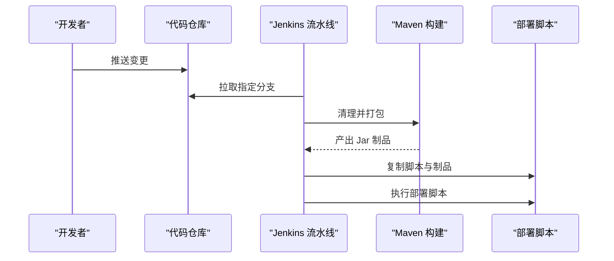
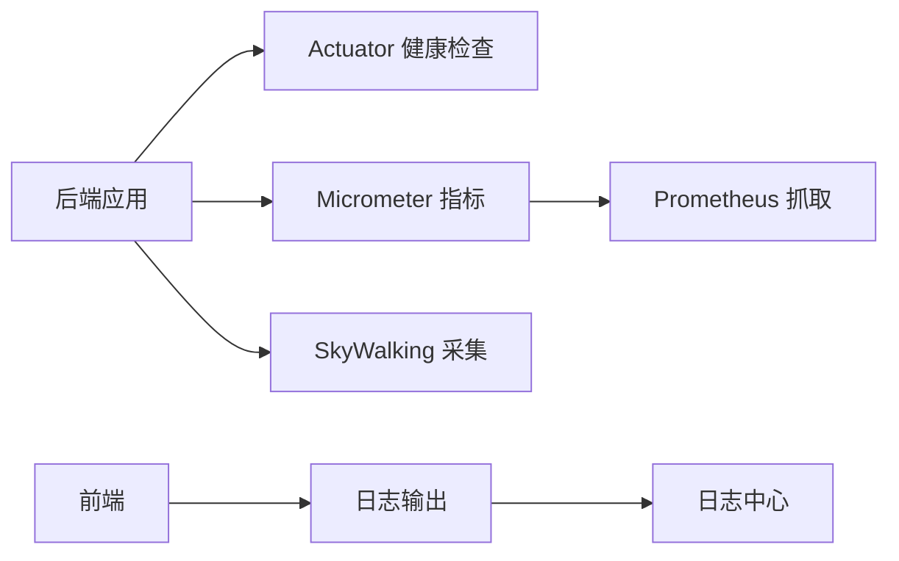
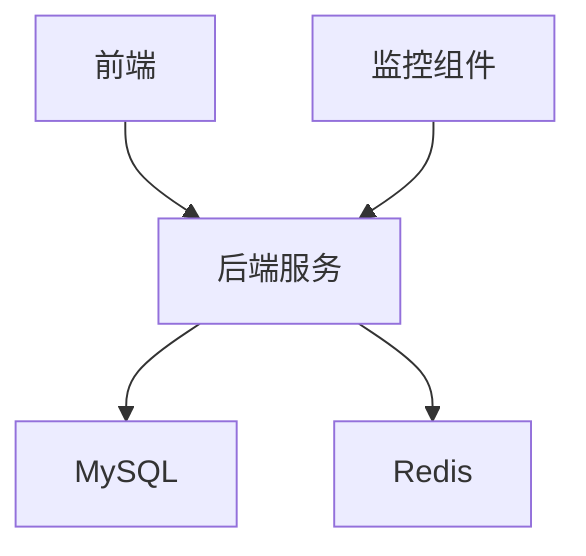

# 部署运维

<cite>
**本文引用的文件**
- [script/docker/docker-compose.yml](file://script/docker/docker-compose.yml)
- [script/docker/docker.env](file://script/docker/docker.env)
- [yudao-server/Dockerfile](file://yudao-server/Dockerfile)
- [script/jenkins/Jenkinsfile](file://script/jenkins/Jenkinsfile)
- [script/shell/deploy.sh](file://script/shell/deploy.sh)
- [yudao-server/src/main/resources/application.yaml](file://yudao-server/src/main/resources/application.yaml)
- [yudao-server/src/main/resources/application-dev.yaml](file://yudao-server/src/main/resources/application-dev.yaml)
- [yudao-server/src/main/resources/application-local.yaml](file://yudao-server/src/main/resources/application-local.yaml)
- [yudao-framework/yudao-spring-boot-starter-monitor/pom.xml](file://yudao-framework/yudao-spring-boot-starter-monitor/pom.xml)
- [yudao-framework/yudao-spring-boot-starter-monitor/src/main/java/cn/iocoder/yudao/framework/tracer/config/YudaoMetricsAutoConfiguration.java](file://yudao-framework/yudao-spring-boot-starter-monitor/src/main/java/cn/iocoder/yudao/framework/tracer/config/YudaoMetricsAutoConfiguration.java)
- [yudao-framework/yudao-spring-boot-starter-monitor/src/main/java/cn/iocoder/yudao/framework/tracer/core/util/TracerFrameworkUtils.java](file://yudao-framework/yudao-spring-boot-starter-monitor/src/main/java/cn/iocoder/yudao/framework/tracer/core/util/TracerFrameworkUtils.java)
- [yudao-ui/yudao-ui-admin-vue3/README.md](file://yudao-ui/yudao-ui-admin-vue3/README.md)
- [README.md](file://README.md)
</cite>

## 目录
1. [简介](#简介)
2. [项目结构](#项目结构)
3. [核心组件](#核心组件)
4. [架构总览](#架构总览)
5. [详细组件分析](#详细组件分析)
6. [依赖关系分析](#依赖关系分析)
7. [性能与容量规划](#性能与容量规划)
8. [故障排查指南](#故障排查指南)
9. [结论](#结论)
10. [附录](#附录)

## 简介
本文件面向“芋道 Ruoyi-Vue-Pro”项目的部署与运维，围绕以下目标展开：
- Docker 容器化部署：Dockerfile 构建、镜像制作、Compose 编排与环境变量配置
- 生产环境配置：数据库连接池、Redis 缓存、日志级别、安全参数等关键项
- CI/CD 流水线：Jenkins 自动化构建、制品归档与部署脚本
- 监控告警：健康检查、指标采集、链路追踪与日志中心
- 备份恢复：数据库、文件存储与配置文件的保护策略
- 故障排查：常见问题定位、性能瓶颈分析与日志分析技巧

## 项目结构
本项目采用前后端分离架构，后端基于 Spring Boot，前端基于 Vue3。部署侧主要涉及：
- 后端服务镜像构建与运行
- MySQL 与 Redis 的容器化依赖
- 前端静态资源由 Nginx 或反向代理提供（在 Compose 中以 admin 服务形式体现）
- Jenkins 流水线负责打包与部署

图表来源
- [script/docker/docker-compose.yml:5-84](file://script/docker/docker-compose.yml#L5-L84)
- [yudao-server/Dockerfile:1-24](file://yudao-server/Dockerfile#L1-L24)

章节来源
- [script/docker/docker-compose.yml:1-85](file://script/docker/docker-compose.yml#L1-L85)
- [yudao-server/Dockerfile:1-24](file://yudao-server/Dockerfile#L1-L24)

## 核心组件
- 后端服务镜像与运行
  - 基于 Eclipse Temurin 21 JRE 的精简镜像，暴露 48080 端口，通过 JAVA_OPTS 与 ARGS 注入 JVM 与 Spring 参数
- 数据库与缓存
  - MySQL 8 与 Redis 6-alpine，分别挂载卷持久化数据
- 前端服务
  - 通过构建参数注入环境变量，映射 8080:80 提供静态资源
- 环境变量与配置
  - docker.env 提供默认值；Compose 通过环境变量覆盖数据源与 Redis 主机

章节来源
- [yudao-server/Dockerfile:1-24](file://yudao-server/Dockerfile#L1-L24)
- [script/docker/docker-compose.yml:5-84](file://script/docker/docker-compose.yml#L5-L84)
- [script/docker/docker.env:1-26](file://script/docker/docker.env#L1-L26)

## 架构总览
下图展示容器化部署的整体交互：前端通过 /prod-api 访问后端，后端连接 MySQL 与 Redis。

图表来源
- [script/docker/docker-compose.yml:58-78](file://script/docker/docker-compose.yml#L58-L78)
- [yudao-server/Dockerfile:19-23](file://yudao-server/Dockerfile#L19-L23)

## 详细组件分析

### Dockerfile 构建与镜像制作
- 基础镜像：eclipse-temurin:21-jre
- 工作目录与拷贝：将打包产物 yudao-server.jar 拷入镜像
- 环境变量：TZ、JAVA_OPTS、ARGS
- 端口暴露与启动命令：EXPOSE 48080，CMD 使用 JAVA_OPTS 与 ARGS 启动

图表来源
- [yudao-server/Dockerfile:1-24](file://yudao-server/Dockerfile#L1-L24)

章节来源
- [yudao-server/Dockerfile:1-24](file://yudao-server/Dockerfile#L1-L24)

### docker-compose 编排与环境变量
- 服务编排：mysql、redis、server、admin
- 端口映射：server 映射 48080，admin 映射 8080:80
- 环境变量：
  - SPRING_PROFILES_ACTIVE、JAVA_OPTS、ARGS（含数据源与 Redis 主机）
  - 数据源与 Redis 默认指向同名容器网络主机名
- 依赖顺序：server 依赖 mysql 与 redis

图表来源
- [script/docker/docker-compose.yml:5-84](file://script/docker/docker-compose.yml#L5-L84)

章节来源
- [script/docker/docker-compose.yml:1-85](file://script/docker/docker-compose.yml#L1-L85)
- [script/docker/docker.env:1-26](file://script/docker/docker.env#L1-L26)

### Jenkins 自动化构建与部署
- 环境变量：DockerHub 凭证、GitHub 凭证、kubeconfig 凭证、镜像仓库与命名空间
- 阶段：
  - 拉取代码（指定分支）
  - 构建：条件复制外部 YAML 到 resources，执行 mvn 打包
  - 部署：复制 deploy.sh 与 jar 到目标路径，赋予执行权限并执行
- 注意：Jenkinsfile 中包含对多环境配置的临时处理注释

图表来源
- [script/jenkins/Jenkinsfile:1-61](file://script/jenkins/Jenkinsfile#L1-L61)
- [script/shell/deploy.sh:1-161](file://script/shell/deploy.sh#L1-L161)

章节来源
- [script/jenkins/Jenkinsfile:1-61](file://script/jenkins/Jenkinsfile#L1-L61)
- [script/shell/deploy.sh:1-161](file://script/shell/deploy.sh#L1-L161)

### 生产环境配置指南
- 数据库连接池
  - 在 application.yaml 中配置主从数据源与连接池参数（如最小空闲、最大连接、超时等）
  - 通过 docker.env 提供默认 MASTER/SLAVE 数据源 URL、用户名与密码
- Redis 缓存
  - 通过 ARGS 注入 spring.data.redis.host，或在 application.yaml 中显式配置
  - 建议开启连接池大小、超时与序列化策略
- 日志级别
  - application-dev.yaml 与 application-local.yaml 控制日志级别与输出格式
  - 建议生产使用 application.yaml 并按需降低 INFO/DEBUG 级别
- 安全参数
  - 启用 HTTPS、CORS 白名单、敏感头过滤
  - JWT 过期与刷新策略、密码加密强度与复杂度要求
- JVM 与容器资源
  - JAVA_OPTS 中设置堆大小与 GC 参数
  - docker-compose 中限制 CPU/内存，设置重启策略

章节来源
- [yudao-server/src/main/resources/application.yaml](file://yudao-server/src/main/resources/application.yaml)
- [yudao-server/src/main/resources/application-dev.yaml](file://yudao-server/src/main/resources/application-dev.yaml)
- [yudao-server/src/main/resources/application-local.yaml](file://yudao-server/src/main/resources/application-local.yaml)
- [script/docker/docker.env:1-26](file://script/docker/docker.env#L1-L26)

### 监控告警体系
- 健康检查
  - 后端暴露 Actuator 健康检查端点，部署脚本通过 curl 轮询确认 200
- 指标采集
  - 通过 Micrometer 与 Prometheus 集成，统一打点与导出
- 链路追踪
  - 集成 SkyWalking Toolkit，记录错误日志与堆栈
- 日志中心
  - 前端与后端均具备日志能力，建议集中化收集与检索

图表来源
- [script/shell/deploy.sh:106-143](file://script/shell/deploy.sh#L106-L143)
- [yudao-framework/yudao-spring-boot-starter-monitor/pom.xml:65-70](file://yudao-framework/yudao-spring-boot-starter-monitor/pom.xml#L65-L70)
- [yudao-framework/yudao-spring-boot-starter-monitor/src/main/java/cn/iocoder/yudao/framework/tracer/config/YudaoMetricsAutoConfiguration.java:1-27](file://yudao-framework/yudao-spring-boot-starter-monitor/src/main/java/cn/iocoder/yudao/framework/tracer/config/YudaoMetricsAutoConfiguration.java#L1-L27)
- [yudao-framework/yudao-spring-boot-starter-monitor/src/main/java/cn/iocoder/yudao/framework/tracer/core/util/TracerFrameworkUtils.java:1-46](file://yudao-framework/yudao-spring-boot-starter-monitor/src/main/java/cn/iocoder/yudao/framework/tracer/core/util/TracerFrameworkUtils.java#L1-L46)
- [yudao-ui/yudao-ui-admin-vue3/README.md:171-190](file://yudao-ui/yudao-ui-admin-vue3/README.md#L171-L190)

章节来源
- [script/shell/deploy.sh:106-143](file://script/shell/deploy.sh#L106-L143)
- [yudao-framework/yudao-spring-boot-starter-monitor/pom.xml:65-79](file://yudao-framework/yudao-spring-boot-starter-monitor/pom.xml#L65-L79)
- [yudao-framework/yudao-spring-boot-starter-monitor/src/main/java/cn/iocoder/yudao/framework/tracer/config/YudaoMetricsAutoConfiguration.java:1-27](file://yudao-framework/yudao-spring-boot-starter-monitor/src/main/java/cn/iocoder/yudao/framework/tracer/config/YudaoMetricsAutoConfiguration.java#L1-L27)
- [yudao-framework/yudao-spring-boot-starter-monitor/src/main/java/cn/iocoder/yudao/framework/tracer/core/util/TracerFrameworkUtils.java:1-46](file://yudao-framework/yudao-spring-boot-starter-monitor/src/main/java/cn/iocoder/yudao/framework/tracer/core/util/TracerFrameworkUtils.java#L1-L46)
- [yudao-ui/yudao-ui-admin-vue3/README.md:171-190](file://yudao-ui/yudao-ui-admin-vue3/README.md#L171-L190)

### 备份与恢复策略
- 数据库备份
  - MySQL：定期执行逻辑备份（mysqldump）或物理备份（Percona XtraBackup），保留增量与全量
  - Quartz/BPM 等业务表需纳入备份范围
- 文件存储备份
  - 前端静态资源与后端上传文件应独立备份，建议分层存储与异地容灾
- 配置文件备份
  - docker.env、application*.yaml、Jenkinsfile 等关键配置纳入版本控制与快照
- 恢复演练
  - 定期进行 RTO/RPO 回放测试，验证备份可用性与恢复流程

章节来源
- [script/docker/docker-compose.yml:16-18](file://script/docker/docker-compose.yml#L16-L18)
- [script/docker/docker.env:1-26](file://script/docker/docker.env#L1-L26)
- [README.md:203-222](file://README.md#L203-L222)

### 故障排查指南
- 健康检查失败
  - 检查 Actuator 端点可达性与返回码；查看 nohup.out 尾部日志
- 数据库连接异常
  - 校验数据源 URL、凭据与网络连通；确认容器间 DNS 与端口映射
- Redis 连接异常
  - 校验 host/port/密码；确认容器网络与防火墙
- JVM 内存溢出
  - 查看 HeapDump 文件位置与生成原因；调整 JAVA_OPTS 堆参数
- 链路追踪与日志
  - SkyWalking 采集与日志中心联动定位异常；关注错误标签与堆栈

章节来源
- [script/shell/deploy.sh:106-143](file://script/shell/deploy.sh#L106-L143)
- [yudao-framework/yudao-spring-boot-starter-monitor/src/main/java/cn/iocoder/yudao/framework/tracer/core/util/TracerFrameworkUtils.java:24-44](file://yudao-framework/yudao-spring-boot-starter-monitor/src/main/java/cn/iocoder/yudao/framework/tracer/core/util/TracerFrameworkUtils.java#L24-L44)

## 依赖关系分析
- 组件耦合
  - 后端服务强依赖 MySQL 与 Redis；前端依赖后端 API
- 外部依赖
  - Micrometer-Prometheus、Spring Boot Admin、SkyWalking Toolkit
- 配置契约
  - docker.env 与 Compose 环境变量共同决定数据源与缓存连接

图表来源
- [script/docker/docker-compose.yml:5-84](file://script/docker/docker-compose.yml#L5-L84)
- [yudao-framework/yudao-spring-boot-starter-monitor/pom.xml:65-79](file://yudao-framework/yudao-spring-boot-starter-monitor/pom.xml#L65-L79)

章节来源
- [script/docker/docker-compose.yml:1-85](file://script/docker/docker-compose.yml#L1-L85)
- [yudao-framework/yudao-spring-boot-starter-monitor/pom.xml:65-79](file://yudao-framework/yudao-spring-boot-starter-monitor/pom.xml#L65-L79)

## 性能与容量规划
- JVM 与容器
  - 根据峰值 QPS 与响应时间估算堆大小；启用并行 GC；限制容器 CPU/内存
- 数据库
  - 主从复制、慢查询日志、索引优化；连接池大小与超时合理配置
- 缓存
  - 合理设置过期策略与淘汰算法；热点数据预热
- 网络与带宽
  - CDN 与静态资源分离；压缩与缓存头优化
- 监控与告警
  - 关键指标阈值化告警；日志检索与聚合分析

## 故障排查指南
- 常见问题
  - 启动失败：检查端口占用、依赖容器健康、JVM 参数
  - 接口 500：查看后端异常堆栈与 SkyWalking 链路
  - 页面空白：检查前端构建产物与反向代理路径
- 性能瓶颈
  - 数据库慢 SQL 分析与索引优化；缓存命中率与过期策略
- 日志分析
  - 结合前端日志与后端日志中心，定位异常时间窗内的调用链

章节来源
- [script/shell/deploy.sh:106-143](file://script/shell/deploy.sh#L106-L143)
- [yudao-ui/yudao-ui-admin-vue3/README.md:171-190](file://yudao-ui/yudao-ui-admin-vue3/README.md#L171-L190)

## 结论
本文基于现有仓库中的 Docker 编排、Jenkins 流水线与监控组件，给出了从容器化构建、环境配置、CI/CD 到监控告警与备份恢复的完整运维实践建议。建议在生产环境中进一步完善：
- Kubernetes 部署（Deployment/Service/Ingress/ConfigMap/Secret）
- 多环境配置管理与密钥治理
- 完整的蓝绿/金丝雀发布策略
- 基于 Prometheus/Grafana 的可视化监控与告警
- 完善的备份与灾难恢复演练

## 附录
- 快速上手
  - 使用 docker-compose 启动本地环境
  - 通过 Jenkinsfile 触发构建与部署
  - 在生产环境替换 docker.env 与 application.yaml 中的关键参数

章节来源
- [script/docker/docker-compose.yml:1-85](file://script/docker/docker-compose.yml#L1-L85)
- [script/jenkins/Jenkinsfile:1-61](file://script/jenkins/Jenkinsfile#L1-L61)
- [script/docker/docker.env:1-26](file://script/docker/docker.env#L1-L26)
- [yudao-server/src/main/resources/application.yaml](file://yudao-server/src/main/resources/application.yaml)