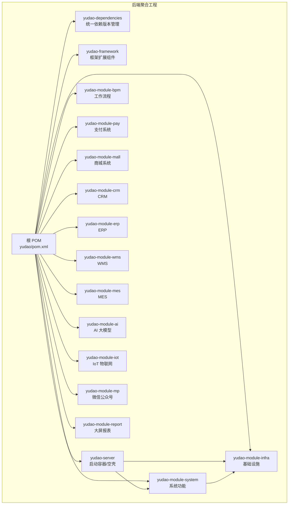
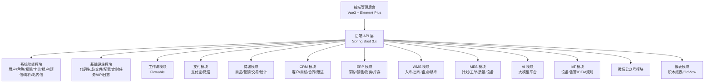
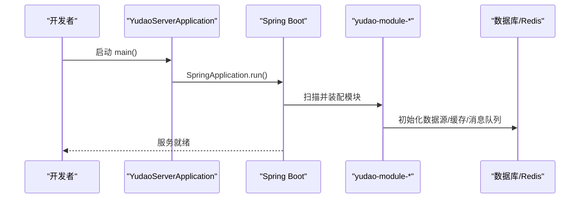
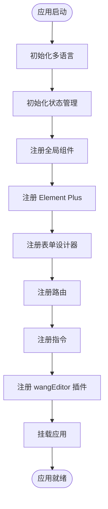
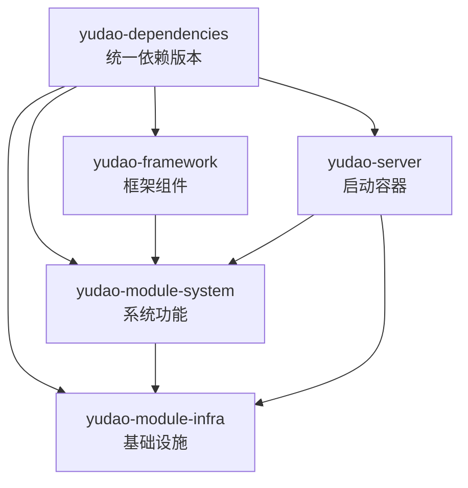

# 项目概述

<cite>
**本文引用的文件**
- [README.md](file://README.md)
- [pom.xml](file://pom.xml)
- [yudao-server/pom.xml](file://yudao-server/pom.xml)
- [yudao-framework/pom.xml](file://yudao-framework/pom.xml)
- [yudao-dependencies/pom.xml](file://yudao-dependencies/pom.xml)
- [yudao-module-system/pom.xml](file://yudao-module-system/pom.xml)
- [yudao-server/src/main/java/cn/iocoder/yudao/server/YudaoServerApplication.java](file://yudao-server/src/main/java/cn/iocoder/yudao/server/YudaoServerApplication.java)
- [yudao-ui/yudao-ui-admin-vue3/package.json](file://yudao-ui/yudao-ui-admin-vue3/package.json)
- [yudao-ui/yudao-ui-admin-vue3/vite.config.ts](file://yudao-ui/yudao-ui-admin-vue3/vite.config.ts)
- [yudao-ui/yudao-ui-admin-vue3/src/main.ts](file://yudao-ui/yudao-ui-admin-vue3/src/main.ts)
- [AGENTS.md](file://AGENTS.md)
</cite>

## 目录
1. [引言](#引言)
2. [项目结构](#项目结构)
3. [核心组件](#核心组件)
4. [架构总览](#架构总览)
5. [详细组件分析](#详细组件分析)
6. [依赖分析](#依赖分析)
7. [性能考虑](#性能考虑)
8. [故障排除指南](#故障排除指南)
9. [结论](#结论)
10. [附录](#附录)

## 引言
芋道 ruoyi-vue-pro 是一个以开发者为中心的快速开发平台，提供从精简版到完整版的灵活功能切换，覆盖系统管理、基础设施、工作流程、支付系统、数据报表、商城系统、微信公众号、CRM、ERP、WMS、MES、AI 大模型、IoT 物联网等多个业务模块。项目采用前后端分离架构，后端基于 Spring Boot 3.x 多模块单体架构，前端基于 Vue3 + Element Plus + TypeScript，支持多数据库、多消息队列、多租户与 SSO 等高级特性，并提供 MIT 许可证，确保个人与企业可 100% 免费使用。

## 项目结构
项目采用 Maven 多模块聚合工程，后端以 yudao-server 作为容器/空壳启动入口，系统功能与基础设施为核心模块，其余业务模块（工作流、支付、商城、CRM、ERP、WMS、MES、AI、IoT、微信公众号、报表等）按需启用。前端位于 yudao-ui/yudao-ui-admin-vue3，采用 Vite + Vue3 + TypeScript + Element Plus 技术栈。

**图表来源**
- [pom.xml:10-31](file://pom.xml#L10-L31)
- [yudao-server/pom.xml:23-145](file://yudao-server/pom.xml#L23-L145)
- [yudao-framework/pom.xml:12-31](file://yudao-framework/pom.xml#L12-L31)

**章节来源**
- [pom.xml:10-31](file://pom.xml#L10-L31)
- [AGENTS.md:64-82](file://AGENTS.md#L64-L82)

## 核心组件
- 后端核心：Spring Boot 3.x + 多模块单体架构，统一依赖版本管理（yudao-dependencies），框架扩展组件（yudao-framework），启动容器（yudao-server），系统功能（yudao-module-system），基础设施（yudao-module-infra）。
- 前端核心：Vue3 + Element Plus + TypeScript，Vite 构建，Pinia 状态管理，路由与权限控制，国际化与主题系统。
- 开源协议：MIT 许可证，个人与企业可 100% 免费使用，无版权归属要求。

**章节来源**
- [README.md:311-333](file://README.md#L311-L333)
- [yudao-ui/yudao-ui-admin-vue3/package.json:143](file://yudao-ui/yudao-ui-admin-vue3/package.json#L143)

## 架构总览
项目采用前后端分离架构，后端通过 yudao-server 提供 RESTful API，前端通过 Element Plus UI 组件库与 Vue3 生态实现管理后台与移动端体验。系统支持多数据库（MySQL、Oracle、PostgreSQL、SQL Server、国产数据库等）、多消息队列（Event、Redis、RabbitMQ、Kafka、RocketMQ 等）、多租户与 SSO 单点登录、动态权限菜单与按钮级权限控制、实时通信（WebSocket）、工作流（Flowable）、报表与大屏设计器、支付与退款、短信与邮件、云存储等能力。

**图表来源**
- [README.md:46-61](file://README.md#L46-L61)
- [README.md:311-333](file://README.md#L311-L333)

## 详细组件分析

### 后端启动与模块装配
- 启动类：YudaoServerApplication 作为 Spring Boot 启动入口，扫描 base-packages 以装配各模块。
- 模块装配：yudao-server 通过依赖引入 yudao-module-system 与 yudao-module-infra，其他模块（如 BPM、支付、商城等）默认注释，按需启用。

**图表来源**
- [yudao-server/src/main/java/cn/iocoder/yudao/server/YudaoServerApplication.java:19-24](file://yudao-server/src/main/java/cn/iocoder/yudao/server/YudaoServerApplication.java#L19-L24)
- [yudao-server/pom.xml:23-145](file://yudao-server/pom.xml#L23-L145)

**章节来源**
- [yudao-server/src/main/java/cn/iocoder/yudao/server/YudaoServerApplication.java:16-24](file://yudao-server/src/main/java/cn/iocoder/yudao/server/YudaoServerApplication.java#L16-L24)
- [yudao-server/pom.xml:23-145](file://yudao-server/pom.xml#L23-L145)

### 前端初始化与插件体系
- 初始化流程：main.ts 中按序初始化多语言、状态管理、全局组件、Element Plus、表单设计器、路由、指令、wangEditor、打印插件等。
- 构建配置：vite.config.ts 支持多环境变量、代理、CSS 预处理器、路径别名、代码分割策略与依赖预优化。

**图表来源**
- [yudao-ui/yudao-ui-admin-vue3/src/main.ts:57-89](file://yudao-ui/yudao-ui-admin-vue3/src/main.ts#L57-L89)

**章节来源**
- [yudao-ui/yudao-ui-admin-vue3/src/main.ts:1-92](file://yudao-ui/yudao-ui-admin-vue3/src/main.ts#L1-L92)
- [yudao-ui/yudao-ui-admin-vue3/vite.config.ts:15-101](file://yudao-ui/yudao-ui-admin-vue3/vite.config.ts#L15-L101)

### 技术栈与版本选择
- 后端：Spring Boot 3.x、MyBatis Plus、Redisson、Flowable、SkyWalking、Springdoc/Knife4j、Lombok、MapStruct、JUnit/Mockito 等。
- 前端：Vue3、Element Plus、TypeScript、Vite、Pinia、Vue Router、Axios、ECharts、wangEditor、FormCreate 等。
- 选择理由：Spring Boot 3.x 提供现代化特性与性能；Vue3 + Element Plus 提供高效开发与良好用户体验；多模块设计便于功能扩展与按需启用。

**章节来源**
- [README.md:335-359](file://README.md#L335-L359)
- [yudao-ui/yudao-ui-admin-vue3/package.json:27-87](file://yudao-ui/yudao-ui-admin-vue3/package.json#L27-L87)

### 开源理念与许可证
- MIT 许可证：个人与企业可 100% 免费使用，无需保留作者与版权信息，适合商业与个人项目。
- 项目承诺：永不推出商业版本，全部开源，持续维护与更新。

**章节来源**
- [README.md:87-96](file://README.md#L87-L96)

### 功能概览与模块化设计
- 系统功能：用户、角色、菜单、部门、岗位、租户、短信、邮件、站内信、操作/登录日志、错误码、通知公告、敏感词、应用管理、地区管理等。
- 基础设施：代码生成、系统接口文档、数据库文档、表单构建、配置管理、定时任务、文件服务、WebSocket、API 日志、MySQL/Redis 监控、消息队列、Java 监控、链路追踪、日志中心、服务保障、单元测试等。
- 业务模块：工作流程（Flowable）、支付系统、数据报表（积木报表/GoView）、微信公众号、商城系统、会员中心、CRM、ERP、WMS、MES、AI 大模型、IoT 物联网等。
- 高扩展性：通过注释控制模块启用，支持从精简版到完整版的功能切换，迁移文档提供 5-10 分钟迁移指导。

**章节来源**
- [README.md:107-333](file://README.md#L107-L333)
- [AGENTS.md:64-82](file://AGENTS.md#L64-L82)

## 依赖分析
- 依赖管理：yudao-dependencies 作为 BOM 统一管理 Spring Boot、MyBatis Plus、Redisson、Flowable、SkyWalking、Knife4j、Lombok、MapStruct、Hutool、JustAuth、微信 SDK、AWS SDK 等版本。
- 模块依赖：yudao-framework 提供框架扩展组件（Web、Security、WebSocket、Monitor、Protection、Job、MQ、Excel、Test、Biz-Tenant/DataPermission/IP 等），yudao-module-system 依赖 yudao-module-infra 与各类业务组件，yudao-server 作为容器引入所需模块。

**图表来源**
- [yudao-dependencies/pom.xml:85-706](file://yudao-dependencies/pom.xml#L85-L706)
- [yudao-framework/pom.xml:12-31](file://yudao-framework/pom.xml#L12-L31)
- [yudao-module-system/pom.xml:20-122](file://yudao-module-system/pom.xml#L20-L122)
- [yudao-server/pom.xml:23-145](file://yudao-server/pom.xml#L23-L145)

**章节来源**
- [yudao-dependencies/pom.xml:16-83](file://yudao-dependencies/pom.xml#L16-L83)
- [yudao-framework/pom.xml:12-31](file://yudao-framework/pom.xml#L12-L31)
- [yudao-module-system/pom.xml:20-122](file://yudao-module-system/pom.xml#L20-L122)
- [yudao-server/pom.xml:23-145](file://yudao-server/pom.xml#L23-L145)

## 性能考虑
- 启动与构建：Spring Boot 3.x 与 Maven 编译插件优化，支持参数发现与注解处理器配置；Vite 构建开启 Terser 压缩与代码分割策略，提升首屏加载性能。
- 缓存与并发：Redis + Redisson 提供分布式缓存与锁；多租户与数据权限封装降低查询开销；消息队列（Redis/RabbitMQ/Kafka/RocketMQ）支持异步解耦。
- 监控与可观测性：SkyWalking 链路追踪、Spring Boot Admin 监控、日志中心与 MySQL/Redis 监控，便于定位性能瓶颈。
- 数据库与连接池：Druid 连接池与监控，MyBatis Plus 与动态数据源支持多数据源与读写分离。

[本节为通用性能建议，不直接分析具体文件]

## 故障排除指南
- 启动问题：若遇到启动问题，请参考启动文档与注释提示，逐步检查数据库/Redis 连接、端口占用、依赖版本冲突等问题。
- 模块启用：启用被注释的模块需同时在根 POM 与 yudao-server POM 中取消注释，并确保依赖版本一致。
- 前端预加载失败：Vite 预加载模块失败时，前端会在监听到事件后自动刷新页面，确保重新构建后资源可用。

**章节来源**
- [yudao-server/src/main/java/cn/iocoder/yudao/server/YudaoServerApplication.java:10-11](file://yudao-server/src/main/java/cn/iocoder/yudao/server/YudaoServerApplication.java#L10-L11)
- [yudao-server/src/main/java/cn/iocoder/yudao/server/YudaoServerApplication.java:25-27](file://yudao-server/src/main/java/cn/iocoder/yudao/server/YudaoServerApplication.java#L25-L27)
- [AGENTS.md:35-37](file://AGENTS.md#L35-L37)
- [yudao-ui/yudao-ui-admin-vue3/src/main.ts:50-54](file://yudao-ui/yudao-ui-admin-vue3/src/main.ts#L50-L54)

## 结论
芋道 ruoyi-vue-pro 以“开发者为中心”的设计理念，提供从精简版到完整版的灵活功能切换，覆盖多业务领域的快速开发能力。后端采用 Spring Boot 3.x 多模块单体架构，前端基于 Vue3 + Element Plus + TypeScript，配合完善的基础设施与业务模块，满足企业级应用的高扩展性与高性能需求。MIT 许可证进一步降低了使用门槛，适合个人与企业长期投入与二次开发。

[本节为总结性内容，不直接分析具体文件]

## 附录
- 演示地址：Vue3 + element-plus、Vue3 + vben(ant-design-vue)、Vue2 + element-ui。
- 启动文档与视频教程：见 README 中的链接。
- 项目关系：后端（ruoyi-vue-pro、yudao-cloud、Spring-Boot-Labs），前端（yudao-ui-admin-vue3、yudao-ui-admin-vben、yudao-mall-uniapp、yudao-ui-admin-vue2、yudao-ui-admin-uniapp、yudao-ui-go-view）。

**章节来源**
- [README.md:16-23](file://README.md#L16-L23)
- [README.md:62-86](file://README.md#L62-L86)