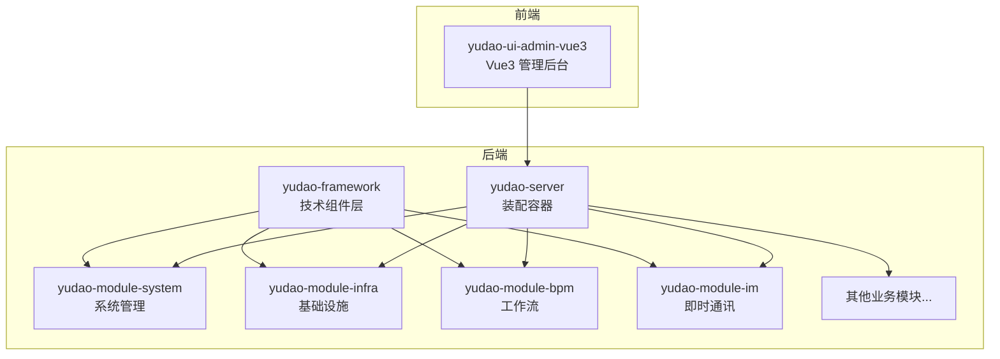
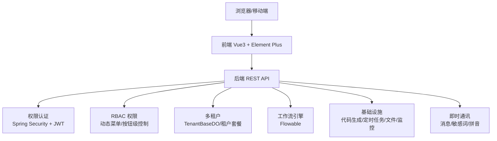
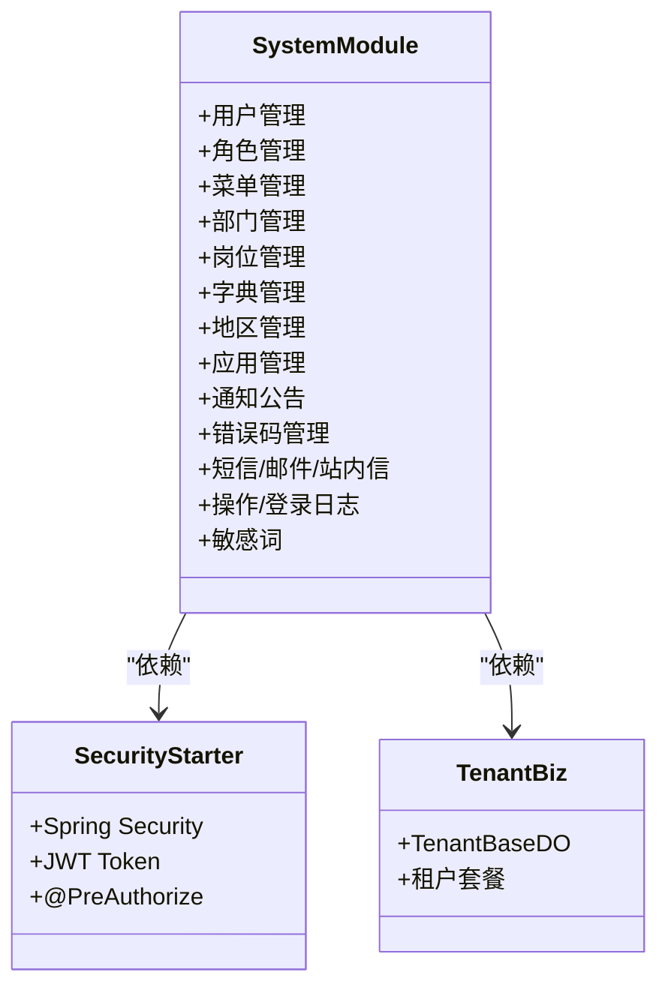
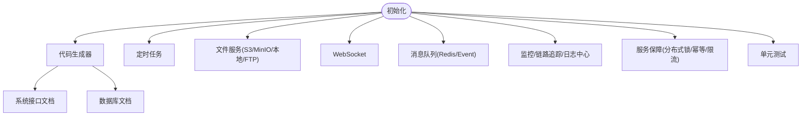
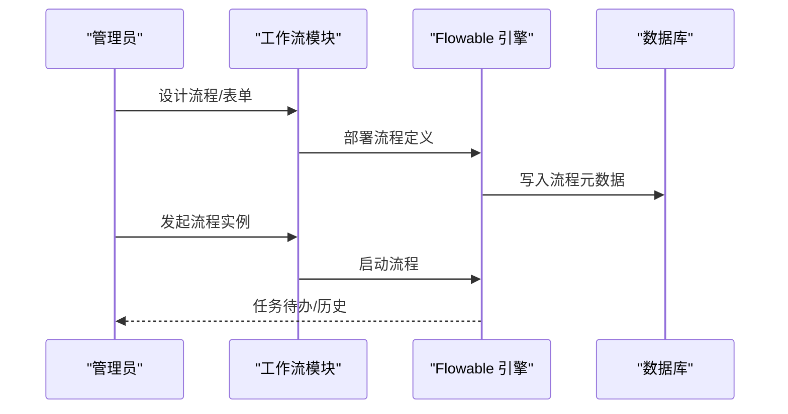
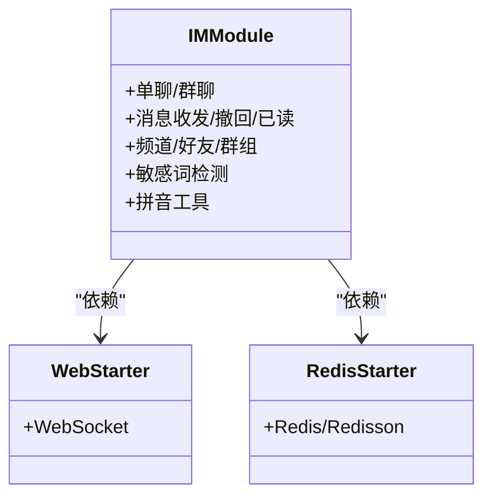
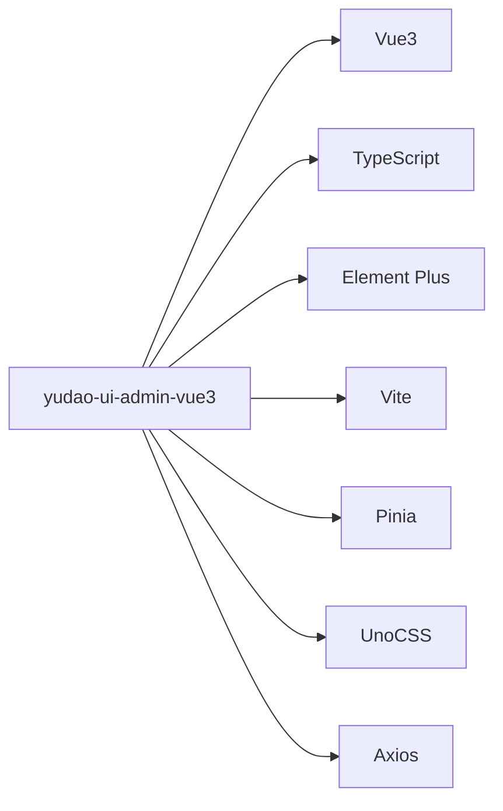
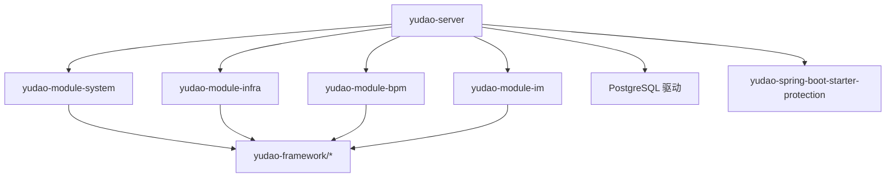

# 项目概述

<cite>
**本文档引用的文件**
- [README.md](file://README.md)
- [STARTUP.md](file://STARTUP.md)
- [DEVELOPMENT-GUIDE.md](file://DEVELOPMENT-GUIDE.md)
- [yudao-server/pom.xml](file://yudao-server/pom.xml)
- [yudao-framework/pom.xml](file://yudao-framework/pom.xml)
- [yudao-module-system/pom.xml](file://yudao-module-system/pom.xml)
- [yudao-module-infra/pom.xml](file://yudao-module-infra/pom.xml)
- [yudao-module-bpm/pom.xml](file://yudao-module-bpm/pom.xml)
- [yudao-module-im/pom.xml](file://yudao-module-im/pom.xml)
- [yudao-ui/yudao-ui-admin-vue3/package.json](file://yudao-ui/yudao-ui-admin-vue3/package.json)
- [PRD-用户权限设计.md](file://docs/PRD-用户权限设计.md)
</cite>

## 目录
1. [引言](#引言)
2. [项目结构](#项目结构)
3. [核心组件](#核心组件)
4. [架构总览](#架构总览)
5. [详细组件分析](#详细组件分析)
6. [依赖分析](#依赖分析)
7. [性能考虑](#性能考虑)
8. [故障排除指南](#故障排除指南)
9. [结论](#结论)
10. [附录](#附录)

## 引言
芋道 Ruoyi-Vue-Pro 是一款以开发者为中心的全栈快速开发平台，采用前后端分离架构，后端基于 Spring Boot 多模块设计，前端基于 Vue3 + Element Plus，覆盖系统管理、基础设施、工作流、支付、报表、即时通讯、IoT、AI 等丰富业务域。项目强调开源、易用、可扩展，提供多租户 SaaS 能力、RBAC 权限控制、动态菜单与按钮级权限、工作流引擎集成、代码生成器、实时通信、多数据库与消息队列支持等特性，适合企业级中后台系统与多租户 SaaS 场景。

## 项目结构
项目采用 Maven 多模块架构，后端通过 yudao-server 作为装配容器，按功能域拆分为 yudao-framework（技术组件层）、yudao-module-*（业务模块）、yudao-ui-*（前端工程）等。后端模块之间通过依赖组合启用，便于按需裁剪与扩展。

**图表来源**
- [yudao-server/pom.xml:23-165](file://yudao-server/pom.xml#L23-L165)
- [yudao-framework/pom.xml:12-31](file://yudao-framework/pom.xml#L12-L31)
- [yudao-module-system/pom.xml:20-122](file://yudao-module-system/pom.xml#L20-L122)
- [yudao-module-infra/pom.xml:21-121](file://yudao-module-infra/pom.xml#L21-L121)
- [yudao-module-bpm/pom.xml:23-79](file://yudao-module-bpm/pom.xml#L23-L79)
- [yudao-module-im/pom.xml:20-85](file://yudao-module-im/pom.xml#L20-L85)

**章节来源**
- [README.md:324-348](file://README.md#L324-L348)
- [DEVELOPMENT-GUIDE.md:22-46](file://DEVELOPMENT-GUIDE.md#L22-L46)

## 核心组件
- 多租户 SaaS 能力：通过 yudao-spring-boot-starter-biz-tenant 提供透明化多租户封装，支持租户隔离与权限定制。
- RBAC 权限控制：基于 Spring Security + JWT Token，支持动态菜单、按钮级权限控制与前端指令级显隐。
- 工作流引擎：基于 Flowable，支持 BPMN 设计器与仿钉钉/飞书设计器，覆盖会签/或签、父子流程、条件分支、路由分支等复杂场景。
- 基础设施：代码生成器、Swagger 文档、数据库文档、定时任务、文件存储（S3/MinIO/本地/FTP）、WebSocket、监控与链路追踪、日志中心、服务保障（分布式锁/幂等/限流）。
- 即时通讯：支持单聊、群聊、消息收发、撤回、已读等，集成敏感词检测与拼音工具。
- 前端生态：Vue3 + TypeScript + Element Plus + Vite + Pinia + UnoCSS，提供管理后台与移动端（uni-app）方案。

**章节来源**
- [README.md:46-61](file://README.md#L46-L61)
- [README.md:107-123](file://README.md#L107-L123)
- [PRD-用户权限设计.md:263-281](file://docs/PRD-用户权限设计.md#L263-L281)

## 架构总览
后端采用 Spring Boot 多模块架构，yudao-server 通过依赖聚合各业务模块；yudao-framework 封装通用技术组件（Web、Security、MyBatis、Redis、MQ、Job、Monitor、Protection 等）；业务模块按领域拆分，彼此通过 API 与公共组件协作。前端 yudao-ui-admin-vue3 通过 Axios 访问后端 REST API，实现统一的管理后台体验。

**图表来源**
- [yudao-server/pom.xml:23-165](file://yudao-server/pom.xml#L23-L165)
- [yudao-framework/pom.xml:12-31](file://yudao-framework/pom.xml#L12-L31)
- [yudao-module-system/pom.xml:27-39](file://yudao-module-system/pom.xml#L27-L39)
- [yudao-module-bpm/pom.xml:69-78](file://yudao-module-bpm/pom.xml#L69-L78)
- [yudao-module-infra/pom.xml:40-84](file://yudao-module-infra/pom.xml#L40-L84)
- [yudao-module-im/pom.xml:65-76](file://yudao-module-im/pom.xml#L65-L76)

## 详细组件分析

### 系统管理模块（yudao-module-system）
- 职责：用户、角色、菜单、部门、岗位、字典、地区、应用管理、通知公告、错误码、短信/邮件/站内信、操作/登录日志、敏感词、SSO 等。
- 技术要点：依赖 yudao-spring-boot-starter-security、yudao-spring-boot-starter-biz-tenant、yudao-spring-boot-starter-biz-data-permission、yudao-spring-boot-starter-mybatis、yudao-spring-boot-starter-redis 等。
- 权限与租户：通过 @PreAuthorize 与前端指令控制按钮级权限；租户隔离通过 TenantBaseDO 实现。

**图表来源**
- [yudao-module-system/pom.xml:27-39](file://yudao-module-system/pom.xml#L27-L39)
- [PRD-用户权限设计.md:263-281](file://docs/PRD-用户权限设计.md#L263-L281)

**章节来源**
- [yudao-module-system/pom.xml:20-122](file://yudao-module-system/pom.xml#L20-L122)
- [README.md:124-147](file://README.md#L124-L147)

### 基础设施模块（yudao-module-infra）
- 职责：代码生成器、系统接口文档、数据库文档、配置管理、定时任务、文件服务（S3/MinIO/本地/FTP）、WebSocket、API 日志、MySQL/Redis 监控、消息队列、Java 监控、链路追踪、日志中心、服务保障（分布式锁/幂等/限流）、单元测试。
- 技术要点：依赖 yudao-spring-boot-starter-websocket、yudao-spring-boot-starter-job、yudao-spring-boot-starter-mq、yudao-spring-boot-starter-monitor、yudao-spring-boot-starter-excel 等。

**图表来源**
- [yudao-module-infra/pom.xml:40-118](file://yudao-module-infra/pom.xml#L40-L118)
- [README.md:201-223](file://README.md#L201-L223)

**章节来源**
- [yudao-module-infra/pom.xml:21-121](file://yudao-module-infra/pom.xml#L21-L121)
- [README.md:201-223](file://README.md#L201-L223)

### 工作流模块（yudao-module-bpm）
- 职责：流程定义、表单配置、流程实例、任务中心（我的申请/待办/已办）、OA 请假等。
- 技术要点：基于 Flowable，提供 BPMN 设计器与仿钉钉/飞书设计器，支持会签/或签、父子流程、条件/并行/包容/路由分支、触发节点、延迟节点、超时审批、自动提醒等。

**图表来源**
- [yudao-module-bpm/pom.xml:69-78](file://yudao-module-bpm/pom.xml#L69-L78)
- [README.md:150-190](file://README.md#L150-L190)

**章节来源**
- [yudao-module-bpm/pom.xml:23-79](file://yudao-module-bpm/pom.xml#L23-L79)
- [README.md:150-190](file://README.md#L150-L190)

### 即时通讯模块（yudao-module-im）
- 职责：单聊、群聊、消息收发、消息撤回、消息已读、频道、好友/群组管理、敏感词检测、拼音工具等。
- 技术要点：依赖 yudao-spring-boot-starter-web、yudao-spring-boot-starter-redis、yudao-spring-boot-starter-excel 等。

**图表来源**
- [yudao-module-im/pom.xml:37-76](file://yudao-module-im/pom.xml#L37-L76)

**章节来源**
- [yudao-module-im/pom.xml:20-85](file://yudao-module-im/pom.xml#L20-L85)

### 前端组件（yudao-ui-admin-vue3）
- 技术栈：Vue3 + TypeScript + Element Plus + Vite + Pinia + UnoCSS，提供管理后台与移动端（uni-app）方案。
- 能力：统一 API 文件组织、Composition API 页面结构、字典展示、权限指令、国际化、主题与样式系统等。

**图表来源**
- [yudao-ui/yudao-ui-admin-vue3/package.json:27-88](file://yudao-ui/yudao-ui-admin-vue3/package.json#L27-L88)

**章节来源**
- [yudao-ui/yudao-ui-admin-vue3/package.json:1-158](file://yudao-ui/yudao-ui-admin-vue3/package.json#L1-L158)
- [DEVELOPMENT-GUIDE.md:653-778](file://DEVELOPMENT-GUIDE.md#L653-L778)

## 依赖分析
- yudao-server 作为装配容器，按需引入 yudao-module-system、yudao-module-infra、yudao-module-bpm、yudao-module-im 等模块，其他业务模块默认注释以便快速编译。
- yudao-framework 提供统一技术组件，模块间通过依赖方向（Controller → Service → DAL）约束耦合，避免反向依赖。
- 前后端通过 REST API 交互，前端通过 Axios 访问后端接口，统一返回格式与分页约定。

**图表来源**
- [yudao-server/pom.xml:23-165](file://yudao-server/pom.xml#L23-L165)
- [yudao-framework/pom.xml:12-31](file://yudao-framework/pom.xml#L12-L31)

**章节来源**
- [yudao-server/pom.xml:1-188](file://yudao-server/pom.xml#L1-L188)
- [DEVELOPMENT-GUIDE.md:64-83](file://DEVELOPMENT-GUIDE.md#L64-L83)

## 性能考虑
- 缓存与性能：Redis 缓存热点数据，结合 Redisson 提升并发性能；前端使用本地缓存与懒加载优化用户体验。
- 数据库与连接池：MyBatis Plus 增强查询与分页，Druid 连接池与监控，支持多数据源与读写分离。
- 监控与可观测性：Spring Boot Admin、SkyWalking 链路追踪、日志中心、MySQL/Redis 监控，便于定位性能瓶颈。
- 消息队列：支持 Redis Stream/Pub-Sub、RabbitMQ/Kafka/RocketMQ，异步解耦与削峰填谷。

**章节来源**
- [README.md:49-61](file://README.md#L49-L61)
- [README.md:211-223](file://README.md#L211-L223)

## 故障排除指南
- 后端启动失败（Redis/数据库连接失败）：检查 application-local.yaml 中连接地址、用户名、密码，确认远程服务器防火墙开放对应端口（PostgreSQL: 15432, Redis: 6379）。
- Maven 构建失败（找不到 yudao-module-xxx）：确保根 pom.xml 的 modules 与 yudao-server/pom.xml 的 dependencies 同步启用对应模块。
- 前端安装失败（ERR_PNPM_IGNORED_BUILDS）：yudao-ui/yudao-ui-admin-vue3/.npmrc 已配置 onlyBuiltDependencies，必要时追加对应包名放行。

**章节来源**
- [STARTUP.md:144-157](file://STARTUP.md#L144-L157)
- [DEVELOPMENT-GUIDE.md:788-796](file://DEVELOPMENT-GUIDE.md#L788-L796)

## 结论
芋道 Ruoyi-Vue-Pro 以 Spring Boot + Vue3 为核心，构建了覆盖多业务域的全栈开发平台。其模块化设计、多租户 SaaS 能力、RBAC 权限控制、工作流引擎集成、基础设施完善与前端工程化体系，使其适用于中大型企业与 SaaS 场景。开源协议宽松、代码质量与社区生态完善，便于二次开发与规模化落地。

## 附录
- 演示地址与视频教程：README.md 提供多套演示与视频链接，便于快速了解平台能力。
- 开发规范：DEVELOPMENT-GUIDE.md 覆盖架构分层、命名规范、API 设计、数据库与 ORM、VO/DTO、异常与错误码、Service 层、测试规范、前端开发与构建管理等，建议作为团队开发标准。

**章节来源**
- [README.md:16-23](file://README.md#L16-L23)
- [DEVELOPMENT-GUIDE.md:1-20](file://DEVELOPMENT-GUIDE.md#L1-L20)