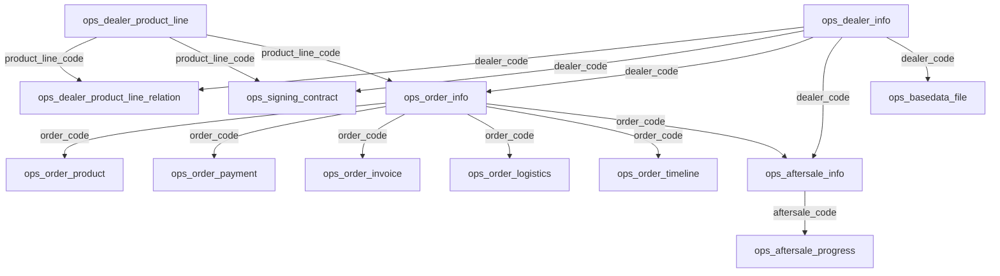

# OpsHub 模块 Excel 批量导入功能方案

## Context

当前 OpsHub 经销商管理客服 SaaS 平台共 20 张业务表。排除工单类、附件表和 FK ID 无法解析的关联表后，共 **13 张表**需要通过 Excel 批量导入。当前 opshub 模块尚未实现任何 Excel 导入功能。

### FK ID 关联排查结论

所有需要导入的 opshub 表之间的 FK 引用均存在**业务编码冗余字段**（dealer_code / order_code / aftersale_code），导入时可通过业务编码查找并回填 ID，不会丢失关联。

**例外：** `ops_dealer_user_scope` 和 `ops_executor_product_line_scope` 两张表仅通过 `user_id` 引用 system_users，无冗余用户名字段，Excel 无法解决用户身份匹配，**不纳入导入范围**，仅通过 UI 手动配置。

## 一、需要导入的表 & 依赖关系

共 **13 张表**，按依赖关系分 5 层：

```
L0 基础主数据（无依赖）
├── ops_dealer_info          经销商信息
└── ops_dealer_product_line  产品线

L1 关联数据（依赖 L0）
└── ops_dealer_product_line_relation  经销商-产品线关联  ← dealer_code + product_line_code

L2 业务主数据（依赖 L0+L1）
├── ops_signing_contract     签约合同  ← dealer_code + product_line_code
├── ops_order_info           订单主表  ← dealer_code + product_line_code
└── ops_aftersale_info       售后主表  ← dealer_code + product_line_code + order_code

L3 业务子表（依赖 L2）
├── ops_order_product        订单产品明细  ← order_code
├── ops_order_payment        订单付款记录  ← order_code
├── ops_order_invoice        订单开票记录  ← order_code
├── ops_order_logistics      订单物流轨迹  ← order_code
├── ops_order_timeline       订单时间线节点  ← order_code
├── ops_aftersale_progress   售后进度节点  ← aftersale_code

L4 补充
└── ops_basedata_file        基础数据文件元数据  ← dealer_code（file_url 必填）
```

### 不导入的 7 张表

| 表名 | 原因 |
|------|------|
| ops_cs_task | 工单类 |
| ops_cs_opreq | 工单类（操作请求） |
| ops_cs_session | 工单类（咨询会话） |
| ops_cs_message | 工单类（消息记录） |
| ops_cs_attachment | 通过 UI 上传管理 |
| ops_dealer_user_scope | FK user_id 引用 system_users.id，无冗余编码，无法通过 Excel 匹配 |
| ops_executor_product_line_scope | FK user_id 引用 system_users.id，无冗余编码，无法通过 Excel 匹配 |

## 二、FK ID 关联排查明细

### 导入表中的 FK ID 引用（全部可解析）

| 表名 | FK ID 字段 | 引用目标 | 冗余业务编码 | 解析策略 |
|------|-----------|---------|------------|----------|
| ops_order_info | dealer_id | ops_dealer_info.id | dealer_code ✅ | 导入时通过 dealer_code 查找回填 dealer_id |
| ops_order_product | order_id | ops_order_info.id | order_code ✅ | 导入时通过 order_code 查找回填 order_id |
| ops_order_payment | order_id | ops_order_info.id | order_code ✅ | 同上 |
| ops_order_invoice | order_id | ops_order_info.id | order_code ✅ | 同上 |
| ops_order_logistics | order_id | ops_order_info.id | order_code ✅ | 同上 |
| ops_signing_contract | dealer_id | ops_dealer_info.id | dealer_code ✅ | 导入时通过 dealer_code 查找回填 dealer_id |
| ops_aftersale_info | dealer_id | ops_dealer_info.id | dealer_code ✅ | 同上 |
| ops_basedata_file | dealer_id | ops_dealer_info.id | dealer_code ✅ | 同上 |
| ops_order_timeline | order_id | ops_order_info.id | order_code ✅ | 导入时通过 order_code 查找回填 order_id |

| ops_aftersale_progress | aftersale_id | ops_aftersale_info.id | aftersale_code ✅ | 导入时通过 aftersale_code 查找回填 aftersale_id |

### 不导入表的 FK ID 引用

| 表名 | FK ID 字段 | 引用目标 | 原因 |
|------|-----------|---------|------|
| ops_dealer_user_scope | user_id | system_users.id | 无冗余用户名，无法 Excel 匹配 |
| ops_executor_product_line_scope | user_id | system_users.id | 无冗余用户名，无法 Excel 匹配 |
| ops_cs_task | creator_user_id, assignee_id | system_users.id | 工单类，不导入 |
| ops_cs_opreq | creator_user_id, assignee_id, source_id | system_users.id / 业务表 | 工单类，不导入 |
| ops_cs_session | initiator_id, assignee_id, context_id | system_users.id / 业务表 | 会话类，不导入 |
| ops_cs_message | session_id, sender_id | ops_cs_session.id / system_users.id | 会话类，不导入 |
| ops_cs_attachment | business_id | 各业务表 | 附件通过 UI 上传 |

## 三、表间关系图



## 四、每张表的 Excel 导入字段设计

### 4.1 ops_dealer_info（经销商信息）

| Excel 列名 | 字段 | 必填 | 校验规则 |
|-----------|------|------|---------|
| 经销商名称 | dealerName | 是 | 非空 |
| 经销商编码 | dealerCode | 是 | 唯一性校验 |
| 联系人 | contactName | 否 | |
| 联系电话 | contactPhone | 否 | |
| 地址 | address | 否 | |
| 状态 | status | 是 | 0=正常/1=停用 |
| 备注 | remark | 否 | |

### 4.2 ops_dealer_product_line（产品线）

| Excel 列名 | 字段 | 必填 | 校验规则 |
|-----------|------|------|---------|
| 产品线名称 | productLineName | 是 | 非空 |
| 产品线编码 | productLineCode | 是 | 唯一性校验 |
| 排序 | sort | 否 | 默认 0 |
| 状态 | status | 是 | 0=正常/1=停用 |
| 备注 | remark | 否 | |

### 4.3 ops_dealer_product_line_relation（经销商-产品线关联）

| Excel 列名 | 字段 | 必填 | 校验规则 |
|-----------|------|------|---------|
| 经销商编码 | dealerCode | 是 | 校验 dealer_info 存在 |
| 产品线编码 | productLineCode | 是 | 校验 product_line 存在 |

### 4.4 ops_signing_contract（签约合同）

| Excel 列名 | 字段 | 必填 | 校验规则 |
|-----------|------|------|---------|
| 经销商编码 | dealerCode | 是 | 校验存在并回填 dealerId |
| 产品线编码 | productLineCode | 否 | 校验存在 |
| 合同类型 | contractType | 是 | 中文→编码：主合同→main, 政策合同→policy 等 |
| 合同名称 | contractName | 是 | 非空 |
| 下发日期 | issuedDate | 否 | |
| 签署日期 | signDate | 否 | |
| 合同摘要 | summary | 否 | |
| 备注 | remark | 否 | |

自动生成：contractCode, contractTypeName, status(=unsigned), subStatus(=pending)

### 4.5 ops_order_info（订单主表）

| Excel 列名 | 字段 | 必填 | 校验规则 |
|-----------|------|------|---------|
| 订单号 | orderCode | 是 | 唯一性校验 |
| 经销商编码 | dealerCode | 是 | 校验存在并回填 dealerId + dealerName |
| 产品线编码 | productLineCode | 否 | 校验存在并回填 productLineName |
| 订单总金额 | totalAmount | 否 | |
| 订单日期 | orderDate | 否 | 默认当天 |
| 进度状态 | progressStatus | 是 | 中文→编码：待确认→pending 等 |
| 付款状态 | payStatus | 否 | 默认 unpaid |
| 开票状态 | invStatus | 否 | 默认 uninvoiced |
| 备注 | remark | 否 | |

**重要：** 导入时**不**自动生成 timeline 节点，时间线数据通过 ops_order_timeline Excel 单独导入

### 4.6 ops_order_product（订单产品明细）

| Excel 列名 | 字段 | 必填 | 校验规则 |
|-----------|------|------|---------|
| 订单号 | orderCode | 是 | 校验 order_info 存在并回填 orderId |
| 产品编码 | productCode | 否 | |
| 产品名称 | productName | 是 | 非空 |
| 规格型号 | specModel | 否 | |
| 单价 | unitPrice | 是 | |
| 数量 | quantity | 是 | |
| 单位 | unit | 否 | |

自动生成：amount(= unitPrice x quantity), returnableQty(= quantity)

### 4.7 ops_order_payment（订单付款记录）

| Excel 列名 | 字段 | 必填 | 校验规则 |
|-----------|------|------|---------|
| 订单号 | orderCode | 是 | 校验存在并回填 orderId |
| 付款金额 | payAmount | 是 | |
| 付款日期 | payDate | 否 | |
| 付款方式 | payMethod | 否 | |
| 付款凭证号 | voucherNo | 否 | |
| 状态 | status | 否 | 默认 pending |
| 备注 | remark | 否 | |

### 4.8 ops_order_invoice（订单开票记录）

| Excel 列名 | 字段 | 必填 | 校验规则 |
|-----------|------|------|---------|
| 订单号 | orderCode | 是 | 校验存在并回填 orderId |
| 开票金额 | invoiceAmount | 是 | |
| 发票号 | invoiceNo | 否 | |
| 开票日期 | invoiceDate | 否 | |
| 发票类型 | invoiceType | 否 | |
| 发票抬头 | companyName | 否 | |
| 纳税人识别号 | taxNo | 否 | |
| 特殊开票需求 | specialRequest | 否 | |
| 状态 | status | 否 | 默认 pending |

### 4.9 ops_order_logistics（订单物流轨迹）

| Excel 列名 | 字段 | 必填 | 校验规则 |
|-----------|------|------|---------|
| 订单号 | orderCode | 是 | 校验存在并回填 orderId |
| 物流公司 | logisticsCompany | 否 | |
| 物流单号 | trackingNo | 否 | |
| 节点描述 | nodeDesc | 是 | 非空 |
| 节点时间 | nodeTime | 否 | |
| 是否已完成 | isCompleted | 否 | 默认 false |
| 排序序号 | sortOrder | 否 | |

### 4.10 ops_order_timeline（订单时间线节点）

| Excel 列名 | 字段 | 必填 | 校验规则 |
|-----------|------|------|----------|
| 订单号 | orderCode | 是 | 校验 order_info 存在并回填 orderId |
| 节点编码 | nodeCode | 是 | 枚举转换：created/confirmed/shipped/signed/completed |
| 节点名称 | nodeName | 是 | 非空 |
| 节点完成时间 | nodeTime | 否 | |
| 是否完成 | isCompleted | 否 | 默认 false |
| 排序序号 | sortOrder | 是 | 1-5 |

### 4.11 ops_aftersale_info（售后主表）

| Excel 列名 | 字段 | 必填 | 校验规则 |
|-----------|------|------|---------|
| 售后单号 | aftersaleCode | 是 | 唯一性校验 |
| 经销商编码 | dealerCode | 是 | 校验存在并回填 dealerId + dealerName |
| 产品线编码 | productLineCode | 否 | 校验存在并回填 productLineName |
| 关联订单号 | orderCode | 否 | |
| 处理方式 | handlingMethod | 是 | 中文→编码：退货→return 等 |
| 售后原因 | reason | 是 | 中文→编码：投诉→complaint 等 |
| 进度状态 | progressStatus | 否 | 默认 pending |
| 产品名称 | productName | 否 | |
| 产品规格型号 | productSpec | 否 | |
| 售后数量 | quantity | 否 | |
| 退款金额 | refundAmount | 否 | |
| 退回物流公司 | logisticsCompany | 否 | |
| 退回物流单号 | logisticsNo | 否 | |
| 换货物流公司 | exchangeLogisticsCompany | 否 | |
| 换货物流单号 | exchangeLogisticsNo | 否 | |
| 备注 | remark | 否 | |

**重要：** 导入时**不**自动创建 progress 节点，节点数据通过 ops_aftersale_progress Excel 单独导入

### 4.12 ops_aftersale_progress（售后进度节点）

| Excel 列名 | 字段 | 必填 | 校验规则 |
|-----------|------|------|----------|
| 售后单号 | aftersaleCode | 是 | 校验 aftersale_info 存在并回填 aftersaleId |
| 节点编码 | nodeCode | 是 | 枚举转换：submitted/reviewed/returned 等 |
| 节点名称 | nodeName | 是 | 非空 |
| 节点完成时间 | nodeTime | 否 | |
| 是否完成 | isCompleted | 否 | 默认 false |
| 排序序号 | sortOrder | 是 | 1-5 |
| 节点备注 | remark | 否 | |

### 4.13 ops_basedata_file（基础数据文件元数据）

| Excel 列名 | 字段 | 必填 | 校验规则 |
|-----------|------|------|---------|
| 经销商编码 | dealerCode | 是 | 校验存在并回填 dealerId |
| 文件分类 | category | 是 | 中文→编码：资质文件→qualification 等 |
| 文件名称 | fileName | 是 | 非空 |
| 文件子类型 | fileType | 否 | 枚举转换 |
| 文件地址 | fileUrl | 是 | 非空 |
| 有效期至 | expireDate | 否 | |
| 状态 | status | 否 | 默认 0 |
| 文件描述 | description | 否 | |
| 备注 | remark | 否 | |

**注意：** file_url 导入时必填，请在 Excel 中填写有效的文件访问地址

## 五、枚举转换策略

opshub 枚举未注册到系统字典框架，采用自定义 FastExcel Converter。

在 `framework/excel/convert/` 目录下创建：

| Converter | 转换内容 |
|-----------|---------|
| ContractTypeConvert | 主合同/政策合同/补充协议/终止协议 ↔ main/policy/supplement/termination |
| OrderProgressStatusConvert | 待确认/已确认/已发货/已签收/已完成 ↔ pending/confirmed/shipped/signed/completed |
| AfterSaleHandlingMethodConvert | 退货/换货/退货退款 ↔ return/exchange/return_refund |
| AfterSaleReasonConvert | 投诉/召回/破损 ↔ complaint/recall/damage |
| BasedataCategoryConvert | 资质文件/授权文件/合同文件/产品文件 ↔ qualification/authorization/contract/product |
| CommonStatusConvert | 正常/停用 ↔ 0/1 |
| BooleanConvert | 是/否 ↔ true/false |

## 六、主从表导入策略

**采用独立导入，不做联合导入：**
- 主表（order_info）导入时自动创建 timeline 节点（timeline 不导入）
- 主表（aftersale_info）导入时**不**自动创建 progress 节点，progress 通过 Excel 单独导入
- 子表（product/payment/invoice/logistics/aftersale_progress）独立导入，通过 order_code/aftersale_code 关联
- 导入前批量查询关联数据到内存 Map，避免逐行查库

## 七、实施计划（5 个 Task）

### Task 1：基础设施 + 经销商主数据导入（L0）

**新建文件：**
- `framework/excel/convert/` 下 7 个 Converter 类
- `controller/admin/dealer/vo/DealerInfoImportExcelVO.java` + RespVO
- `controller/admin/dealer/vo/DealerProductLineImportExcelVO.java` + RespVO

**修改文件：**
- `DealerInfoController.java` / `DealerInfoService.java` / `DealerInfoServiceImpl.java`
- `DealerProductLineController.java` / `DealerProductLineService.java` / `DealerProductLineServiceImpl.java`

### Task 2：关联数据表导入（L1）

**新建文件：**
- `DealerProductLineRelationImportExcelVO.java` + RespVO

**修改文件：**
- `DealerProductLineController.java` — 增加 relation-import + get-relation-import-template 接口
- `DealerProductLineService.java` / `DealerProductLineServiceImpl.java` — 增加 importRelationList

### Task 3：签约合同 + 订单主表导入（L2）

**新建文件：**
- `SigningContractImportExcelVO.java` + RespVO
- `OrderInfoImportExcelVO.java` + RespVO

**修改文件：**
- `SigningContractController.java` + Service — 自动生成 contractCode
- `OrderInfoController.java` + Service — 自动创建 5 个 timeline 节点
- `OrderInfoMapper.java` — 新增 selectByOrderCode

### Task 4：订单子表导入（L3）

**新建文件：**
- `OrderProductImportExcelVO.java` + RespVO
- `OrderPaymentImportExcelVO.java` + RespVO
- `OrderInvoiceImportExcelVO.java` + RespVO
- `OrderLogisticsImportExcelVO.java` + RespVO

**修改文件：**
- `OrderInfoController.java` — 增加子表导入接口
- 对应 Service 实现

### Task 5：售后主表 + 售后进度 + 基础数据文件导入（L4）

**新建文件：**
- `AfterSaleInfoImportExcelVO.java` + RespVO
- `AfterSaleProgressImportExcelVO.java` + RespVO
- `BasedataFileImportExcelVO.java` + RespVO

**修改文件：**
- `AfterSaleInfoController.java` + Service
- `AfterSaleInfoController.java` — 增加 progress-import + get-progress-import-template 接口（或在单独的 Controller）
- `AfterSaleInfoService.java` / `AfterSaleInfoServiceImpl.java` — 增加 importProgressList
- `BasedataFileController.java` + Service

## 八、验证方案

1. **编译验证**：`mvn clean compile -pl yudao-module-opshub` 确保无编译错误
2. **单元测试**：为核心导入方法编写测试，覆盖正常导入/空数据/重复编码/关联不存在
3. **集成验证**：按 L0 → L1 → L2 → L3 → L4 顺序导入测试数据，验证自动生成子记录和枚举转换

## 附录：导入 Excel 字段规格与枚举值序列

> Excel 中填写**中文名**，导入时自动转换为系统编码。

---

### 1. ops_dealer_info（经销商信息）

| 列序号 | Excel 列名 | 必填 | 类型 | 枚举值 |
|:------:|-----------|:----:|------|--------|
| A | 经销商名称 | 是 | 文本 | — |
| B | 经销商编码 | 是 | 文本 | — |
| C | 联系人 | 否 | 文本 | — |
| D | 联系电话 | 否 | 文本 | — |
| E | 地址 | 否 | 文本 | — |
| F | 状态 | 是 | 枚举 | `正常` `停用` |
| G | 备注 | 否 | 文本 | — |

---

### 2. ops_dealer_product_line（产品线）

| 列序号 | Excel 列名 | 必填 | 类型 | 枚举值 |
|:------:|-----------|:----:|------|--------|
| A | 产品线名称 | 是 | 文本 | — |
| B | 产品线编码 | 是 | 文本 | — |
| C | 排序 | 否 | 数字 | — |
| D | 状态 | 是 | 枚举 | `正常` `停用` |
| E | 备注 | 否 | 文本 | — |

---

### 3. ops_dealer_product_line_relation（经销商-产品线关联）

| 列序号 | Excel 列名 | 必填 | 类型 | 枚举值 |
|:------:|-----------|:----:|------|--------|
| A | 经销商编码 | 是 | 文本 | — |
| B | 产品线编码 | 是 | 文本 | — |

---

### 4. ops_signing_contract（签约合同）

| 列序号 | Excel 列名 | 必填 | 类型 | 枚举值 |
|:------:|-----------|:----:|------|--------|
| A | 经销商编码 | 是 | 文本 | — |
| B | 产品线编码 | 否 | 文本 | — |
| C | 合同类型 | 是 | 枚举 | `主合同` `政策合同` `补充协议` `终止协议` |
| D | 合同名称 | 是 | 文本 | — |
| E | 下发日期 | 否 | 日期 | yyyy-MM-dd |
| F | 签署日期 | 否 | 日期 | yyyy-MM-dd |
| G | 合同摘要 | 否 | 文本 | — |
| H | 备注 | 否 | 文本 | — |

> 自动生成：合同编码、签署状态(=未签署)、子状态(=待签署)

---

### 5. ops_order_info（订单主表）

| 列序号 | Excel 列名 | 必填 | 类型 | 枚举值 |
|:------:|-----------|:----:|------|--------|
| A | 订单号 | 是 | 文本 | — |
| B | 经销商编码 | 是 | 文本 | — |
| C | 产品线编码 | 否 | 文本 | — |
| D | 订单总金额 | 否 | 数字 | — |
| E | 订单日期 | 否 | 日期 | yyyy-MM-dd |
| F | 进度状态 | 是 | 枚举 | `待确认` `已确认` `已发货` `已签收` `已完成` |
| G | 付款状态 | 否 | 枚举 | `未付款` `已付款` |
| H | 开票状态 | 否 | 枚举 | `未开票` `部分开票` `已开票` |
| I | 备注 | 否 | 文本 | — |

> 导入时自动创建 5 个 timeline 节点

---

### 6. ops_order_product（订单产品明细）

| 列序号 | Excel 列名 | 必填 | 类型 | 枚举值 |
|:------:|-----------|:----:|------|--------|
| A | 订单号 | 是 | 文本 | — |
| B | 产品编码 | 否 | 文本 | — |
| C | 产品名称 | 是 | 文本 | — |
| D | 规格型号 | 否 | 文本 | — |
| E | 单价 | 是 | 数字 | — |
| F | 数量 | 是 | 数字 | — |
| G | 单位 | 否 | 文本 | — |

> 自动计算：金额(=单价×数量)、可退货数量(=数量)

---

### 7. ops_order_payment（订单付款记录）

| 列序号 | Excel 列名 | 必填 | 类型 | 枚举值 |
|:------:|-----------|:----:|------|--------|
| A | 订单号 | 是 | 文本 | — |
| B | 付款金额 | 是 | 数字 | — |
| C | 付款日期 | 否 | 日期 | yyyy-MM-dd |
| D | 付款方式 | 否 | 文本 | — |
| E | 付款凭证号 | 否 | 文本 | — |
| F | 状态 | 否 | 枚举 | `审批中` `已通过` `已拒绝` |
| G | 备注 | 否 | 文本 | — |

---

### 8. ops_order_invoice（订单开票记录）

| 列序号 | Excel 列名 | 必填 | 类型 | 枚举值 |
|:------:|-----------|:----:|------|--------|
| A | 订单号 | 是 | 文本 | — |
| B | 开票金额 | 是 | 数字 | — |
| C | 发票号 | 否 | 文本 | — |
| D | 开票日期 | 否 | 日期 | yyyy-MM-dd |
| E | 发票类型 | 否 | 文本 | — |
| F | 发票抬头 | 否 | 文本 | — |
| G | 纳税人识别号 | 否 | 文本 | — |
| H | 特殊开票需求 | 否 | 文本 | — |
| I | 状态 | 否 | 枚举 | `待开票` `已开票` |
| J | 备注 | 否 | 文本 | — |

---

### 9. ops_order_logistics（订单物流轨迹）

| 列序号 | Excel 列名 | 必填 | 类型 | 枚举值 |
|:------:|-----------|:----:|------|--------|
| A | 订单号 | 是 | 文本 | — |
| B | 物流公司 | 否 | 文本 | — |
| C | 物流单号 | 否 | 文本 | — |
| D | 节点描述 | 是 | 文本 | — |
| E | 节点时间 | 否 | 日期 | yyyy-MM-dd HH:mm:ss |
| F | 是否已完成 | 否 | 枚举 | `是` `否` |
| G | 排序序号 | 否 | 数字 | — |

---

### 10. ops_aftersale_info（售后主表）

| 列序号 | Excel 列名 | 必填 | 类型 | 枚举值 |
|:------:|-----------|:----:|------|--------|
| A | 售后单号 | 是 | 文本 | — |
| B | 经销商编码 | 是 | 文本 | — |
| C | 产品线编码 | 否 | 文本 | — |
| D | 关联订单号 | 否 | 文本 | — |
| E | 处理方式 | 是 | 枚举 | `退货` `退换货` `退货退款` |
| F | 售后原因 | 是 | 枚举 | `投诉` `召回` `破损` |
| G | 进度状态 | 否 | 枚举 | `待处理` `进行中` `换货中` `已完成` |
| H | 产品名称 | 否 | 文本 | — |
| I | 产品规格型号 | 否 | 文本 | — |
| J | 售后数量 | 否 | 数字 | — |
| K | 退款金额 | 否 | 数字 | — |
| L | 退回物流公司 | 否 | 文本 | — |
| M | 退回物流单号 | 否 | 文本 | — |
| N | 换货物流公司 | 否 | 文本 | — |
| O | 换货物流单号 | 否 | 文本 | — |
| P | 备注 | 否 | 文本 | — |

> 导入时不自动创建 progress 节点

---

### 11. ops_aftersale_progress（售后进度节点）

| 列序号 | Excel 列名 | 必填 | 类型 | 枚举值 |
|:------:|-----------|:----:|------|--------|
| A | 售后单号 | 是 | 文本 | — |
| B | 节点编码 | 是 | 枚举 | `申请提交` `审核通过` `商品退回` `退款完成` `红字发票` `新商品发出` `确认收货` |
| C | 节点名称 | 是 | 文本 | — |
| D | 节点完成时间 | 否 | 日期 | yyyy-MM-dd HH:mm:ss |
| E | 是否完成 | 否 | 枚举 | `是` `否` |
| F | 排序序号 | 是 | 数字 | 1-5 |
| G | 节点备注 | 否 | 文本 | — |

---

### 12. ops_basedata_file（基础数据文件元数据）

| 列序号 | Excel 列名 | 必填 | 类型 | 枚举值 |
|:------:|-----------|:----:|------|--------|
| A | 经销商编码 | 是 | 文本 | — |
| B | 文件分类 | 是 | 枚举 | `资质文件` `授权文件` `合同文件` `产品文件` |
| C | 文件名称 | 是 | 文本 | — |
| D | 文件子类型 | 否 | 枚举 | 见下表 |
| E | 有效期至 | 否 | 日期 | yyyy-MM-dd |
| F | 状态 | 否 | 枚举 | `正常` `停用` |
| G | 文件描述 | 否 | 文本 | — |
| H | 备注 | 否 | 文本 | — |

> file_url 导入时为空，需后续通过 UI 上传

**文件子类型序列（按分类分组）：**

| 分类 | 子类型编码 | 子类型名称 |
|------|-----------|----------|
| 资质文件 | BL | 营业执照 |
| 资质文件 | JYXK | 经营许可证 |
| 资质文件 | BA | 备案凭证 |
| 资质文件 | QMS | 质量体系认证 |
| 授权文件 | SQ | 品牌授权书 |
| 合同文件 | MC | 主合同 |
| 合同文件 | POL | 政策合同 |
| 合同文件 | SA | 补充协议 |
| 合同文件 | TA | 终止协议 |
| 产品文件 | ZCZ | 注册证 |
| 产品文件 | HGZ | 合格证 |
| 产品文件 | SMS | 说明书 |
| 产品文件 | JS | 技术文件 |
| 产品文件 | JCBG | 检测报告 |

---

### 通用枚举值汇总

| 枚举类 | Excel 可选值 |
|--------|-------------|
| 状态 | `正常` `停用` |
| 是/否 | `是` `否` |
| 合同类型 | `主合同` `政策合同` `补充协议` `终止协议` |
| 订单进度 | `待确认` `已确认` `已发货` `已签收` `已完成` |
| 付款状态 | `未付款` `已付款` |
| 开票状态 | `未开票` `部分开票` `已开票` |
| 付款记录状态 | `审批中` `已通过` `已拒绝` |
| 开票记录状态 | `待开票` `已开票` |
| 售后处理方式 | `退货` `退换货` `退货退款` |
| 售后原因 | `投诉` `召回` `破损` |
| 售后进度 | `待处理` `进行中` `换货中` `已完成` |
| 售后节点 | `申请提交` `审核通过` `商品退回` `退款完成` `红字发票` `新商品发出` `确认收货` |
| 文件分类 | `资质文件` `授权文件` `合同文件` `产品文件` |

