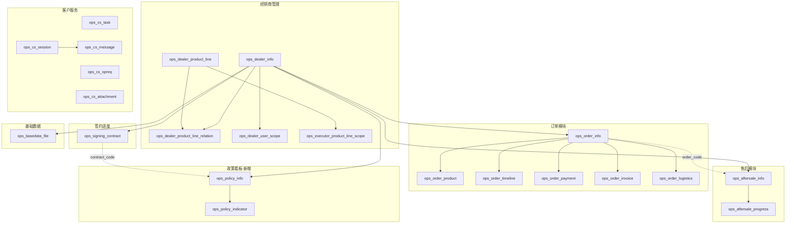

# 经销商管理客服SaaS — 数据库方案分析

## Context

基于 PRD V1.0（`PRD-经销商管理客服SaaS.md`）和 PRD V2.0（`经销商管理客服SaaS_PRD_V2.0.md`）两份文档，对比现有代码库中已实现的 20 张数据库表，梳理完整的数据库 Gap 分析和新增表设计方案。

**核心发现**：现有 20 张表覆盖了 6 大业务模块中的 5 个（签约、售后、订单、基础数据、客户服务），唯一严重缺失的是 **政策看板模块**（PRD V2.0 第5节完整描述了功能需求），需要新增 2 张表。此外操作请求类型枚举缺少"待验款"类型。

---

## 一、现有表总览（20 张）

| # | 表名 | Step | 所属模块 | DO 类 |
|---|------|------|---------|-------|
| 1 | `ops_dealer_info` | Step 1 | 经销商管理 | DealerInfoDO |
| 2 | `ops_dealer_product_line` | Step 1 | 产品线管理 | DealerProductLineDO |
| 3 | `ops_dealer_product_line_relation` | Step 1 | 经销商-产品线关联 | DealerProductLineRelationDO |
| 4 | `ops_dealer_user_scope` | Step 1 | 用户-经销商授权 | DealerUserScopeDO |
| 5 | `ops_executor_product_line_scope` | Step 1 | 执行员-产品线授权 | ExecutorProductLineScopeDO |
| 6 | `ops_basedata_file` | Step 2 | 基础数据文件 | BasedataFileDO |
| 7 | `ops_signing_contract` | Step 3 | 签约合同 | SigningContractDO |
| 8 | `ops_order_info` | Step 4 | 订单主表 | OrderInfoDO |
| 9 | `ops_order_product` | Step 4 | 订单产品明细 | OrderProductDO |
| 10 | `ops_order_timeline` | Step 4 | 订单时间线 | OrderTimelineDO |
| 11 | `ops_order_payment` | Step 4 | 订单付款记录 | OrderPaymentDO |
| 12 | `ops_order_invoice` | Step 4 | 订单开票记录 | OrderInvoiceDO |
| 13 | `ops_order_logistics` | Step 4 | 订单物流轨迹 | OrderLogisticsDO |
| 14 | `ops_aftersale_info` | Step 5 | 售后主表 | AfterSaleInfoDO |
| 15 | `ops_aftersale_progress` | Step 5 | 售后进度节点 | AfterSaleProgressDO |
| 16 | `ops_cs_task` | Step 6 | 客服工单 | CsTaskDO |
| 17 | `ops_cs_opreq` | Step 6 | 操作请求 | CsOpReqDO |
| 18 | `ops_cs_attachment` | Step 6 | 通用附件 | CsAttachmentDO |
| 19 | `ops_cs_session` | Step 7 | 咨询会话 | CsSessionDO |
| 20 | `ops_cs_message` | Step 7 | 咨询消息 | CsMessageDO |

---

## 二、PRD 覆盖度 Gap 分析

| 模块 | PRD V2.0 数据结构 | 现有实现 | Gap 等级 |
|------|------------------|---------|---------|
| 签约进度 | 12.1 signingData | `ops_signing_contract` 完全覆盖 | **无 Gap** |
| **政策看板** | **12.2 policyIndicatorData** | **完全缺失** | **严重** |
| 售后模块 | 12.3 afterSaleData | 2 张表完全覆盖 | **无 Gap** |
| 订单模块 | 12.4 orderData | 6 张表覆盖（沟通记录通过 cs_session 实现） | **无 Gap** |
| 基础数据 | 12.5 baseDataFiles | `ops_basedata_file` 完全覆盖 | **无 Gap** |
| 客户服务 | 12.6-12.8 | 5 张表覆盖，操作请求类型缺 1 个枚举值 | **轻微** |
| 用户权限 | 12.9 AUTH_CONFIG | system_user + system_role + 5 张扩展表 | **无 Gap** |

---

## 三、新增表设计（2 张）

### 3.1 政策信息主表 `ops_policy_info`

```sql
CREATE TABLE ops_policy_info (
    id                  BIGINT          NOT NULL,
    policy_code         VARCHAR(30)     NOT NULL,
    policy_name         VARCHAR(200)    NOT NULL,
    policy_type         VARCHAR(20)     NOT NULL,
    dealer_id           BIGINT          NOT NULL,
    dealer_code         VARCHAR(50)     NOT NULL,
    dealer_name         VARCHAR(100)    NOT NULL,
    product_line_code   VARCHAR(50)     NOT NULL,
    product_line_name   VARCHAR(100)    NOT NULL,
    contract_code       VARCHAR(30),
    quarter             INTEGER         NOT NULL,
    month               INTEGER,
    year                INTEGER         NOT NULL,
    status              VARCHAR(20)     NOT NULL    DEFAULT 'pending',
    start_date          DATE,
    end_date            DATE,
    description         TEXT,
    rebate_rate         NUMERIC(5,2),
    remark              VARCHAR(500),
    creator             VARCHAR(64)     DEFAULT '',
    create_time         TIMESTAMP       NOT NULL    DEFAULT CURRENT_TIMESTAMP,
    updater             VARCHAR(64)     DEFAULT '',
    update_time         TIMESTAMP       NOT NULL    DEFAULT CURRENT_TIMESTAMP,
    deleted             SMALLINT        NOT NULL    DEFAULT 0,
    tenant_id           BIGINT          NOT NULL    DEFAULT 0,
    CONSTRAINT pk_ops_policy_info PRIMARY KEY (id)
);

CREATE INDEX idx_ops_policy_info_dealer_code ON ops_policy_info (dealer_code);
CREATE INDEX idx_ops_policy_info_pl_code ON ops_policy_info (product_line_code);
CREATE INDEX idx_ops_policy_info_type ON ops_policy_info (policy_type);
CREATE INDEX idx_ops_policy_info_status ON ops_policy_info (status);
CREATE INDEX idx_ops_policy_info_quarter ON ops_policy_info (year, quarter);
CREATE INDEX idx_ops_policy_info_contract_code ON ops_policy_info (contract_code);
CREATE SEQUENCE ops_policy_info_seq START WITH 1 INCREMENT BY 1;
```

**字段说明**：
- `policy_code` — 政策编码（如 POL-2026-001）
- `policy_type` — rebate(返利)/promotion(促销)/other(其他)
- `contract_code` — 关联政策合同编码（关联 ops_signing_contract.contract_code）
- `quarter` + `month` + `year` — 支持按季度/月度双维度追踪
- `rebate_rate` — 返利比例（如 3.00 = 3%），仅返利类政策使用
- `status` — pending(待执行)/executing(执行中)/completed(已完成)

### 3.2 政策指标明细子表 `ops_policy_indicator`

```sql
CREATE TABLE ops_policy_indicator (
    id                  BIGINT          NOT NULL,
    policy_id           BIGINT          NOT NULL,
    policy_code         VARCHAR(30)     NOT NULL,
    indicator_code      VARCHAR(30),
    indicator_name      VARCHAR(100)    NOT NULL,
    target_value        NUMERIC(15,2)   NOT NULL    DEFAULT 0,
    achieved_value      NUMERIC(15,2)   NOT NULL    DEFAULT 0,
    unit                VARCHAR(20)     NOT NULL,
    achievement_rate    NUMERIC(5,2),
    sort_order          INTEGER         DEFAULT 0,
    remark              VARCHAR(500),
    creator             VARCHAR(64)     DEFAULT '',
    create_time         TIMESTAMP       NOT NULL    DEFAULT CURRENT_TIMESTAMP,
    updater             VARCHAR(64)     DEFAULT '',
    update_time         TIMESTAMP       NOT NULL    DEFAULT CURRENT_TIMESTAMP,
    deleted             SMALLINT        NOT NULL    DEFAULT 0,
    tenant_id           BIGINT          NOT NULL    DEFAULT 0,
    CONSTRAINT pk_ops_policy_indicator PRIMARY KEY (id)
);

CREATE INDEX idx_ops_policy_indicator_policy_id ON ops_policy_indicator (policy_id);
CREATE INDEX idx_ops_policy_indicator_policy_code ON ops_policy_indicator (policy_code);
CREATE INDEX idx_ops_policy_indicator_code ON ops_policy_indicator (indicator_code);
CREATE SEQUENCE ops_policy_indicator_seq START WITH 1 INCREMENT BY 1;
```

**8 大 KPI 指标（indicator_code 标准化值）**：

| indicator_code | indicator_name | unit |
|---------------|---------------|------|
| `ortho_joint_sales` | 骨科关节销量 | 件 |
| `market_expense` | 市场费用额度 | 万元 |
| `strategic_hospital` | 战略医院数量 | 家 |
| `key_hospital_coverage` | 重点医院覆盖 | 家 |
| `implant_count` | 植入台数 | 台 |
| `commercial_purchase` | 商采金额 | 万元 |
| `new_product_coverage` | 新品推广覆盖 | 家 |
| `key_product_sales` | 重点产品销量 | 件 |

---

## 四、枚举值变更

### 4.1 新增枚举

| 枚举类 | 值 | 说明 |
|--------|----|------|
| `PolicyTypeEnum` | REBATE("rebate","返利") / PROMOTION("promotion","促销") / OTHER("other","其他") | 政策类型 |
| `PolicyStatusEnum` | PENDING("pending","待执行") / EXECUTING("executing","执行中") / COMPLETED("completed","已完成") | 政策状态 |
| `PolicyIndicatorCodeEnum`（可选） | 上述 8 个 code | KPI 指标编码 |

### 4.2 修改枚举

| 枚举类 | 变更 |
|--------|------|
| `CsOpReqTypeEnum` | **新增** `PAYMENT("payment", "验款")` — PRD V2.0 Section 9.3.2 要求 5 种操作请求类型（待签署/待验款/待开票/待退货/待盖章），当前只有 4 种 |

### 4.3 映射说明（无需修改）

| 枚举 | PRD V2.0 | 当前实现 | 映射 |
|------|---------|---------|------|
| `CsTaskUrgencyEnum` | 紧急/普通/特殊要求(3级) | URGENT/HIGH/MEDIUM/LOW(4级) | URGENT→紧急(24h), MEDIUM→普通(48h), HIGH/LOW 应用层处理 |
| `CsTaskStatusEnum` | 已指派/处理中/等待验收/已完成(4种) | PENDING/IN_PROGRESS/DELIVERED/CLOSED/REJECTED(5种) | PENDING→已指派, IN_PROGRESS→处理中, DELIVERED→等待验收, CLOSED→已完成 |

---

## 五、现有表无需 ALTER TABLE

所有 20 张现有表经逐字段对比，均不需要结构变更：
- 签约/订单/售后/基础数据 — 字段完整覆盖 PRD 需求
- 客户服务 — `op_type VARCHAR(20)` 字段本身不限制枚举值，新增类型仅需扩展 Java 枚举
- 沟通记录 Tab — 通过 `ops_cs_session` + `ops_cs_message` 关联实现，无需独立沟通日志表

---

## 六、ER 关系图



---

## 七、数据一致性注意事项

| 风险 | 说明 | 缓解 |
|------|------|------|
| `signing_contract.indicators` vs `policy_indicator` | 合同 JSON 指标是签署时的政策快照（只读），政策指标表是独立管理数据（可更新） | 明确职责分离，不要求实时同步 |
| `contract_code` 关联 | `policy_info.contract_code` 关联 `signing_contract.contract_code`（字符串关联） | 建议给 `ops_signing_contract.contract_code` 补充唯一索引 |
| 政策数据导入 | PRD 提到政策数据需要批量导入 | Step 10 实施时配套 Excel 导入功能 |

---

## 八、实施计划

### Task 1: Step 10 — 政策看板模块 DDL + DML
- **新建文件**: `db/branches/feature_step10-政策看板/feature_step10-政策看板_ddl.sql`
- **新建文件**: `db/branches/feature_step10-政策看板/feature_step10-政策看板_dml.sql`
- 包含 2 张新表 DDL + 菜单/按钮权限 + 角色关联 + 种子数据
- **新建 Java 枚举**: `PolicyTypeEnum`, `PolicyStatusEnum`, `PolicyIndicatorCodeEnum`
- **新建 DO**: `PolicyInfoDO`, `PolicyIndicatorDO`
- **新建 Controller/Service/Mapper**: 政策看板 CRUD + 统计/钻取查询
- **文件**: `yudao-module-opshub/enums/CsOpReqTypeEnum.java` — 新增 PAYMENT

### Task 2: Step 11 — 操作请求类型补全
- **修改文件**: `yudao-module-opshub/enums/CsOpReqTypeEnum.java` — 新增 `PAYMENT("payment", "验款")`
- 前端操作请求 Tab 筛选器同步新增"待验款"选项

### Task 3: 验证
- 编译后端代码 `mvn clean compile -pl yudao-module-opshub`
- 执行 DDL 到开发数据库
- 验证菜单权限和角色关联

---

## 九、最终表清单（22 张）

| # | 表名 | 状态 | Step | 模块 |
|---|------|------|------|------|
| 1-5 | ops_dealer_* (5张) | 已有 | Step 1 | 经销商管理 |
| 6 | ops_basedata_file | 已有 | Step 2 | 基础数据 |
| 7 | ops_signing_contract | 已有 | Step 3 | 签约进度 |
| 8-13 | ops_order_* (6张) | 已有 | Step 4 | 订单 |
| 14-15 | ops_aftersale_* (2张) | 已有 | Step 5 | 售后 |
| 16-18 | ops_cs_task/opreq/attachment | 已有 | Step 6 | 客服 |
| 19-20 | ops_cs_session/message | 已有 | Step 7 | 客服聊天 |
| **21** | **ops_policy_info** | **新增** | **Step 10** | **政策看板** |
| **22** | **ops_policy_indicator** | **新增** | **Step 10** | **政策看板** |
